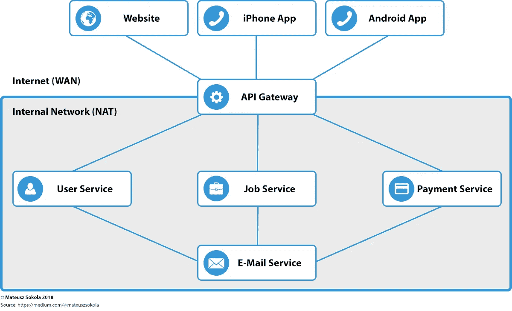
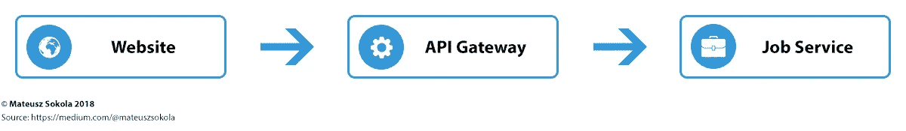
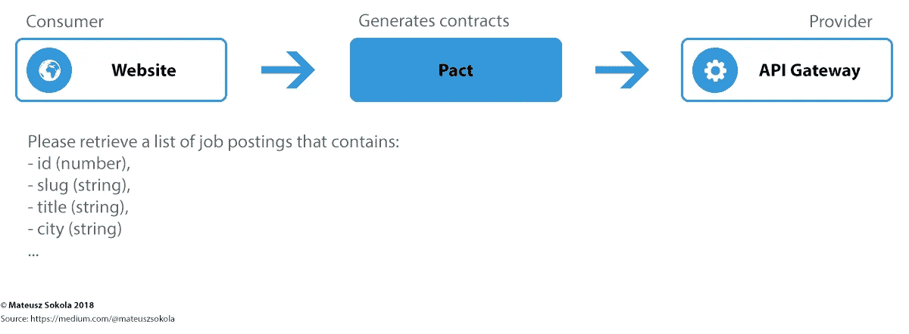
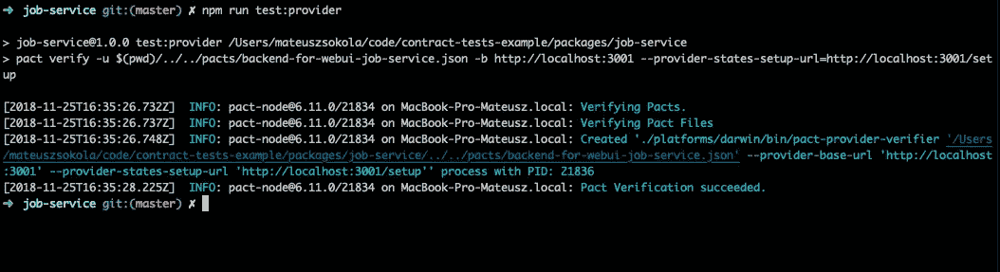
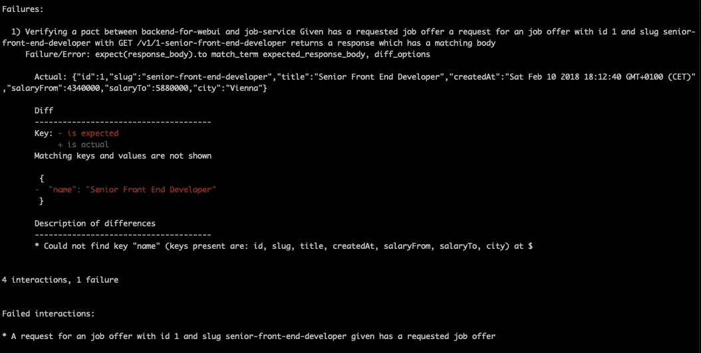

# 如何测试消费者驱动契约的微服务？

> 原文：<https://medium.com/hackernoon/how-to-test-microservices-with-consumer-driven-contracts-9bf5c2c05349>

许多软件公司决定以分布式方式构建他们的应用程序。这种方法提供了高可用性，并且从长远来看提高了开发速度。设计分布式系统最常见的架构模式是微服务。微服务架构是将应用程序分割成小的独立服务，每个服务在整个系统中扮演一个独立的角色。

假设你的客户想要建立一个工作公告。该产品必须允许用户放置工作机会，并向他们收取少量的上市费。它还必须发送几种电子邮件通知。实际上，它不是一个单一的应用程序，而是一个网页，以及 iPhone 和 Android 应用程序。需要做的第一件事是决定我们将选择什么架构。

# 单片架构的优势

一个单一的方法在项目开始时给了一个推动力。不需要定义复杂的集成测试和部署过程。一切都被简化为单一的服务。

**优点:**

*   单一代码库——易于开发(至少在开始阶段)。
*   不需要验证与其他服务的集成，因为它们不存在。
*   相对简单的部署流程—只需要部署一项服务。

**缺点:**

*   单点故障—如果一个应用程序宕机，整个服务都会宕机。
*   维护的复杂性随着时间的推移而增加。
*   难以适应新技术和工艺。通常需要从头开始重写应用程序。

# 微服务的优势

微服务比整体架构(单个应用程序负责整个系统)有很多优势。最重要的是:

*   没有单点故障。当一个服务关闭时，用户仍然可以使用应用程序。其他服务仍在运行。
*   单个微服务可以纵向扩展，以提高其容量和可用性。
*   安全性——大多数服务不会暴露在互联网上。
*   每个服务都可以独立于其他服务进行部署。只要他们不违反 API 合同。

**缺点:**

*   需要投入大量的工作来建立基础。
*   部署过程更加复杂。一些部署可能需要部署多个服务。
*   DevOps 上的大量工作。尤其是部署…
*   处理集成测试。

大多数大型应用程序都是由数百名开发人员开发的。这就是为什么将一个应用程序拆分成更小的服务会使工作更容易、更快。微服务架构对于大中型应用来说是一个很好的选择，尽管最成功的初创公司都是从单片架构开始应用，后来才迁移到微服务。

# 为工作发布应用程序设计微服务

让我们为工作公告考虑下面的架构。网站和移动应用程序通过应用编程接口网关与服务通信。应用编程接口网关是从互联网访问服务的唯一途径。这些服务在内部网络中相互通信。

想象一下，一个用户创建了一个新帐户。他们进入网站，填写表单，并将请求发送给 API Gateway。API 网关将此请求传递给创建新帐户的用户服务。创建帐户后，用户服务向电子邮件服务发送请求，以发送激活电子邮件。然后，会发送一封带有链接的电子邮件，用户需要单击该链接才能激活其帐户。

正如您所注意到的，电子邮件服务不能通过 API Gateway 使用。这是因为只有内部服务才能触发电子邮件通知。

# 如何处理测试？

微服务总是会遇到测试问题—如何确认所有服务都在一起工作？处理整体应用程序的测试是直截了当的。该应用程序只有一个代码库，不依赖任何外部服务。相比之下，微服务使所有服务分布式。他们依赖来自其他人的信息，这意味着系统架构师必须找到方法来验证服务使用相同的语言。通常，他们决定构建一个集成环境，在这个环境中服务被分解，测试人员运行测试。不幸的是，这种方法效率低下且成本高昂。在我们的例子中，我们需要并行运行六个服务。请记住，其中一些服务需要运行数据库或其他系统。

尽管提升整个应用程序堆栈需要大量硬件，但想想测试地狱吧。假设预算对您的客户来说不是问题。您有必要的硬件和一些开发人员来构建和维护集成环境。运行所有测试需要花费大量时间…

…有时几个小时，说真的…

我们的一些服务看起来运行 cron 和批处理作业。您可以想象，预测执行它们所需的时间几乎是不可能的，这意味着依赖于这些工作的测试可能是不可靠的。

当您的测试依赖于 cron 作业处理的数据，并且它会在 cron 作业完成之前尝试确认测试时，会发生什么？您的测试失败，需要重新运行测试…

…经过几次尝试后，您将获得绿色版本。您在这上面浪费了 3 个小时，但是现在您可以合并您的更改，并提供一个功能…

耶！生活是美好的！

…不幸的是，两分钟前有人合并了一些东西，所以您需要合并这些更改，并再次运行所有测试…

# 消费者驱动的合同

与其在所有服务之间运行集成测试，不如将它们去掉。所有服务都通过 RESTful APIs 进行通信。这意味着，如果我们在 API 之间定义了一个紧密的“契约”,我们就不需要提升整个平台。它足以验证其他服务的需求满足情况。

> 示例代码可以在 Github 上找到[。](https://github.com/mateuszsokola/contract-tests-example)

## 它是如何工作的？

有两个对等点—消费者(客户端)和提供者(服务)。作为开发人员，我们希望确认它们是相互兼容的；这就是我们在消费者端定义 API 契约的原因。合同必须由服务提供商强制执行。

## **使用什么工具？**

在这篇文章中，我使用了[协议](https://docs.pact.io/)。我还没有找到其他可以和 Pact 竞争的产品。Pact 支持[多种语言](https://docs.pact.io/implementation_guides)，被 [Atlassian](https://www.atlassian.com/) 等知名公司使用。

你可能也想考虑一下 Dredd。

## 什么是消费者？

消费者是希望从其他服务(例如，web 前端或消息接收端点)接收一些数据的客户端。它们定义了对端点的要求，比如 HTTP 头、状态代码、有效负载和响应。契约是在单元测试运行时生成的。所有测试成功后，pact 创建包含 HTTP 请求信息的 json 文件。这是合同示例:

## 什么是提供商？

提供者是提供数据的服务或服务器(例如，提供客户端所需数据的服务器上的 API，或者发送消息的服务)。向提供者验证合同的工具称为 [**契约提供者验证者**](https://github.com/pact-foundation/pact-provider-verifier) 。验证器根据消费者创建的合同运行 HTTP 请求。如果服务器响应是消费者所期望的形式，测试就通过了。

如果提供商没有达到预期，他们就会失败…

## 稍等一下……那么，如何向所有同行交付合同呢？

在消费者端的所有测试成功之后，包含契约的 json 文件就创建好了。我们的工作是将它们交付给提供商以验证合同。有几种方法可以做到这一点:

*   一个 **Git 存储库**，用于存储契约，并通过 Git 子模块将它们包含到每个项目中。在我看来，最好的方法是，
*   文件系统。
*   契约经纪人。

Pact Broker 是一个应用程序，用于共享消费者驱动的合同和验证结果。我们可以把我们的合同推到那里，允许服务提供商下载它们，并对它们进行测试。

DiUS 提供了 Pact Broker 的云版本，也许你可以看看并使用它。我看不出经营自己的契约经纪人有什么好处。最终，这又是一项需要 DevOps 维护的服务。如果你想自己跑[这里是 Docker 图片](https://hub.docker.com/r/dius/pact-broker/)。

我认为将合同存储在单独的 git 存储库中已经足够好了。就我个人而言，我会在集成管道中创建它们，并在同一个集成工作中对服务提供者运行测试——这里是的[示例集成管道。](https://travis-ci.org/mateuszsokola/contract-tests-example/builds/354853499?utm_source=github_status&utm_medium=notification)

# 为什么不招摇？

Swagger 是用于记录 API 的定义格式。它通过映射所有的资源和相关的操作来创建开发和使用 API 的接口。输出可以被人(通过网站)和机器(通过 yaml 和 json 文件)理解。不幸的是，Swagger 并不是用来测试的。Swagger 生成的模拟服务器不验证请求负载，验证由前端处理。

并不是说你完全不应该用 Swagger，你可以，强烈推荐。如果您使用微服务，很可能它们是由许多团队开发的，并被其他团队(有时是外部团队)使用。将文档链接到 API 可以加快开发速度，因为开发人员不需要知道如何使用端点。他们可以在文档页面上阅读并试用。

您可能想阅读更多关于 [Swagger 模拟验证器](https://bitbucket.org/atlassian/swagger-mock-validator)的内容；一个允许你根据 Swagger 文件验证合同的工具。

# 摘要

测试微服务是一个复杂的问题。没有什么灵丹妙药，也没有一套在任何情况下都能轻松使用的规则。我写这篇文章是为了向你展示我所在的团队是如何决定处理这个问题的。

如果你对消费者驱动的合同感兴趣，我强烈推荐观看来自 Atlassian 的 Mauri Edo 和 Ben Sayers 的演讲。

我决定在我的 Github 上保留 [**所有代码，这样文章更容易阅读。**](https://github.com/mateuszsokola/contract-tests-example)

**如果你有任何问题或建议，请写下评论。**

你可以通过[媒体](/@mateuszsokola)和[推特](https://twitter.com/msokola)联系我。