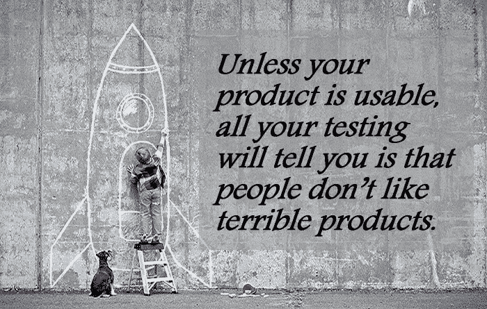
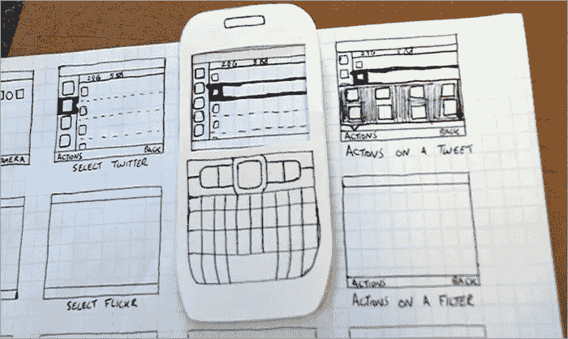
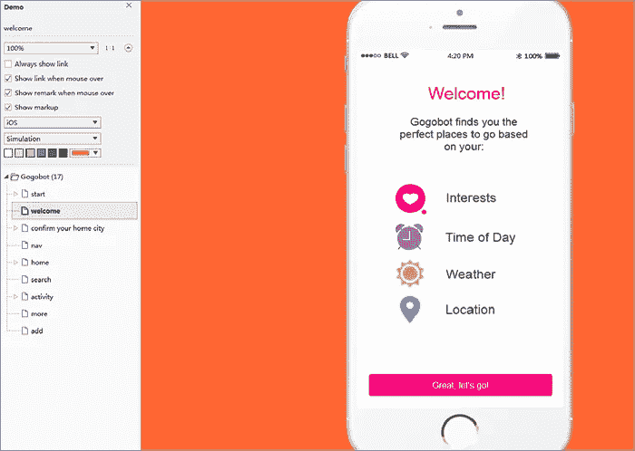
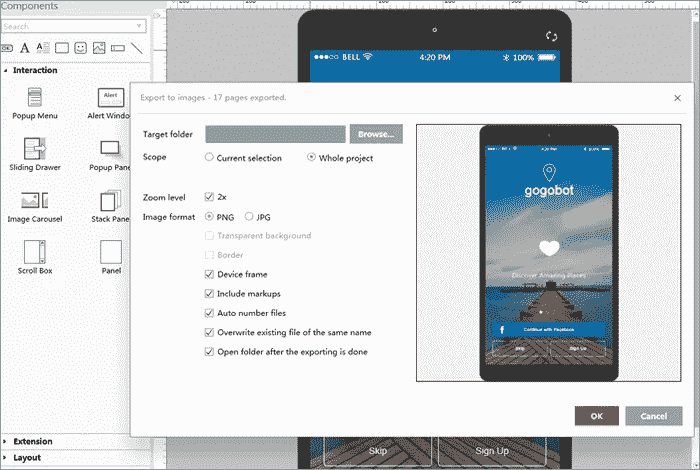
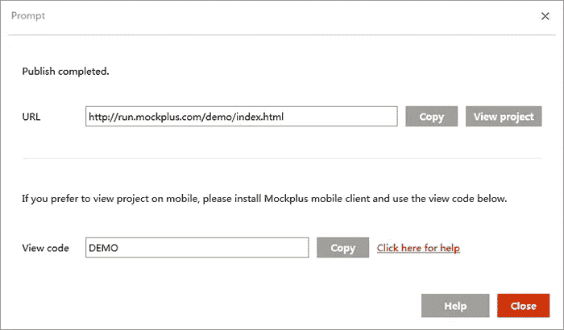
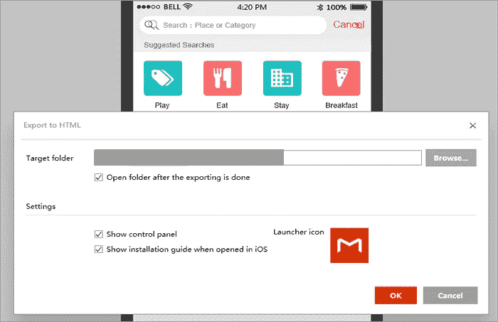
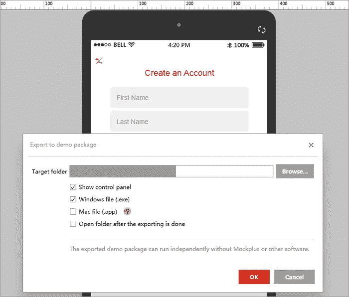
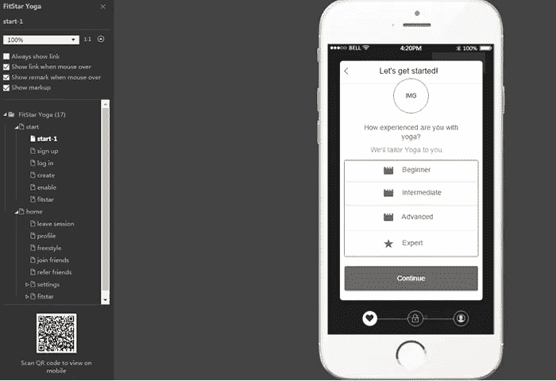
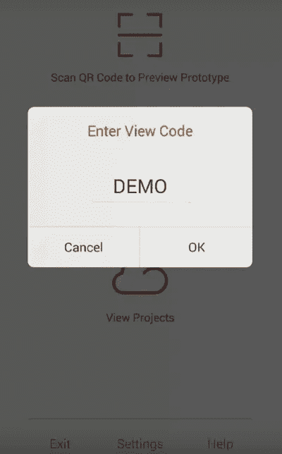

# 如何测试你的原型在移动和桌面设备上的可用性？

> 原文：<https://medium.com/hackernoon/how-to-test-the-usability-of-your-prototypes-on-mobile-and-desktop-devices-53a7e25452a0>

广义地说，可用性测试是一种在以用户为中心的交互设计中使用的技术，目的是通过测试用户来评估产品。它允许公司在投入时间进行编码和开发阶段之前，测试移动应用或网站的基本版本。当原型已经有一个很大的待办事项列表时，为什么要这么早就担心可用性呢？因为“*除非你的产品是可用的，否则你所有的测试都会告诉你，人们不喜欢糟糕的产品*”。

毫无疑问，可用性测试可以在没有原型的情况下开始，这些测试可能会找出构建您的信息架构或原型导航的最佳方式。一些流行的预定型测试包括**卡片分类**、**树形测试**和**面试**。测试一个原型和测试一个功能性网站是不同的，让我们看看下面几个对原型测试有用的技巧。

***小心 Lorem Ipsum 文本** —每次 Lorem Ipsum 文本出现时，都会给那些参与者带来分心和困惑。此外，它不能在页面上给出实际意义，也不能完全传达你的产品信息。尝试使用实际的文本，或者更好地制作合理的占位符内容。

***避免假名**——如果加上名人名字，考试可能会变得更有趣，但这是另一种干扰。因此，最好使用一个通用的、现实的名字。你会从网上的名字生成器中找到大量的好名字。

***不要使用占位符图像或图标** —带有 x 的方框之类的占位符可能与线框图配合得很好，但它们可能会将参与者引向错误的方向。有些人可能认为占位符图像是一个带有特定图标的盒子。使用合适的图片来帮助理解用户界面是非常重要的。

***使用低保真度原型进行早期测试** —使用低保真度原型测试您的标签、导航和组织概念。这将有助于参与者感觉比一个完全抛光的设计更舒适。更重要的是，创建纸上原型会更快更容易。

**如何像专业人士一样测试你的原型？**

然而，你的设计不应该被原型驱动。实际上，[最好的原型制作工具](https://goo.gl/dR44lU)不一定是最好的设计工具，但是它可以在设计和原型制作同时进行的情况下节省很多时间。一个高效且易于使用的工具将让你在进行设备测试时摆脱成千上万个令人头疼的问题，这里我将带你了解如何使用 [Mockplus](http://goo.gl/OHRk8L) 在多个设备上无痛测试你的原型。

一般来说，有 7 种方法可以在手机和桌面上测试你完成的原型。接下来，您将了解如何在实际设备上查看和测试原型，而不会弄脏您的手。

**1。在线预览**

按 F5 或顶部工具栏上的“播放”按钮进入预览模式。这将打开另一个新的屏幕，你可以预览你的工作。一个亮点是预览窗口可以进一步定制。具体来说，您可以决定是否显示/隐藏交互链接、备注、鼠标悬停时的标记、调整移动外观、在“模拟”和“线框”之间选择样式、调整背景颜色等。

**2。导出到图像**

将项目屏幕导出为 PNG 或 JPG 格式的图像，对于在 PS/Fireworks 等图像编辑软件中操作或发送给朋友以整合反馈非常有用。它很简单，可以在 Mockplus 中获得。如图，你可以打开左上方的主菜单，进入“导出”>“导出到图像”(也可以按“Ctrl+E”来完成)。导出整个项目或当前选择是可选的。可以导入你的[像素完美的 UI 套件](https://goo.gl/xAEbvr)或元素。

**3。在线发布到云**

只需轻触工具栏上的“发布”按钮，就可以将发布的原型上传到云中。这种在线发布选项不仅可以让您从 web 浏览器实时“查看项目”，还可以生成一个可以在浏览器中打开的共享链接。通过获得原型的反馈来验证你的想法，网上发布只是为你准备的。

**4。导出到离线 HTML**

有了 Mockplus 2.2 的广告，就可以将你的原型导出到 HTML 页面。此选项位于“导出”>“导出到 HTML”，您可以在任何离线浏览器中访问原型，然后分发给许多负责执行和测试它的同事。选取在 iOS 中打开时是否显示预览大纲和安装指南。此外，您可以将导出的 HTML 部署到您的服务器，以便更好地共享和协作。这里有一个关于 Mockplus 的在线 HTML 演示供参考。

**5。导出到演示包**

如果你想在不安装原型播放器或第三方应用程序的情况下获得逼真的预览，那么这应该是你的选择。Mockplus 的演示包有两种形式，包括。exe 文件运行在 Windows 和。在 Mac 上运行的应用程序文件。这允许你的队友通过简单地解压[演示包](http://doc.mockplus.com/?p=149)来玩和测试你的原型设计。

**6。通过扫描二维码在手机上查看原型**

扫描二维码查看样机？以前没试过？嗯，这是 Mockplus 的一个特殊选项，使用它，您可以将您的设计工作下载到移动设备上，而没有任何限制。详细来说，你需要打开分享链接，扫描控制面板左下方显示的二维码。请注意，使用 QR 码需要您的智能手机配备摄像头和 QR 扫描仪/阅读器应用程序功能。在网上很容易找到合适的工具。

**7。在手机客户端 App** 中输入视图代码

一旦你在 Mockplus 帐户中发布了原型，你就可以从你的移动应用程序中打开并查看它。这需要你登录你的帐户，点击“预览视图代码”:原型将被下载，模拟将开始。注意，视图代码可以直接从“在线发布”提示窗口中复制。

**总结**

测试参与者可能会被一些您认为可以忽略的细节分散注意力，而像 Mockplus 这样合适的工具将会是原始工具的两倍。希望这能对你有所帮助，如果有任何不同的意见或进一步的建议，欢迎在下面评论。

**更多 UX/UI 相关帖子:**

[2016 年 UX 最佳设计师原型和线框工具 11 个](https://goo.gl/mc4IlN)

[用 Mockplus 和 Axure 创建交互式原型的比较](https://goo.gl/K5o2T0)

在 UX 面试中你会被问到的 10 个问题

[如何在滴滴出行上获得成功](https://goo.gl/gzjser)