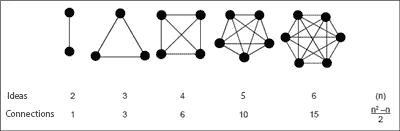

# 如何好好思考

> 原文：<https://medium.com/hackernoon/how-to-think-well-84fa279525bd>

这是迄今为止我多年来思考、讨论和研究的最有效的思维模式的集合。

> 我们感知现实的有效性很大程度上来源于我们大脑运行的操作系统。

考虑到这一点，我发现不断地质疑和升级我的操作系统非常有趣。

关于有效性的一个有趣的事情是它是无限优化的。**即使 10 万年后，人工智能仍将致力于开发更好的思维模式。不管我们[认为自己有多聪明，总有更聪明的我们在等待被发现。](https://hackernoon.com/tagged/think)**

# 谦虚

练习谦逊对于减少我们对现实的偏见非常重要。我们的自我有一种永远存在的欲望，那就是在任何出现的问题上，我们都希望自己是正确的，因为错误而被冒犯。

这可能是一个问题，也可能是一个很大的帮助，取决于如何处理。当这种来自自我的渴望出现时，我试图记录我的感受，并以此作为我即将意识到自己在某件事情上犯了错误的标志。而且从理性上来说，错总比对好，因为当你错了的时候，你会获得新的知识。我们可以通过将自我的挫败感转化为对即将到来的新信息的好奇来获取它。

# 保持简单

使用尽可能少的事实使得思考、表达和捍卫想法变得简单多了。

> 作为一个经验法则，我试图将解决任何问题的核心事实减少到只有 3 个，并且从不超过 7 个。

**为什么 3 理想？**
3 可能是自然界中最美的数字，但更重要的是，因为头脑中同时有 3 个想法只需要 3 个连接。4 个想法已经需要 6 个连接，5 个想法需要 10 个连接，以此类推，规模非常大。

**为什么是 7 最大值？**因为它是人类大脑中可以同时容纳的平均事物量(此处[证明](https://en.wikipedia.org/wiki/The_Magical_Number_Seven,_Plus_or_Minus_Two))。

# 基本原理

将事物分解成它们不可否认的本来面目的思维过程。被埃隆·马斯克，以及其他许多伟大的思想家如亚里士多德、笛卡尔和整个科学界所使用，作为验证理论的最直接的方法。

这是一种思维方式，它允许我们通过小的独立部分来看待复杂的事物，当孤立时，它们是简单的和不带偏见的。零件以我们以前看不到的方式重新组合在一起，与我们想要解决的问题保持一致。

当我们不需要使用类比来验证我们的**想法**时，我们知道我们在使用基本原理，因为它们是**不证自明的**。

举个例子，让我们看看人们在 2007 年至 2008 年的*金融危机前几年看到了什么:*

—**类推(🐱~🐶)**人们和经济学家预言:

*   每个人的生活质量都会不断提高，
*   商业会继续繁荣
*   房地产价格将继续稳步上涨。

—但是有人使用**第一原理(🐱=🐱)**和运气收集所有这些碎片:

*   房价是基于人们支付的价格，
*   房地产是经济的最大支柱之一(约 2.7 倍🌎美国国内生产总值💰),
*   人们购买基于他们能从银行得到什么，
*   当出现信用违约时，银行会停止放贷
*   没有受过信用教育的人正在用新的债务来偿还债务。

与普遍观点相反，我可以预测世界经济最终会崩溃。

大多数流行的假设都是不可否认的。但我相信他们都遵循着不直观但确定的思维方式，使他们变得过时。每当我们学到一些伟大的东西，更伟大的东西就在眼前等着我们。

# 批判性思维

批判性思维让你理性思考，不受约束，并强烈关注原始事实和他人的批评/意见。

它借鉴了很多基本原则，但更注重询问他人的意见。

这不是简单地批评他人的想法或当前的解决方案(即使这会导致这种情况)，而是清晰地思考，并能够表达容易理解的想法。

它是关于:

*   比最初的想法更深入一些，
*   考虑其他观点(甚至有些你不同意)，
*   了解哪些事实真正重要
*   迭代潜在的解决方案。

这不仅可以让你很容易地捍卫你的想法，因为它们现在是基于很少但很强的事实，但更重要的是，它可以让你清楚地思考，因为你必须在头脑中处理的事实数量现在越来越少，越来越强。

# 结束的

思考方式:

*   保持谦逊，
*   保持简单，
*   基本原则和
*   批判性思维

帮助我们清晰地思考和交流👽)更省力。

我们如何思考是我们如何感知和塑造现实的，这是一项对我们所做的一切都有直接影响的技能，所以至少偶尔微调一下肯定是值得的。

# 保持联络

我写作的目的是为了结识能与之进行有趣对话的人。所以，我最想从你的评论或推特上得到一条消息。