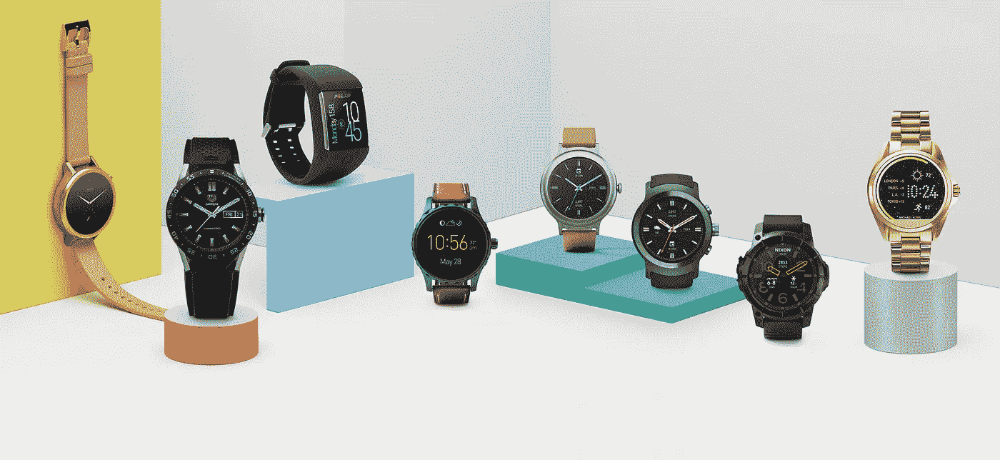

# 如何追踪睡眠:安卓版

> 原文：<https://medium.com/hackernoon/how-to-track-sleep-android-edition-af9348457d33>

跟踪你的睡眠是了解生活方式和健康之间联系的有效方法。

Android 用户可以使用一款功能强大、价格低廉的应用程序,它将睡眠日记与手机或智能手表记录的运动数据结合在一起。此外，该应用程序包括一个智能闹钟，可以减少醒来时的昏昏沉沉感。

*更新:*这篇文章现在有了 [Apple Watch 的对应物](https://hackernoon.com/how-to-track-sleep-apple-watch-edition-e1ddd1791450)。

Watch my video [on YouTube](https://www.youtube.com/watch?v=sgcmK8ZLdB4). Subscribe to [my channel](https://www.youtube.com/c/gregyeutter?sub_confirmation=1).

# 设置

睡眠追踪应用程序使用[动作](https://sleep.urbandroid.org/documentation/core/background/)来计算你处于睡眠的哪个阶段。手机和智能手表都有可以测量运动的加速度计，并且都可以用来跟踪睡眠。但是人们报告说用手表追踪更准确。

Android Wear smartwatches

谷歌的智能手表平台 Android Wear 远没有苹果的 watchOS 受欢迎。但是除非你有一部 iPhone，否则苹果手表不会是一个选择。

对 Android 用户来说幸运的是，在易贝上可以以不到 100 美元的价格买到一款功能强大的 Android Wear 智能手表。基本上任何 Android Wear 手表都可以，但你应该寻找一款已经更新到 [Android Wear 2.0](https://www.android.com/wear/) 的手表。

另一个选择是一款[三星 Gear](https://www.samsung.com/us/mobile/wearables/) 智能手表。参见本页查看哪些手表兼容。

# 该应用程序

尽管有一个可怕的名字， [Sleep as Android](https://play.google.com/store/apps/details?id=com.urbandroid.sleep&hl=en) 是 Android 设备上最强大的睡眠跟踪工具。它使用你的智能手表或手机来记录运动数据。对于每晚的睡眠，该应用程序会在你的笔记旁边显示详细的统计数据和图表。

Sleep as Android’s sleep statistics tab

另外，Sleep as Android 可以充当智能闹钟。如果它感觉到你处于浅睡眠状态，它会在你的闹钟设置之前的预设时间内叫醒你，比如 30 分钟。

这可以减少你从深度睡眠状态醒来后的昏昏沉沉的感觉。如果你需要用闹钟来叫醒你，这是个不错的选择。

如果你对智能闹钟的好处持怀疑态度，可以看看由睡眠机器人创造者开展的这项研究。

Sleep as Android’s sleep graphs tab

睡眠追踪很容易实现，无论是从手机应用程序还是从手表本身。有关如何设置和操作安卓睡眠的更多信息，请参考[我的视频](https://www.youtube.com/watch?v=sgcmK8ZLdB4)或安卓睡眠[文档](https://sleep.urbandroid.org/documentation/)。

# 让它为你工作

睡眠是个人的。我可能是一个早起的人，在下午 2 点后喝不了咖啡。你可能是一个不受一杯酒影响的夜猫子。不同的人有不同的睡眠时间表和习惯。

Sleep as Android’s sleep rating page

在每次睡眠跟踪会议之后，花一点时间用 1 到 5 的尺度来评价你的睡眠。记录下任何你认为可能影响睡眠的笔记，比如你前一天吃了什么，喝了什么，或者做了什么。

随着时间的推移，你会积累更多的数据，了解哪些因素有助于睡个好觉，哪些因素会妨碍睡个好觉。

感谢阅读。如果你喜欢这篇文章，请点击上面的按钮，与你的朋友分享。我也鼓励你订阅我的 YouTube 频道来获取更多的数字健康内容。

P.S .看我的 [iOS 睡眠追踪](https://hackernoon.com/how-to-track-sleep-apple-watch-edition-e1ddd1791450)文章！