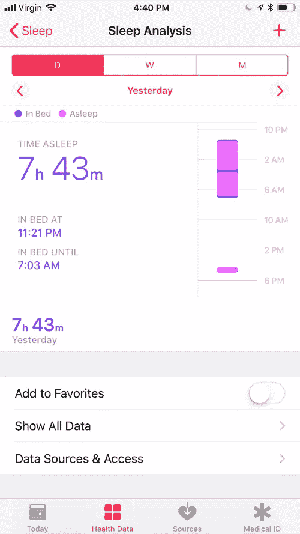
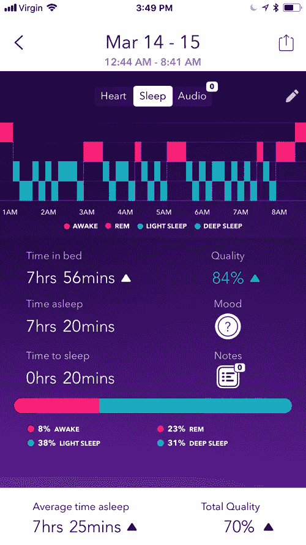
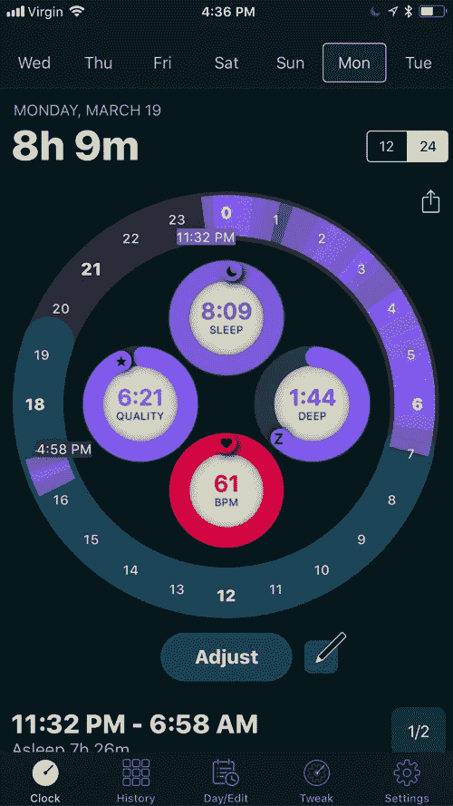
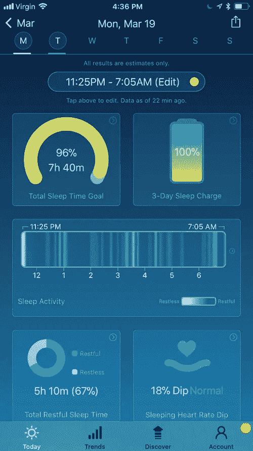

# 如何追踪睡眠:苹果手表版

> 原文：<https://medium.com/hackernoon/how-to-track-sleep-apple-watch-edition-e1ddd1791450>

Apple Watch. Photo by [Jens Kreuter](https://unsplash.com/@jenskreuter?utm_source=medium&utm_medium=referral) on [Unsplash](https://unsplash.com?utm_source=medium&utm_medium=referral).

跟踪你的睡眠是了解生活方式和健康之间联系的有效方法。

一个月前，我发表了一篇关于 Android Wear (现由谷歌推出的 [Wear OS)的](https://wearos.google.com/)[睡眠追踪的文章和视频。这是 Apple Watch 的翻版。](https://hackernoon.com/how-to-track-sleep-android-edition-af9348457d33)

苹果卓越的应用生态系统延伸到跟踪睡眠。单独使用你的 iPhone 或者将你的 iPhone 与 Apple Watch 配对，睡眠跟踪有多个可靠的选择。

一般来说，腕戴式设备提供的睡眠运动记录比放在你床边的手机更准确。在这篇文章中，我将重点介绍适用于 Apple Watch 的应用程序。

*** *更新于 2018/08/15，以反映枕头新的自动睡眠跟踪功能。**

Watch my video [on YouTube](https://www.youtube.com/watch?v=KQoiNfSxSOU). Subscribe to [my channel](https://www.youtube.com/c/gregyeutter?sub_confirmation=1).

# 健康

内置的健康应用程序只提供睡眠的基本信息，如睡眠时间和卧床时间。例如，它没有提供睡眠阶段的图表或智能闹钟。

A single night of sleep in Health.

尽管 Health 有缺点，但你可以同时运行多个睡眠跟踪应用，不会有任何不良影响。此外，这里列出的所有应用程序都与健康相关，所以你可以直接比较它们的结果。

# 枕头

在我试过的睡眠追踪应用中，我最喜欢的是[枕头](https://neybox.com/pillow/)。该应用程序非常容易使用，有一个伟大的用户界面和非常详细的睡眠统计数据。Pillow 可以跟踪睡眠，不管有没有闹钟，它甚至可以记录你在晚上发出的声音。

A single night of sleep in Pillow.

如果你选择使用枕头作为闹钟，它有一个很大的功能，它可以在你的闹钟前 30 分钟叫醒你。你为什么想要这个？因为你可能在设定的闹铃时间处于深度睡眠状态，而在闹铃前几分钟处于较轻的状态。在这种轻松的状态下醒来会让你感觉不那么昏昏沉沉。

如果你对智能闹钟的好处持怀疑态度，看看由一个类似应用程序的创造者进行的这项研究[。](https://sleep.urbandroid.org/a-case-for-the-smart-alarm/)

Pillow’s Snooze Lab.

Pillow 还包括一个名为 Snooze Lab 的功能，它可以根据记录的数据生成关于你睡眠的见解。例如，它目前认为我的最佳睡觉时间是晚上 11:30。它还提供了有益的睡眠建议，比如周末补觉可能不健康的建议。

睡眠追踪很容易用枕头激活。请参考[我的视频](https://www.youtube.com/watch?v=KQoiNfSxSOU)和首次使用该应用程序时出现的指南。

# 自动休眠

*** *更新 2018/08/15**最新发布的枕头现在包括自动跟踪睡眠的功能。我现在建议你只使用 Pillow 而不是 AutoSleep，因为它有更好的用户界面和自动跟踪睡眠的功能。**

另一款睡眠追踪应用 [AutoSleep](http://autosleep.tantsissa.com/) ，相比枕头有一个关键优势:它能自动追踪你的睡眠。与枕头不同，你必须启动手表应用程序来激活和停止睡眠跟踪，你所要做的就是戴着手表上床睡觉。

A single night of sleep in AutoSleep.

也就是说，AutoSleep 的用户界面很笨拙，而且我觉得这些图形很难理解。因此，如果你打算导出数据或作为数据的备份来源，以防你忘记手动启动或停止 Pillow 的跟踪，我只推荐这款应用程序。

# 睡眠观察

[睡眠手表](http://Sleep Watch App SleepWatch_iOS_App_Store_Renderings_5-8_in_v3.png Auto Sleep Tracking for Apple Watch. Now with Artificial Intelligence. Track sleep with your Apple Watch automatically. No buttons to press. Just wear your Watch to bed and wake up to AI-powered, personalized insights about your sleep. Automatically log your data and follow your sleep trends with powerful charting tools.  GET IT NOW. All results are estimates only. Do not rely on Sleep Watch for medical advice or diagnosis.   HOW IT WORKS Wear your Apple Watch to bed (do not enable Power Reserve) Upon waking, check the Watch or iPhone app to see your auto-detected sleep details; that's it! Opt to confirm or adjust your auto-detected sleep times in the iPhone app to help us build you a smarter sleep detection algorithm We recommend scheduling 'Do Not Disturb' to turn on automatically during your typical sleeping hours to prevent any Watch notifications from disturbing your sleep. This can be done in the iPhone Watch App > My Watch > General > 'Do Not Disturb' section.  We also recommend enabling 'Theatre Mode' while asleep to keep your Watch screen dark until waking.  APP FEATURES Auto Sleep: Automatically log your estimated total sleep time, total restful sleep time, avg. sleeping heart rate, sleeping heart rate dip, sleep rhythm, and sleep activity levels for each day by simply wearing your Apple Watch to bed Discover: Take control of your sleep habits with AI-powered, personalized insights. Every body is unique. Using artificial intelligence, Discover uncovers from your data the lifestyle choices you make that appear to be helping you achieve a better night's rest. The more data you track with Sleep Watch, the more you can Discover. Sleep Charge Tracking: a fun new way to help you better track and recover from recently missed sleep Sleeping Heart Rate Dip Tracking: Studies among particular populations suggest that the more heart rate slows—or "dips"—during sleep compared to waking may be better for both overall and cardiovascular health in years to come. Get motivated to build a healthier lifestyle and start tracking your sleeping heart rate dip today. Sleep Rhythm Tracking: Track an estimate of how consistently you sleep at the same time each day • Sleep Charge Tracking: a fun new way to help you track and recover from recently missed sleep Easy Editing: Manually adjust your detected sleep times to your desired accuracy Daily Sleep Goal Progress: See daily progress towards your custom sleep goal Daily Briefings: Effortlessly get daily notifications about how you slept Trend Analysis: Track changes in sleep stats on a daily, weekly, or monthly basis Health App Support: Auto sync sleep data to Health app Data History: See your data from up to a year ago Keep an Account: Create an account and access your data across multiple iOS devices Watch Face Complications: See your last night's Total Sleep Time and Sleeping Heart Rate directly on your Watch face complication Dedicated Watch App Interface: See your last night's estimated Total Sleep Time, Total Restful Sleep Time, Restful Sleep Percentage, Sleep Rhythm, Total Sleep Time Goal Progress, Avg. Sleeping Heart Rate, Sleeping Heart Rate Dip, 3-Day Sleep Charge, and Sleep Activity Graph on your Watch in our Watch app SUBSCRIBE TO SLEEP WATCH NEWS Sign up with your email address to receive news and updates.   Email Address   SIGN UP We respect your privacy.  MONITOR YOUR SLEEP Do we need to say it? Getting adequate and quality sleep is part of a healthy lifestyle that may help us:  Improve mood Reach weight loss goals Battle stress Improve exercise performance and recovery Elevate daytime energy levels Learn and retain new knowledge better Improve workplace productivity Boost immune system strength Build better cardiovascular and brain health TECHNICAL DETAILS Leveraging the state-of-the-art motion and pulse sensors in your Apple Watch, our algorithm estimates when you are asleep by analyzing changes in your activity and heart rate Sleep Watch looks for sleep between 7pm and 11:30am that totals at least 1 hour Sleep Watch notifications about your sleep are sent after 6am at least 30min after your detected wake-up time Sleep Watch works by integrating with Apple Health CAUTION - IMPORTANT SAFETY & USE INFO Do not rely on Sleep Watch for medical advice or diagnosis. Sleep Watch is not a replacement or substitute for professional medical care. Use Sleep Watch for informational, general wellbeing and fitness purposes only. Sleep Watch results are estimates only. Consult a doctor if you have any health concern or before starting any exercise program. Do not self-adjust medications. GET SLEEP WATCH NOW Available for $2.99 now in select countries.   Does_Apple_Watch_Track_Sleep__Sleep_Watch_by_Bodymatter.jpg FROM THE SLEEP WATCH BLOG  DON'T BE AFRAID OF THE DARK Did you get up this morning feeling somewhat-rested or not rested at all? Are you ordering that third cup of coffee mid-morning to keep your eyes open? Are you having trouble concentrating by early afternoon? These signs might suggest that you did not have a good night's sleep. Light seeping into your sleeping environment may be a factor in preventing a restful sleep.  Dec 7, 2017  sleep_watch_is_a_bodymatter_creation BLOG   HELP CENTER   DOES APPLE WATCH TRACK SLEEP? PRIVACY POLICY   TERMS OF SERVICE   WHEN DO I CHARGE MY WATCH? ACCOUNT PASSWORD RESET   MEDIA RESOURCES » BODYMATTER SITE » Sleep Watch™ © 2016-2017 Bodymatter, Inc.)比枕头和自动睡眠手表更受限制，但根据您的需要，它可能是最合适的。

A single night of sleep in Sleep Watch.

像自动休眠一样，它会自动开始和停止跟踪。和抱枕一样，UI 也不错。然而，它没有智能闹钟功能——它只能用来跟踪睡眠，而不是叫醒你。此外，它不允许您导出数据。

如果你不需要智能闹钟，但想要比健康应用程序提供的更详细的信息，这可能是一个很好的选择。

# 论数据准确性

这三款应用都提供相似但不完全相同的睡眠分析数据。例如，这些是计算出的一个晚上的睡眠时间:

*   枕头:睡着了:8:50；在床上:9:11
*   自动睡眠:睡眠时间:9:04；在床上:9:04
*   睡眠手表:睡着了:9:05；在床上:9:05

注意，Apple Watch 是**而不是**一款临床级的睡眠工具。你可以利用这些数据来确定睡眠趋势，但你不应该如此仔细地审视它。Apple Watch 和任何兼容的应用程序都不能用于诊断医疗状况。

未来的更新将致力于更详细地比较应用程序之间的睡眠数据。

# 让它为你工作

睡眠是个人的。我可能是一个早起的人，在下午 2 点后喝不了咖啡。你可能是一个不受一杯酒影响的夜猫子。不同的人有不同的睡眠时间表和习惯。

在每一次睡眠跟踪会议之后，花一点时间反思，并对你的睡眠进行评级。记录下任何你认为可能影响睡眠的笔记，比如你前一天吃了什么，喝了什么，或者做了什么。

随着时间的推移，你会积累更多的数据，了解哪些因素有助于睡个好觉，哪些因素会妨碍睡个好觉。

**感谢阅读。**如果你喜欢这篇文章，请点击上面的拍手按钮，并与你的朋友分享。我也鼓励你订阅我的 [YouTube 频道](https://www.youtube.com/c/gregyeutter?sub_confirmation=1)，获取更多数字健康内容。