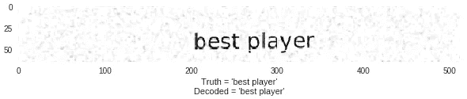
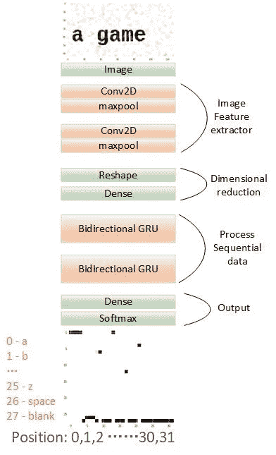
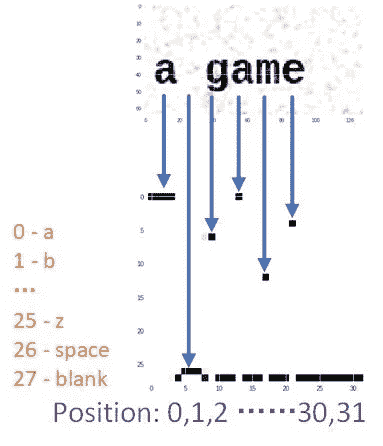
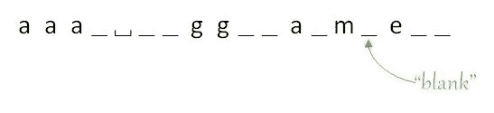
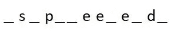
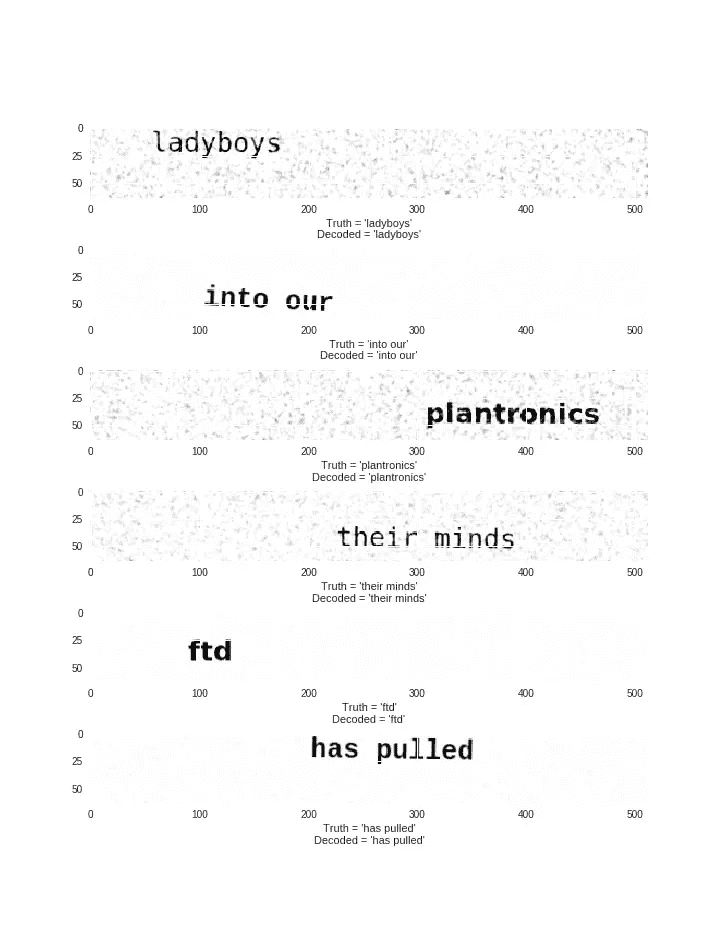

# 如何训练 Keras 模型识别可变长度的文本

> 原文：<https://medium.com/hackernoon/how-to-train-a-keras-model-to-recognize-text-with-variable-length-10f30666aa62>

我玩了 Keras 官方的 **image_ocr.py** 例子有一段时间了，想在这篇文章中分享一下我的心得。

官方的例子只对模型进行了训练，而忽略了预测部分，我的最终源代码既可以在[我的 GitHub](https://github.com/Tony607/keras-image-ocr) 上获得，也可以在[一台可运行的 Google Colab 笔记本](https://drive.google.com/file/d/1CdB9rvImJCAl_U9yYVD6HqMFWup_RzpG/view?usp=sharing)上获得。OCR(光学字符识别)的更多技术细节，包括模型结构和 CTC 损失，也将在下面的章节中简要说明。

# OCR 任务声明

输入将是一个包含单行文本的图像，文本可以在图像中的任何位置。模型的任务是输出给定图像的实际文本。

举个例子，

OCR example input & output

官方 image_ocr.py 示例源代码相当长，可能看起来令人望而生畏。它可以分解成几个部分。

*   作为训练样本的生成器，这部分源代码将生成生动的文本图像，类似于带有人工斑点、随机位置和各种正面的扫描文档。
*   模型回调保存模型权重，并在每个训练时期后使用一些生成的文本图像可视化当前模型的性能。
*   模型构建和训练部分。我们将在下一节详细阐述这一部分。

# 模型结构

模型输入是图像数据，我们首先将数据馈送到两个卷积网络以提取图像特征，然后进行整形和密集以降低特征向量的维度，然后让双向 GRU 处理顺序数据。供给 GRU 的顺序数据是水平划分的图像特征。最终的输出密集层将给定图像的输出转换为一个形状为(32，28)的数组，表示(#水平步长，#字符标签)。

Base model structure

下面是构建 Keras 模型的部分代码。

Model construction

# CTC 损失

正如我们在示例图像中看到的，文本可以位于任何位置，模型如何在输入和输出之间对齐以定位图像中的每个字符并将它们转换为文本？这就是 CTC 发挥作用的地方，CTC 代表连接主义时间分类。

input -> softmax output

注意，模型的输出有 32 个时间步长，但是输出可能没有 32 个字符。CTC 成本函数允许 RNN 生成如下输出:

Output sequence -“a game” with CTC blanks inserted

CTC 引入了“空白”标记，它本身并不翻译成任何字符，它所做的是分隔单个字符，以便我们可以折叠没有被空白分隔的重复字符。

因此前一序列的解码输出将是“一个游戏”。

我们再来看另一个文字“速度”的例子。

Output sequence -“speed”

根据解码原则，我们首先折叠未被空白标记分隔的重复字符，然后删除空白标记本身。请注意，如果没有空白标记来分隔两个“e ”,它们将合并为一个。

在 Keras 中，CTC 解码可以在单个函数`K.ctc_decode`中执行。

ctc_decode with greedy search mode

`out`是模型输出，它由来自 a~z、空格和空白记号的 28 个记号中的每一个的 28 个 softmax 概率值的 32 个时间步长组成。我们设置参数`greedy`来执行贪婪搜索，这意味着该函数将只返回最可能的输出令牌序列。

或者，如果我们想让 CTC 解码器返回前 N 个可能的输出序列，我们可以要求它以给定的波束宽度执行波束搜索。

ctc_decode with beam search mode

值得一提的是，如果你是波束搜索算法的新手，`top_paths`参数不会大于`beam_width`参数，因为波束宽度告诉波束搜索算法在迭代所有时间步长时要跟踪多少个顶部结果。

现在，解码器的输出将是一个令牌序列，我们只需要将数字类翻译回字符。

到目前为止，我们只讨论了 CTC 的解码部分。你可能想知道模型是怎么用 CTC 丢失训练的？

为了计算 CTC 损失，不仅需要模型的真实标签和预测输出，还需要输出序列长度和每个真实标签的长度。

*   **y_true。**它的一个例子看起来像[0，1，2，3，4，26，25]代表文本序列‘abcde z’
*   **y_pred** 是 softmax 层的输出，其样本具有形状(32，28)，32 个时间步长，28 个类别，即“a-z”，空格和空白标记。
*   **input_length** 是输出序列长度 img _ w//down sample _ factor—2 = 128/4-2 = 30，2 表示前 2 个丢弃的 RNN 输出时间步长，因为 RNN 的第一对输出往往是无用的。
*   **前一个 **y_true** 样本的标签 _ 长度**将为 7，

在 Keras 中，CTC 损失封装在一个功能`K.ctc_batch_cost`中。

ctc_batch_cost

# 结论

训练模型 25 个时期后的检查点结果。

Model performance check after 25 training epochs

如果你已经读到这里，并在 Google Colab 上进行实验，你现在应该有一个 Keras OCR 演示在运行。如果您仍然渴望获得更多关于 CTC 和 beam search 的信息，请随时查看以下资源。

[使用 CTC 进行序列建模](https://distill.pub/2017/ctc/) —深入阐述 CTC 算法和其他可以应用 CTC 的应用，如语音识别、视频唇读等。

[Coursera 光束搜索视频讲座](https://www.coursera.org/learn/nlp-sequence-models/lecture/4EtHZ/beam-search)。快速且易于理解。

不要忘了从[我的 GitHub](https://github.com/Tony607/keras-image-ocr) 以及[一个可运行的 Google Colab 笔记本](https://drive.google.com/file/d/1CdB9rvImJCAl_U9yYVD6HqMFWup_RzpG/view?usp=sharing)中获取源代码。

*最初发表于*[*www.dlology.com*](https://www.dlology.com/blog/how-to-train-a-keras-model-to-recognize-variable-length-text/)*。*