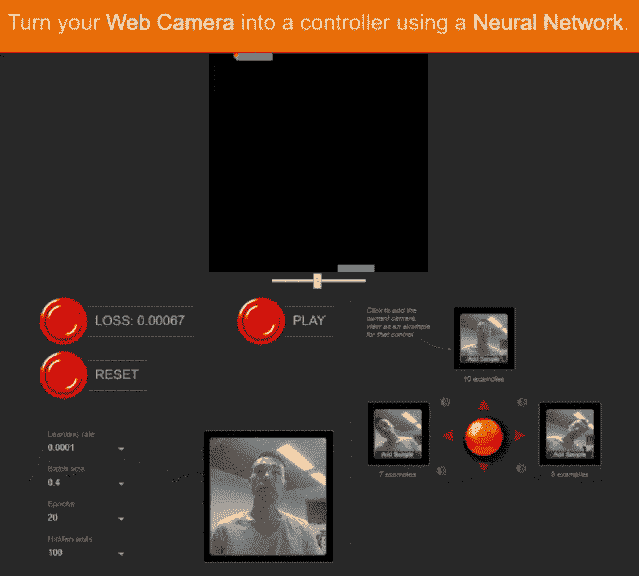
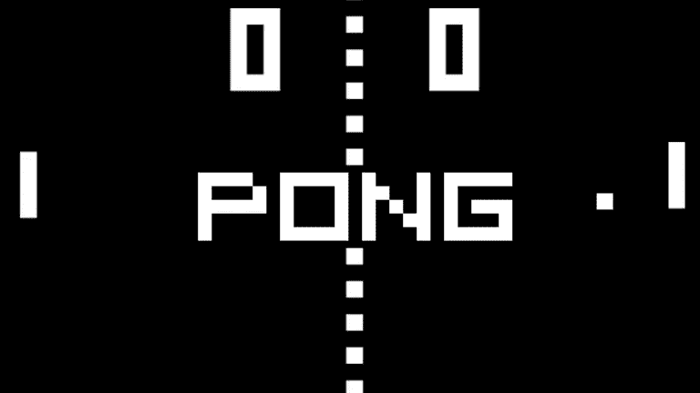

# 如何在浏览器上训练神经网络

> 原文：<https://medium.com/hackernoon/how-to-train-neural-network-on-browser-7a435132a1ed>



无论你是深度学习的新手还是经验丰富的老手，建立一个训练神经网络的环境有时会很痛苦。让训练一个神经网络变得像加载一个网页，然后点击几下，你就可以马上用它进行推理一样简单，这是不是很棒？

在本教程中，我将向您展示如何使用浏览器上的框架 TensorFlow.js 以及从您的网络摄像头收集的数据和在您的浏览器上的训练来构建模型。为了让这个模型有用，我们将把一个网络摄像头变成传奇游戏“乒乓”的控制器。

# 让我们先玩游戏

I 指令要在您的计算机上本地提供 web 应用程序，

*   下载 [**dist.zip**](https://github.com/Tony607/webcam-pong/releases/download/V0.1/dist.zip) 并解压到你的本地机器。
*   安装一个 HTTP 服务器，我的建议是 npm 全局安装 **http-server** ，

```
npm install -g http-server
```

你问什么是 npm？它是 Node.js 的一个包安装程序，就像 Python 的 pip 一样，可以在这里[获得](https://nodejs.org/en/)。

*   在命令行中运行下面的命令，其中 **dist** 文件夹位于本地机器上的一个端口，比如 1234。

```
http-server dist --cors -p 1234 -s
```

*   将一个浏览器窗口指向 [http://localhost:1234](http://localhost:1234/) ，我在 Chrome 和 Firefox 上进行了测试。
*   当页面完成加载时，从收集左、中、右三个动作的训练图像开始。这里有一个提示，平衡训练样本，每个案例可能有大约 20 个样本。
*   单击“TRAIN ”,它将开始带有亏损显示的培训过程。
*   输了不改表示训练结束，现在点击“玩”开始游戏。
*   如果您想重新开始，请单击“重置”。

在你厌倦了用你的选择用头或手敲打电脑之后，让我们来看看这个游戏是如何构建的。本教程中使用了两个模型，第一个是从 Keras 导出的预训练卷积网络，它负责从网络摄像头图像中提取图像特征。第二个模型在你的浏览器上构建和训练，用图像特征对游戏控制进行预测。它是一个回归模型，预测值范围在-1~1 之间，以控制玩家的球拍速度。本质上是一种迁移学习任务。更多关于迁移学习的话题，参考我之前的系列— [温柔指南设置 Keras 深度学习框架，构建旅游推荐引擎](https://www.dlology.com/blog/gentle-guide-to-setup-keras-deep-learning-framework-and-build-a-travel-recommendation-engine/)。不多说了，我们开始吧。你现在可以从我的 GitHub repo[**web cam-pong**](https://github.com/Tony607/webcam-pong)下载源代码。

# 将预训练模型导出到 tfjs

如果你只是想学习 web 应用部分，你可以跳过这一节。

让我们首先将一个预先训练好的卷积网络导出为 TensorFlow.js(tfjs)格式。在本教程中，我选择了用 ImageNet 数据集训练的 DenseNet，但你也可以使用其他模型，如 MobileNet。尽量避免大型深度卷积网络，如 ResNets 和 VGGs，即使它们可能提供稍高的精度，但不适合边缘设备，如我们在浏览器上运行的情况。

第一步是用 Python 脚本将预先训练好的 DenseNet Keras 模型保存到一个 **.h5** 文件中。

然后，我们运行转换脚本，将. h5 文件转换为针对浏览器缓存优化的 tfjs 文件。在继续之前，通过 pip3 安装 tensorflowjs 转换脚本 python 包。

```
pip3 install tensorflowjs
```

我们现在可以通过运行以下命令来生成 tfjs 文件，

```
cd ./tfjs-densenet
tensorflowjs_converter --input_format keras ./model.h5 ./model
```

你会看到一个名为**型号**的文件夹，里面有几个文件。 **model.json** 文件定义了模型结构和权重文件的路径。并且预先训练的模型准备好为 web 应用服务。例如，您可以将 **model** 文件夹重命名为 **serveDenseNet** 并复制到您的 web app served 文件夹，然后模型就可以这样加载了。

`window.location.origin`是 web 应用程序的 URL，或者如果您在 1234 端口本地提供它，它将是`localhost:1234`。`await`声明只是允许 web 应用程序在后台加载模型，而不冻结主用户界面。

此外，要认识到，由于我们加载的模型是一个图像分类模型，我们不需要顶部的图层，我们只需要模型的特征提取部分。解决方案是找到最顶层的卷积层，并截断前面代码片段中显示的模型。

# 从网络摄像头生成训练数据

为了准备回归模型的训练数据，我们将从网络摄像头中抓取一些图像，并使用 web 应用程序中的预训练模型提取它们的特征。为了简化用于采集训练数据的用户界面，我们仅使用三个值[-1，0，1]中的一个来标记图像。

对于通过网络摄像头获取的每幅图像，它将被输入预先训练的 DenseNet，以提取特征并保存为训练样本。在将图像通过特征提取器模型之后，224×224 的彩色图像将使其维数减少到形状为[7，7，1024]的图像特征张量。形状取决于你选择的预先训练好的模型，可以通过调用我们在上一节中选择的图层上的`outputShape`来获得，就像这样。

```
modelLayerShape = layer.outputShape.slice(1)
```

使用提取的图像特征而不是原始图像作为训练数据的原因有两个。首先，它节省了存储训练数据的内存，其次，它通过不运行特征提取模型来减少训练时间。

下面的片段展示了如何通过网络摄像头捕捉图像，并提取和汇总其特征。请注意，所有图像特征都以张量的形式保存，这意味着如果您的模型与浏览器的 WebGL 后端一起运行，它在 GPU 内存中一次可以安全包含多少训练样本是有限制的。所以不要指望用数千甚至数百个图像样本训练你的模型取决于你的硬件。

# 建立和训练神经网络

B 在不上传到任何云服务的情况下建立和训练你的神经网络，保护你的隐私，因为数据永远不会离开你的设备，在你的浏览器上观察它会使它变得更酷。

回归模型将图像特征作为输入，将其展平为向量，然后跟随两个完全连接的层，并生成一个浮点数来控制游戏。最后一个完全连接的层没有激活函数，因为我们希望它产生-1 到 1 之间的实数。我们选择的损失函数是训练期间的均方误差，以最小化损失。更多关于选择，看我的帖子— [如何选择最后一层激活和损失函数](https://www.dlology.com/blog/how-to-choose-last-layer-activation-and-loss-function/)。

以下代码将构建、编译和拟合模型。看起来很像 Keras 的工作流程吧？

# 将网络摄像头变成乒乓控制器

As 你可能期望用一个类似 Keras 语法的图像来预测。图像首先被转换成图像特征，然后被传递到训练好的回归神经网络，该网络输出-1 到 1 之间的控制器值。

一旦你训练好了模型，游戏开始运行，预测值就会通过这个调用`pong.updatePlayerSpeed(value)`向下传递，以控制玩家的球拍向左或向右变速运动的速度。您可以通过调用来开始和停止游戏，

*   **pong.startGameplay()** 按下 **Play** 按钮就会发生
*   **点击**复位**按钮，会调用 pong.stopGameplay()** 。

可以通过调用`pong.updateMultiplier(multiplier)`来调整球拍移动的力度，当前的乘数值在 Pong 的类构造函数中被设置为 12。

# 结论和进一步的思考

在这个教程中，你已经学会了如何在一个带有 TensorFlow.js 的浏览器上训练一个神经网络，并把你的网络摄像头变成一个 Pong 控制器来识别你的动作。请随意检查我的源代码，并对它进行实验，修改它，看看结果如何，如激活函数，损失函数和交换到另一个预先训练的模型等。在具有即时反馈的浏览器上训练神经网络的美妙之处在于，它使我们能够尝试新的想法，更快地获得结果，因为我们的原型也使它更容易被大众接受。在我的 GitHub repo[**web cam-pong**](https://github.com/Tony607/webcam-pong)上查看完整源代码。

[](https://github.com/Tony607/webcam-pong) [## Tony 607/网络摄像头-乒乓

### 网络摄像头-乒乓-通过网络摄像头学习玩乒乓

github.com](https://github.com/Tony607/webcam-pong) 

*原载于 www.dlology.com*[](https://www.dlology.com/blog/how-to-train-neural-network-on-browser/)**。**