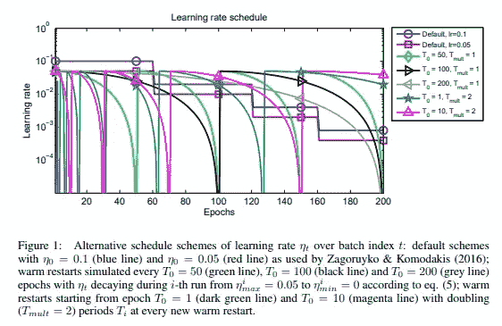
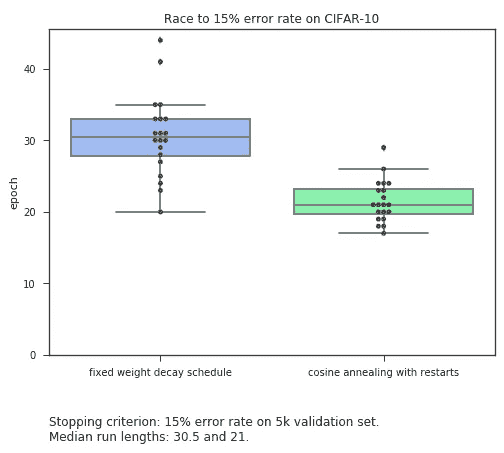
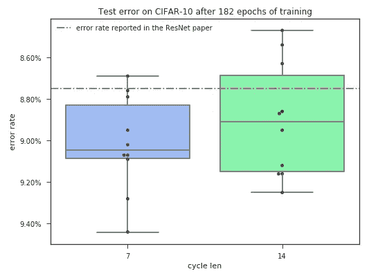

# 如何训练你的神经网络

> 原文：<https://medium.com/hackernoon/how-to-train-your-neural-network-cb5a36e91072>

## 余弦退火的评估

想象你住在山里。你的一个亲戚生病了，你自愿去拿药。

你在你家门口停下来拿必需品——一张城市地图和一块你声称会给你带来好运的大理石形状的石头。你跳上你的龙向北飞去。

最初最重要的是一个总的方向感。地面上的细节几乎看不到，你可以快速覆盖距离。

众所周知，龙需要很大的空间才能着陆。你在城外挑了一个不错的着陆点，然后从附近的酒馆里租了一匹马。

你现在必须更加小心——这匹马跑得很快，但如果你想在药店关门前赶到那里，你必须更加谨慎地选择方向。

一到城里，你就拿出地图，大踏步向大街跑去。当最终到达时，你停下来喘口气，环顾四周。

你的目标就在眼前，你漫不经心地走向入口。

你刚刚开始的旅程非常像训练一个神经网络。为了尽快收敛到一个好的解决方案，我们通过改变[学习](https://hackernoon.com/tagged/learning)速率来利用不同的运动模式。

龙是目前最快的，但也是最不精确的。飞行时，地形看起来大致相同，你只能挑出主要的地标用于导航。这对应于具有高学习率的训练。

另一个极端是走得慢。你可以观察到所有的细节，并几乎完美地选择你的道路。这是我们最低的学习率。

如果走路这么精确，为什么我们不从头到尾做一遍呢？因为要走的路太多了，我们不可能在合理的时间内到达城市。

那为什么不全程飞行呢？从空中我们将无法精确地确定我们的目的地。此外，由于我们的龙是相当大的规模，它可能无法降落在目标附近。城市的地形非常崎岖，我们能做的最好的事情就是选择一个漂亮的平屋顶着陆。然而，这将使我们离我们想要达到的目标还有一段距离。

我们唯一的希望是把训练和高低学习率结合起来，优化速度和精度。

但是在训练一个神经网络的时候如何去做还不是很明显。下面我们将考虑解决这个问题的两种方法。

## 如何衰减学习率

降低学习速度最常见的方法是手工操作。你训练网络一段时间，然后根据结果决定是提高还是降低学习率。冲洗并重复。

整个过程依靠直觉，需要时间去尝试。

然而，最近提出了一种降低学习速率的新方法[1]。其中，我们提供了一个初始学习率，随着时间的推移，它会按照余弦曲线的一部分的形状衰减。到达底部后，我们回到开始的地方，因此得名——余弦退火和重启。

下图对比了使用余弦学习率衰减和手动分段常数时间表。

source: [Stochastic Gradient Descent with Warm Restarts](https://arxiv.org/abs/1608.03983) by Ilya Loshchilov et al.

新方法具有良好的特性。首先，我们不再需要担心手工制作学习率衰减时间表。这为我们节省了大量的时间，我们可以花在其他地方。

此外，通过以非线性方式在学习率的较低值和较高值之间跳跃，我们希望能够更容易地导航出权重空间中对我们的优化器特别不友好的部分。

这些理由是否足以证明转而采用降低学习率的新方法是正确的呢？大概吧。但是像训练时间或训练精度这样的其他重要参数呢？

让我们两个都看看。

## 培训持续时间的比较

我们想测量完全训练一个模型需要多长时间。但是一个网络被充分训练意味着什么呢？

这是你在训练一个模型几个时期后得出的结论吗？或者当您达到一些验证集性能时？这是否意味着通过额外的训练我们不能取得更好的成绩？

这些问题没有简单的答案。为了有更具体的东西，我武断地宣布，在验证集上，终点线是 85%的准确性。

为了进行实验，我在 CIFAR-10 上训练了 40 个 resnet-20[2]模型，对于每种降低学习速率的方法训练 20 个。

我使用默认参数[2],这些参数被挑选出来很好地处理固定学习率衰减。在很多方面，我觉得我让我们的自动化退火计划变得特别艰难。

然而当我运行这个实验时，我得到了如下的结果。

余弦退火以显著的优势赢得了比赛。同样，非常重要的是，我们的结果更加一致。这意味着对计划更有信心，能够持续产生良好的结果。

可能会快一些，但是它能跑完全程吗？它能把我们带到我们想去的地方吗？

## 结果的准确性

余弦退火的承诺是，它应该收敛到解决方案，推广到看不见的数据。

为了进行评估，我们可以将得到的结果与 ResNet 论文[2]中的结果进行比较。作者通过训练集进行了相当于 182 遍的训练，实现了 8.75%的测试误差。

我们将执行 10 次训练，周期长度分别为 7 和 14(两者都是 182)。

我们得到的结果的意义是什么？余弦退火能实现它的承诺吗？

## 摘要

在我的分析中，我运行了余弦退火，其参数经过多年的实验调整，可以很好地处理手动降低学习速率的问题。

以 0.1 的起始学习率一直训练到结束也不可否认地不是正确的方法。

可能最大的问题是我没有展示余弦退火如何丰富一个[机器学习](https://hackernoon.com/tagged/machine-learning)从业者的日常工作流程。

运行实验要快得多。我有更多的时间可以花在增值活动上，而不必忙于陪伴模特的训练。

看看专门为余弦退火设计的设置能有多好的表现会很有趣。但是在所有的未知中，我觉得我找到了我一直在寻找的答案。

鉴于其固有的节省时间的能力和对参数值的鲁棒性，带重启的余弦退火很可能是我在各种应用中选择的技术。

[1][Ilya Loshchilov 和 Frank Hutter 的带有热重启的随机梯度下降](https://arxiv.org/abs/1608.03983)

[2] [用于图像识别的深度残差学习](https://arxiv.org/abs/1512.03385)何、、任、

[3][les lie n . Smith 撰写的用于训练神经网络的循环学习率](https://arxiv.org/abs/1506.01186)—一篇开创性的论文，介绍了在边界值之间循环改变学习率的思想

使用的工具:

1.  杰瑞米·霍华德等人的 [Fastai 库](https://github.com/fastai/fastai)
2.  Yerlan Idelbayev 实施 Resnet-20

你可以在 github 上我的[库](https://github.com/radekosmulski/machine_learning_notebooks/blob/master/cifar10_evaluation_of_cosine_annealing.ipynb)中找到我写的运行实验的代码。

*如果你觉得这篇文章很有趣并且想保持联系，你可以在 Twitter 上找到我* [*这里*](https://twitter.com/radekosmulski) *。*