# 如何训练你的机器人——为每个人的人工智能

> 原文：<https://medium.com/hackernoon/how-to-train-your-robot-ai-for-everyone-69b96ad943e5>

在电影“[如何训练你的龙](https://www.howtotrainyourdragon.com/)”中，角色们住在一个叫“伯克”的岛上(谢谢，[斯蒂芬妮·埃伦贝尔](https://medium.com/u/a14b204262a?source=post_page-----69b96ad943e5--------------------------------))，他们了解到龙并不邪恶，它们只是“被误解了”，你可以[训练](https://hackernoon.com/tagged/train)它们，骑在它们身上，它们不会吃你。

这部电影和这篇文章唯一的共同点是，我的名字实际上是伯克(拼写正确)，我需要一个标题。这周我还训练了一个机器人，我对此感觉很好。

我在 Azure 的自然语言处理方面做了很多工作。Azure 将这项服务称为 LUIS。所以 LUIS 是我的机器人，我训练它在我要求它在特定房间开灯或关灯时理解我。在这个过程中，我学到了一些东西…

*   人工智能可能非常聪明，但是你真的需要训练它
*   机器学习工具已经走过了漫长的道路
*   如果你不吃早餐，喝很多咖啡，确保你呆在浴室附近

让我们来看看如何教路易斯处理一个简单的命令，如“关掉厨房的灯”。

## 路易斯

微软通过 [luis.ai](https://www.luis.ai/home?WT.mc_id=trainyourobot-medium-buhollan) 站点公开 LUIS 服务。你不一定要有 Azure 账户才能使用它，但你需要有一个电子邮件地址。如果你没有电子邮件地址，那么你的名字可能是“Brenden Frasier”。但我特别指的是“过去的爆炸”布兰登·弗雷泽。

What happened to you, Brenden? You left us and didn’t even say goodbye.

LUIS 操作两个主要概念——意图和实体。意图是来自用户的特定动作或想法。他们可以用许多不同的方式来表达这种行为，但是他们潜在的“意图”是一样的。例如，在“打开厨房灯”的情况下，用户可能会尝试几种不同方式中的一种，包括但不限于…

*   打开厨房的灯
*   打开厨房的灯
*   打开厨房的灯
*   厨房灯。开着。现在。

实体是我们想要从意图中解析出来的信息片段。在这种情况下，是位置(即厨房、客厅、泳池房——开玩笑，我没有泳池房。我几乎没有房子房子)和光状态(开或关)。

LUIS 网站使用起来非常简单。连我都很难搞砸。

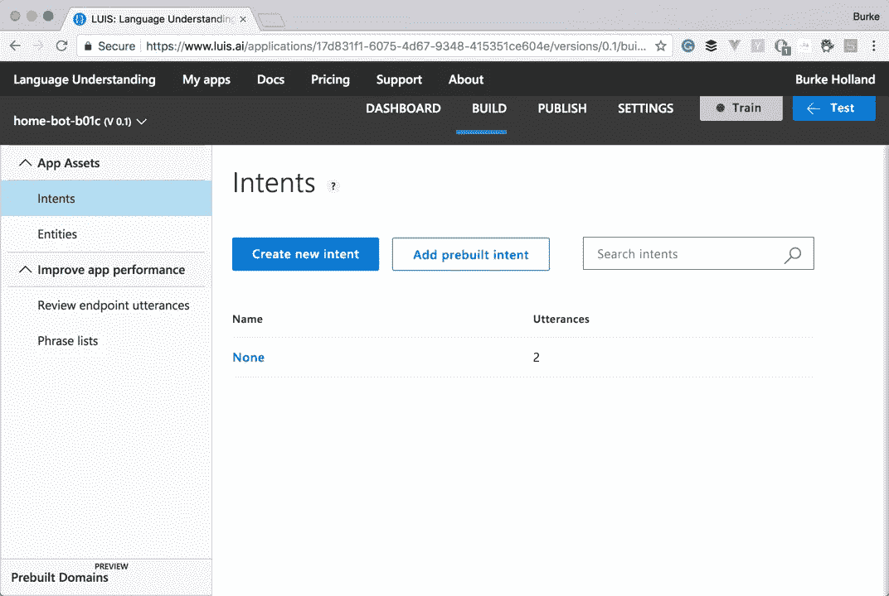

我把两个和两个放在一起，意识到我需要点击“创建新的意图”按钮。

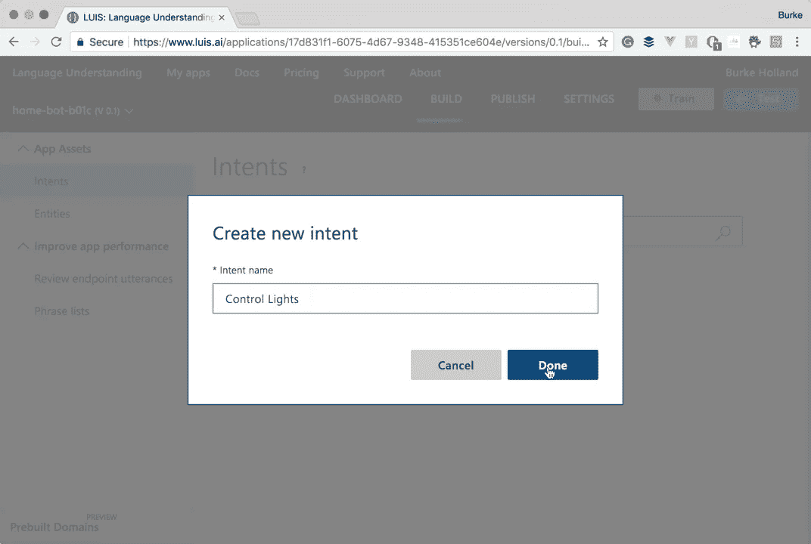

然后它希望你进入一些话语。“话语”这个词应该是英语中最不庄重的词了。从来没有人说过，“我喜欢听你说话”。或者他们有过，而你有过那次糟糕的约会。

我从上面列出的 3 个开始。

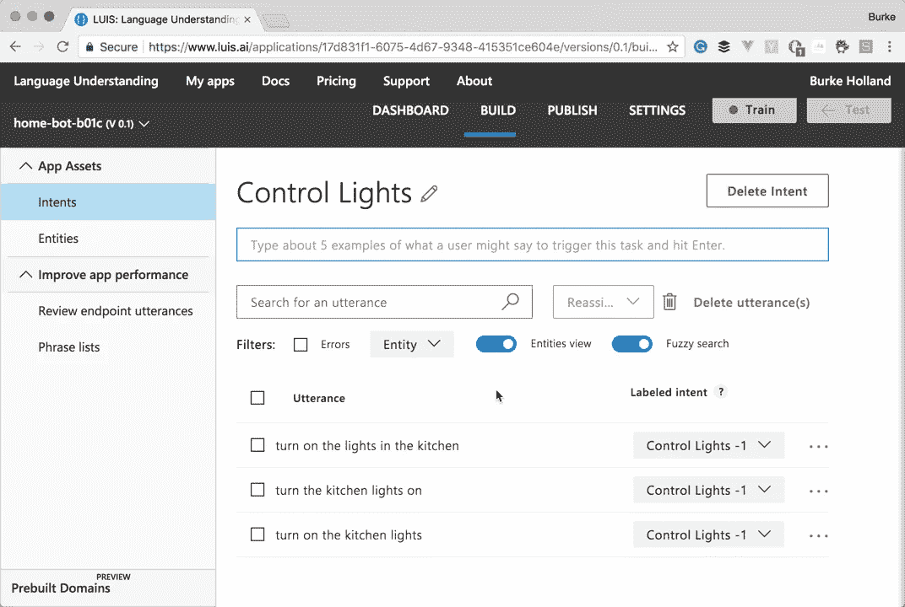

现在，它希望你创建一些实体，并标记你想要提取的话语部分。你只需将鼠标放在单词上，然后给它们分配实体就可以了。我创建了两个简单的实体。你可以创建许多其他类型的实体，但是我并不完全理解它们是什么，你可能应该[检查文档](https://docs.microsoft.com/en-us/azure/cognitive-services/luis/luis-concept-entity-types?WT.mc_id=trainyourrobot-medium-buhollan)。

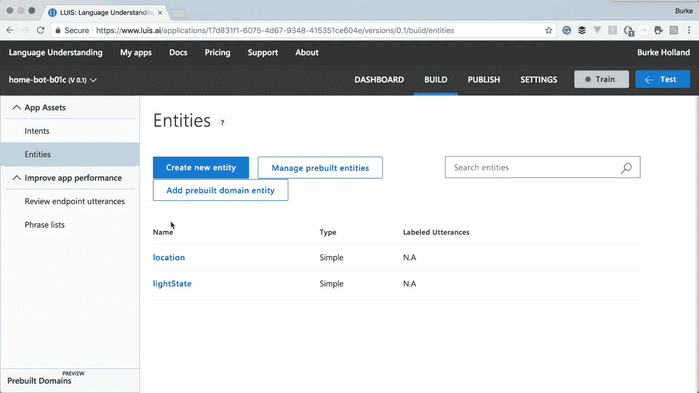

现在我可以用实体来标记我的话语。你只需点击一个单词，并通过选择实体来标记它。当我完成时，它看起来像这样…

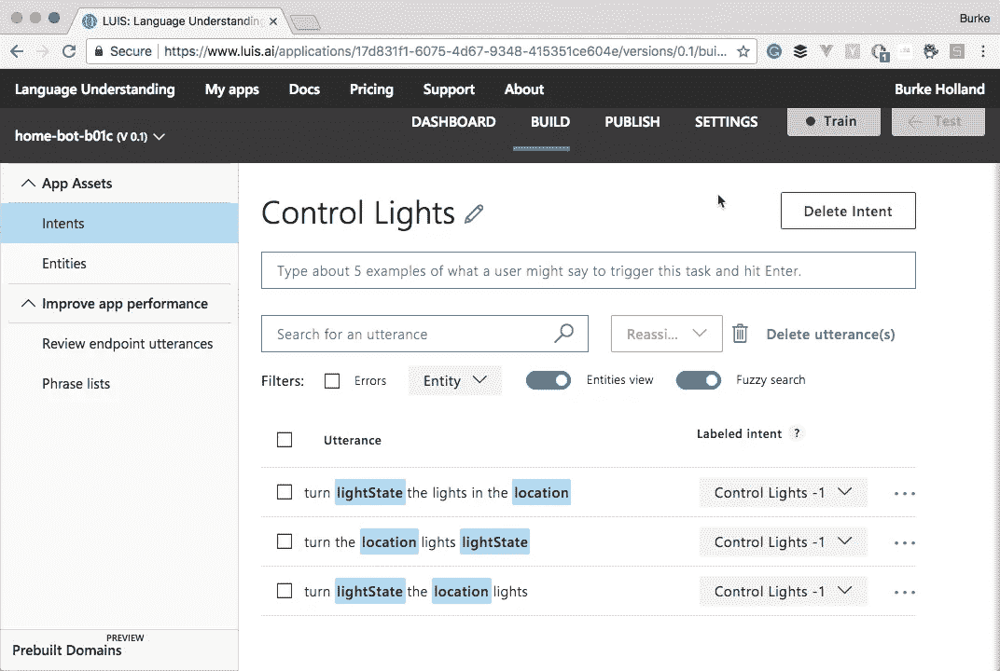

现在我们得到了“火车”模型。这是我最喜欢的部分，因为它涉及到只需点击“培训”按钮，然后去 twitter 吹嘘我是一名数据科学家。

现在我们开始测试我们的模型。这是事情变得有趣和有趣的地方。点击“测试”按钮会打开一个小侧面板，我可以在那里输入话语。在我输入话语后，点击它会打开另一个面板，我们可以看到 LUIS 是如何理解的。

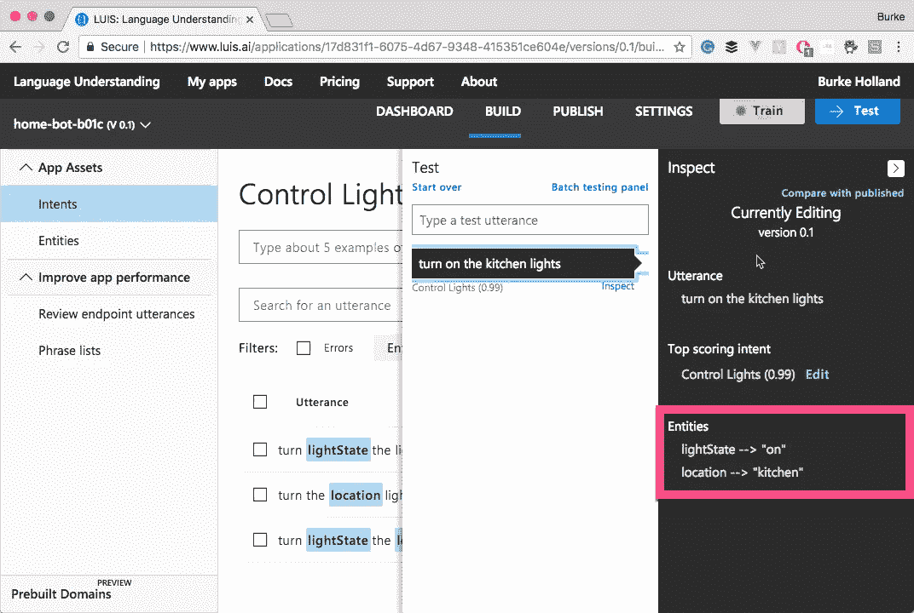

有用！现在让我们言归正传，看看我们能否愚弄这个人工智能。

如果我说“请关掉厨房的灯”，LUIS 只会选择位置。

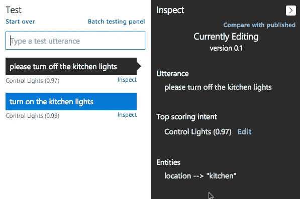

这让我怀疑 LUIS 是否知道关闭是轻状态的有效选择。

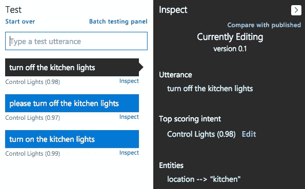

没有。我需要在模型中添加一个语句来处理这个问题。

让我们重新训练，再试一次。每次我们对模型进行修改，比如添加话语，我们都必须再次点击“训练”按钮。又是一个在 Twitter 上吹嘘的好时机。

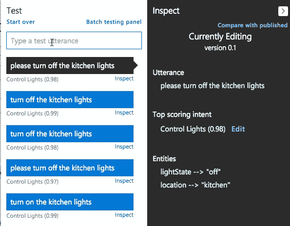

更好看！如果我们尝试一个有两个单词的房间会发生什么。类似“客厅”的东西。

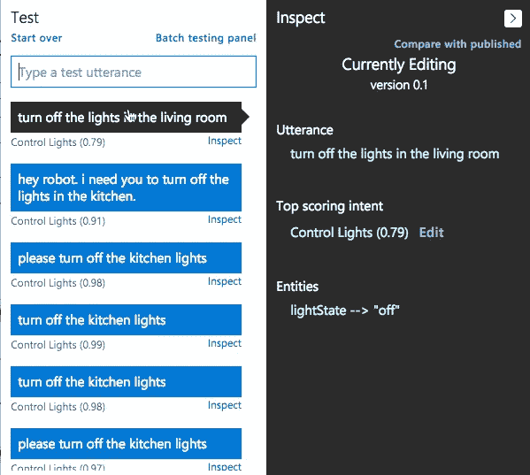

它根本处理不了那个。于是我们添加了另一种话语，将“客厅”标注为“位置”。

现在它工作了，但是如果我打开开关，说“关掉客厅的灯”，路易斯只能得到位置。多训练！

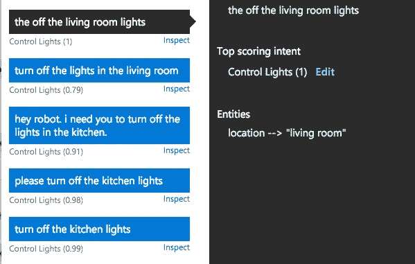

在花了大约一个小时试图愚弄机器人之后，我有了以下的言论和标签。

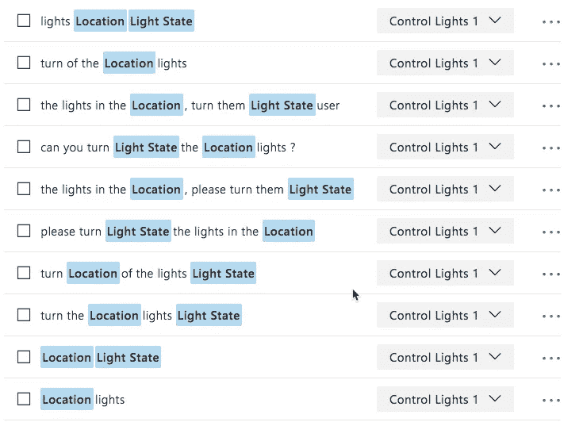

它非常坚固。我可以给它几乎完全胡说八道，它可以挑选出房间和灯光状态。

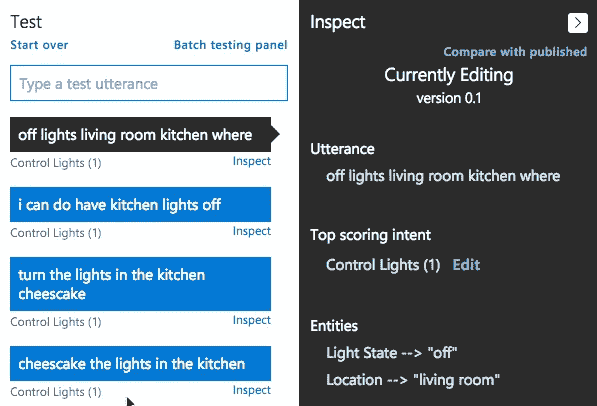

嗯，有时候…

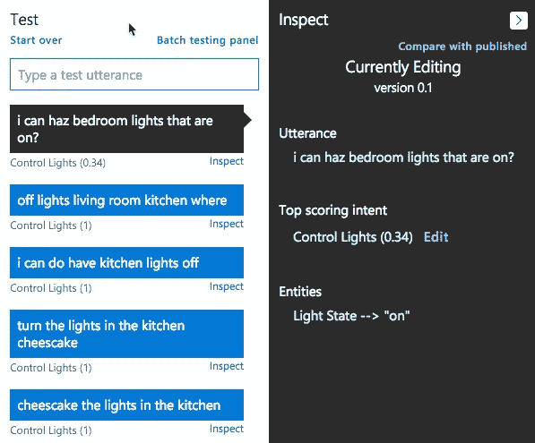

我想我需要用记忆艺术来训练这个机器人。

一旦我完成了，LUIS 就从一个简单的 HTTP 端点公开这个 AI。然后，我可以用它来创建一个机器人，或者从我的应用程序中使用它。我使用 Azure Bot 服务以及 Twilio 和一个无服务器的 Azure 函数来创建一个文本 Bot。看这荣耀！

# 训练你自己的

我喜欢学习如何使用路易斯。最让我受鼓舞的是，我觉得“我能做到！”。我一直对人工智能和机器学习持超级怀疑态度，唯一的原因是，感觉你必须是一个理论物理学家才能弄明白它，而我甚至连系鞋带都不会。

工具已经到了我们可以开始将人工智能构建到我们的应用程序中的地步，你没有博士学位也可以做到这一点。

你可以通过前往 [luis.ai](https://www.luis.ai/home?WT.mc_id=trainyourobot-medium-buhollan) 来训练你自己的机器人。