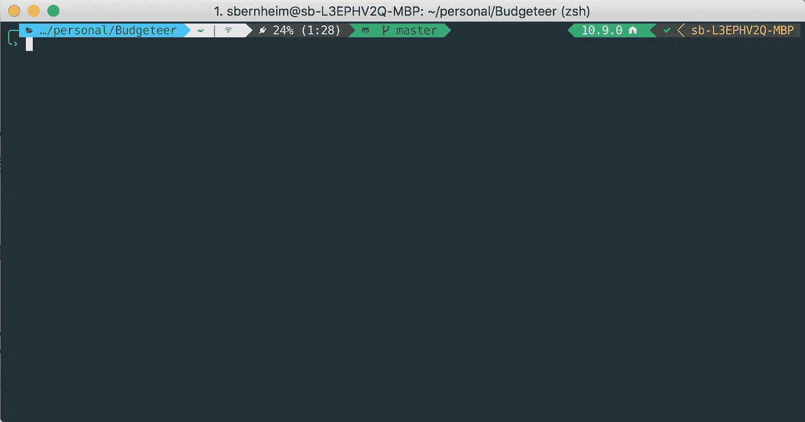

# 如何使用 ZSH 定制您的终端

> 原文：<https://medium.com/hackernoon/how-to-trick-out-terminal-287c0e93fce0>

当我第一次开始使用我的终端时，它看起来像这样

Basic Terminal

现在，它看起来像这样:

Tricked out Terminal

那么，你如何从一个到另一个呢？对我来说，花了大约 2 年时间才学会足够的东西，但是让我们看看我们是否能帮你加快速度！

😎

# 第一步:放弃 Bash，使用 ZSH + [哦，我的 ZSH](https://github.com/robbyrussell/oh-my-zsh)

首先，一些终结学——bwhahaha get it terminal ogy！！*擦去眼中的泪水*😂

好吧，也许这就是可怕的双关语

所以你有你的终端应用程序。这是 mac/linux/windows 或 iTerm2 或 powershell 等上的默认终端应用程序。([你肯定应该使用 iTerm2](https://www.iterm2.com/downloads.html) )。

然后你就有了运行在应用程序中的外壳。有一堆这样的东西

*   Bash(再次代表 Bourne Shell)
*   ZSH (Z 壳)
*   c 壳
*   鱼
*   等等等等

它们的工作方式都略有不同，或者支持不同的功能。ZSH 非常容易定制，这也是我们使用它的原因。如果你有 mac，你可以`brew install zsh`或者 linux `sudo apt-get install zsh`如果都不行/更多信息[点击这里查看更多安装方法。](https://github.com/robbyrussell/oh-my-zsh/wiki/Installing-ZSH#install-and-set-up-zsh-as-default)

现在你需要做的就是用这个命令`chsh -s zsh`将它设置为你的默认 shell。`chsh`代表，你猜它是 change shell，-s 告诉命令你想把它改成一个你作为参数传入的特定 shell，这里是 zsh。你也会被要求输入你的电脑密码。

# *第二步:安装我的 ZSH*

此处安装说明:[https://github.com/robbyrussell/oh-my-zsh#via-curl](https://github.com/robbyrussell/oh-my-zsh#via-curl)

恭喜，完成了两步！！看看这有多简单。

# 第三步:选择合适的字体

你会想看看这个回购:[https://github.com/ryanoasis/nerd-fonts#font-installation](https://github.com/ryanoasis/nerd-fonts#font-installation)它包含了大量的字体，支持所有你想使用的令人敬畏的、酷的符号。有很多字体需要安装，所以当你的网络连接可能会中断或者你很急的时候，一定不要运行这个程序。

Nerdfont 字体支持字体-真棒字形，材料设计图标，octicons 和更多。

Nerdfont source fonts diagram

如果你只是想得到一个，[这是我正在使用的字体](https://github.com/ryanoasis/nerd-fonts/blob/master/patched-fonts/DejaVuSansMono/Regular/complete/DejaVu%20Sans%20Mono%20Nerd%20Font%20Complete%20Mono%20Windows%20Compatible.ttf)，效果很好。只需点击链接，下载 ttf 文件并将字体安装到您的计算机上。如果您多次看到带有问号的框，这意味着您在终端中使用的字体不支持该字符。

Unsupported character symbol

# 第四步:主题和颜色

在定制您的终端时，您需要关注两件事情。首先是主题。这是终端的外观。第二是那些东西的颜色。这决定了什么样的蓝色是你的蓝色，什么样的红色是你的红色等等。

首先让我们谈谈主题。首先来看看[https://github.com/robbyrussell/oh-my-zsh/wiki/themes](https://github.com/robbyrussell/oh-my-zsh/wiki/themes)

所有这些都是烘烤成哦，我的 zsh 和所有你要做的是编辑你的。zshrc 文件(位于~/。zshrc)并设置`ZSH_THEME="THEME_NAME"`，例如`ZSH_THEME="agnoster"`，就这样。

Example of iTerm2 Color Scheme called Broadcast

至于颜色，你可以[看看这个 repo](https://github.com/mbadolato/iTerm2-Color-Schemes) 里面有一堆很好的配色方案准备下载给 iTerm2。可以在设置中编辑颜色。转到设置>配置文件>颜色。右下角是颜色预设列表。点击这个，你会看到一个选项来导入一个配色方案或选择一些内置的。导入从该仓库下载的任何配色方案。

# 第五步:Powerlevel 9K

我最近发现的另一个很棒的回购是 [PowerLevel 9K](https://github.com/bhilburn/powerlevel9k) 。它的目的和《哦，我的天》中的主题是一样的。

[要安装 PowerLevel 9k，请查看此处的说明](https://github.com/bhilburn/powerlevel9k/wiki/Install-Instructions#step-1-install-powerlevel9k)

然后看看这个页面，看看其他人做的很酷的东西。找一个你喜欢的，把他们的设置复制到你的`.zshrc`文件中，然后你可以修改一些小东西，直到它变成你喜欢的样子。在你尝试从零开始构建你自己的之前，我会先这么做。您的里程可能会因其中一些而异。但是一旦你找到一个你喜欢的，你可以修改任何变量，直到它是你喜欢的。

(一些配置可能包括`POWERLEVEL9K_MODE="SOMETHING_HERE"`和`ZSH_THEME="powerlevel9k/powerlevel9k"`。如果你已经在你的`.zshrc`中有了它们，删除重复的，如果你正在设置第一个选项，确保它在`ZSH_THEME`之前被设置。)

# 步骤 6:编写自己的函数

Powerlevel 9K 支持很多开箱即用的东西，包括 github 状态/其他版本控制系统、当前工作目录、主机、节点版本、时间/日期、[等等](https://github.com/bhilburn/powerlevel9k#available-prompt-segments)。

你也可以写你自己的函数来显示更多的东西。如果我连接到互联网，下面是我必须显示的功能。如果是这样，我用绿色显示这个符号。否则为红色。你可以写任何 bash 函数，并让它`echo`在最后写一条语句。然后在提示中添加`custom_internet_signal`(或者任何你的函数被调用)和任何函数`echo`会出现的内容！

注意:该功能存储在`.zshrc`中。

注 2: `\uXXXX`是说显示这个 unicode 字符。要真正知道 google `u+XXXX unicode character`是什么角色。

你可以编写函数来显示你的电池电量(不同的图标代表不同的状态，不同的颜色代表不同的电量等)。Spotify 上播放的歌曲等(这可能需要一些工作，但检查一下[https://github.com/hnarayanan/shpotify](https://github.com/hnarayanan/shpotify)或[https://github.com/johnelse/spotify-cli](https://github.com/johnelse/spotify-cli))、Docker 状态等。

就是这样！欺骗终端的 6 个步骤！

如往常一样，如果你想看看我的点文件作为参考，这就是。随意派生或克隆它(尽管我不会使用安装脚本来复制一切，它有相当多的错误并且不是最新的)。