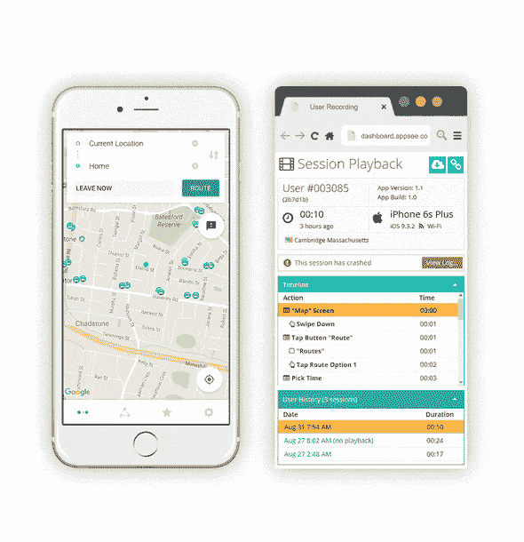
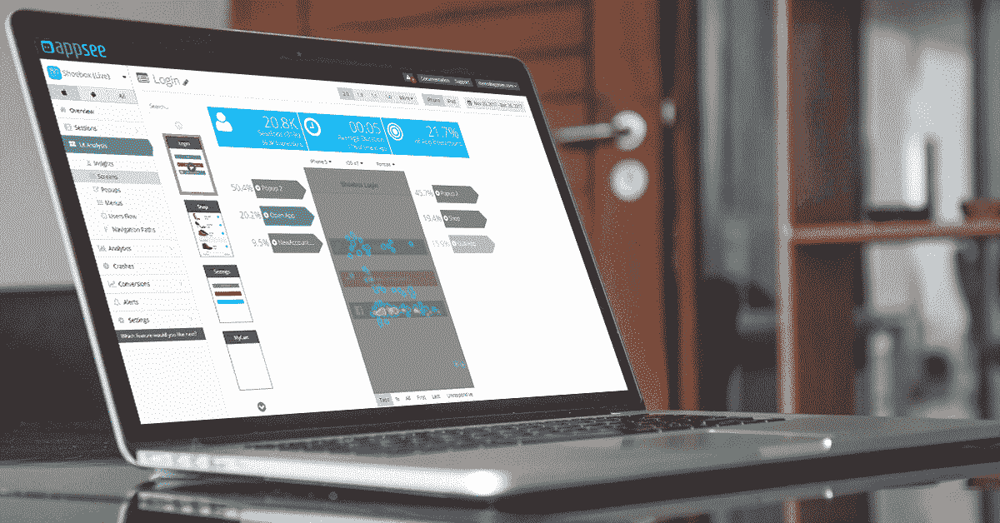
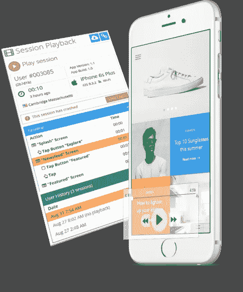

# 如何让你的 App 用户从调皮变成乖

> 原文：<https://medium.com/hackernoon/how-to-turn-your-app-users-from-naughty-to-nice-81d12f8d6324>

在节日期间，不仅仅是百货商店和在线零售商感受到了节日购物热潮的好处。事实上，在每年的这个时候，应用程序的下载率都会得到大幅提升。

然而，即使这一季有更多的下载，也有更多的评论。应用程序用户的评论和评级对应用程序的成功有着重要的影响。事实上，从二星到四星的增长可以转化为[540%的下载率增长](https://www.kahuna.com/resources/how-app-store-ratings-impact-app-downloads/)。此外，很难获得积极的评价，因为应用程序用户更有可能分享他们的意见[，如果他们有负面的体验](https://blog.appsee.com/how-important-are-app-ratings-and-reviews-to-users/?cpnid=701b0000000Wd7c&utm_source=medium&utm_medium=link&utm_campaign=how_to_turn_users_naughty_nice&utm_content=how_important_app_ratings_reviews_users)，而不是正面的体验。这就是为什么优先考虑你的应用程序的 UX 对于赢得更多的推广者而不是反对者是至关重要的。毕竟，你不希望你的用户的表情从微笑变成邪恶的假笑。

应用程序制造商需要提供最佳的用户体验，以确保他们吸引更多的好用户和 5 星评论。[有很多原因](http://blog.monkop.com/post/120657007496/9-causes-of-bad-app-reviews)为什么用户会变得“淘气”,并在评级储备中给一个应用程序一坨煤。下面，我们将讨论**导致淘气用户和差评**的三大原因，以及如何利用 [Appsee](https://www.appsee.com/?cpnid=701b0000000Wd7c&utm_source=medium&utm_medium=link&utm_campaign=how_to_turn_users_naughty_nice&utm_content=appsee_home_link) 的一些独特功能让它们变得更好。

# 频繁/未解决的崩溃

当应用程序崩溃时，会非常令人沮丧。用户失去了时间、工作，甚至可能对应用失去信心。 ***有人能说“删除吗？”*** 因此，对于开发人员来说，快速识别和排除崩溃是至关重要的。修复崩溃可能具有挑战性，因为应用程序及其环境正变得越来越复杂。再加上用户期望越来越高，耐心越来越少，开发者需要帮助。

这就是自动检测、记录和标记崩溃的工具能够扭转局面的地方。开发人员可以使用[崩溃视频记录](https://www.appsee.com/features/crash-videos-and-symbolication?cpnid=701b0000000Wd7c&utm_source=medium&utm_medium=link&utm_campaign=how_to_turn_users_naughty_nice&utm_content=crash_reporting_feature)来亲眼见证问题和事件的顺序，而不是浏览崩溃日志试图了解发生了什么。没有更多的猜测——这意味着有更多的时间专注于实际解决问题，让您的用户更开心。此外，因为开发人员可以将每次崩溃与不同的用户 ID 相关联，所以他们可以更好地帮助他们的支持团队在用户变得调皮并写下差评之前快速联系他们。

*Example of crashed session recording via Appsee.*

# 弱用户界面

有许多设计元素会导致 UX 质量差。一些常见的问题是违反直觉的菜单，没有反应的手势，奇怪的导航流程和混乱的按钮。此外，[苹果仅仅因为糟糕的设计就拒绝了提交给应用商店的 6%的应用。](https://developer.apple.com/app-store/review/rejections/)

设计师可以使用[触摸热图进行 UI 优化和故障排除](https://www.appsee.com/features/touch-heatmaps?cpnid=701b0000000Wd7c&utm_source=medium&utm_medium=link&utm_campaign=how_to_turn_users_naughty_nice&utm_content=touch_heatmaps_feature)。通过利用触摸热图，设计师可以了解用户对屏幕上的哪些区域感兴趣，哪些动作按钮被忽略或让用户感到困惑，以及哪里出现了无反应的手势。触摸热图跟踪应用程序中的所有手势，并显示每个屏幕中执行的手势。他们还可以识别屏幕上的点击、挤压和滑动之间的明显差异。这是有助于推动用户界面改进的强大信息。点击阅读更多关于[触摸热图的信息。](https://www.appsee.com/ebooks/the-complete-handbook-for-touch-heatmap-analytics?cpnid=701b0000000Wd7c&utm_source=medium&utm_medium=link&utm_campaign=how_to_turn_users_naughty_nice&utm_content=touch_heatmaps_ebook)

# 性能和可用性差

有时应用程序只是表现不佳或难以使用。与崩溃或错误不同，应用程序的性能往往更难确定。性能和可用性差的一些例子包括加载时间慢、屏幕错误、冻结和用户发起的任务不完整。具体来说，应用程序运行缓慢的一个主要原因是内存使用在测试阶段没有得到优化。

通过利用[用户会话记录](https://www.appsee.com/features/user-recordings?cpnid=701b0000000Wd7c&utm_source=medium&utm_medium=link&utm_campaign=how_to_turn_users_naughty_nice&utm_content=user_recordings_feature)，开发人员可以识别用户受挫区域并有效地解决它们。这些记录还可以帮助开发者确定关键的用户行为元素，例如:用户为什么可能放弃注册，用户使用应用程序的忠诚度如何，以及用户为什么退出应用程序。了解这些事情可以帮助应用程序开发人员制定增强策略，并使任何应用程序更上一层楼。

# 最后的话

归根结底，app 用户并非天生“淘气”；更确切地说，是应用程序本身造成了不好的影响。应用程序开发者需要专注于不断改善用户体验的不同方面，以防止点燃挫折感和随后应用程序用户的差评。定性分析平台肯定可以帮助应用程序制造商实现最佳 UX，领先于潜在问题，并保持良好的用户。

**现在是更好的应用程序用户的季节，所以在你的用户成为怪杰之前，开始你的**[**14 天免费 Appsee 试用**](https://www.appsee.com/start?cpnid=701b0000000Wd7c&utm_source=medium&utm_medium=link&utm_campaign=how_to_turn_users_naughty_nice&utm_content=free_trial_link) **。**

 [## 追踪移动应用用户行为的最佳工具

### 你知道用户如何使用你的应用吗？他们的好恶是什么？很容易忽略这些问题，并且…

medium.com](/@Appseecom/best-tools-for-tracking-user-behavior-on-mobile-apps-b980cfa2165d)