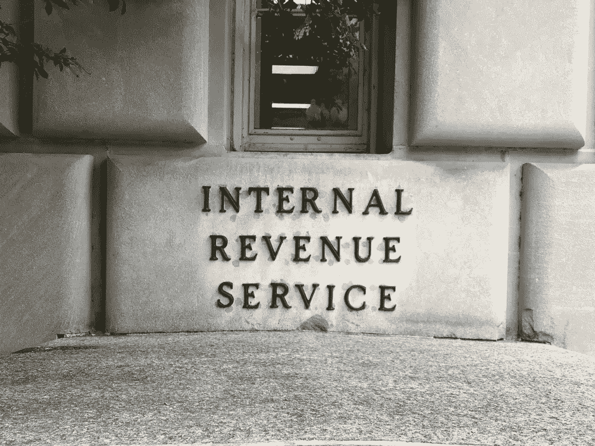

# 如何将你的比特币和加密损失转化为节税

> 原文：<https://medium.com/hackernoon/how-to-turn-your-bitcoin-and-crypto-losses-into-tax-savings-b5bafe0976>

[比特币](https://hackernoon.com/tagged/bitcoin)和[加密](https://hackernoon.com/tagged/crypto)损失可以用来抵消其他类型的资本利得，从而为你省钱。这篇文章讲述了如何处理你的损失，以及你在美国的秘密税需要记住的重要事项。

# 加密和比特币交易的损失抵消了其他资本收益

出于税收目的，出售加密货币与出售任何其他类型的资本资产(股票、债券、房地产等)一样对待。这意味着，无论何时你出售比特币或任何其他密码，你要么实现了[资本收益](https://www.investopedia.com/terms/c/capitalgain.asp)，要么实现了资本损失。当你获得资本收益时(你出售密码的价格高于你购买密码的价格)，你就应该为收益的金额纳税。但是，当您以低于购买价格的价格出售密码时，您会遭受资本损失，并且您可以使用这种损失来抵消其他交易的收益，甚至可以抵消出售其他财产(如投资组合中的股票)的收益。

不幸的是，在我们目前经历的加密领域，有大量的损失，为了减少你的应税收入和节省资金，提交这些资本损失是明智的。

# 高达 3000 美元的净资本损失可以从其他类型的收入中扣除

每当你一年的资本利得和损失总和为负数时，你就会发生净资本损失。如果[净资本损失](https://www.investopedia.com/terms/c/capital-loss-carryover.asp)小于或等于 3000 美元(如果你已婚并单独报税，则为 1500 美元)，那么全部资本损失可以用来抵消其他类型的收入——比如你的工作收入。

如果你的损失超过 3000 美元，那么超过 3000 美元的金额将结转到下一个纳税年度。

# 这在现实生活中是什么样子的？

让我们通过一个例子来描绘一幅清晰的画面。

假设你在 2018 年开始时作为一名密码交易员做得非常好。你在比特币和以太坊交易中赚了 5000 美元。一旦八月来临，市场变得更糟，你遭受重创，你的投资组合价值大幅下跌。你最终卖掉了所有的头寸，损失了 7000 美元。从这里开始，你今年可能会损失 2000 美元。这项损失将从你当年的应税收入中扣除。假设你一年的收入是 5 万美元。由于这一损失，只有 48，000 美元的收入需要纳税。根据你的损失有多严重，你可以通过适当地记录你的损失来节省一大笔钱——特别是如果你有其他资本收益来抵消传统股票投资组合的话。

# 国税局表格 8949

为了更详细地了解如何在您的税收中报告这种加密，您需要在美国国税局 8949 号表格中报告您所做的每一笔交易，以及其他资本资产的销售和处置。对于您在这一年中进行的每笔交易，您都要列出交易的密码数量、交易价格、交易日期、交易的成本基础以及发生的资本损益。继续在这张表上列出今年以来的每笔交易，在底部合计净损失，它们应该等于 2000 美元。

# 如果我在一年中做了大量的交易会怎么样？

许多密码爱好者经常交易。如果你没有记录你的交易日期，你买卖密码的金额，以及这些交易的资本收益/损失，这个报告过程和创建你的 8949 表格会变得非常令人头痛。如果这是你面临的情况，那么利用[加密税务软件](https://www.cryptotrader.tax)为你自动创建 8949 是值得的。

# 警惕昂贵的“加密会计师”

许多交易者转向昂贵的“加密会计师”来创建他们的 8949，并处理整个纳税申报过程。虽然有一个好的注册会计师很重要，但大多数注册会计师事务所只是使用这些相同的自动加密税务服务来进行密集的计算，然后在另一端向客户收取更多的费用。在支付数百美元之前，先做好调查。一个省钱的选择是自己做加密损益计算，然后将这些数据交给传统的注册会计师或上传到 TurboTax 这样的网站。这样，你就避开了等式中昂贵且不必要的“加密会计师”部分。

一旦你在表格 8949 上把你的总资本收益和损失加在一起，你就把总额转移到你的 [1040 表 D](https://www.irs.gov/forms-pubs/about-schedule-d-form-1040-capital-gains-and-losses) 上。

理想情况下，你是一个密码交易者的向导，你不必从你的交易活动中收获任何损失。然而，如果你有损失，确保你至少在利用它们，并尽可能地省钱。

*使用* [***密码交易员***](https://www.cryptotrader.tax) ***轻松申报您的加密货币资金收益。*税**。

[https://upscri.be/hackernoon/](https://upscri.be/hackernoon/)