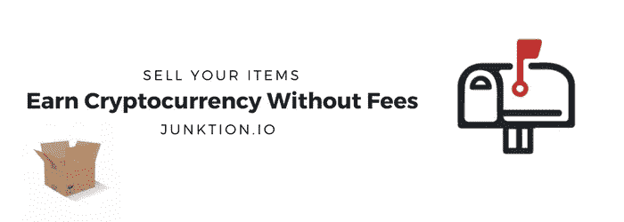

# 如何把你的东西变成加密货币

> 原文：<https://medium.com/hackernoon/how-to-turn-your-stuff-into-cryptocurrency-3f89d8b21e79>

将你的物品转换成加密货币在以前是一件很麻烦的事情。你必须使用多种服务，整个过程需要几天甚至几周。这个过程中的一个主要问题是，从来没有一个服务可以将你的物品直接转换成加密货币。这就是垃圾回收发挥作用的地方。

# 将您的物品转换成加密货币

将您的物品转换成加密货币从未如此简单。有了 Junktion，我们会在 24 小时内给你的项目报价。如果您填写这张[表格](https://junktion.io/sell-to-us)，您将能够开始将您的物品转换为比特币和加密货币的简单 4 步流程。

> 这甚至比在大型平台上销售还要快，比如 T4、易趣和亚马逊。

# 为什么我要把我的物品变成加密货币？

如果你有兴趣在你的投资组合中获得或引入某种加密货币头寸，这是一个好主意。在 Junktion，你可以用你能想到的几乎任何加密货币出售你的物品。这里有几个把你的物品卖给废品收购站的好处。

## 免费赚取加密货币

Junktion 是一个将你的东西变成比特币、以太坊币、恒星币、Monero 币、Neo 币、Nano 币、Stratis 币、Vertcoin 币、任何主要交易所的 erc20 代币以及几乎所有其他硬币的地方。

我们会给你一个你拥有并愿意出售的任何东西的报价。此报价不含任何费用。

## 人们可以投资未来

Junktion 在这里推动加密货币的采用。我们希望每个人都能尽可能地参与加密货币革命。如果你拥有一件有价值的东西，你可以在 Junktion 开发它，把你的东西变成你选择的加密货币。

## 回收利用

这是你应该把你的产品卖给我们的众多原因之一。Junktion 计划增加生态系统中所有生物的寿命。我们目前正处于为我们的生态系统收集物品的阶段。在生态系统中，买家将能够匿名购买任何通过我们生态系统的东西。这是将你的物品变成加密货币的关键一环。我们将在我们的白皮书中详细介绍，这将在未来几个月内完成。

# 我们做什么

我们希望通过让人们有机会立即将你的物品转化为加密货币，来帮助加密货币平台，如以太坊、Neo 和 Stellar，以及比特币进一步推动采用。我们在帮助所有加密货币普及的过程中发挥着支持作用。

## 它是如何工作的

为了更好地了解我们如何将您的物品转换为比特币或加密货币的流程，请[点击此处](https://junktion.io/#how-it-works)。

> 人们一直称我们为比特币当铺。

## 我们为什么这么做

我们将商品和实物转化为比特币和其他加密货币的原因有很多。Junktion 有两个主要目标。帮助人们投资比特币和其他加密货币，同时回收并帮助清洁世界。

我开始 Junktion 的原因是因为我曾经投资于所有类型的实物项目。我想把这些实物直接转换成加密货币，所以我自己创建了这项服务。对于比特币和所有加密货币来说，2017 年是不可思议的一年。当你拥有这种数字货币时，持有实物作为投资就不再有意义了。把你的实物变成比特币、以太坊或者任何你想要的加密货币都有它的好处。