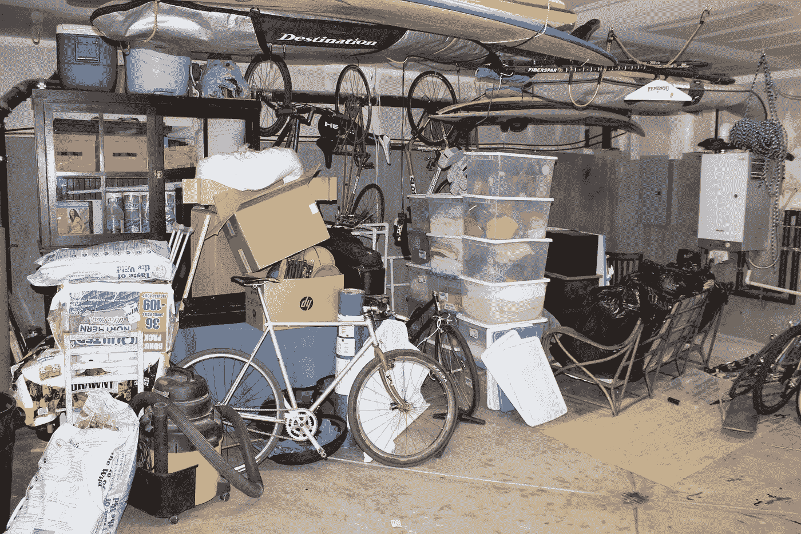

# 如何把你的东西变成加密货币

> 原文：<https://medium.com/hackernoon/how-to-turn-your-stuff-into-cryptocurrency-fb981deed501>

发布于[2018 年 4 月 2 日](https://junktion.io/2018/04/)

将你的物品转换成加密货币在以前是一件很麻烦的事情。你必须使用多种服务，整个过程需要几天甚至几周。这个过程中的一个主要问题是，从来没有一个服务可以将你的物品直接转换成加密货币。这就是垃圾回收发挥作用的地方。