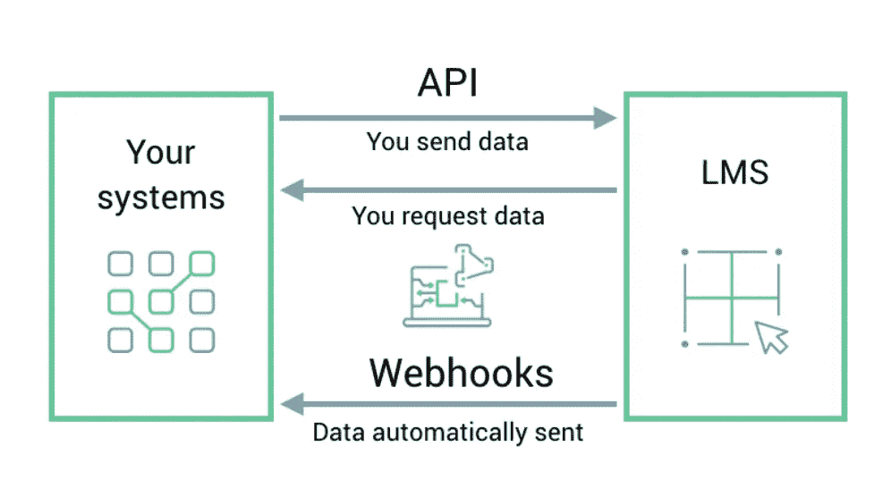

# 如何使用 API 和 Webhooks 来增强你的培训自动化

> 原文：<https://medium.com/hackernoon/how-to-use-apis-webhooks-to-supercharge-your-training-automation-5a0b16b80cce>

学习应该是许多不同系统和运营的核心，应该在最需要的时间和地点进行。正是通过 API 和 webhooks，未来在正确的时间、正确的地点进行与上下文相关的学习才成为可能。

随着培训越来越融入工作场所的运营，简化流程和[提供情境学习](https://elearningindustry.com/cloud-based-lms-for-your-online-training-program-need-5-reasons)的能力变得比以往任何时候都更加重要。

为了提高易用性和参与度，[学习管理系统(LMS)](https://www.northpass.com/learning-management-systems) 和其他软件系统需要能够协同工作，以提供最佳的用户体验。应用程序接口(API)和 webhooks 可以作为软件系统和 LMS 之间的桥梁。

# 什么是 API 和 Webhooks？

一般来说，API[1]和 webhooks [2]是在两个系统之间传输数据的编程方式。开发人员可以利用 API 和 webhooks 在系统之间推和拉数据，以执行自动化功能。

API 和 webhooks 是一枚硬币的两面。这两个特性都支持两个系统之间的编程数据传输，有时甚至交换相似的数据。关键的区别在于数据传输的时间和原因，以及数据交换的方向。

为了说明 API 和 webhooks [3]，我们可以把你手机上的邮件应用程序想象成一个类比。

两者之间的第一个区别是谁发起对数据的请求。使用 API 的动作类似于点击一个按钮来刷新你的收件箱以检查新邮件。在这种情况下，**您必须发起数据请求**。而 webhook 类似于自动推送通知到您的手机，在收到邮件时通知您。数据会自动地**传递给**你，而不需要你去索取。

第二个区别是系统间数据交换的方向。您可以使用 API **从系统中收集数据，也可以向系统发送数据**，但是您只能从 webhooks 接收数据**。在收件箱示例中，如果您撰写了一封新邮件，将使用一个 API 来将新邮件的数据发送到系统中。webhook 无法用于完成此任务，因为 web hook 仅用于接收数据，不能向系统发送数据。**

概括一下:

# API 和 Webhook 的主要区别

*   API
    要求在系统之间交换任何数据之前发起一个请求。此外，数据可以双向流动:流入和流出系统。
*   **web hook**自动编程，在有事发生时向另一个系统发送数据。此外，数据只能单向流动:流出系统。

虽然 API 通常可以配置为定期请求对数据的任何更改，以便完成与 webhook 类似的任务，但 web hook 提供了一种更简单、更即时的方式来在关键事件发生时接收更新。当 API 和 webhooks 结合使用时，可以实现广泛的智能和简化的工作流。

# 如何利用 LMS API 和 Webhooks？

可以利用一个 [LMS API](https://app.northpass.com/api/v2/docs) 和 [webhooks](https://www.northpass.com/apps/northpass-webhooks) 来简化公司中的各种操作流程。下面是一些示例工作流，可以通过利用 LMS 的 API 和 webhooks 功能来实现。

1.  通过 API 在新的在线课程中注册学员。这允许您在支持团队成员收到客户的不良反馈后，让他们参加标准课程。另一个使用案例是，在销售团队成员报告的交易损失超过阈值后，让他们参加处理异议的课程。
2.  使用 API 从 LMS 中提取数据，并结合其他员工指标进行分析。例如，这将允许您将销售业绩或票证响应时间与课程参与度进行比较。
3.  使用 webhooks 采取触发动作。这可以让您在员工的经理完成某门课程时获得不及格的分数时向其发出警告，或者在内部系统中自动奖励参与度较高的员工。

您 [LMS Webhooks 应用程序(如 Northpass)](https://www.northpass.com/apps/northpass-webhooks) 应该允许您通过利用学员创建事件、学员进度事件和课程完成事件来触发系统中的特定操作，从而自动化和简化操作和工作流。使用 Webhooks，您的开发人员可以与 Northpass 建立更深层次的集成，使您的系统能够根据学习者与培训的交互采取行动。

当创建新学员、学员完成课程或学员完成活动时，您可以启用和接收 Webhooks。

# 摘要

在当今互联系统的世界中，学习应该是许多不同系统和运营的核心，应该在最需要的时间和地点提供。正是通过 API 和 webhooks，未来在正确的时间、正确的地点进行上下文相关的学习成为可能。

当你计划你的培训项目的[未来时，寻求采用提供 API 或 webhooks 的 LMS。请一位工程师来帮助您发现适合您的用例的最佳解决方案，并与您的技术团队建立持续的协作，以帮助您简化、适应和扩展您的培训操作。](https://elearningindustry.com/top-online-training-center-10-characteristics)

请记住，LMS 是您培训内容交付方式的关键部分，也是您评估学员和评估项目成功与否的关键部分。要获得更多关于 API、webhooks 的细节，以及购买合适的 LMS 所需了解的一切，请看一下[为中小型企业提供的完整 LMS 购买指南](https://elearningindustry.com/free-ebooks/the-complete-lms-buying-guide)。

**参考文献:**

1.  [什么是 API？请用英语。](https://medium.freecodecamp.org/what-is-an-api-in-english-please-b880a3214a82?utm_campaign=elearningindustry.com&utm_source=%2Fimportant-feature-for-training-automation-lms-api-single&utm_medium=link)
2.  什么是 Webhook？
3.  [Webhook vs API:两者有什么区别？](https://sendgrid.com/blog/webhook-vs-api-whats-difference/?utm_campaign=elearningindustry.com&utm_source=%2Fimportant-feature-for-training-automation-lms-api-single&utm_medium=link)

north pass[是专为拥有 100 多名员工的公司设计的，是一个现代化的、易于使用的学习管理系统，用于快速创建和提供品牌培训模块。](https://www.northpass.com/)

*原载于 2018 年 2 月 26 日*[*elearningindustry.com*](https://elearningindustry.com/important-feature-for-training-automation-lms-api-single)*。*