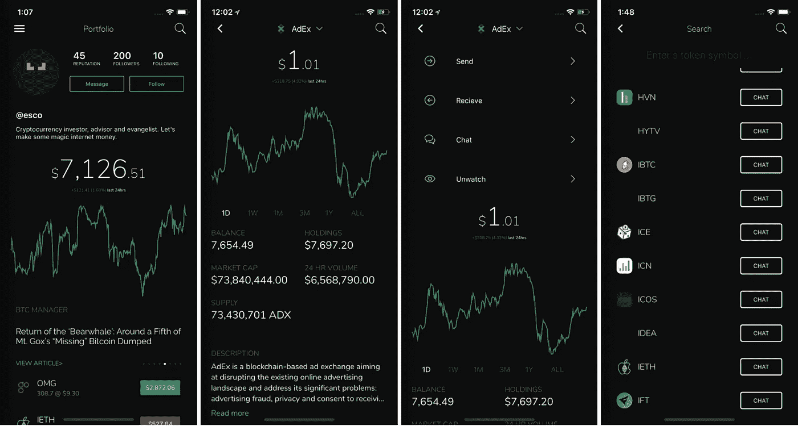

# 如何使用加密货币而不被黑客攻击

> 原文：<https://medium.com/hackernoon/how-to-use-cryptocurrency-without-getting-hacked-d1d5a3190bb>

*由*[*Esco Obong*](https://www.linkedin.com/in/escoo)*，CTO @* [令牌](https://medium.com/u/231b728d1800#heading=h.bbj70jwn1kh8)和[ico](https://docs.google.com/document/d/1ynKBPCkzn76LI8jH3eGkPTJtQV7-PzaFVy0tquGAHCE/edit#heading=h.oyggl0de89fm)列表，以及通过区块链技术和[实时聊天](https://docs.google.com/document/d/1ynKBPCkzn76LI8jH3eGkPTJtQV7-PzaFVy0tquGAHCE/edit?pli=1#heading=h.dm9dasx9mnpv)进行[验证的社交档案，这些社交档案旨在防范网络钓鱼攻击和垃圾邮件。](https://docs.google.com/document/d/1ynKBPCkzn76LI8jH3eGkPTJtQV7-PzaFVy0tquGAHCE/edit#heading=h.ewfmnhrda40m)

今日下载阿尔法[https://play.google.com/store/apps/details?id=express.tokens.tokens](https://play.google.com/store/apps/details?id=express.tokens.tokens)

在外面注意安全！