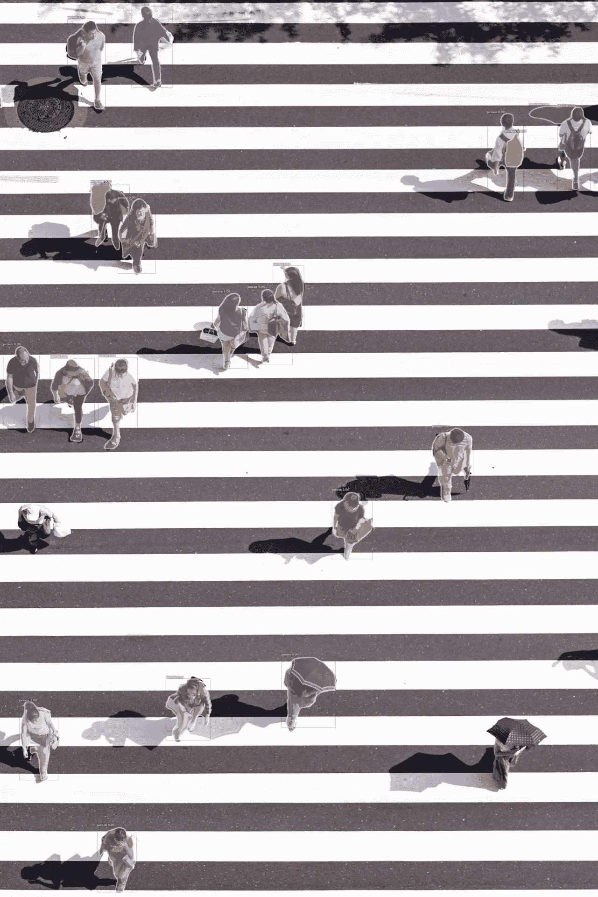
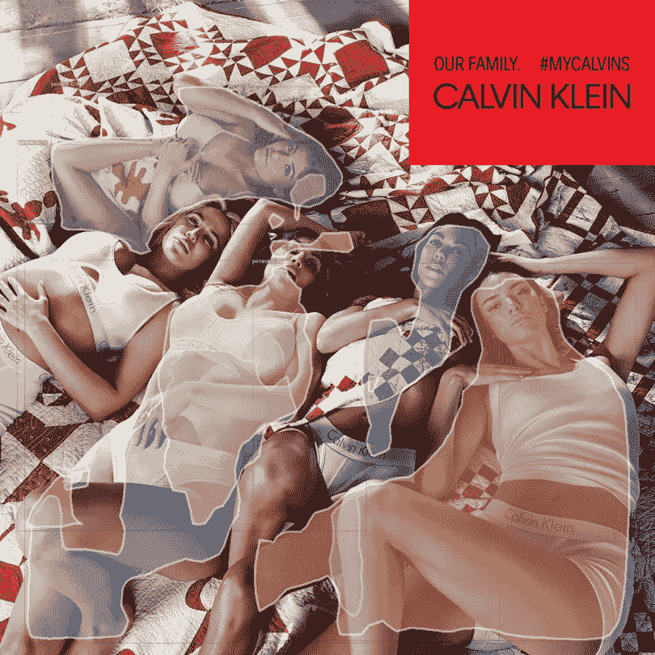

# 如何使用脸书的免费物体探测平台 Detectron

> 原文：<https://medium.com/hackernoon/how-to-use-detectron-facebooks-free-platform-for-object-detection-9d41e170bbcb>


> "我怎样才能在一个物体周围画出更详细的轮廓？"

这可能是在有人阅读了我的[上一篇关于如何使用 TensorFlow 进行物体检测的文章](https://medium.freecodecamp.org/tracking-the-millenium-falcon-with-tensorflow-c8c86419225e)后，我最常被问到的问题之一。有好消息，我终于有答案了。

脸书人工智能研究(FAIR)刚刚开源了他们的 [Detectron](https://github.com/facebookresearch/Detectron) 平台。这意味着 FAIR 用于对象检测研究的软件现在可供我们所有的开发者使用。这个新平台可以做的许多事情之一是对象屏蔽。对象遮罩将对象检测向前推进了一步，它不仅可以在图像周围绘制边界框，还可以绘制复杂的多边形。

Detectron 使对象遮罩开箱即用变得极其简单。方法如下:

# 安装咖啡 2

第一步是安装 [Caffe2](https://caffe2.ai/) :

```
git clone --recursive https://github.com/caffe2/caffe2.git && cd caffe2
make && cd build && sudo make install
python -c 'from caffe2.python import core' 2>/dev/null && echo "Success" || echo "Failure"
```

> **注意:**目前，你**必须**有带 CUDA 的 NVIDIA GPU 才能使用 Detectron。

# 安装 COCO API

```
git clone [https://github.com/cocodataset/cocoapi.git](https://github.com/cocodataset/cocoapi.git)
cd cocoapi/PythonAPI
make install
```

# 克隆回购

在我们成功安装 Caffe2 之后，我们需要做的就是克隆 [Detectron repo](https://github.com/facebookresearch/Detectron) :

```
git clone [https://github.com/facebookresearch/Detectron.git](https://github.com/facebookresearch/Detectron.git) && cd Detectron
```

安装要求:

```
pip install \
numpy \
pyyaml \
matplotlib \
opencv-python>=3.0 \
setuptools \
Cython \
mock \
scipy
```

并构建 python 模块:

```
cd lib && make && cd ..
```

# 做出推论

现在，我们要做的就是运行以下命令，在演示映像上运行对象掩蔽:

```
python tools/infer_simple.py \
--cfg configs/12_2017_baselines/e2e_mask_rcnn_R-101-FPN_2x.yaml \
--output-dir demo/output \
--image-ext jpg \
--wts \
https://s3-us-west-2.amazonaws.com/detectron/35861858/12_2017_baselines/e2e_mask_rcnn_R-101-FPN_2x.yaml.02_32_51.SgT4y1cO/output/train/coco_2014_train:coco_2014_valminusminival/generalized_rcnn/model_final.pkl \
demo
```

您将能够在`Detectron/demo/output`目录中找到 pdf 格式的输出。

这里是我自己的一些测试例子，其中大部分工作得很好。



但是一如既往的，[卡戴珊们继续难倒 AI](https://hackernoon.com/capsule-networks-are-shaking-up-ai-heres-how-to-use-them-c233a0971952) ，因为她们是真实的吗？



> **注意:**如果您想测试您自己的图像，只需将 JPG 文件添加到`Detectron/demo`目录中。为了获得最佳效果，请将图像保持在 600–800 像素左右。

# 最后的想法

这个模型在屏蔽非常一般的对象方面做得很好，但是我们中的很多人需要一些更具体的东西。为此，请关注我的下一篇教程，学习如何构建您自己的自定义对象遮罩模型！

感谢阅读！如果您有任何问题，请随时联系 bourdakos1@gmail.com，通过 [LinkedIn](https://www.linkedin.com/in/nicholasbourdakos) 与我联系，或者通过 [Medium](/@bourdakos1) 和 [Twitter](https://twitter.com/bourdakos1) 关注我。

如果你觉得这篇文章很有帮助，给它一些掌声会很有意义👏并分享出来帮别人找！并欢迎在下方发表评论。