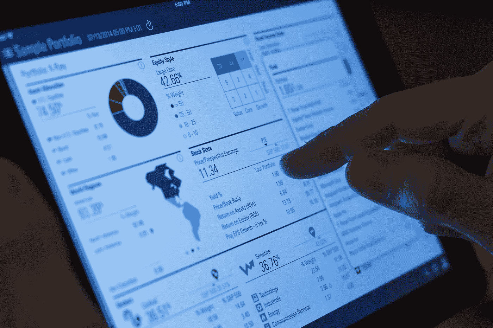

# 如何使用电子商务分析来提高转化率

> 原文：<https://medium.com/hackernoon/how-to-use-ecommerce-analytics-for-better-conversions-d62b2667477>

帮助你做到这一点的最准确的方法之一是深入挖掘你的商店的分析。分析可以帮助你发现你的网页上有什么是行不通的，或者仍然可以进一步改进。

不幸的是，关于电子商务商店如何使用他们的分析的统计数据相当令人沮丧。 [80%的在线商店没有正确使用 Google Analytics】，具体如下:](https://econsultancy.com/blog/10925-80-of-online-retailers-are-using-google-analytics-incorrectly)

*   只有一半的电子商务商店甚至懒得跟踪他们的主要转换点
*   67%的商店没有将社交媒体跟踪与他们的分析整合在一起
*   73%的人不屑于跟踪微转化，如时事通讯注册或新注册

然而，当你密切监视并理解你的分析时，你可以解决任何问题并看到更好的结果。

# 电子商务分析看起来像什么

它将帮助我们具体定义什么是电子商务环境中的分析。从本质上来说，它们是任何能给你提供关于你的客户的用户行为的更详细信息的数据。

根据这一定义，分析可以涵盖广泛的因素，其中包括:

*   你的网站的[流量来自哪里(有机搜索、社交媒体等。)](https://www.smartinsights.com/search-engine-optimisation-seo/seo-strategy/the-6-types-of-seo-you-need-to-use-to-boost-your-site-traffic/)
*   客户在特定页面停留多长时间
*   顾客先看一页
*   客户与哪些页面元素交互
*   一页的跳出率
*   页面的转换率(迷你转换率和实际购买率)
*   用户在任何给定的页面上流动
*   有哪些具体的关键词带来流量

如您所见，您可以在商店中跟踪大量数据。

出于我们的目的，我们将重点关注电子商务商店中三个重要的分析数据，并对它们进行全面分析:

*   废弃的购物车数据
*   登陆或产品页面数据
*   热图数据

## 废弃的购物车数据及其处理方法

当你的顾客点击或点击“立即购买”或“添加到购物车”按钮，从而将你的商店中的特定商品放入他们的购物车时，就会出现废弃购物车。然而，不管出于什么原因，他们在结账过程中没有完成购买。

统计数据显示，平均来说， [15%弃车的人](https://www.bigcommerce.com/blog/ecommerce-analytics-guide/)会回来买你的东西。有时候，这个比例高达 30%。

无论你的分析向你展示了多大比例的放弃，鼓起勇气，你可以做些什么。

不言而喻，你不应该放弃将那些放弃者转变成彻底的皈依者。有时候，只需要轻轻一推。然而，防止这种情况发生的最好方法就是优化你的结账流程。

下面是一些你可以从一开始就做的事情:

*   **通过显著展示信任印章或符号** (BBB、McAfee、VeriSign 等)来消除结账恐惧。)高达 [61%的购物者不会在结账过程中没有信任符号时购买](http://www.actualinsights.com/2011/shopping-cart-abandonment-trust-logos/)。
*   **通过在结账时提供独家折扣**来鼓励转换完成。
*   **确保“免运费”的信息在整个结账过程中显著显示**，因为各种案例研究表明免运费可以提高转化率。

这些先发制人的策略不会让你的放弃率一直下降到 0%。因此，除了上述方法之外，还有一些方法可以降低你的商店的废弃率:

*   发送废弃购物车电子邮件以跟进未能完成购买的客户，因为废弃购物车电子邮件中的 [29.9%的点击率](https://blog.salecycle.com/stats/remarketing-report-q1-2015/)会导致恢复购买。
*   在你的后续电子邮件中包含一个特殊的折扣或优惠券，以进一步增加交易的甜头。
*   跟进脸书再营销活动，使用脸书像素追踪那些在你的网站上放弃购物车的人。然后在脸书上投放相关广告。

# 登陆/产品页面数据以及如何处理

从转化率和收入的角度，检查你的分析，看看哪些页面相对于其他页面表现不佳。总而言之，从长远来看，这会让你的商店损失很多钱。你可以[通过实施一些合理的修正来阻止泄露的转换](https://shanebarker.com/blog/landing-page-best-practices-boosting-conversions/)和收入损失。

表现不佳的登录或产品页面可能是各种问题的结果。它可以是任何东西，从难以看到的行动按钮到页面目标或定义不清的用户流。好消息是，解决这类问题非常简单。

研究表明，与死记硬背的产品描述相比，以明确的故事讲述为特色的产品页面拥有更高的转化率。

一项案例研究显示，与只有产品描述的对照页面相比，有丰富故事情节的酒瓶产品页面提高了 5%的转化率。

在这种情况下，将一个故事作为产品页面的一部分有助于说服更多的人转化，因此，不要只是写书面材料来描述你的产品，而是通过告诉你的客户一个关于你的产品的故事来让他们参与进来。

一些简单的事情，比如把你的行动号召按钮*放在折页*上方，也会对[的登陆页面转换率](https://www.smartinsights.com/conversion-optimisation/landing-page-optimisation/3-elements-of-landing-page-psychology-you-need-to-know/)产生戏剧性的积极影响。一个高级 WordPress 编辑器工具的案例研究显示，在新页面[中包含一个大而易见的行动号召按钮，帮助提高了 47%的转化率](https://www.webpagefx.com/blog/conversion-rate-optimization/important-lessons-from-3-call-to-action-ab-case-studies/)。

# 热图数据及其处理方法

热图用于显示特定页面上的用户行为。因此，他们可以非常详细地了解*您的客户如何与您商店中的特定页面互动。*

这可以提供令人大开眼界的“啊哈！”突然揭示客户为何没有点击行动号召按钮的时刻。也许他们放弃了，因为长长的页面迫使他们向下滚动太久。或者为什么他们在完成用户目标之前点击离开页面。也许在最后的行动号召按钮之前，你有太多不必要的链接。

无论如何，热图也更容易分析，因为它们非常直观。如果你不喜欢在比如谷歌分析(Google Analytics)中浏览大量统计数据，这也是它们的理想选择。热图的美妙之处在于，它们提供了直接的答案，或者至少指出了需要解决的问题。

一个案例研究引用了一个网站增长自动化工具网站上的热图，该热图确定其客户主要点击页面左侧的内容和行动号召，并向页面底部逐渐变细。这种所谓的吸收内容的 F 型模式表明，商店应该将更重要的内容放在页面的左侧。

另一个由 UX 研究公司进行的关于热图的案例研究显示，用户倾向于只看相关页面上的图片，而忽略像股票照片这样华而不实的图片。

有了这样的信息，你就可以确保商店的产品页面只显示与你的商品相关的图片。您还应该消除不必要的填充和占位符的库存照片。

另一个由优化分割测试人员进行的热图案例研究发现，行动号召按钮的大小、颜色和位置将对你的转化产生深远的影响。

在包含三个相互竞争的行动号召的登录页面上，[转化率最高的 CTA](https://www.digitalmarketer.com/heatmap-landing-page-case-study/)具有以下特征:

*   由于大小和颜色，它最引人注目
*   它有最有说服力和易读的副本
*   它被定位为页面的主要焦点之一

有了这些信息，你也可以通过确保你的 CTA 在案例研究中分享这三个特征来提高你的页面的转化率。

# 准确的数据总是有助于转换

把你的商店的分析数据看作是提高转化率和销售额的关键。深究一下，这就是继续亏损(或者不尽可能多赚钱)和享受收入增长之间的区别。

如果你想知道为什么你的商店的某个页面会以这种方式运行，你的分析会有答案。虽然一开始浏览这些数据似乎有些力不从心，但为了经营一家更成功的商店，进行必要的调整是非常值得的。

*原载于*【www.smartinsights.com】

***关于作者***

*[谢恩·巴克](https://shanebarker.com)是[内容解决方案](https://contentsolutions.io/)和 [Gifographics](http://gifographics.co/) 的创始人兼首席执行官。你可以在[推特](https://twitter.com/shane_barker)、[脸书](https://www.facebook.com/ShaneBarkerConsultant/)、[领英](https://www.linkedin.com/in/shanebarker/)、 [Instagram](https://www.instagram.com/shanebarker/) 上和他联系。*