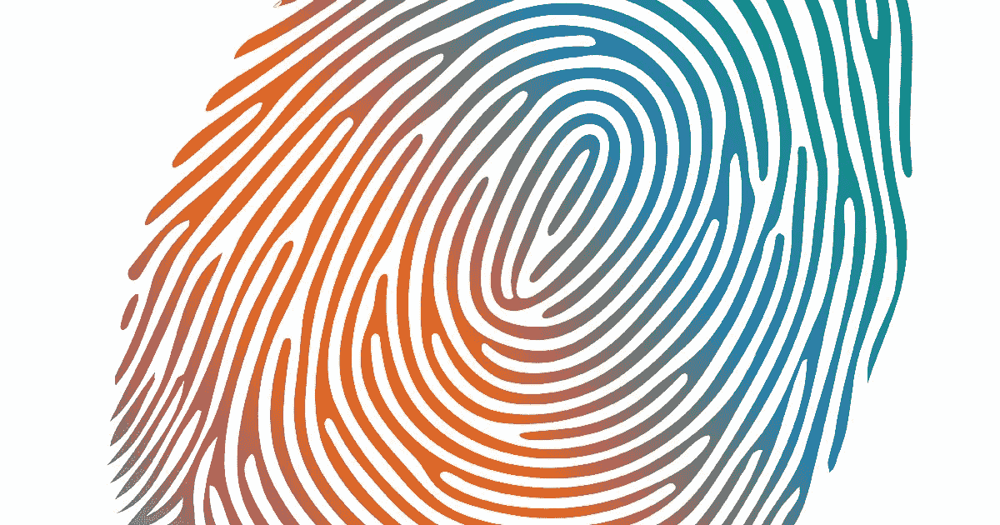
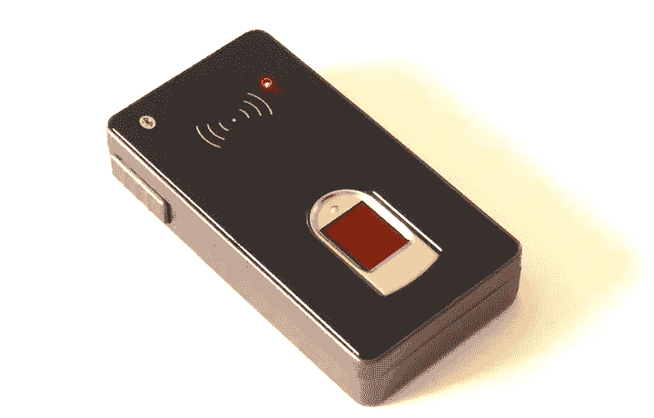
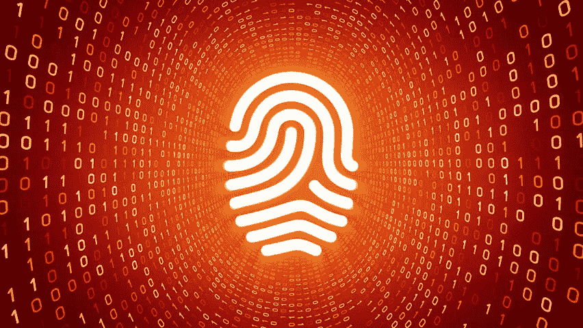

# 如何使用指纹扫描仪

> 原文：<https://medium.com/hackernoon/how-to-use-fingerprint-scanners-e4b7b48d12b0>

从生理学上讲，指纹是一种所谓的乳头状图案——一种包含由凹陷分开的单个孔隙的突起(峰)的配置。手指皮肤下面是血管网。此外，指纹与皮肤的某些电学和热学特征相关联。这意味着光、热或电容(或它们的组合)可以用来获得指纹图像。

指纹是在胎儿发育过程中形成的，在人的一生中不会改变。而且，如果损坏了，它会及时恢复原来的结构。即使是同卵双胞胎也没有相同的指纹。就可靠性而言，指纹扫描仅次于 DNA 分析，以及虹膜或视网膜扫描。

# 指纹扫描仪的使用示例:

## 1.而不是签名

自古以来，人们就对指尖图案的细节感兴趣，甚至发现它们在数百年前就已被使用。在 6 世纪的中国，指纹被用来代替签名或印章。然而，人们不能肯定地说，留在文件上确认其真实性的痕迹的独特性是否真的很重要。这种类型的“签名”有一个主要的神秘特征——重要的是，这个人接触过这张纸，在上面留下了他的个性痕迹。

## 2.而不是钥匙

由于好莱坞电影，使用指纹作为“钥匙”打开锁或保险箱的做法已经变得相当众所周知。为了做到这一点，复杂的设备称为 AFIS，或自动指纹识别系统，被用来。其中使用的扫描仪可以是光学的、基于半导体的或使用超声波的。最后两种类型是最可靠和有效的，但是，当然，当光带通过印刷品时，光学应用在屏幕上看起来更有效，所以这些扫描仪变得更广泛。它们被用在比保护银行金库和秘密实验室更加平淡无奇的领域。例如，可以安装生物识别终端来计算员工的工作时间。

## 3.而不是密码

在指尖上绘制的模式在安全系统的开发人员中非常流行。特别是，指纹扫描可以用来代替计算机和小工具的密码或 PIN 码。

在这些新的发展中，值得注意的是 [ITBiometrics](https://itbiometrics.com) 的硬件“冷”指纹钱包，它考虑到了数字货币持有者对生物认证的特殊需求。使用非常复杂的加密技术来捕获用户的指纹，并使用这种算法来输入密码。这种钱包的一个有趣的特点是，它不仅能够识别主人的指纹，还可以通过读取手指的脉搏和血流来确定是否真的是那个人试图进入他的钱包。

ITBiometrics fingerprint hardware wallet

自 80 年代以来，小型生物识别设备已被引入个人电脑，今天它们经常出现在笔记本电脑或闪存驱动器中。作为一项规则，手指必须放在一个小芯片上，用光源读取皮肤表面的信息。实际上，识别不需要完整的指纹。一个独特的片段，如线的交点，或特殊的弯曲等。，就足够了。

## 4.而不是银行卡

2007 年，德国南部进行了一项有趣的实验:一些银行的客户可以选择将他们的账户与手指上的独特图案联系起来，而不是与塑料卡联系起来。在一些超市和其他零售点，安装了特殊的扫描仪，人们可以在购物时用手指扫描。一些学生甚至开始用这种方式支付学校午餐。由于误印的概率是千万分之一，这种“支付手段”的拥有者可以不像普通卡的持有者那样担心他们的钱的安全。

# 指纹扫描仪有哪些类型？

现有的指纹扫描仪可以分为三类:**光学**、**半导体**和**超声波**。此外，每种方法都提供了几种类型的实现。

# 1.光学扫描仪

光学扫描仪——操作基于光学成像方法的使用。实现光学方法有几种基本方式:

*   **光学反射法:**

这种方法利用了破碎全反射(受抑全内反射)的效果。当光落在两种介质之间的界面上时，就会出现这种效应，光能被分成两部分——一部分从边界反射，另一部分穿过边界进入第二种介质。反射能量的比例取决于光通量的入射角。从给定角度的某个值开始，所有的光能都从界面反射。

这种现象被称为全内反射。当密度较大的光学介质(手指表面)与密度较小的光学介质在全内反射点接触时，一束光穿过该边界。因此，只有到达全内反射的某些点的光束，而手指的乳头状图案没有附着在这些点上，才会从边界反射。为了捕捉手指表面产生的光图像，使用了一种特殊的图像传感器(CMOS 或 CCD，取决于扫描仪)。

该方法的缺点:

对假货保护不力

对污染的敏感性

这些扫描仪的主要制造商是 BioLink、Digital Persona 和 Identix。

**光学照明方法:**

这种类型的扫描仪利用光纤矩阵，其中输出端的所有波导都连接到光传感器。

每个传感器的灵敏度允许您在手指与矩阵表面的接触点捕捉穿过手指的残余光。根据每个光传感器读取的数据形成整个指纹的图像。

这种方法有更多的优点:

高读取可靠性

抵制造假

然而，这种方法也有一个明显的缺点，即实现的复杂性:

这种类型的扫描仪是由安全第一公司制造的

**光学无接触扫描仪:**

令人难以置信的是，光学非接触式扫描仪(非接触式扫描仪)不需要手指与扫描设备的表面直接接触。手指贴在扫描仪的一个孔上，几个光源从不同的侧面从下面照亮它；在扫描仪的中心是一个镜头，通过它收集的信息被投射到 CMOS 摄像头上，摄像头将数据转换成指纹图像。

这类扫描仪的领先制造商是无接触传感器技术。

# 2.半导体扫描仪

半导体扫描仪的基础是利用半导体的特性，通过在乳头状图案的波峰与扫描仪表面的接触点处发生变化来获得手指表面的图像。

**电容式扫描仪:**

电容扫描仪是目前最常用的指纹成像半导体设备。它们的操作是基于当乳头状图案的梳状物接触半导体矩阵的元件时，半导体 PN 结的电容变化的效应。

由于它的广泛应用，它具有以下优点:

低成本

可靠性

缺点:

防造假保护不力

这类扫描仪的主要制造商是英飞凌、意法半导体和 Veridicom。

**·射频扫描仪:**

对于射频扫描仪(RF 场扫描仪)，使用元件矩阵，每个元件作为微型天线工作。射频模块产生低强度信号，并将其发送到手指的扫描表面。矩阵的每个敏感元件接收从乳头状图案反射的信号。每个微型天线中感应的 emf 的大小取决于其附近是否存在乳头状图案的波峰。产生的应力矩阵被转换成数字指纹图像。

优势:

由于分析了皮肤的生理特性，欺骗扫描仪的概率趋于零。

缺点:

如果手指接触不良，运行不稳定

Authentec 是一家著名的射频扫描仪制造商。

**使用压力方法的扫描仪:**

压敏扫描仪(压力扫描仪)在其设计中使用对压力敏感的压电元件矩阵。当手指放在扫描表面上时，乳头状突起对矩阵元素的子集施加压力。皮肤图案的凹陷不施加任何压力。因此，从压电元件获得的全部电压被转换成指纹图像。

这种方法有几个缺点:

低灵敏度

防造假保护不力

操作时过度用力容易造成损坏

压敏扫描仪可从 BMF 获得。

**热扫描仪:**

在热扫描仪设备中，使用由热电元件组成的传感器。这允许固定温度差并将其转换成电压。

当手指放在扫描仪上时，基于接触热电元件的乳头状图案的突起的温度和空腔中的空气温度来构建手指表面的温度图，该温度图随后被转换成数字图像。

温度法有许多优点:

高抗静电放电能力

在很宽的温度范围内稳定运行

有效防范假货。

这种方法的缺点包括图像很快消失。当您将手指放在上面时，在第一个瞬间，温度差异很大，信号电平也很高。在短时间(不到十分之一秒)后，随着手指和传感器达到温度平衡，图像消失。

# 3.超声法

在这个小组中，到目前为止，只有一种方法，那就是它所谓的:超声波。超声波扫描仪用超声波扫描手指表面。波源和乳头状图案的脊状突起和凹陷之间的距离通过从它们反射的回波来测量。

图像质量比生物识别市场上的任何其他方法都要好十倍。此外，这种方法几乎完全不受伪造品的影响，因为除了指纹乳头图案之外，它还可以获得其他特征的信息，例如脉搏。

缺点:

高成本

这种扫描仪的主要制造商是 Ultra-Scan 公司。