# 如何将 Firebase 与 Flutter 一起使用

> 原文：<https://medium.com/hackernoon/how-to-use-firebase-with-flutter-2c9838d5f0d6>


本文展示了用 Firebase 在 Flutter 中构建一个框架应用程序所需的所有步骤。

谷歌的 Flutter SDK 可用于开发应用程序，为 Android 和 iOS 平台提供原生 UI 体验。要用 Flutter 写 app，就得用 Dart 编程语言。

Firebase 实时数据库是一个云托管的数据库，数据存储为 JSON。它为后端数据库提供了直接从客户端构建丰富的协作应用程序的安全访问。数据保存在本地设备上，而离线和实时事件继续触发，为最终用户提供响应体验。当设备重新连接到互联网时，实时后端数据库会自动与客户端离线时发生的本地数据更改同步，同时自动合并任何冲突。

## 创建 Firebase 项目

1.  在 firebase 控制台中创建一个 firebase 项目。

【https://console.firebase.google.com 

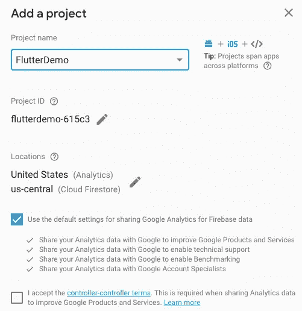

2.完整的平台特定配置

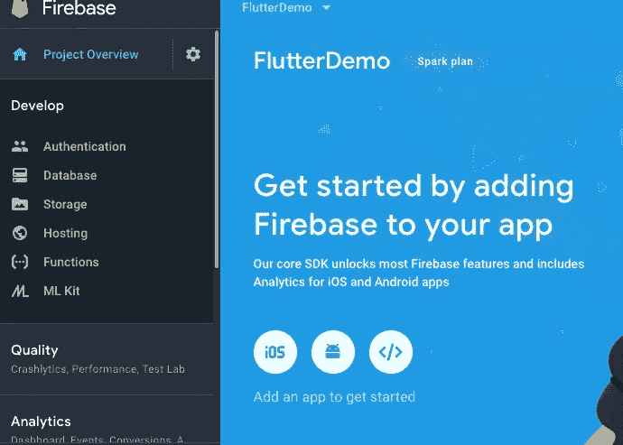

***iOS***

*   将 iOS 应用程序注册到 firebase，IOS 捆绑包 Id 在 Xcode 项目和 firebase 控制台中必须相同。

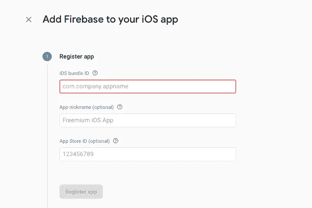

*   下载应用程序的配置文件，并将其添加到项目文件夹中。

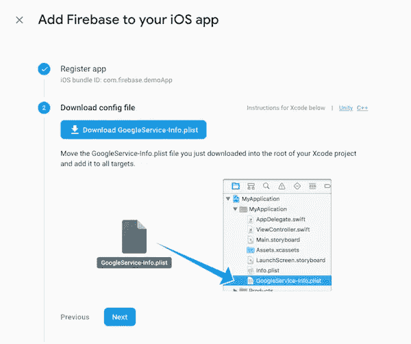

*   将 firebase 依赖项添加到项目中

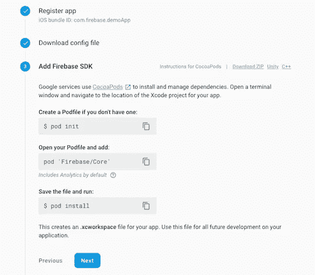

***安卓***

*   注册你的安卓应用。在 firebase 控制台的项目中使用包名。

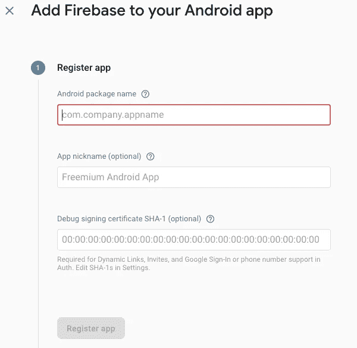

*   下载配置文件`GoogleService-Info.plist`放在 app 模块根目录下。

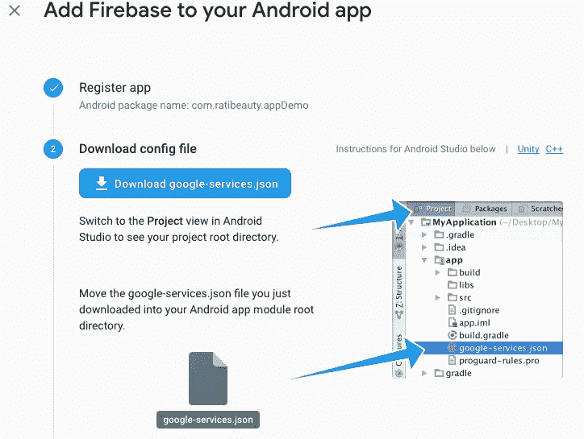

## 创建颤振项目

1.  使用`flutter create`命令创建一个新项目。

```
$ flutter create flutter_with_firebase
```

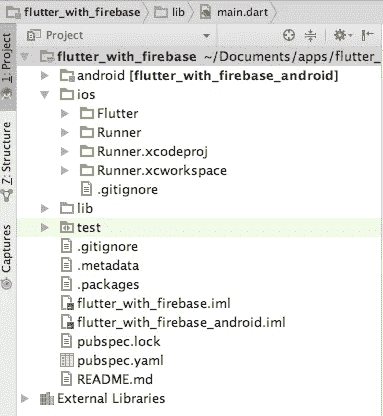

2.打开 ios/Runner.xcworkspace。保留 xcode 项目中与 firebase 控制台上定义的相同的包标识符，并将 GoogleService-info.plist 保存在 Runner 文件夹中

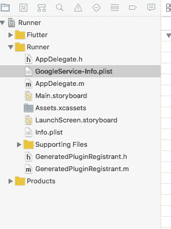

3.在你的 IDE 或编辑器中，打开文件`pubspec.yaml`。为 **firebase_database** 和**添加依赖关系**保存文件。

```
**dependencies:
  flutter:
    sdk:** flutter
  **firebase_database:** 1.0.3
```

4.在 IDE 或命令行中，将其当前目录设置为 Flutter 应用程序目录，运行以下命令。

`flutter packages get`

## 设置

1.  firebase 的导入依赖项。

```
**import 'package:firebase_database/firebase_database.dart'**;
```

2.创建 databaseReference 对象以使用数据库。

```
**final databaseReference** = FirebaseDatabase.*instance*.reference();
```

3.创建一个有 4 个按钮的屏幕。

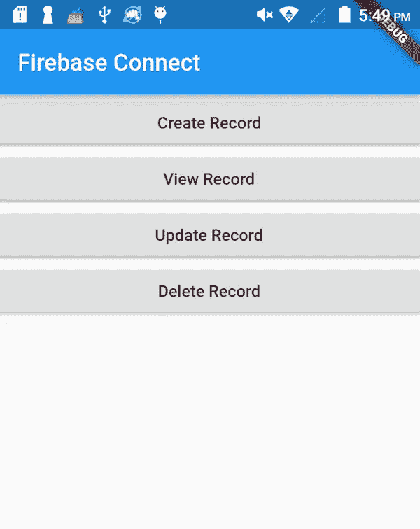

## 创建记录

1.单击“创建记录”按钮时，将调用 Create Record()方法。

```
RaisedButton(
    child: Text(**'Create Record'**),
    onPressed: () {
      createRecord();
    },
),
```

2.在 createRecord()中，我们在数据库中创建两条演示记录。

```
**void** createRecord(){
  **databaseReference**.child(**"1"**).set({
    **'title'**: **'Mastering EJB'**,
    **'description'**: **'Programming Guide for J2EE'** });
  **databaseReference**.child(**"2"**).set({
    **'title'**: **'Flutter in Action'**,
    **'description'**: **'Complete Programming Guide to learn Flutter'** });
}
```

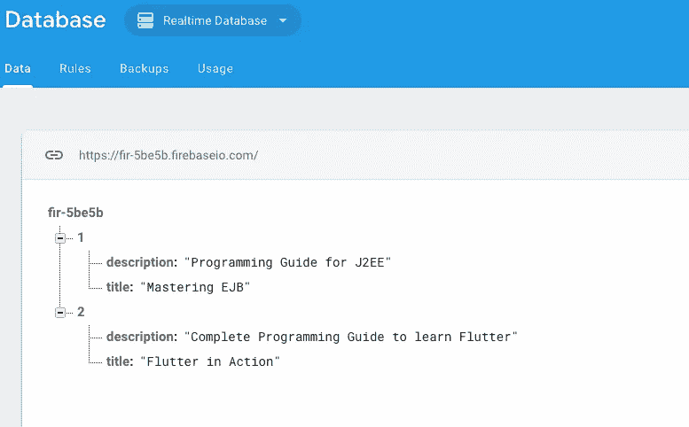

## 查看记录

1.  单击“查看记录”按钮，调用 getData()方法。

```
RaisedButton(
    child: Text(**'View Record'**),
    onPressed: () {
      getData();
    },
)
```

2.在 getData()中，我们从数据库中检索所有记录。

```
**void** getData(){
  **databaseReference**.once().then((DataSnapshot snapshot) {
    print(**'Data :** ${snapshot.**value**}**'**);
  });
}
```

3.它们打印在控制台上

```
*Data : [{title: Mastering EJB, description: Programming Guide for J2EE}, {title: Flutter in Action, description: Complete Programming Guide to learn Flutter}]*
```

## 更新记录

1.  单击“更新记录”按钮时，将调用 updateData()方法。

```
**void** updateData(){
  **databaseReference**.child(**'1'**).update({
    **'description'**: **'J2EE complete Reference'** });
}
```

2.将标题'*掌握 EJB'* 的描述从'*J2EE 节目指南*更新为'**J2EE 完全参考** *'*

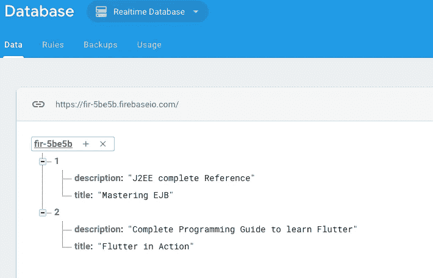

## 删除记录

1.  单击“删除记录”按钮时，将调用 deleteData()方法。

```
**void** deleteData(){
  **databaseReference**.child(**'1'**).remove();
}
```

2.它从数据库中删除记录。

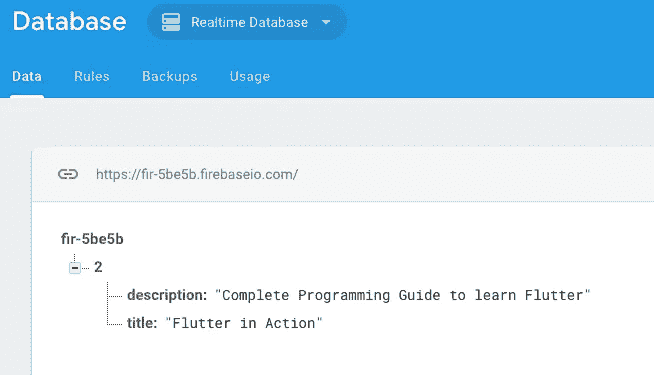

## 完全码

```
**import 'package:flutter/material.dart'**;
**import 'package:firebase_database/firebase_database.dart'**;**class** FirebaseDemoScreen **extends** StatelessWidget { **final databaseReference** = FirebaseDatabase.*instance*.reference(); @override
  Widget build(BuildContext context) {
    getData();
    **return** Scaffold(
        appBar: AppBar(
            title: Text(**'Firebase Connect'**),
            ),
        body: Center(
            child: Column(
                crossAxisAlignment: CrossAxisAlignment.**stretch**,
                children: <Widget>[ RaisedButton(
                      child: Text(**'Create Record'**),
                      onPressed: () {
                        createRecord();
                      },
                  ), RaisedButton(
                      child: Text(**'View Record'**),
                      onPressed: () {
                        getData();
                      },
                  ),
                  RaisedButton(
                      child: Text(**'Udate Record'**),
                      onPressed: () {
                        updateData();
                      },
                  ),
                  RaisedButton(
                      child: Text(**'Delete Record'**),
                      onPressed: () {
                        deleteData();
                      },
                  ),
                ],
            )
        ), *//center* );
  } **void** createRecord(){
    **databaseReference**.child(**"1"**).set({
      **'title'**: **'Mastering EJB'**,
      **'description'**: **'Programming Guide for J2EE'** });
    **databaseReference**.child(**"2"**).set({
      **'title'**: **'Flutter in Action'**,
      **'description'**: **'Complete Programming Guide to learn Flutter'** });
  }
  **void** getData(){
    **databaseReference**.once().then((DataSnapshot snapshot) {
      print(**'Data :** ${snapshot.**value**}**'**);
    });
  } **void** updateData(){
    **databaseReference**.child(**'1'**).update({
      **'description'**: **'J2EE complete Reference'** });
  } **void** deleteData(){
    **databaseReference**.child(**'1'**).remove();
  }
}
```

*感谢阅读。如果你喜欢这篇文章，请随意点击那个按钮👏帮助其他人找到它。*

*本文是移动技术相关系列文章的一部分。如果您正在寻找一个移动应用开发团队来构建您的解决方案，请通过*[*info@47billion.com*](mailto:info@47billion.com)*联系我们。*