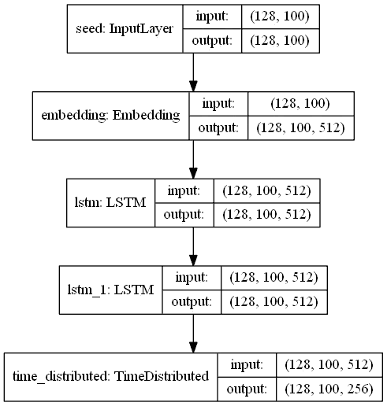

# 如何使用 Keras 稀疏分类交叉熵

> 原文：<https://medium.com/hackernoon/how-to-use-keras-sparse-categorical-crossentropy-47da9734bd98>


在这个快速教程中，我将向您展示两个简单的例子，在编译 Keras 模型时使用`sparse_categorical_crossentropy`损失函数和`sparse_categorical_accuracy`度量。

# 示例一— MNIST 分类

作为多类、单标签分类数据集之一，任务是将手写数字的灰度图像(28 像素乘 28 像素)分类到它们的十个类别(0 到 9)。让我们构建一个 Keras CNN 模型来处理它，最后一层应用了“softmax”激活，它输出一个十个概率分数的数组(总和为 1)。每个分数将是当前数字图像属于我们的 10 个数字类之一的概率。

对于这种输出形状为(None，10)的模型，传统的方法是将目标输出转换为独热编码数组，以匹配输出形状，然而，在`sparse_categorical_crossentropy`损失函数的帮助下，我们可以跳过这一步，将整数作为目标。

像这样编译模型时，你需要做的就是用`sparse_categorical_crossentropy`替换`categorical_crossentropy`。

之后，您可以使用整数目标来训练模型，即一维数组，如

```
**array([5, 0, 4, 1, 9 ...], dtype=uint8)**
```

请注意，这不会影响模型输出形状，它仍会为每个输入样本输出十个概率得分。

# 示例二—字符级序列到序列预测

我们将根据威廉·莎士比亚的综合作品训练一个模型，然后用它来创作一部类似风格的戏剧。

文本 blob 中的每个字符首先通过调用 Python 的内置函数`ord()`转换成一个整数，该函数返回一个表示字符的整数作为其 ASCII 值。例如，`ord('a')`返回整数`97`。因此，我们有一个整数列表来表示整个文本。

给定序列长度为 100 的移动窗口，模型学习预测未来一个时间步长的序列。换句话说，给定序列中时间步长 T0~T99 的特征，模型预测时间步长 T1~T100 的特征。

让我们在 Keras 中构建一个简单的序列对序列模型。

我们可以进一步可视化模型的结构，以分别理解其输入和输出形状。



The training model

即使模型具有三维输出，当用损失函数`sparse_categorical_crossentropy`编译时，我们可以将训练目标作为整数序列。与前面的例子类似，在没有`sparse_categorical_crossentropy`的帮助下，首先需要将输出的整数转换成一键编码的形式以适应模型。

训练模式是，

*   无状态
*   序列长度=100
*   batch_size = 128
*   模型输入形状:(批处理大小，序列长度)
*   模型输出形状:(批处理大小，序列长度，最大令牌数)

一旦训练好模型，我们就可以让它“有状态”，一次预测五个字符。通过使其有状态，LSTMs 在一个批次中的每个样本的最后状态将被用作下一个批次中的样本的初始状态，或者简单地说，一次预测的那五个字符和下一个预测批次是一个序列中的字符。

预测模型加载训练好的模型权重并一次预测五个字符，

*   宏伟威严的
*   seq_len =1，一个字符/批次
*   batch_size = 5
*   模型输入形状:(批处理大小，序列长度)
*   模型输出形状:(批处理大小，序列长度，最大令牌数)
*   需要在预测前调用`reset_states()`来重置 LSTMs 的初始状态。

关于该模型的更多实现细节，请参考我的 [GitHub 库](https://github.com/Tony607/keras_sparse_categorical_crossentropy)。

# 结论和进一步阅读

本教程探索了两个例子，使用`sparse_categorical_crossentropy`来保持整数作为字符/多类分类标签，而不转换成一个热标签。因此，当标签是整数时，模型的输出将是类似 softmax one-hot 的形状。

要了解[keras . back end . sparse _ category _ cross entropy](https://github.com/tensorflow/tensorflow/blob/r1.11/tensorflow/python/keras/backend.py#L3582)和[sparse _ category _ accuracy](https://github.com/tensorflow/tensorflow/blob/r1.11/tensorflow/python/keras/metrics.py#L587)的实际实现，可以在 TensorFlow repository 上找到。别忘了在我的 GitHub 上下载本教程的源代码。

[](https://github.com/Tony607/keras_sparse_categorical_crossentropy) [## Tony 607/keras _ sparse _ category _ cross entropy

### 使用 Keras sparse _ categorial _ cross entropy-Tony 607/Keras _ sparse _ categorial _ cross entropy 的示例

github.com](https://github.com/Tony607/keras_sparse_categorical_crossentropy) 

[在 Twitter 上分享](https://twitter.com/intent/tweet?url=https%3A//www.dlology.com/blog/how-to-use-keras-sparse_categorical_crossentropy/&text=How%20to%20use%20Keras%20sparse_categorical_crossentropy) [在脸书分享](https://www.facebook.com/sharer/sharer.php?u=https://www.dlology.com/blog/how-to-use-keras-sparse_categorical_crossentropy/)

*原载于*[*www.dlology.com*](https://www.dlology.com/blog/how-to-use-keras-sparse_categorical_crossentropy/)*。*