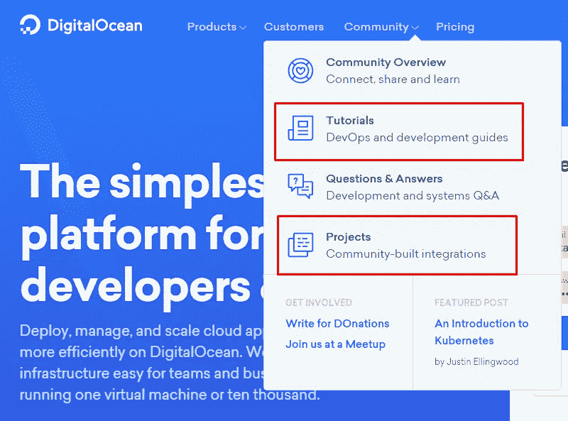
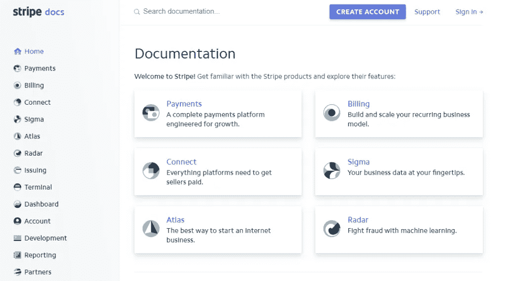
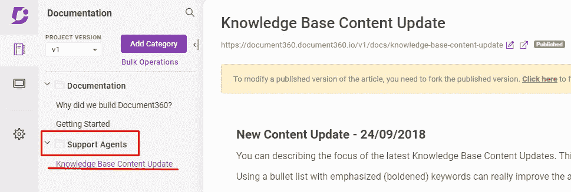
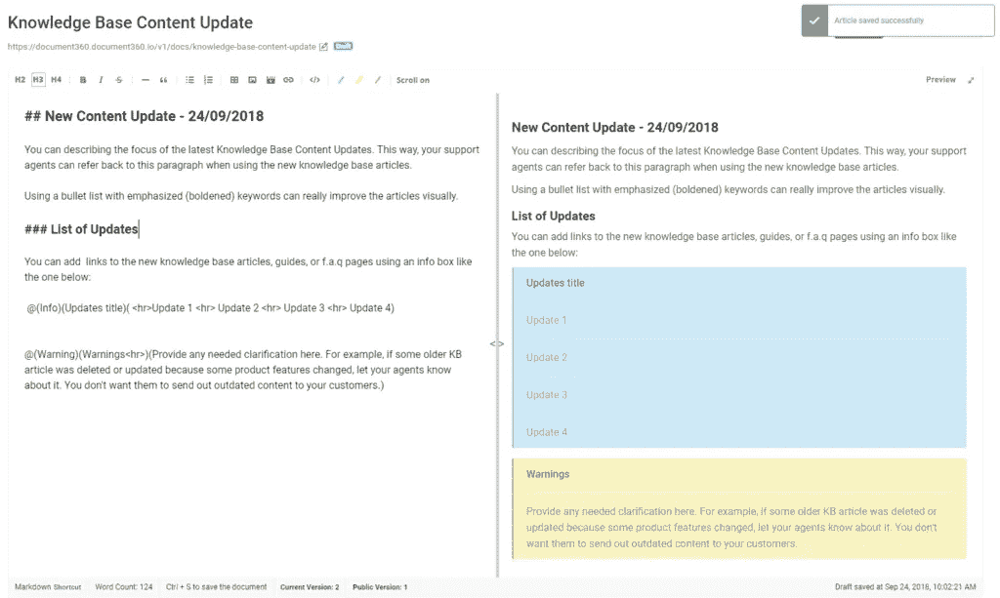

# 如何使用知识库作为营销工具

> 原文：<https://medium.com/hackernoon/how-to-use-knowledge-base-as-marketing-tool-60d81e2793c0>

如今，拥有一个知识库对几乎每一家 SaaS 公司来说都是必不可少的。由于 SaaS 定价模式在很大程度上依赖于留住现有客户，而不仅仅是获得新客户，因此让所有客户都满意非常重要。否则，你可能会以高客户流失率告终。

一旦你的客户群开始增长，向他们提供高质量的支持就变得困难了。如果你是一家初创公司，你可能雇不起很多支持代理。

这就是为什么公司开始依靠他们的知识库来帮助客户，比如产品的基本功能，故障排除，甚至指导他们进行高级实践。

不幸的是，仅仅拥有一个构建良好的知识库是不够的。您可能有令人惊叹的操作指南、简单的分步指南以及客户需要的所有其他有用资源，但如果他们不知道在哪里可以找到它们，这些都将化为乌有。

或者更糟的是，想象一下，如果他们根本不知道这些资源的存在。

那真的是浪费！

许多公司已经想出如何为他们的产品建立一个**综合知识库**，但是他们仍然很难吸引流量。

这就是本指南的目的。如果您想了解更多信息，请继续阅读:

*   让您的客户了解您的知识库的好处
*   为你的知识库增加流量的 5 个简单步骤

因此，在我们深入探讨可行的技巧之前，让我们概述一下通过使用知识库作为营销工具，您的公司可以获得的不同优势。

# 为什么你应该让你的客户知道你的知识库的存在？

有几个原因可以说明为什么你应该把你的知识库作为营销工具来推广。为了讨论使用知识库作为营销工具的优势，我们将假设您已经为您的产品创建了一个良好的知识库。

因此，第一个优势变得非常明显。你已经投入了资源和时间来打造你的知识库。通过营销，你只是简单地**增加了你最初投资的回报**。

将您的知识库用作向客户营销的工具的其他不太明显(但仍然重要)的好处包括:

# 减少员工开销

如果您的客户知道您的知识库的存在，他们将能够使用它作为自助服务支持工具。支持票一定会减少。尤其是在这个时代，用户更喜欢通过最少的社交接触来解决他们的问题。

因此，您可以维持一个较小的支持团队。对于初创企业或中型企业来说，将资源集中在开发和研究上非常重要。

# 减少客户流失

*几乎* [*70%的可识别顾客离开的原因*](https://www.insightsquared.com/business-analytics/churn-statistics/) *典型的与产品无关的公司。更换的主要原因是服务质量差。*

更低的门票数量也意味着顾客更开心。实际上，他们可以利用**自助服务支持**来找到问题的解决方案，比打电话或发电子邮件给支持人员要快得多。客户打电话给客户支持并在线等待 10 分钟或更长时间来接听电话的日子已经一去不复返了。如今，人们希望能得到及时的帮助。他们有问题，现在就要求答案。

此外，客户现在[更喜欢自助服务，而不是人工服务](https://document360.io/blog/saas-self-service-over-the-human-touch/)。所以，如果他们能在一瞬间找到他们正在寻找的东西，而不涉及任何社会互动，那就太完美了。

让您的用户获得即时自助服务会让他们感到满意。通过这样做，你可以大大减少客户流失，同时仍然能够专注于吸引新客户。

## 这给我们带来了下一个优势:

# 扩展业务的能力

我们来考虑一下上面提到的两个优点。通过增加知识库的流量，您可以**自动化您的自助服务支持**和**同时让您的现有客户满意**。

反过来，这意味着您可以将您的**客户支持成本保持在尽可能低的水平**(小型客户支持团队)。此外，保留下来的客户会产生稳定的收入流，您可以将这些收入再投资于改进开发中的产品。

# 创建一个社区

当使用你的知识库作为营销工具时，它也有助于围绕你的产品建立一个强大的社区。

好的、宣传良好的文档会给你的知识库带来更多的读者。如果这些读者在你的知识库中找到有用的信息，他们会更关注你的产品。

满意的用户更有可能在社交媒体和其他社交新闻网站(如黑客新闻)上分享内容。这对你的企业来说是一个很好的循环。

云基础设施提供商 Digital Ocean 就是一个很好的例子。他们的知识库由不同种类的内容组成。从初级水平的如何做 X 和 Y 教程到高级优化指南。

然而，尽管 Digital Ocean 拥有最全面的知识库之一，但有时用户无法准确找到他们要找的内容。这就是他们强大的社区介入的地方。

> *“联系、分享和学习……”*

通过创建一流的内容和使用他们的知识库作为营销工具，数字海洋设法围绕他们的服务和产品创建了一个社区。

如果你查看他们的问题线索和问题，大多数答案都是由用户自己生成的**。从而为支持团队节省了大量麻烦。**

然而，如果你的用户不知道你的知识库的存在，围绕它创建一个支持性的社区几乎是不可能的。

所以，这就是为什么公司必须教育他们的客户，并使用他们的知识库作为营销工具来进行推广的一些原因。

事不宜迟，让我们直接进入可操作的提示。

# 使用知识库作为营销工具的 5 个步骤

有几种方法可以让你的客户了解你的知识库的存在。然而，从哪里开始会令人困惑。

在大多数情况下，你应该像对待你网站的博客一样对待你的知识库。每个单独的文档组件都应被视为一个独立的潜在登录页面**。当然，内容本身和结构会有所不同。**

如果你问大多数文案、内容创作者、软件文档人员等等，他们可能会告诉你从**提供优质内容**开始。

# 步骤 1 —提供高质量的内容

这不是将知识库用作营销工具的直接方式。然而，如果你不完成这一步，利用你的知识库作为营销工具将成为一个几乎不可能完成的任务。

提供好的内容是你大部分时间应该关注的。确保您的知识库拥有最有价值和优化的内容。

毕竟**好的内容推广自己**，就这么简单。

如果一个故障诊断指南被证明对几个人有用，他们会开始在社区内分享它，把它放在几篇文章的评论区，甚至可能在一些 Quora 问题上链接到它。

一旦您知识库中的内容帮助了客户，回答了他们的问题、顾虑或难题，客户自己就会开始在多个平台上交叉共享链接。

一个很好的例子就是 [Stripe 的开发者知识库](https://growthhackers.com/articles/tear-down-of-stripe-s-legendary-developer-knowledge-base)。

[Stripe](https://stripe.com/) 精心制作了一个知识库，用户和开发人员都可以轻松地跟踪和导航。他们不再使用关键词、流行语和技术术语，而是清晰地解释每个概念**，并以一种**简化的方式****。****

## ****结果如何？****

****开发人员如此热爱他们的知识库内容，以至于他们**分享到它的链接**，甚至**发推特说他们的文档有多棒。******

****有些人甚至更进一步，贴出他们条纹商品的照片。****

********

****嗯，现在可能已经很清楚了。你需要用户乐于分享的好内容。****

****那么，提供好的内容意味着什么呢？虽然有很多关于[撰写 kickass 知识库文章](https://document360.io/blog/how-to-write-a-knowledge-base-article/)的综合指南，但我们还是列出了一些要记住的简明扼要的要点…****

## ****写好内容的关键点****

1.  ****始终牢记你的目标受众。如果文章的主要读者是新用户，就不要用高度技术性的方式来写。尽量让他们容易理解，尽可能清楚。****
2.  ****使用描述性的标题。仅仅通过阅读标题，读者/用户就应该知道文章的内容。****
3.  ******开门见山。**知识库内容不需要冗长而艺术的介绍。相反，要简洁，提供足够的信息让他们理解你要解释的概念，从第一段开始就直奔主题。****
4.  ****保持一个逻辑流程。没有人喜欢阅读从一件事跳到另一件事的循序渐进的指南。那只会让你的读者更加困惑。相反，保持你的句子简单，确保从一个部分跳到另一个部分时包含好的过渡。****
5.  ******包括支持介质**。图像、屏幕截图、演示视频是任何知识库内容的绝佳补充。它们提高了整个知识库的质量。****

****毕竟，你会喜欢包含每个重要步骤截图的教程指南吗？还是一个含糊解释如何完成一系列步骤的？****

****拥有好的知识库内容也会提高你的整体搜索引擎优化效果。****

****一旦你建立了高质量的内容，你需要加强你的游戏。当然，优秀的内容将开始得到认可，用户将开始分享它等等，但这还不够。****

****你还需要优化内容，让它变得更加明显。这让我们进入下一步。****

# ****第二步——SEO 优化****

****每当有人遇到问题，他们就依赖谷歌。****

****我们生活在这样一个时代，大多数人试图通过谷歌搜索找到解决他们每个问题的方法。在谷歌上进行的大部分查询，在一个有机的列表或结果中找到答案。****

****实际上，付费广告 [**的影响力只占所有搜索**](https://www.searchenginepeople.com/blog/40-unbelievable-seo-statistics-need-know.html) **的~2.8%。******

****因此，用最新的 SEO 实践来优化你的知识库内容对你的公司最有利。****

****原因很简单。通过增加知识库内容的总体在线呈现，客户更有可能有机地找到问题的答案。****

****如果你还是不服气，可以这么想。如果你需要为你的网络浏览器添加一个扩展(以谷歌 Chrome 为例)，你会在网络浏览器的帮助部分搜索一种方法，还是直接在谷歌上搜索？****

****对大多数人来说，这是后一种选择。因此，您很可能希望将关于扩展安装的帮助部分文章放在 SERP 的顶部。或者更好，在[特色片段](https://support.google.com/webmasters/answer/6229325?hl=en)上。****

****如果你想让你的客户发现你的知识库的存在，你应该努力使用最新的 SEO 实践来优化你的知识库内容。****

****简单来说，当你为你的知识库写一篇文章时，你应该记住诸如标题、元描述、URL 段、关键词密度、链接、CTA-s 等因素…****

****以下是你需要了解的关于 SEO 策略的知识，以优化你的搜索知识库。****

# ****步骤 3-# 4-链接到您的知识库内容****

****你可以把这一步看作是 SEO 中“内部链接”的扩展版本。****

****一旦你有了通过 SEO 实践优化的知识库内容，你就可以在任何地方链接到它了。****

****到处都是？****

****是的。本质上，您希望您的客户和员工能够从不同的来源获得您的知识库内容。****

****这需要一个**两步过程**。****

## ****培训您的支持代理****

****你的知识库还是新鲜的。这就是为什么你试图驱动越来越多的流量。反过来，这意味着您仍然需要依靠您的支持代理来解决一些客户问题。****

****您的支持代理是那些直接与您的用户互动的人。因此，它们是您将知识库用作营销工具的最有力的方法:****

*   ******在现有内容上部署新的支持代理。**如果您的新代理熟悉现有知识库内容，他们可以发送客户问题的链接，而不必写下答案。****
*   ******通知代理新的知识库内容更新。**每次发布新内容或更新或删除现有内容时，您的代理都应该知道。****

****如果您使用知识库软件来维护您的知识库，您可以通过为您的支持代理创建一个单独的类别来轻松做到这一点。****

********

****然后，您可以创建定期(每周或每两周)知识库内容更新文章。****

********

****这样，您的代理将始终知道哪些内容是最新的。****

*   ******培训您的代理链接您的知识库内容。**你可以建立一个流程指南。每次您的代理收到询问时，让他们提供知识库文章**的链接以及问题的答案**。****

****这样，他们的回应会更完整。如果你的用户需要一个更全面的答案，他可以阅读完整的帖子。****

*   ******提供内部搜索选项。**这是任何知识库的必需品。您不希望代理浪费时间搜索知识库文章。****

## ****链接内容****

****一旦你有了以上所有的设置，你就可以开始链接内容了。有几个地方可以重点关注。****

****我们整理了一个列表，列出了您需要集中精力进行链接的地方:****

****自动收到的票证响应如果您注意到几个用户发现某篇文章对特定问题有帮助，那么您可以链接到该文章，作为对提交该问题票证的用户的自动响应。支持代理票证注释您可以培训您的支持代理在票证的注释部分包含知识库文章的链接。支持页面上的热门文章****

****将您最有用的支持文章钉在您的帮助台主页上。****

****对于每篇文章，你可以在页面底部提供相关文章的建议。****

****已解决的票据自动回复****

****每当票证解决后，发送一条包含知识库链接的自动消息。****

****例如，您可以看到如下消息:****

****“嘿，你关于‘安装 X’的问题已经解决了。如果您正在寻找更多方法来增强您的流程，请查看我们的知识库(包括链接)。在那里，您可以找到分步指南、常见问题解答、教程等！”****

******每周简讯******

****在每周简讯中包含知识库的链接。****

****为知识库文章留出与博客文章相同的空间。****

******社交媒体******

****使用社交媒体渠道传播您的知识库内容。****

****包括脸书、Google+、Twitter 等网站的链接****

******Quora******

****Quora 是一个非常强大的工具，可以利用你的知识库作为营销平台。****

****关注与你的产品相关的话题和兴趣。如果你的知识库文章可以回答一个问题，确保提供一个简短的答案，以及一个完整文章的链接。****

# ****第五步——别忘了推广它！****

****以下是德里克·哈尔彭的 [80/20 法则](https://socialtriggers.com/80-20-blog-building/):****

> *****花 80%的时间营销内容，20%的时间创造内容。*****

****你创造了惊人的内容，并使用最优秀的搜索引擎优化技术进行优化。见鬼，你甚至对你的代理进行了内容培训，并实施了一个主要的链接方案…****

****但是，如果你不积极利用你的知识库作为营销工具来推广内容，这一切都将化为乌有。****

****您的营销部门应该尽最大努力使用您公司的知识库作为营销工具来推广您的产品、您的登录页面等等…****

*   ******让你的社交媒体团队参与进来。训练他们把你知识库中的文章包括进来，就像他们对待其他内容一样。在脸书、Instagram、LinkedIn 以及任何你的企业活跃的社交媒体平台上推广它。******
*   ******向有影响力的人询问报价。**在推广关于如何在您的平台上安装 X 和 Y 的指南之前，请一位有影响力的人报价。或者是某个创造了产品的 X 和 Y 特征的人。这将增加营销内容时的可信度。****

****最后，简单地分享，分享，分享..****

# ****概述****

****所以，让我们简单回顾一下…****

****我们经历了使用知识库作为营销工具的不同好处。更具体地说:****

*   ****减少员工人数—您的聊天支持可以专注于非常重要的问题****
*   ****减少客户流失——用户可以立即得到答案，几乎不需要人工干预****
*   ****允许您通过自动化您的帮助中心的最大部分来扩展您的业务****
*   ****帮助您围绕您的产品或服务创建一个社区****

****然后，我们介绍了一个简单的 3 步指南，帮助您提高知识库的访问量:****

*   ******提供优质内容** —好的内容得到分享。****
*   ******用 SEO 优化你的知识库内容** —像对待你的博客一样对待你的知识库。****
*   ******培训您的支持代理** —您的代理应该及时了解与您的知识库相关的任何变化****
*   ******创建一个复杂的链接模式** —通过链接到你的知识库和不同渠道的内容，最大化你的努力。****
*   ******推广一下！******

# ****后续步骤****

****对于下一步，您可以考虑使用专门的知识库软件。****

****它可以让管理知识库变得更加容易。这样你就可以把时间花在为你的用户创造最吸引人和最有用的内容上，而不是处理技术细节。****

****您可能会使用其他软件来管理您的知识库。或者你有自己的内部解决方案。无论哪种方式，请在下面的评论部分告诉我们您如何管理和使用知识库作为营销工具来推广内容。****

****此外，如果你觉得我们可能遗漏了什么，或者帖子中的某些部分需要更多的细节，请在下面给我们留言。****

****作者鸣谢:Noel Ceta @ [Document360](https://medium.com/u/936d31f88686?source=post_page-----60d81e2793c0--------------------------------)****

*****原载于 2018 年 10 月 24 日*[*document 360 . io*](https://document360.io/blog/knowledge-base-as-marketing-tool/)*。*****