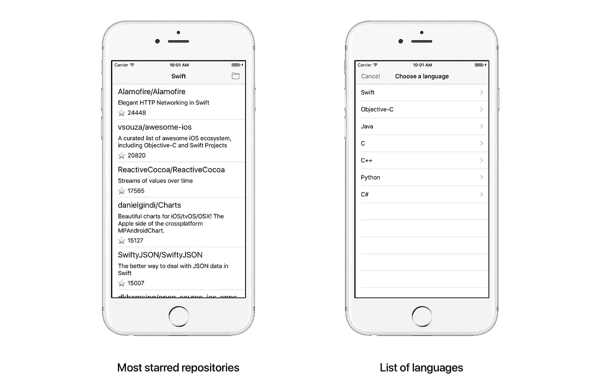
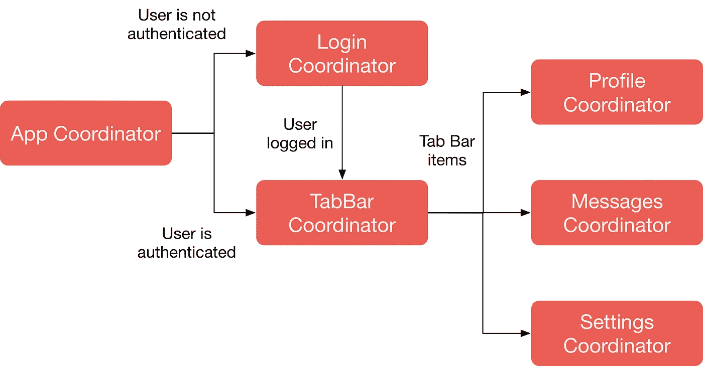
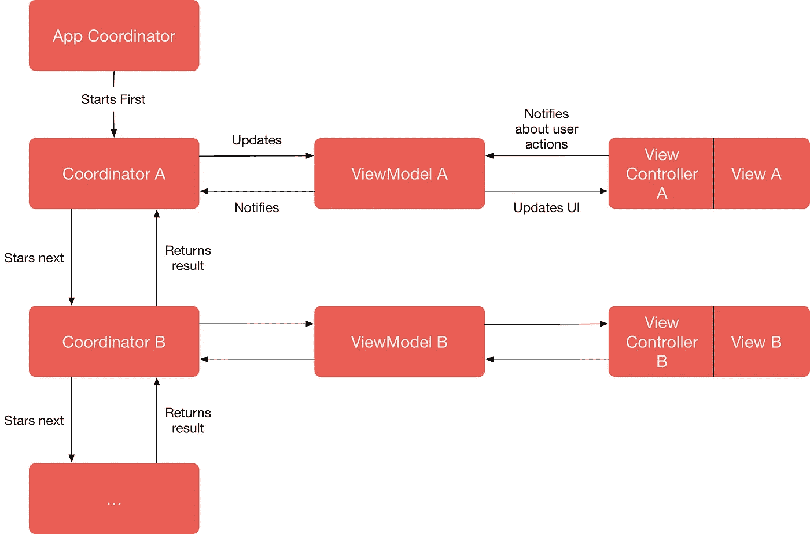

# 如何使用 MVVM、协调员和 RxSwift

> 原文：<https://medium.com/hackernoon/how-to-use-mvvm-coordinators-and-rxswift-7364370b7b95>


我们的团队在生产应用中使用协调器和 MVVM 已经超过 2 年了。起初，这看起来很可怕，但从那时起，我们已经完成了基于这些架构模式的6 应用程序。在这篇文章中，我将分享我们的经验，并将引导你到 MVVM 地，协调员&反应式编程。

我们将从一个简单的 MVC 示例应用程序开始，而不是预先给出一个定义。我们将一步一步地慢慢进行重构，以展示每个组件如何影响代码库以及结果是什么。每一步都会以一个简短的理论介绍开始。

# 例子

在本文中，我们将使用一个简单的示例应用程序，它按语言显示 GitHub 上最受欢迎的存储库列表。它有两个屏幕:一个按语言过滤的存储库列表和一个按语言过滤存储库的列表。



Screens of the example app

用户可以点击导航栏中的按钮来显示第二个屏幕。在语言屏幕上，他可以选择一种语言或通过点击取消按钮关闭屏幕。如果用户选择一种语言，屏幕将关闭，存储库列表将根据所选语言进行更新。

您可以在这里找到源代码:

[](https://github.com/uptechteam/Coordinator-MVVM-Rx-Example) [## uptechteam/协调员-MVVM-Rx-示例

### 协调员-MVVM-Rx-示例-使用 RxSwift 实施的 MVVM-C 架构示例

github.com](https://github.com/uptechteam/Coordinator-MVVM-Rx-Example) 

该库包含 4 个文件夹:MVC，MVC-Rx，MVVM-Rx，协调员-MVVM-Rx，对应于重构的每一步。让我们打开 [MVC 文件夹](https://github.com/uptechteam/Coordinator-MVVM-Rx-Example/tree/master/MVC)中的项目，看看重构前的代码。

大部分代码在两个视图控制器中:`RepositoryListViewController`和`LanguageListViewController`。第一个获取最流行的存储库列表，并通过表格视图显示给用户，第二个显示语言列表。`RepositoryListViewController`是`LanguageListViewController`的代表，符合以下协议:

`RepositoryListViewController`也是表视图的代表和数据源。它处理导航、格式化要显示的模型数据并执行网络请求。哇，一个视图控制器要承担很多责任！

此外，您可能会注意到全局作用域中的两个变量定义了`RepositoryListViewController` : `currentLanguage`和`repositories`的状态。这样的有状态变量给类带来了复杂性，并且当我们的应用程序的一部分可能以我们不期望的状态结束时，这是一个常见的错误来源。总而言之，当前的代码库有几个问题:

*   视图控制器的责任太多；
*   我们需要被动地处理状态变化；
*   代码根本不可测试。

该见见我们的第一位客人了。

# RxSwift

该组件将允许我们对变化做出反应，并编写声明性代码。

Rx 是什么？其中一个定义是:

> ReactiveX 是一个库，用于通过使用可观察序列来编写异步和基于事件的程序。

如果你不熟悉函数式编程，或者这个定义听起来像一门火箭科学(对我来说仍然是),你可以把 Rx 想象成一种服用了类固醇的观察者模式。欲了解更多信息，您可以参考[入门指南](https://github.com/ReactiveX/RxSwift/blob/master/Documentation/GettingStarted.md)或 [RxSwift 书籍](https://store.raywenderlich.com/products/rxswift)。

让我们打开资源库中的 [MVC-Rx 项目，看看 Rx 是如何修改代码的。我们将从与 Rx 相关的最显而易见的事情开始——我们用两个可观察到的事物来代替`LanguageListViewControllerDelegate`:`didCancel`和`didSelectLanguage`。](https://github.com/uptechteam/Coordinator-MVVM-Rx-Example/tree/master/MVC-Rx)

Delegate pattern done right

`LanguageListViewControllerDelegate`变成了`didSelectLanguage`和`didCancel`可观测量。我们在`prepareLanguageListViewController(_: )`方法中使用它们来反应性地观察`RepositoryListViewController`事件。

接下来，我们将重构`GithubService`来返回 observables，而不是使用回调。之后，我们将使用 RxCocoa 框架的能力来重写我们的视图控制器。`RepositoryListViewController`的大部分代码将转移到`setupBindings`函数，在这里我们声明性地描述了视图控制器的逻辑:

A declarative description of the view controller logic

现在我们去掉了视图控制器中的表视图委托和数据源方法，并将我们的状态转移到一个可变主题:

```
fileprivate let currentLanguage = BehaviorSubject(value: “Swift”)
```

## 结果

我们已经使用 RxSwift 和 RxCocoa 框架重构了示例应用程序。那么它到底给了我们什么？

*   所有的逻辑都以声明的方式写在一个地方；
*   我们把状态简化为当前语言的一个主题，我们观察变化并对变化作出反应；
*   我们使用了 RxCocoa 的一些语法糖来设置表视图数据源，并且简单明了地进行委托。

我们的代码仍然是不可测试的，视图控制器仍然负责很多事情。让我们转向架构的下一个组件。

# MVVM

MVVM 是一个来自模型-视图-X 家族的 UI 架构模式。MVVM 类似于标准的 MVC，除了它定义了一个新的组件——ViewModel，它允许更好地将 UI 从模型中分离出来。本质上，ViewModel 是一个独立于视图 UIKit 的对象。

*该示例项目在* [*MVVM-Rx 文件夹下*](https://github.com/uptechteam/Coordinator-MVVM-Rx-Example/tree/master/MVVM-Rx) *。*

首先，让我们创建一个视图模型，它将为视图中的显示准备模型数据:

接下来，我们将把所有的数据突变和格式化代码从`RepositoryListViewController`移到`RepositoryListViewModel`:

现在，我们的视图控制器将所有 UI 交互(如按钮点击或行选择)委托给视图模型，并观察视图模型输出的数据或事件(如`showLanguageList`)。

我们将为`LanguageListViewController`做同样的事情，看起来我们准备好了。但是我们的测试文件夹仍然是空的！视图模型的引入允许我们测试大部分代码。因为视图模型纯粹使用注入依赖关系将输入转换成输出，所以视图模型和单元测试是我们应用程序中最好的朋友。

我们将使用 RxSwift 附带的 RxTest 框架测试该应用程序。最重要的部分是一个`TestScheduler`类，它允许你通过定义它们应该在什么时候发出值来创建假的可观测量。这就是我们测试视图模型的方式:

View Model tests

## 结果

好了，我们已经从 MVC 移到了 MVVM。但是有什么区别呢？

*   视图控制器现在更薄了；
*   数据格式化逻辑与视图控制器分离；
*   MVVM 让我们的代码可测试。

然而，我们的视图控制器还有一个问题— `RepositoryListViewController`知道`LanguageListViewController`的存在并管理导航流。让我们与协调员一起解决它。

# 协调者

如果你还没有听说过协调员，我强烈推荐你阅读 Soroush Khanlou 的这篇很棒的博客文章。

简而言之，协调器是控制应用程序导航流的对象。它们有助于:

*   隔离并重用 ViewControllers
*   沿导航层次结构向下传递依赖关系；
*   定义应用程序的用例；
*   实现深度链接。



Coordinators Flow

该图显示了应用程序中典型的协调器流程。App Coordinator 检查是否有存储的有效访问令牌，并决定接下来显示哪个 Coordinator—登录或选项卡栏。选项卡栏协调器显示了三个子协调器，它们对应于选项卡栏项目。

我们的重构过程终于要结束了。已完成的项目位于[协调员-MVVM-Rx](https://github.com/uptechteam/Coordinator-MVVM-Rx-Example/tree/master/Coordinators-MVVM-Rx) 目录中。有什么变化？

首先，我们来看看什么是`BaseCoordinator`:

Base Coordinator

这个通用对象为具体的协调者提供了三个特性:

*   启动协调器作业的抽象方法`start()`(即呈现视图控制器)；
*   通用方法`coordinate(to: )`，它调用传递的子协调器上的`start()`，并将其保存在内存中；
*   `disposeBag`为子类所用。

*为什么* `*start*` *方法返回一个* `*Observable*` *，什么是* `*ResultType*` *？*

`ResultType`是代表协调者工作结果的类型。更常见的是`ResultType`将是`Void`，但是对于某些情况，它将是可能结果情况的枚举。`start`将发出一个结果项并完成。

我们在应用程序中有三个协调员:

*   `AppCoordinator`这是协调员层级的一个根；
*   `RepositoryListCoordinator`；
*   `LanguageListCoordinator.`

让我们看看最后一个是如何与 ViewController 和 ViewModel 通信并处理导航流的:

如果用户点击“取消”按钮，则 LanguageListCoordinator 工作的结果可以是选定的语言或什么都不是。两种情况都在`LanguageListCoordinationResult`枚举中定义。

在`RepositoryListCoordinator`中，我们通过`LanguageListCoordinator`的呈现来平铺`showLanguageList`的输出。在`LanguageListCoordinator`的`start()`方法完成后，我们过滤结果，如果选择了一种语言，我们将它发送到视图模型的`setCurrentLanguage`输入。

*注意，我们返回* `*Observable.never()*` *，因为存储库列表屏幕总是在视图层次中。*

## 结果

我们完成了重构的最后一个阶段

*   将导航逻辑移出视图控制器并隔离它们；
*   设置视图模型到视图控制器的注入；
*   简化了故事板。

从鸟瞰图来看，我们的系统是这样的:



MVVM-C architecture

应用程序协调器启动第一个协调器，该协调器初始化视图模型，注入视图控制器并呈现它。视图控制器向视图模型发送用户事件，如按钮点击或单元格区域。视图模型向视图控制器提供格式化的数据，并要求协调器导航到另一个屏幕。协调器也可以向视图模型输出发送事件。

# 结论

我们已经讨论了很多:我们讨论了描述 UI 架构的 MVVM，用协调器解决了导航/路由问题，并用 RxSwift 声明了我们的代码。我们已经对应用程序进行了一步一步的重构，并展示了每个组件是如何影响代码库的。

在构建 iOS 应用程序架构时，没有灵丹妙药。每个解决方案都有自己的缺点，可能适合也可能不适合您的项目。坚持架构是在您的特定情况下权衡取舍的问题。

当然，关于 Rx、协调员和 MVVM 的内容比我在这篇文章中所能涵盖的要多得多，所以如果你想让我再写一篇关于边缘案例、问题和解决方案的文章，请告诉我。

感谢阅读！

*亚瑟·迈伦科，* [*UPTech 团队*](https://uptech.team/) *与❤️*

*本帖原载于* [*UPTech 团队博客*](http://blog.uptech.team) *。关注我们，获取更多关于如何构建优秀产品的文章💪*