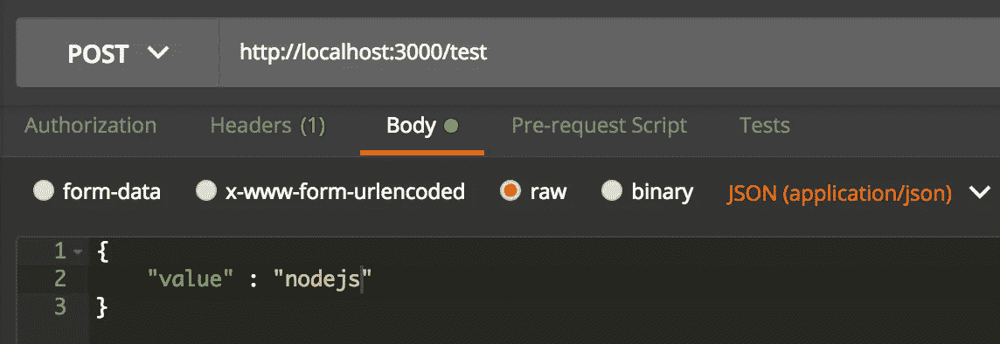

# 没有框架和外部库如何使用 NodeJS

> 原文：<https://medium.com/hackernoon/how-to-use-nodejs-without-frameworks-and-external-libraries-97eb6acac9e3>


“timelapse photography of pink vehicle lights near buildings” by [Emre Karataş](https://unsplash.com/@emrekaratas?utm_source=medium&utm_medium=referral) on [Unsplash](https://unsplash.com?utm_source=medium&utm_medium=referral)

[NodeJS](https://hackernoon.com/tagged/nodejs) 最常用于 Express 框架。NodeJS 还使用了许多其他外部库。

这些[框架](https://hackernoon.com/tagged/frameworks)和库与 NodeJS 一起使用的原因是为了使开发更加容易和快速。

在进行任何真正的项目时，最好在任何需要的地方使用框架和库来加快开发😄

也就是说，在这篇文章中，我将展示如何在不使用 express framework 或任何其他外部库的情况下用 NodeJS 构建简单的 REST API。本文将只使用 NodeJS 本身提供的那些功能。

这样做的原因是为了展示如何在没有框架和库的情况下使用 NodeJS😄。这也将给出一个关于 NodeJS 如何工作的更好的想法😄

# 先决条件

从[https://nodejs.org](https://nodejs.org/)安装节点

# 密码

这篇文章的代码可以在我的 [github repo](https://github.com/aditya-sridhar/simple-rest-apis-nodejs-without-frameworks) 中找到。

# 让我们从代码开始😄

创建一个名为**simple-rest-APIs-nodejs-without-frameworks**的文件夹。这将是我们的 NodeJS 项目文件夹。

进入项目文件夹，使用`npm init`使项目成为节点项目。执行此操作的命令有

```
cd simple-rest-apis-nodejs-without-frameworks
npm init
```

# package.json

运行`npm init`之后，在项目文件夹中会创建一个 **package.json** 文件。

json 有关于你的项目的信息，比如项目名称，版本，描述等等。另外，package.json 是您添加节点依赖项的地方。在本文中，我们不会有任何依赖，因为我们只使用 NodeJS 本身提供的功能。

# 首个 API

在项目文件夹中创建一个名为 **server.js** 的文件。这将是我们应用程序的起点。

将以下代码复制到 server.js 中

```
**const** hostname **=** '127.0.0.1';
**const** port **=** 3000;**const** server **=** require('./controller.js');server.listen(port, hostname, () **=>** {
    console.log(`Server running at http://${hostname}:${port}/`);
});
```

这段代码实际上依赖于一个名为 **controller.js** 的文件，我们很快就会添加这个文件。这段代码告诉我们服务器需要监听端口 3000 和本地主机 T21

服务器创建在 **controller.js** 中完成

# controller.js

这是我们将在其中创建服务器和定义 rest 端点的文件。创建一个名为 **controller.js** 的文件

让我们首先在 **controller.js** 中创建一个 GET 端点

```
**const** http **=** require('http');
**const** url **=** require('url');module.exports **=** http.createServer((req, res) **=>** { **var** service **=** require('./service.js');
    **const** reqUrl **=** url.parse(req.url, **true**); *// GET Endpoint*
    **if** (reqUrl.pathname **==** '/sample' **&&** req.method **===** 'GET') {
        console.log('Request Type:' **+**
            req.method **+** ' Endpoint: ' **+**
            reqUrl.pathname); service.sampleRequest(req, res);
    } 
});
```

首先导入 **http** 和 **url** 模块。这些模块都是 NodeJS 自己提供的。

http 模块能够创建 web 应用程序。它支持客户端和服务器操作。

**url** 模块帮助解析 url

行`http.createServer((req, res) => {`表示需要创建一个 http 服务器，其中**请求作为 req，响应作为 res**

**module.exports** 用于将该文件导出为一个模块。这就是为什么我们可以使用`const server = require('./controller.js');`在 **server.js** 中导入 **controller.js**

可以看出这个文件需要 **service.js** 这个我们后面会讲到。

代码`const reqUrl = url.parse(req.url, true);`获取请求 url 并解析它，这样我们就可以在上面运行一些 url 函数。

我们要创建的第一个端点是一个端点 url 为 **/sample** 的 **GET** 端点

为了进行 url 路由，我们将使用**如果其他条件**

行`if (reqUrl.pathname == '/sample' && req.method === 'GET') {`检查被请求的 url 是否是 **/sample** ，还检查请求类型是否是 **GET**

这个 get 请求的逻辑存在于 **service.sampleRequest(req，res)中；**是 **service.js** 中定义的功能

# 服务网

这是实际的 api 逻辑将出现的地方。创建一个名为 **service.js** 的文件。

将以下代码复制到 **service.js** 中

```
**const** url **=** require('url');exports.sampleRequest **=** **function** (req, res) {
    **const** reqUrl **=** url.parse(req.url, **true**);
    **var** name **=** 'World';
    **if** (reqUrl.query.name) {
        name **=** reqUrl.query.name
    } **var** response **=** {
        "text": "Hello " **+** name
    }; res.statusCode **=** 200;
    res.setHeader('Content-Type', 'application/json');
    res.end(JSON.stringify(response));
};
```

这段代码检查请求 URL 是否有一个名为 **name** 的查询参数，并将它存储在 name 变量中。如果没有查询参数，则默认为字符串 **World**

响应状态设置为 **200** ，响应的内容类型为 **JSON** ，最后使用`res.end(JSON.stringify(response));`发回响应

因为**响应变量**是一个 JSON 对象，所以我们在发回 http 响应之前，对它使用 **JSON.stringify** 将其转换为字符串

现在我们可以使用命令运行应用程序

```
node server.js
```

# 测试

为了测试端点，使用 **postman** 。你可以从[这里](https://www.getpostman.com/)下载

在 postman 中选择 Get request 并输入 url 为`http://localhost:3000/sample?name=aditya`然后点击 send


这个请求的输出如下所示

```
{
    "text": "Hello aditya"
}
```

现在输入网址为`http://localhost:3000/sample`并点击发送

这个请求的输出如下所示

```
{
    "text": "Hello World"
}
```

# 第二个 API

在本节中，我们将构建第二个 API，它是一个 **POST** 请求。此外，如果用户点击一些随机的网址，我们将需要指出这是一个无效的路线。我们将在这里添加逻辑。

# controller.js

将 **controller.js** 中的代码更新为如下所示

```
**const** http **=** require('http');
**const** url **=** require('url');module.exports **=** http.createServer((req, res) **=>** { **var** service **=** require('./service.js');
    **const** reqUrl **=** url.parse(req.url, **true**); *// GET Endpoint*
    **if** (reqUrl.pathname **==** '/sample' **&&** req.method **===** 'GET') {
        console.log('Request Type:' **+**
            req.method **+** ' Endpoint: ' **+**
            reqUrl.pathname); service.sampleRequest(req, res); *// POST Endpoint*
    } **else** **if** (reqUrl.pathname **==** '/test' **&&** req.method **===** 'POST') {
        console.log('Request Type:' **+**
            req.method **+** ' Endpoint: ' **+**
            reqUrl.pathname); service.testRequest(req, res); } **else** {
        console.log('Request Type:' **+**
            req.method **+** ' Invalid Endpoint: ' **+**
            reqUrl.pathname); service.invalidRequest(req, res); }
});
```

post 端点将拥有 url **/test** 。该代码有一个检查**/测试**端点的条件。 **/test** 端点的逻辑将在 **service.testRequest(req，res)中；**在 **service.js** 中

该代码还有一个针对无效路由的 else 条件。无效路由的逻辑在 **service.invalidRequest(req，res)中处理；**

# 服务网

将下面这段代码添加到 **service.js** 中。不要删除 service.js 中的现有代码，请将此代码添加到现有代码的下方。

```
exports.testRequest **=** **function** (req, res) {
    body **=** ''; req.on('data', **function** (chunk) {
        body **+=** chunk;
    }); req.on('end', **function** () { postBody **=** JSON.parse(body); **var** response **=** {
            "text": "Post Request Value is  " **+** postBody.value
        }; res.statusCode **=** 200;
        res.setHeader('Content-Type', 'application/json');
        res.end(JSON.stringify(response));
    });
};
```

对于 POST 请求，调用端点时会给出一个输入 POST 主体。

在代码中，我们需要从请求中获取 POST 主体。

下面的代码可以做到这一点

```
req.on('data', **function** (chunk) {
    body **+=** chunk;
});
```

请求以**流**的形式出现。这段代码获取数据流，并不断将其附加到**主体**中。

只有在流式传输完成并且收到完整的 **post 主体**后，才会执行`req.on('end', function () {`。

`postBody = JSON.parse(body);`这段代码将输入的 post 主体转换成 JSON 格式，这样我们就可以使用其中的值。

在代码中，我们使用了**后置体**中的**值**字段。

响应的设置类似于我们对 GET 请求的设置。

# 无效请求的逻辑

将下面这段代码添加到 **service.js** 中。不要删除 service.js 中的现有代码，请将此代码添加到现有代码的下方。

```
exports.invalidRequest **=** **function** (req, res) {
    res.statusCode **=** 404;
    res.setHeader('Content-Type', 'text/plain');
    res.end('Invalid Request');
};
```

对于无效请求，状态设置为 **404** ，内容类型设置为**文本**。发回的实际内容是**无效请求**

# 测试

去找邮递员。选择请求类型为**帖子**，并键入以下 url `[http://localhost:3000/test](http://localhost:3000/test.)` [。](http://localhost:3000/test.)



同时选择**主体**、**原始**和**应用/json** ，如图所示

输入贴体如下所示

```
{
	"value" : "nodejs"
}
```

点击邮递员发送

API 输出如下所示

```
{
    "text": "Post Request Value is  nodejs"
}
```

您也可以尝试使用无效的请求。在 postman 中选择 **GET** 并输入 url 为`[http://localhost:3000/test123](http://localhost:3000/test123)`

对此的响应将是**无效文本**

# 祝贺😄

您现在知道了如何在 NodeJS 中创建 REST API，而无需使用任何框架或外部库😄

**在实际项目中，尽可能使用框架或库，以使开发周期更容易、更快**

# 关于作者

我热爱技术，关注该领域的进步。我也喜欢用我的技术知识帮助别人。

请随时联系我的 LinkedIn 账户[https://www.linkedin.com/in/aditya1811/](https://www.linkedin.com/in/aditya1811/)

你也可以在推特上关注我[https://twitter.com/adityasridhar18](https://twitter.com/adityasridhar18)

我的网站:[https://adityasridhar.com/](https://adityasridhar.com/)

# 我的其他帖子

[Git 简介](https://medium.freecodecamp.org/what-is-git-and-how-to-use-it-c341b049ae61)

[如何高效使用 Git](https://medium.freecodecamp.org/how-to-use-git-efficiently-54320a236369)

[代码中那个奇怪的 bug 是怎么来的](/swlh/how-did-that-weird-bug-come-in-the-code-70111ee1480b)

*原载于*[*adityasridhar.com*](https://adityasridhar.com/posts/how-to-use-nodejs-without-frameworks-and-external-libraries)*。*