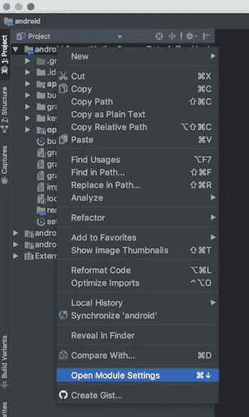
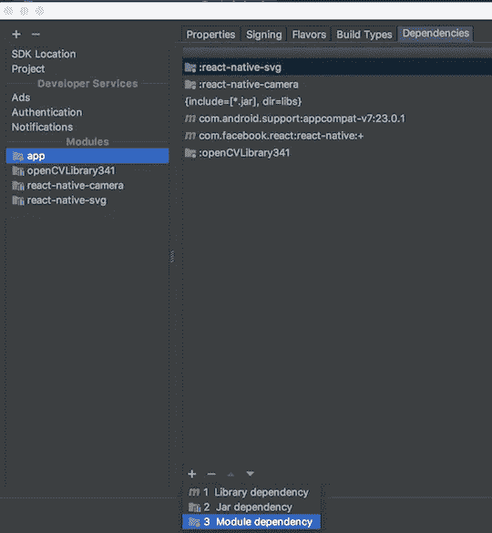
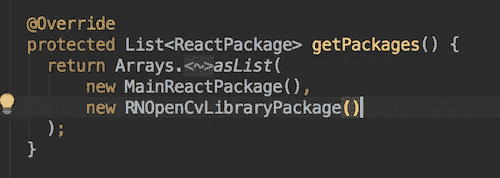
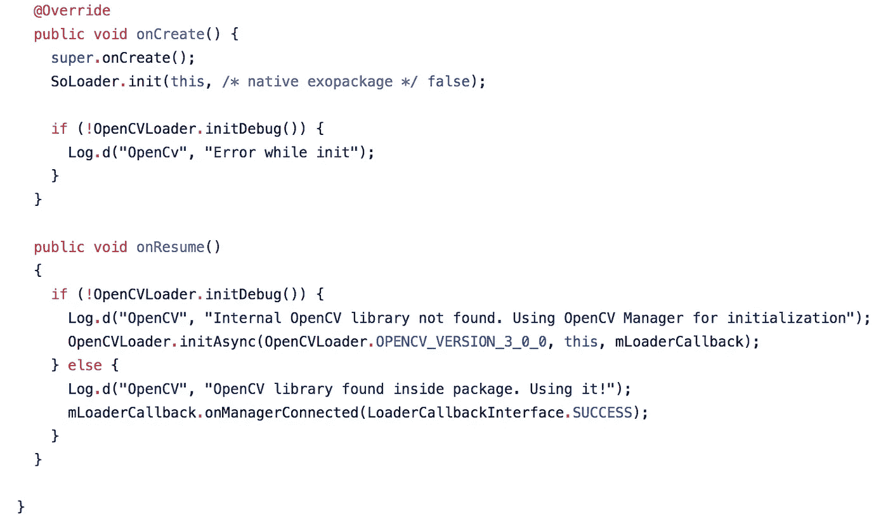
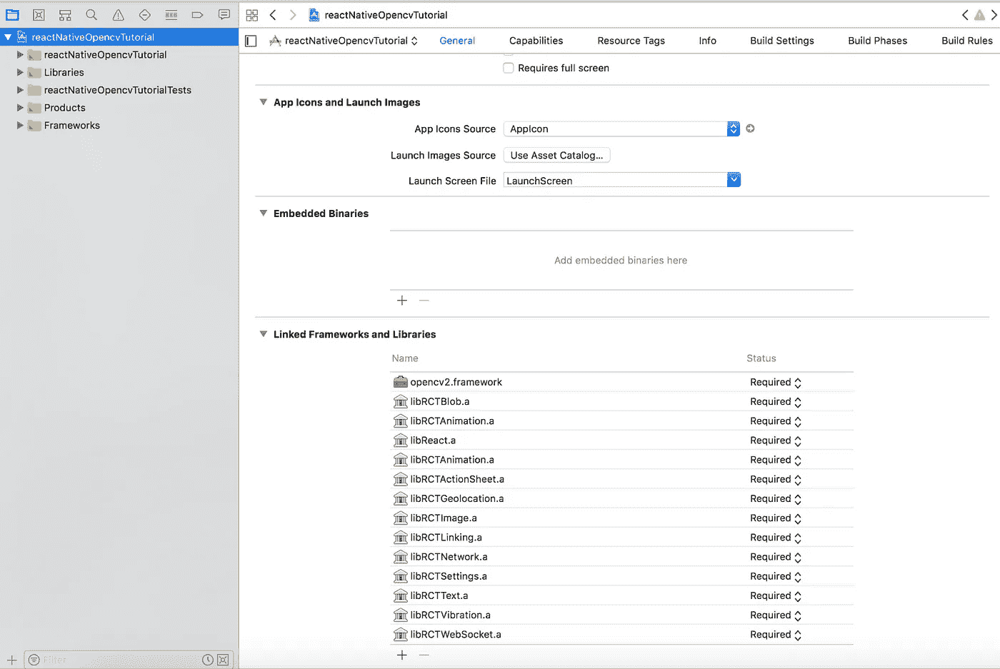
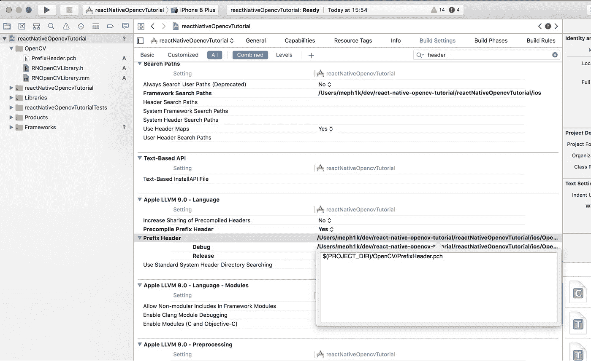
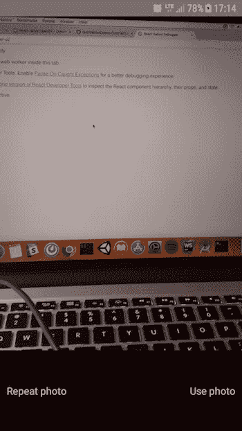
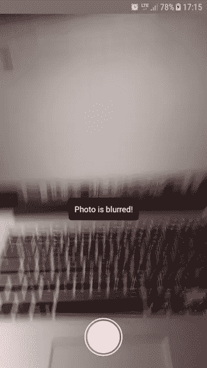

# 如何在 React Native 中使用 OpenCV 进行图像处理

> 原文：<https://medium.com/hackernoon/how-to-use-opencv-in-react-native-for-image-processing-db997e73678c>


如果您曾经想知道如何使用 OpenCV 和 React Native 处理您的图像，那么您来对地方了。

OpenCV 与 [React Native](https://brainhub.eu/blog/difference-react-js-react-native-react-vr/) 一起使您能够**处理移动设备上的图像**(您很可能想要处理您设备的摄像头拍摄的图像)。

其中最大的**优势**是:

*   容易实现。
*   好用。
*   互联网上有很多教程和 OpenCV 的官方文档。
*   你的移动应用程序的大小只会大十几兆字节。

让我向你展示我如何使用 OpenCV 和 React Native 一步一步地处理我的图像，但首先要做一些介绍。

# OpenCV 是什么？

OpenCV **(开源计算机视觉库)**是一个开源的计算机视觉和机器学习软件库。OpenCV 旨在为计算机视觉应用提供一个公共基础设施，并加速机器感知在商业产品中的应用。

该库拥有超过 **2500 种优化算法**，包括一套全面的经典和最先进的计算机视觉和机器学习算法。

这些算法可用于检测和识别人脸、识别物体、对视频中的人类动作进行分类、跟踪相机运动、跟踪运动物体、提取物体的 3D 模型、从立体相机产生 3D 点云、将图像拼接在一起以产生整个场景的高分辨率图像、从图像数据库中找到相似的图像、从使用闪光灯拍摄的图像中去除红眼、跟随眼球运动、识别风景并建立标记以用增强现实覆盖它等。

OpenCV 拥有超过 47000 人的社区，预计下载次数超过 1400 万次。

该图书馆被公司、研究团体和政府机构广泛使用。

OpenCV 是用 C++原生编写的。

自 2010 年 OpenCV 被移植到 Android 环境后，它允许在移动应用程序开发中使用该库的全部功能。

2012 年，OpenCV 开发团队积极致力于增加对 iOS 的扩展支持。从版本 2.4.2 (2012)开始提供完全集成。

**React Native** 最早是脸书在 2015 年发布的[。React Native 让你](https://brainhub.eu/blog/famous-apps-built-with-react-native/)[只用 JavaScript 就能构建移动应用](https://brainhub.eu/technology/react-native-development)。它使用与 React 相同的设计，允许您从声明性组件构建丰富的移动 UI。

# React Native 和 OpenCV 是好朋友！

如果我们在谷歌上搜索“react native opencv ”,我们会发现以下链接:

*   [GitHub—ma-PE/React-native-OpenCV:OpenCV Bindings for React…](https://github.com/ma-pe/react-native-opencv)'
    正如文件中的第一句话所说:“目前正在开发中🙂为 OpenCV 反应本地绑定。但是没有 React 本机绑定。”此外，它是不完整的，上传 500 多 MB 的 OpenCV 库不是一个好主意。
*   [我可以在 react native 中使用 openCV 吗？？问题#88 wix/react-native …](https://github.com/wix/react-native-camera-kit/issues/88) '
    关于 React Native 和 OpenCV 的一个未解问题。
*   [opencv/opencv—GitHub](https://github.com/opencv/opencv/issues/8681)’
    链接库的一个问题是一开始并没有指明如何做。
*   [(新手)用 OpenCV:React Native-Reddit](https://www.reddit.com/r/reactnative/comments/7iu5ad/newbie_react_native_with_opencv/)’
    反应原生，答案是可能的，但没有如何做的例子。

# 这个教程是关于什么的？

在本教程中，我们将构建一个示例项目，其中**使用设备的摄像头**拍摄照片，**使用本机代码**对其进行处理，并且**返回所拍摄图像模糊或清晰的信息**。

用普通的 JavaScript 来做是非常低效的。JavaScript 不足以完成非常繁重的计算。

请注意，我们绝不是 Java 或 Objective-C 开发人员，因此我们的 Java/Objective-C 代码可能远远不够好。如果你想对此课题有所贡献，请联系我们。

# OpenCV 基础准备

**第一步:** `react-native init reactNativeOpenCvTutorial`

**第二步:**在你的项目目录中运行`downloadAndInsertOpenCV.sh`脚本([可以在这里找到)](https://github.com/brainhubeu/reactNativeOpencvTutorial/blob/master/downloadAndInsertOpenCV.sh)它下载并插入 Android 和 iOS 的 openCV 文件。文件中的路径可能不符合您的偏好，因此您可能需要更改它们。

# Android 教程

**第一步:**在 Android Studio 中打开你的项目。

第二步:按照 Android Studio 中的提示同步你的项目。

**第三步:**下载[最新版本的 OpenCV for Android](https://opencv.org/releases.html) 。我的情况是 3.4.1。

**第四步:**导入 OpenCV 到 Android Studio:从`File -> New -> Import Module`开始，在解压后的 OpenCV 档案中选择`sdk/java`文件夹。

**第五步:**更新导入的 OpenCV 模块下的`build.gradle`，更新 4 个字段以匹配您项目的`build.gradle`:

*   编译版本
*   构建工具版本
*   minSdkVersion
*   targetSdkVersion。

**第六步:**添加模块依赖:

`Application -> Module Settings`，并选择`Dependencies`选项卡。点击底部的`+`图标，选择`Module Dependency`，选择导入的 OpenCV 模块。

对于 Android Studio v1.2.2，要在项目视图中访问`Module Settings`，右键单击依赖模块并选择`Open Module Settings`。

打开`Module Settings`。



点击`+`，选择`Module Dependency`，从列表中选择 OpenCV 库。



**第七步:`android/app/src/java`里面的**创建一个名为即`com.reactlibrary`的包。

步骤 8: 用适当的权限更新您的清单:

```
<uses-permission android:name=”android.permission.CAMERA” />
<uses-permission android:name=”android.permission.READ_EXTERNAL_STORAGE” />
<uses-permission android:name=”android.permission.WRITE_EXTERNAL_STORAGE” />
```

参见[整体文件](https://github.com/brainhubeu/reactNativeOpencvTutorial/blob/master/android/app/src/main/AndroidManifest.xml)。

**第 9 步:**在你新创建的包里面创建一个文件`RNOpenCvLibraryModule.java`，然后[填充它，如下图所示](https://github.com/brainhubeu/reactNativeOpencvTutorial/blob/master/android/app/src/main/java/com/reactlibrary/RNOpenCvLibraryModule.java)。

**第 10 步:**在你新创建的包里面创建一个名为`RNOpenCvLibraryPackage.java`的文件[如下图所示](https://github.com/brainhubeu/reactNativeOpencvTutorial/blob/master/android/app/src/main/java/com/reactlibrary/RNOpenCvLibraryPackage.java)。

**步骤 11:** 在您的`MainApplication.java`文件中添加适当的导入，将您的 OpenCV 包添加到列表中，并将适当的代码添加到`MainApplication`类中，如下所示:

```
Imports:import com.reactlibrary.RNOpenCvLibraryPackage;
import org.opencv.android.BaseLoaderCallback;
import org.opencv.android.LoaderCallbackInterface;
import org.opencv.android.OpenCVLoader;
import android.util.Log;
```

将`new RNOpenCvLibraryPackage()`添加到您的包列表中。



将`BaseLoaderCallback`添加到您的`MainApplication`类中:


此外，向您的`MainApplication`类添加以下回调:



此处见[整体文件。](https://github.com/brainhubeu/reactNativeOpencvTutorial/blob/master/android/app/src/main/java/com/reactnativeopencvtutorial/MainApplication.java)

# iOS 教程

**第一步:**在 XCode 中打开 iOS 项目。

**第二步:**将`opencv2.framework`添加到你的`Linked Frameworks and Libraries`中。



第三步:在 iOS 目录中创建新群组。我把它命名为“OpenCV”。

**第四步:**添加一个. pch 文件，插入 OpenCV 目录。

**第五步:**给你的`.pch`文件添加合适的内容——这里显示的。

**第六步:**创建一个名为`RNOpenCvLibrary.h`的文件，[如下图](https://github.com/brainhubeu/reactNativeOpencvTutorial/blob/master/ios/OpenCV/RNOpenCvLibrary.h)填写。

**第七步:**创建一个名为`RNOpenCvLibrary.mm`的文件，[如下图所示](https://github.com/brainhubeu/reactNativeOpencvTutorial/blob/master/ios/OpenCV/RNOpenCvLibrary.mm)。

**第八步:**将`Precompile Prefix Header`设置为`Yes`，并像这样设置`Prefix Header path`:



**第 9 步:**将以下内容添加到您的`Info.plist`文件中:

```
<key>NSCameraUsageDescription</key>
<string>Your message to user when the camera is accessed for the first time</string>
<key>NSPhotoLibraryAddUsageDescription</key>
<string>Your message to user when the photo library is accessed for the first time</string>
```

参见[整体文件](https://github.com/brainhubeu/reactNativeOpencvTutorial/blob/master/ios/reactNativeOpencvTutorial/Info.plist)。

# 最后一部分— JavaScript

**第一步:**在你的 src 文件夹中创建一个名为`NativeModules`的文件夹和一个名为`OpenCV.js,`的文件，并填入:

```
import { NativeModules } from ‘react-native’;export default NativeModules.RNOpenCvLibrary;
```

参见[整体文件](https://github.com/brainhubeu/reactNativeOpencvTutorial/blob/master/src/NativeModules/OpenCV.js)。

**第二步:**我们将使用一些第三方库进行快速设置。打开终端并键入:

```
npm i –save react-native-svg
npm i –save react-native-camera
npm i –save react-native-easy-toast
```

**第三步:**别忘了链接库:`react-native link`。

我们将使用这个文件作为参考。

在第 126 行，我们设置了摄像头，在第 135 行，我们创建了一个可触摸的元素来处理拍照。拍照由拍照功能处理。它拍摄一张照片，将数据保存在本地状态，并继续检查照片是否模糊。函数`proceedWithCheckingBlurryImage`使用本地函数`checkForBlurryImage`并返回一个简单的信息:照片是否模糊。

**第四步:**注意:如果遇到 Android 连接相机的构建问题，参考我的 [build.gradle 文件](https://github.com/brainhubeu/reactNativeOpencvTutorial/blob/master/android/build.gradle)，尤其是`maven { url “[https://jitpack.io](https://jitpack.io)” }`行，在 Android Studio 中重新同步项目。

如果您有与 Google Play 服务相关的错误，请在 GitHub 上查看此[问题。](https://github.com/facebook/react-native/issues/18479)

如果您有与 react-native-camera 相关的错误，请检查主分支，在`package.json`中更改版本，如下所示:

```
“react-native-camera”: “git+[https://git@github.com/react-native-community/react-native-camera](https://git@github.com/react-native-community/react-native-camera)"
```

# 示例结果

一张清晰的照片。我们会收到照片的预览，并可以选择使用它或重复它。



一张模糊的照片。我们收到一条提示信息，通知我们照片模糊不清，必须重复拍摄。



**别忘了看看我们 GitHub** **上的** [**最终产品！**](https://github.com/brainhubeu/reactNativeOpencvTutorial)

## 参考资料:

*   [在 Android Studio 中为 Android 设置 OpenCV](https://stackoverflow.com/questions/27406303/opencv-in-android-studio)(stack overflow)
*   [在 XCode 中为 iOS 设置 OpenCV](https://kurtjacobs.weebly.com/computer-vision/up-and-running-with-opencv-30-for-ios)(博文)
*   [React Native 的原生模块](https://facebook.github.io/react-native/docs/native-modules-ios.html) (GitHub)
*   [用于检查提供的图像是否模糊的原生 Java 代码](http://answers.opencv.org/question/16927/detect-if-image-is-blurry/) (OpenCV 官方)
*   [用于检查提供的图像是否模糊的本机目标 C 代码](https://stackoverflow.com/questions/24080123/opencv-with-laplacian-formula-to-detect-image-is-blur-or-not-in-ios) (StackOverflow)
*   [OpenCV 官网](https://opencv.org/about.html) (OpenCV 官方)

*这是发表在 Brainhub 的博客* [*这里*](https://brainhub.eu/blog/opencv-react-native-image-processing/) *。*

查看我们的其他 React 原生故事，如“[如何向客户端交付 React 原生应用](https://medium.freecodecamp.org/how-to-deliver-a-react-native-app-to-the-client-e58421e7272e)”!

**寻求帮助打造你的**[**React Native**](https://brainhub.eu/technology/react-native-development)**还是**[**React**](https://brainhub.eu/technology/react-js-development)**应用？** [**降我们一行**](https://brainhub.eu/contact) **。**