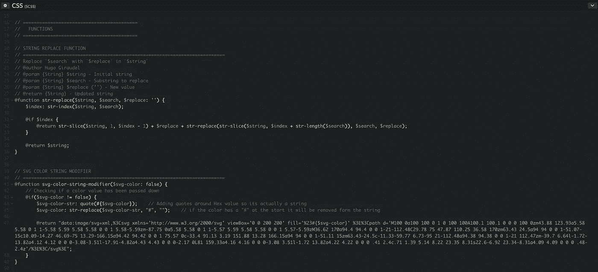

# 如何使用 Sass 字符串替换来动态显示 SVG 中的变化

> 原文：<https://medium.com/hackernoon/how-to-use-sass-string-replacement-to-animate-changes-in-an-svg-3ecdfc53ea91>

有时，我希望有一个 SVG 作为 URL 编码的`background-image: url(path/to/your.svg);`，通常在伪元素上([参见泰勒·亨特斯关于 URL 编码 SVG 的文章](https://codepen.io/tigt/post/optimizing-svgs-in-data-uris))。我喜欢这样做，因为这意味着我的 SVG 在我的样式表中，并为我节省了一个额外的服务器请求。我使用 Sass 运行一个字符串替换函数来编辑 SVG 的代码，从而使它具有动画效果。很酷吧？！下面的例子展示了如何将这种技术应用到一个只有单一填充颜色的简单 SVG 中。

Codepen example of Sass string replacement on an SVG — [https://codepen.io/stuartjnelson/full/xYOXRZ/](https://codepen.io/stuartjnelson/full/xYOXRZ/)

## 我们要做什么

1.  导出并优化 [SVG](https://hackernoon.com/tagged/svg) ，使其尽可能小
2.  使用 [SVG URL-encoder](http://yoksel.github.io/url-encoder/) 对 SVG 进行编码，以便可以在您的`.scss`文件中使用
3.  使用 [Hugo Giraude 的](https://hugogiraudel.com/2014/01/13/sass-string-replacement-function/)字符串替换功能来更改 SVG
4.  创建一个 mixin 来调用字符串替换函数并输出 [CSS](https://hackernoon.com/tagged/css)

# 1.导出和优化 SVG

从你最喜欢的图形编辑器导出的 SVG 总是有一堆我们不需要的信息。我个人认为 Adobe Illustrators SVG export 是最干净的，但是可以随意使用你选择的任何编辑器。

通过选择画板工具并双击我的 SVG，我将画板裁剪到 SVG 的边缘。

Using the Artboard Tool to exactly crop the artboard to the graphic

然后我想有一个单一的路径，因为我的 SVG 只有一种填充颜色。我为我的 SVG 选择父组，并使用 Mac 上的`cmd + 8`或 Windows 上的`ctlr + 8`将其转换为复合路径。

Combining the groups/layers into a single compound path

导出 SVG 后，在文本编辑器中打开它，您应该会看到类似这样的代码。

My SVG exported straight from Adobe Illustrator — [https://gist.github.com/stuartjnelson/dec1d06046e82fc0dc9492706c18311d](https://gist.github.com/stuartjnelson/dec1d06046e82fc0dc9492706c18311d)

## 优化导出的 SVG

这个 SVG 没有像我希望的那样优化。下面列出了一些优化 SVG 的选项。

1.  使用 SVGO CLI 从命令行进行优化。查看我关于如何为 SVGO CLI 设置 bash 别名的演练
2.  在浏览器中使用杰克·阿奇博尔德的牛逼软件 [SVGO GUI](https://jakearchibald.github.io/svgomg/)
3.  使用文本编辑器手动编辑 SVG。

对于一个简单的 SVG，比如我们正在使用的例子，我会在 SVGO GUI 上运行它，然后编辑一些东西。当在 CSS 中使用 SVG 时，我喜欢确保始终保留 ViewBox。我在过去遇到过 SVG 变得非常小并且没有`viewBox`属性的问题。在 SVGO 图形用户界面的偏好列表底部有一个选项可以做到这一点，并且移除了`width`和`height`属性。请看下面完成的 SVG！

SVGO GUI option to keep the viewBox attribute but to remove width & height

SVGO GUI optimised SVG

SVGO GUI optimised SVG that I then manually removed `data-name` from

# 2.数据对 SVG 进行编码，以便在 SCSS 使用

我没有对 SVG 进行 64 进制编码，因为正如 Taylor Hunt 指出的那样，没有必要使用 T11(它实际上会使 SVG 变得更大)。我在浏览器中使用 Yoksel 的 [SVGO URL 编码](http://yoksel.github.io/url-encoder/)工具对我的 SVG 进行 URL 编码。只需粘贴您的 SVG 和嘣你得到它的编码回来。对于步骤 4，您只需要准备好 CSS 文本*中的`url()`中的所有内容。*

[Yoksel’s](http://css.yoksel.ru/) SVG URI-encode tool is free, fast and awesome

# 3.字符串替换功能

[Hugo Giraude 发表了一篇关于使用 Sass 创建字符串替换函数的伟大文章](https://hugogiraudel.com/2014/01/13/sass-string-replacement-function/)。我使用了他的函数的一个简单版本。请注意，传递给函数*的字符串必须是用引号括起来的字符串。*

# 4.创建一个函数和一个 mixin 来调用字符串替换函数并输出 CSS

我从编码器中复制了编码的 SVG，并将其放入一个函数中，该函数负责通过调用字符串替换函数来替换我们的 SVG 的填充。这个函数，`svg-color-string-modifier()`做了 4 件事；

1.  检查你是否通过了一个论点(你可以进一步验证这一点，但我觉得没有必要)。
2.  然后，它会在您传入的颜色参数周围添加引号。
3.  然后，如果颜色中有杂凑，它会从颜色中移除杂凑(`#`)。
4.  最后，它将 SVG 作为一个长字符串返回，其中插入了新的填充颜色。

Sass function for modifying URL-encoded SVG’s fill propertiy

我在编码的 SVG 上用`fill="%23#{$svg-color}"`替换了`fill="%23000000"`。`%23`是`#`符号的 ULR 编码版本。你可以在上面的代码片段中看到的散列是[萨斯插值](https://webdesign.tutsplus.com/tutorials/all-you-ever-need-to-know-about-sass-interpolation--cms-21375)。使用这个函数，我们现在可以动态地改变我们的 SVG 填充！

然后我创建一个 mixin 来输出`background-image` CSS。

Sass mixin to output the SVG with your desired color

就是这样。我用本文中的所有代码创建了一个可用的 Codepen 示例。非常感谢[克里夫](https://twitter.com/issunboshi)(非常棒的全栈开发)& [塔维](http://taavetkelle.co.uk/)(像 UI/UX/前端开发这样的向导)帮助我改进这篇文章。任何问题/评论/bug/反馈请联系！感谢阅读。

Codepen example of Sass string replacement on an SVG — [https://codepen.io/stuartjnelson/full/xYOXRZ/](https://codepen.io/stuartjnelson/full/xYOXRZ/)