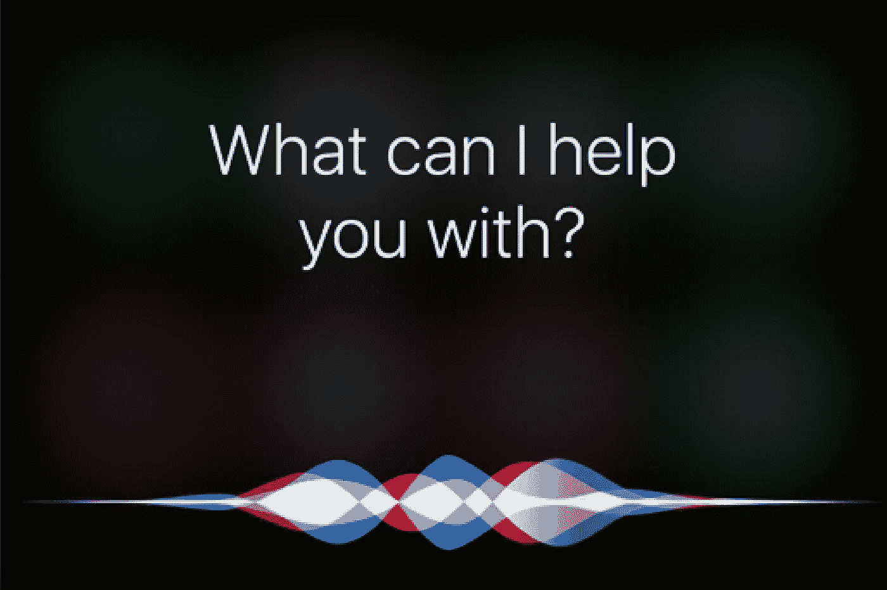

# 如何使用 SIRI 录制音频或视频

> 原文：<https://medium.com/hackernoon/how-to-use-siri-to-record-audio-or-video-1b46d8102f8e>

你对尝试使用 SIRI 来录制自己的声音感到恼火吗？如果你不得不绕开 SIRI 的转录限制，转储想法或口述对电子邮件的回复会变得很费力。

也许你和我一样，我想出的想法都是如此短暂和“在那一刻”，以至于处理 SIRI 的纪律只是扼杀了机会。组织、表达和重复的纪律。以及等待 SIRI 是否听到你说话的痛苦。

我发现了一种变通方法，下面是我的做法:

在 iPhone 上:

“嘿 Siri”
“丁克”
“录制”
****iPhone 开始录制带音频的视频****
我说话
我必须使用 iPhone 屏幕才能停止录制但它有效！

在苹果手表上

**长按 crown 调用 SIRI*****
“丁克”
“录音”
出现红色录音按钮。
我按它。
开始录音。
完成后，会出现一个停止按钮，提示我结束录制。

如果你现在尝试，很可能对你不起作用。那么它对我有什么作用呢？

嗯，我偶然发现了一些非常简单、有效和容易使用的东西…我从来没有见过其他人使用它，所以我想应该分享一下，希望你能和我一样沮丧。

SIRI 的一个经常未使用的功能是，它可以只使用应用程序名称来打开应用程序。所以这里有一个窍门…如果你找到一个名为“record”的音频或视频 iOS 或 watch 应用程序，那么 SIRI 会打开它并运行它，就像它是一个通用的 SIRI 指令一样。

在上面描述的 iPhone 应用程序中，我使用了具有自动录制功能的“录制”应用程序。这意味着当你打开它时，它会立即开始录制视频，直到你结束录制。这很适合我，因为我经常使用 Record 应用程序来捕捉想法或电子邮件听写，以便稍后转录到 Evernote 或电子邮件。

就 Apple Watch 而言，我安装了一款名为 Record 的手表应用，它只能录制音频。它保存在本地，然后自动备份到你的 iPhone，所以它的工作很棒。

我有一个私人助理，所以我与她分享录制的听写内容，她替我接手…但是即使你在做自己的转录，能够有意识的流动而没有技术的阻碍也是如此美妙。作为一名发明家，我总是会有一些灵感和直觉，如果不能立即捕捉到，它们就会消失，所以这对我来说是一个重要的工具。希望你也能使用它。

更新:只是想补充一下，我使用的两个快速录制应用是“只需按下录制”(在你的主屏幕和使用 Siri 时显示为简单的“录制”)和“快速录制”。谢谢，接得好，达诺·李。

https://itunes . apple . com/au/app/just-press-record/id 1033342465？mt=8