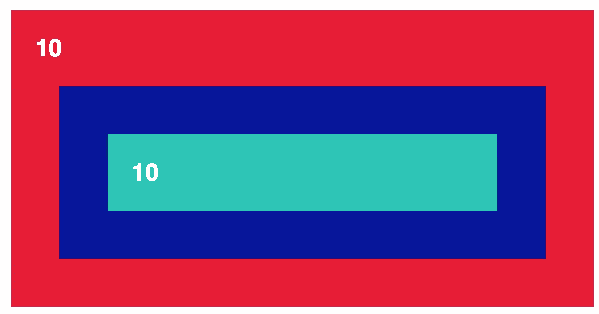
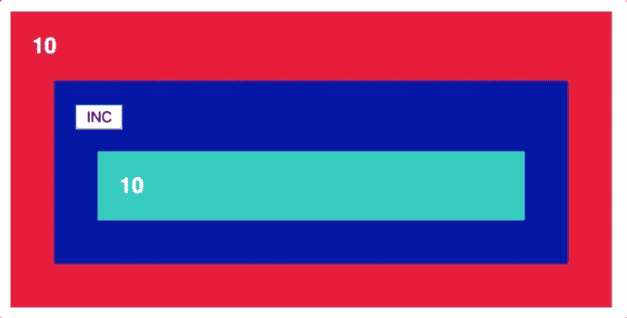

# 如何使用新的 React 上下文 API

> 原文：<https://medium.com/hackernoon/how-to-use-the-new-react-context-api-fce011e7d87>


您是否曾经将一个属性传递给一个 React 组件，只是为了能够将它传递给该组件的一个子组件？这正是新的 [React 上下文 API](https://reactjs.org/docs/context.html#api) 试图解决的问题。

# 更喜欢视频？

更喜欢视频教程？我把这个教程也制作成了视频，可以在下面找到:

*有兴趣学习更多关于 React 和 Javascript 的知识吗？* [*注册我的邮件列表*](http://www.js-craft.io/newsletter/) *这样我就可以和你分享接下来的截屏和教程了！*

# 问题？

例如，在下面的例子中:
-我们有一些数据，即值为 10 的数字
-我们需要红色组件中的数据，也需要绿色组件中的数据
-绿色组件是蓝色组件的子组件，蓝色组件是红色组件的子组件
-因此，最有可能的是，我们需要将数据从红色组件发送到蓝色组件，以便能够将其发送到绿色组件



React Context API Example

在这一点上，我们的代码应该是这样的:

```
const Green = (props) => (
  <div className="green">{props.number}</div>
)const Blue = (props) => (
  <div className="blue">
    <Green number={props.number} />
  </div>
)

class Red extends Component { state = {
    number : 10
  } render() {
    return  <div className="red">
      {this.state.number}
      <Blue number={this.state.number} />
    </div>
  }
}
```

我们必须将数据发送到蓝色组件，以便将其“深化”到绿色组件。这是一个简单的例子。想象一下，如果我们有十级亲子 React 组件，会发生什么？

直到 React 16.3，像这样的问题的标准解决方案是 Redux 或 Mobx 或任何其他处理状态管理的库。但是现在，我们已经将解决方案嵌入到 React 中。

# 解决方案:用 React 上下文进行状态管理？

React Context 允许我们定义数据存储，并在需要的地方访问它们。我们不再需要通过属性传递数据。使用 React Context，我们可以定义类似“应用程序全局状态”的东西，并在需要的地方使用这些数据。

# 如何使用 React 上下文？

将 React 上下文设置到应用程序中有两个主要步骤。设置一个**上下文提供者** &定义你想要存储的数据
2。当您需要来自商店的数据时，使用**上下文消费者**

为了创建上下文提供者，我们需要通过 React.createContext 创建一个上下文。

```
const AppContext = React.createContext()
```

新创建的 AppContext 将用于构建上下文提供程序组件。该提供程序将在其状态中存储我们需要的数据，并将包装红色组件的所有内容:

```
class AppProvider extends Component {
  state = {
    number : 10,
  }render() {
    return <AppContext.Provider value={this.state}>
    </AppContext.Provider>
  }
}

//...

class Red extends Component {
  render() {
    return  <AppProvider> 
        <div className="red">
          <Blue />
        </div>
    </AppProvider>
  }
}
```

长话短说:通过将所有东西包装在这个 AppProvider 中，我们可以在需要的地方轻松地注入来自 **value** 属性的数据。鉴于 AppProvider 将被用作包装组件，在 render 方法中使用{ [this.props.children](http://www.js-craft.io/screencast/18-01-17-ReactJS-example-using-the-React-Children-object/) }非常重要。

现在，安装了提供者之后，如果我们想从提供者那里访问一些数据，我们可以很容易地使用上下文消费者。

```
<AppContext.Consumer>
      {(context) => context.number}
</AppContext.Consumer>
```

我们添加到 AppContext 的 value 属性中的所有数据。现在，arrow 函数的 context 参数使 Provider 可用。

此时，我们的代码将如下所示:

```
const AppContext = React.createContext()class AppProvider extends Component {
  state = {
    number : 10
  }render() {
    return <AppContext.Provider value={this.state}>
      {this.props.children}
    </AppContext.Provider>
  }
}const Green = () => (
  <div className="green">
      <AppContext.Consumer>
        {(context) => context.number}
      </AppContext.Consumer>
  </div>
)const Blue = () => (
  <div className="blue">
    <Green />
  </div>
)

class Red extends Component {
  render() {
    return  <AppProvider> 
        <div className="red">
          <AppContext.Consumer>
            {(context) => context.number}
          </AppContext.Consumer>
          <Blue />
        </div>
    </AppProvider>
  }
}
```

请注意，我们不再将数字属性传递给蓝色组件或绿色组件。所有这些数据现在都由 React 上下文机制处理。

# 在 React 上下文中使用操作和修改数据

除非你正在开发一个非常基础的应用程序，否则你需要一种方法来更新/改变来自 React 上下文的数据。最小的例子可以是一个按钮，它将从我们的数据中增加数字。



React context change data

我们需要的是 Mobx 或 Redux 动作的替代品。

这是很容易实现的。我们要做的是在 AppProvider 上下文的状态上定义一个函数，并对状态数据进行所需的更新。

```
class AppProvider extends Component { state = {
    number : 10,
    inc: () => {
      this.setState({number: this.state.number + 1})
    }
  }
  //...}
```

定义好动作后，我们可以通过 AppContext 使用它。消费者，并在 onClick 事件中调用它:

```
const Blue = () => (
  <div className="blue">
    <AppContext.Consumer>
        {(context) => <button onClick={context.inc}>INC</button>}
      </AppContext.Consumer>
    <Green />
  </div>
)
```

我们最终的代码看起来会像这样:

```
import React, { Component } from 'react'const AppContext = React.createContext()class AppProvider extends Component { state = {
    number : 10,
    inc: () => {
      this.setState({number: this.state.number + 1})
    }
  } render() {
    return <AppContext.Provider value={this.state}>
      {this.props.children}
    </AppContext.Provider>
  }
}const Green = () => (
  <div className="green">
     <AppContext.Consumer>
        {(context) => context.number}
      </AppContext.Consumer>
  </div>
)const Blue = () => (
  <div className="blue">
    <AppContext.Consumer>
        {(context) => <button onClick={context.inc}>INC</button>}
      </AppContext.Consumer>
    <Green />
  </div>
)
```

React 16.3 Context API 仍处于早期阶段，如果您使用状态管理库的唯一目的是避免钻取，它可以用作传统状态管理的替代方法。

我希望这篇文章对你有帮助！如果你想在 React、Mobx 和 Javascript 领域学习其他东西，请告诉我。

*有兴趣学习更多关于 React 和 Javascript 的知识吗？* [*注册我的邮件列表*](http://www.js-craft.io/newsletter/) *这样我就可以和你分享接下来的截屏和教程了！*