# 如何使用 Vue.js 开发工具

> 原文：<https://medium.com/hackernoon/how-to-use-the-vue-js-devtools-3288b789b85d>

> 有兴趣学习 Vue.js？在 vuehandbook.com 获得我的免费电子书

当你第一次尝试使用 Vue 时，如果你打开浏览器开发者[工具](https://hackernoon.com/tagged/tools)，你会发现这条消息:“*下载 Vue Devtools 扩展以获得更好的开发体验:*[*https://github.com/vuejs/vue-devtools*](https://github.com/vuejs/vue-devtools)”

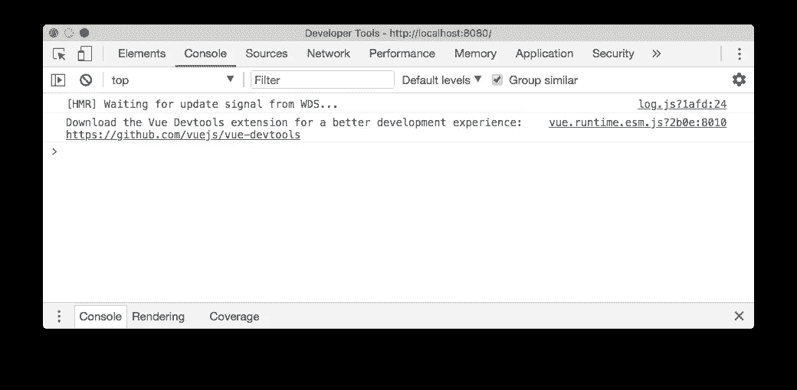

这是一个安装 **Vue Devtools 扩展**的友好提示。那是什么？任何流行的[框架](https://hackernoon.com/tagged/framework)都有自己的 devtools 扩展，它通常为浏览器开发者工具添加一个新的面板，比浏览器默认提供的面板更加专业。在这种情况下，面板将让我们检查我们的 Vue 应用程序并与之交互。

在构建 Vue 应用时，这个工具将是一个惊人的帮助。开发人员工具只能在 Vue 应用程序处于开发模式时检查它。这确保了没有人可以使用它们来与你的生产应用程序交互(并且会使 Vue 更有性能，因为它不必关心 devtools)

我们来装吧！

安装 Vue 开发工具有三种方式:

*   在 Chrome 上
*   在 Firefox 上
*   作为独立的应用程序

自定义扩展不支持 Safari、Edge 和其他浏览器，但使用独立应用程序，您可以调试在任何浏览器中运行的 Vue.js 应用程序。

# 安装在 Chrome 上

进入谷歌 Chrome 商店的这个页面:[https://Chrome . Google . com/web Store/detail/vue js-dev tools/nhdogjmejiglipcpnnnanhbledajbpd](https://chrome.google.com/webstore/detail/vuejs-devtools/nhdogjmejiglipccpnnnanhbledajbpd)点击**添加到 Chrome** 。

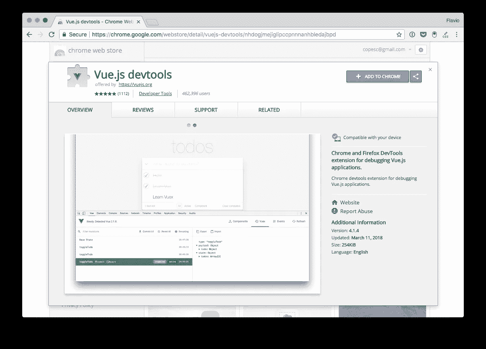

完成安装过程:

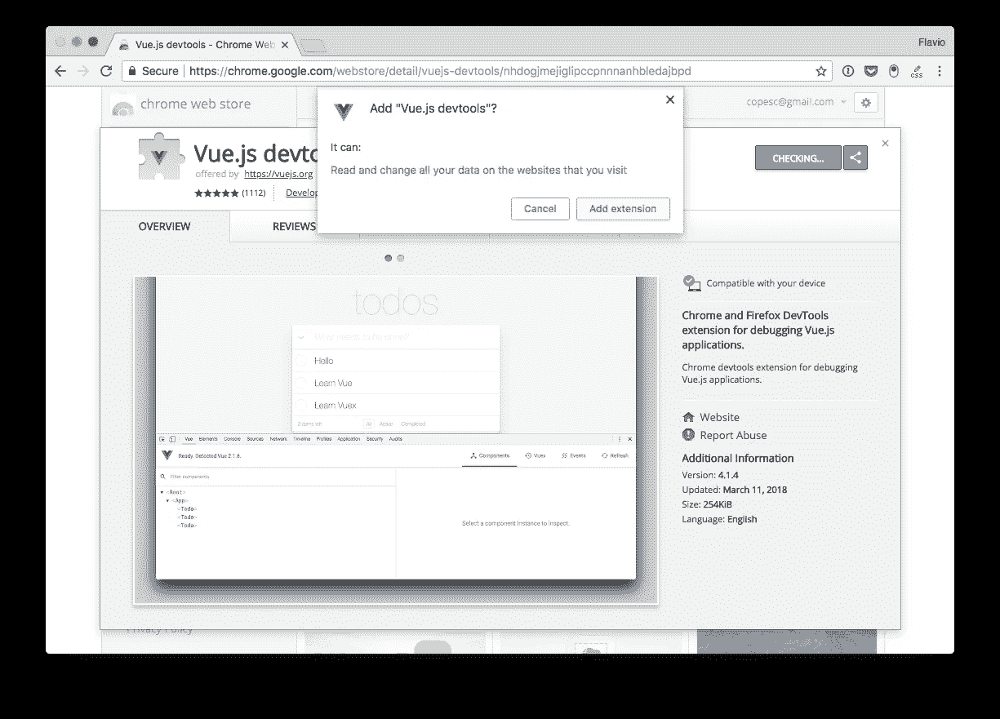

Vue.js devtools 图标显示在工具栏中。如果页面没有运行 Vue.js 实例，它将呈灰色显示。

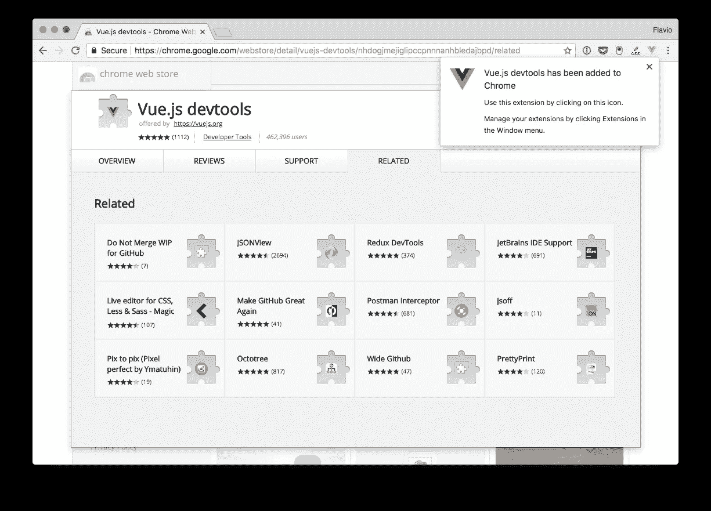

如果检测到 Vue.js，图标会显示 Vue 徽标颜色。

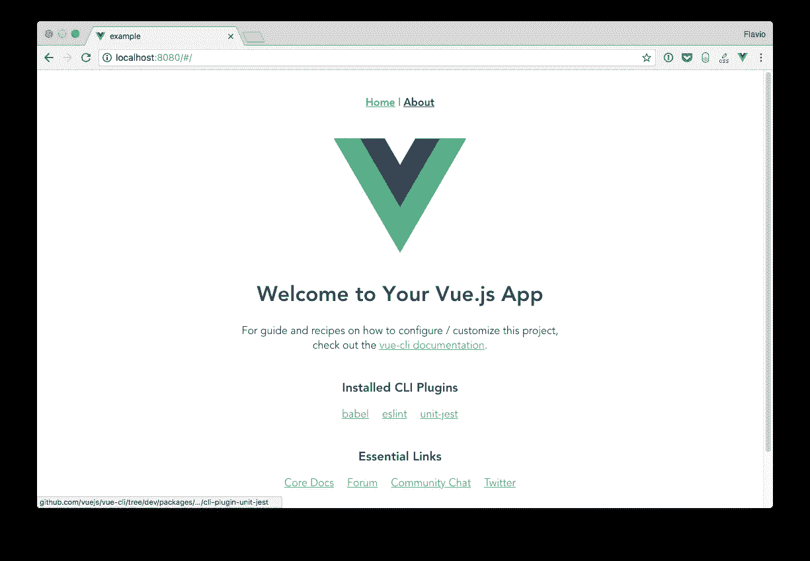

该图标除了向我们显示*有一个*vue . js 实例之外什么也不做。要使用 devtools，我们必须使用“视图→开发人员→开发人员工具”或`Cmd-Alt-i`打开开发人员工具面板

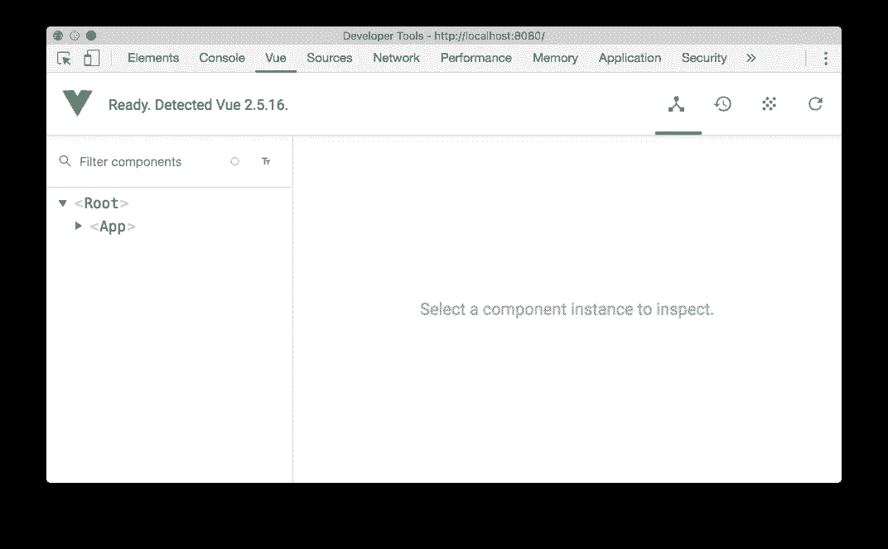

# 在 Firefox 上安装

你可以在 Mozilla addons 商店找到 Firefox dev tools 扩展:[https://addons . Mozilla . org/en-US/Firefox/addon/vue-js-dev tools/](https://addons.mozilla.org/en-US/firefox/addon/vue-js-devtools/)

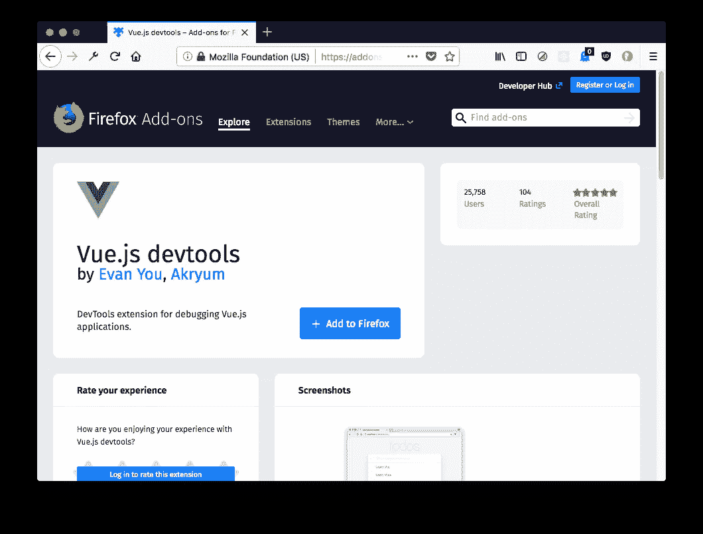

点击**添加到火狐**，扩展将被安装。和 Chrome 一样，工具栏中会出现一个灰色图标

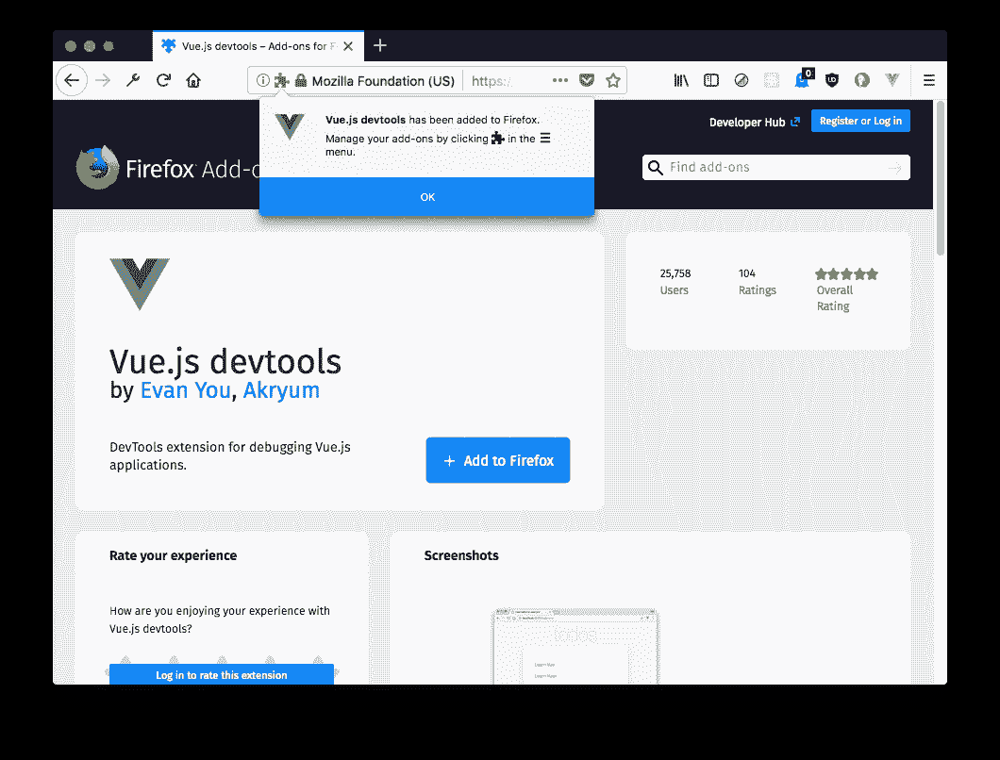

当你访问一个有 Vue 实例运行的站点时，它会变成绿色，当我们打开开发工具时，我们会看到一个" **Vue** "面板:

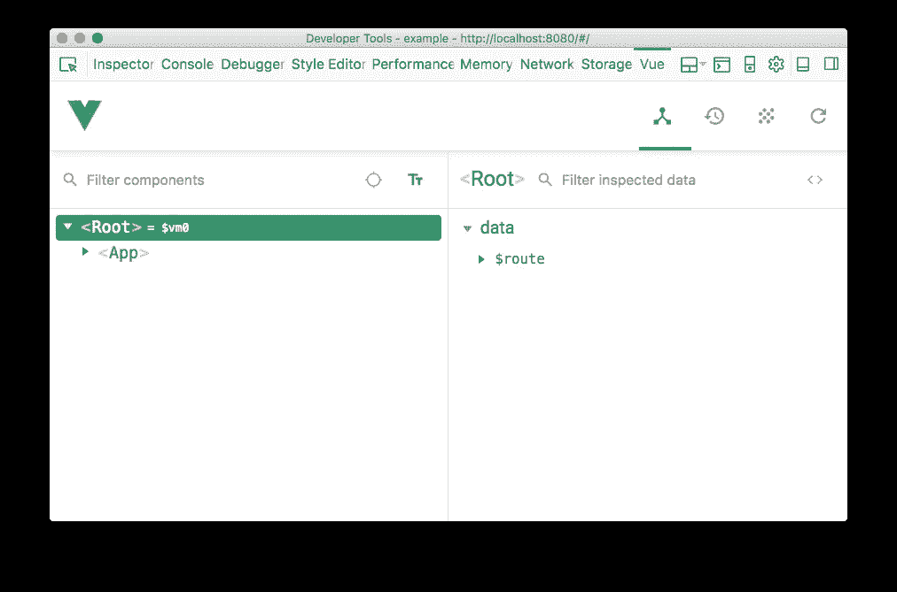

# 安装独立应用程序

或者，您可以使用 DevTools 独立应用程序。

简单地安装它使用

```
npm install -g @vue/devtools //or yarn global add @vue/devtools
```

并通过调用来运行它

```
vue-devtools
```

这将打开独立的电子应用程序。

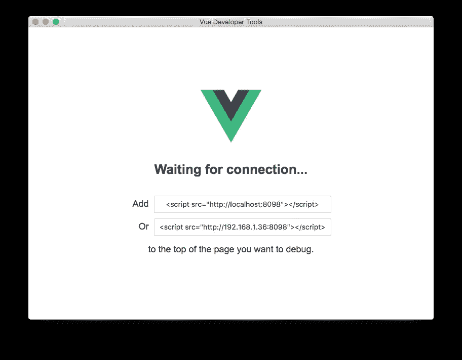

现在，粘贴它向您显示的脚本标记:

```
<script src="http://localhost:8098"></script>
```

项目`index.html`文件内，等待 app 重新加载，会自动连接 app:

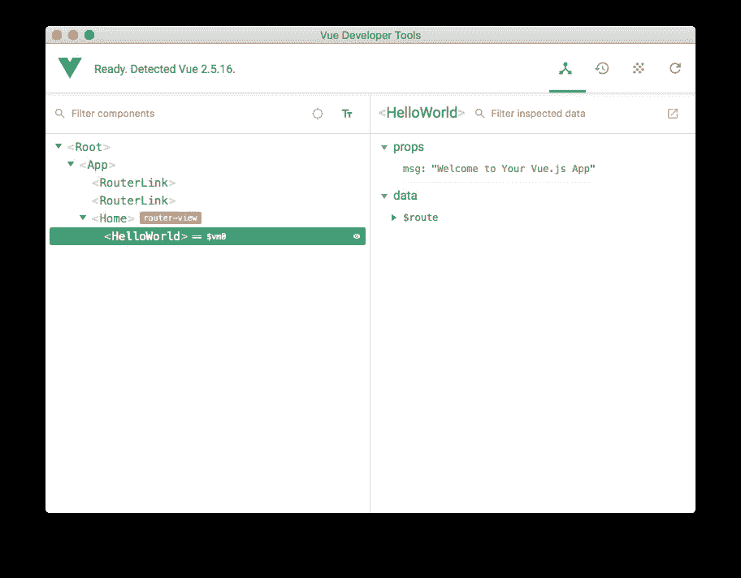

# 如何使用开发者工具

如前所述，可以通过在浏览器中打开开发工具，并移动到 Vue 面板来激活 Vue 开发工具。

另一个选项是右键单击页面中的任何元素，然后选择“检查 Vue 组件”:

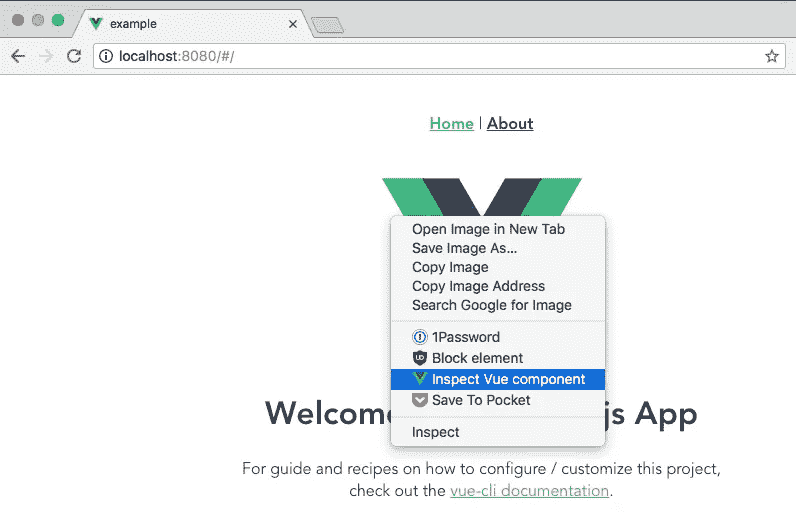

当 Vue DevTools 面板打开时，我们可以导航组件树。当我们从左边的列表中选择一个组件时，右边的面板会显示它包含的属性和数据:

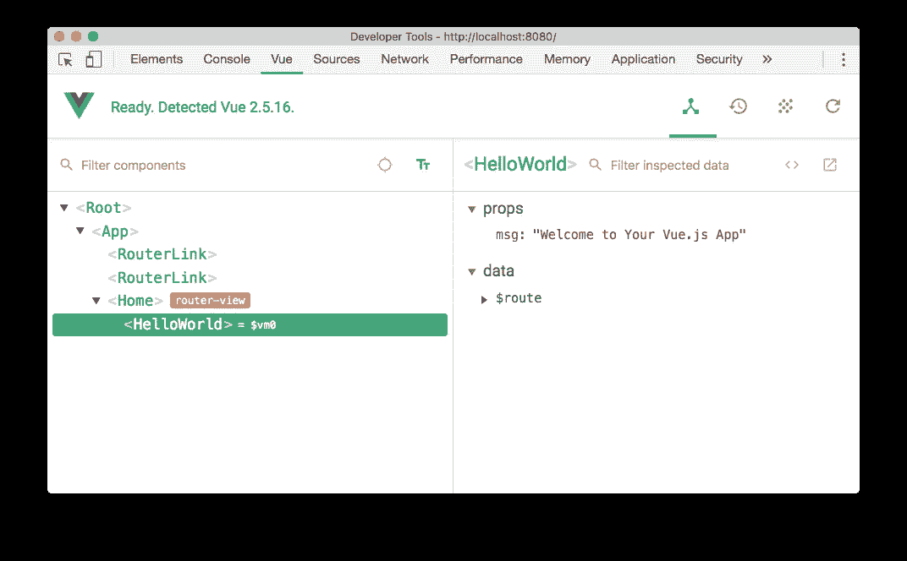

顶部有 4 个按钮:

*   **组件**(当前面板)，列出当前页面运行的所有组件实例。Vue 可以同时运行多个实例，例如，它可以用单独的轻量级应用程序管理您的购物车小部件和幻灯片。
*   Vuex 是您可以检查通过 Vuex 管理的状态的地方。
*   **事件**显示所有发出的事件
*   **刷新**重新加载开发工具面板

注意到组件旁边的小文本了吗？这是一种使用控制台检查组件的简便方法。按“esc”键会在 devtools 的底部显示控制台，你可以输入`$vm0`来访问 Vue 组件:

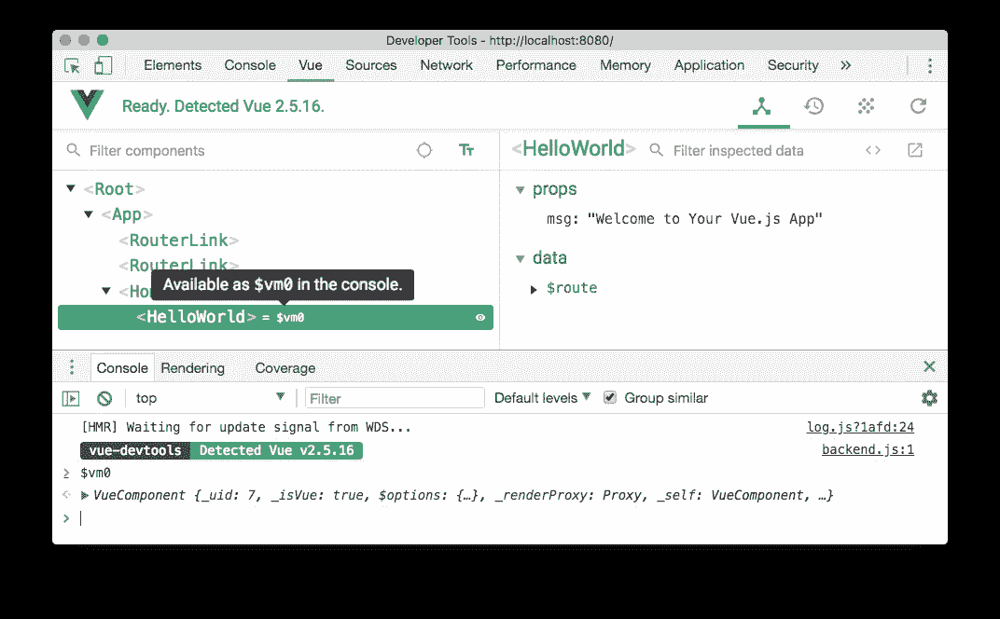

这是非常酷的检查和与组件交互，而不必在代码中将它们赋给一个全局变量。

# 过滤器组件

开始输入组件名，组件树将过滤掉不匹配的组件。

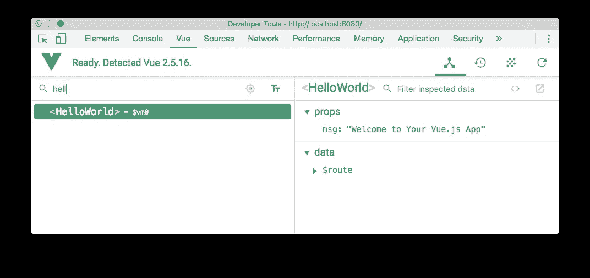

# 在页面中选择组件

单击


按钮，你可以将鼠标悬停在页面中的任何组件上，单击它，它将在 devtools 中打开。

# 格式化组件名称

您可以选择在 camelCase 中或使用破折号来显示组件。

# 过滤检查的数据

在右侧面板中，您可以键入任何单词来过滤不匹配的属性。

# 检查 DOM

单击 Inspect DOM 按钮，进入 DevTools 元素检查器，组件会生成 DOM 元素:

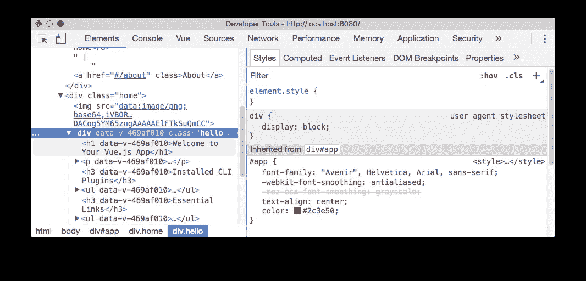

# 在编辑器中打开

任何用户组件(不是框架级组件)都有一个按钮，可以在默认编辑器中打开它。非常方便。

我将全职学习 Vue 个月，并且**我将为你**创建一个资源来快速学习它，包括教程和项目、工作示例和**截屏**。我会把我创作的**免费内容**发给你👨🏼‍💻我会让你了解课程的最新情况，并在课程发布时给你一个大折扣。呆在圈子里！

> 有兴趣学习 Vue.js？在 vuehandbook.com[获得我的免费电子书](https://vuehandbook.com)