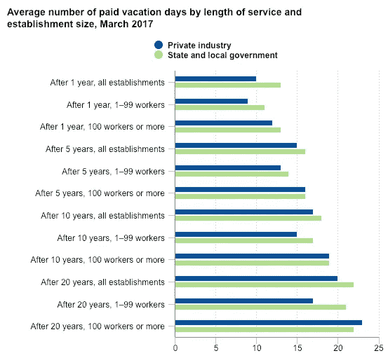
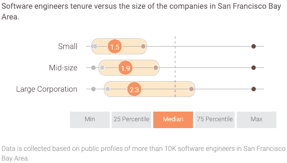
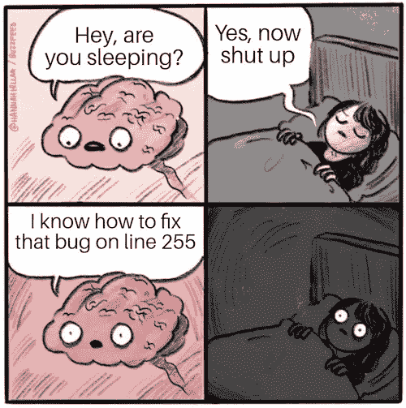

# 如何利用无限的休假时间并全身而退

> 原文：<https://medium.com/hackernoon/how-to-use-unlimited-time-off-and-get-away-with-it-d810a27ceca6>

## 在“无限”PTO 的地图绘制不佳的水域中航行的技巧

Photo by [Josh Newton](https://unsplash.com/photos/5D9SyUI3wHU?utm_source=unsplash&utm_medium=referral&utm_content=creditCopyText) on [Unsplash](https://unsplash.com/search/photos/time-off?utm_source=unsplash&utm_medium=referral&utm_content=creditCopyText)

如今，初创公司(以及试图成为初创公司的公司)正在四处兜售许多时髦的福利，包括从谷物棒到健身房会员资格再到午睡室的一切。无限 PTO 的承诺也经常被混淆。大多数智人天生就知道如何使用谷物棒；然而，虽然无限假期在理论上看起来不可思议，但作为一名员工很难从中获得最大价值。

有很多内容在权衡无限 PTO 的利弊，但大多数普通的程序员、设计师、产品负责人、经理等实际上从未参与过休假政策是如何制定的。一旦做出了决定，员工们通常会被丢下不管，自生自灭。

也许你最近已经接受了或者正在考虑接受一个软件商店的职位，并且有奢华的假期福利。也许你的公司刚刚开始提供无限假期。无论你的情况如何，如果这样的计划对你来说是新的，“无限制”也可能意味着“恐吓”

我已经为几家提供无限休假的公司工作过了，这里是我在工作过程中得到的一些建议，让我可以充分利用这些时间。

# 1.自己预算和跟踪 PTO

要成功利用无限休假政策，你必须消除“无限”的歧义当 BaseCamp 试验无限休假时，他们发现焦虑*增加了*，因为没人知道“无限”是什么意思。(如果你想知道更多关于他们的故事，请阅读。)如果你想要没有压力的灵活性，你可以自己选择一个数字，然后记录下你不在办公室的时间。

每当我有无限 PTO 的特权时，我总会保留一个电子表格来记录我的时间。作为一个数据迷，我还会计算各种指标，比如平均休假时间、每年的滚动平均值以及其他不同价值水平的统计数据。额外的收获是，看电子表格比看一个从 90 年代末窃取设计灵感的人力资源门户网站要稍微不那么引人注目。

但这一切仍然没有回答最初的问题。如果你应该选择你自己的号码，那个号码应该是多少？

让我们把无限的概念发挥到极致。如果每个人每年休假 364 天会怎么样？显然，这是行不通的。想想企业是如何运作的:他们提供价值，顾客提供金钱。与此同时，员工为企业提供价值，企业以薪水作为回报。换句话说，如果员工不为企业提供价值，那么企业就不能为客户提供价值，所有人都是输家。如果你 100%的时间都在度假，你就无法提供价值。因此，“无限”不等于“无限”

让我们走向另一个极端。如果没有人休假呢？对休息的需求是人类与生俱来的。这就是为什么我们睡觉、过周末、做白日梦、在工作中谈论与工作无关的事情，以及有一段时间处于“最佳状态”哦，还有为什么我们需要休假。总是被限制在红线内会导致精疲力尽。因此，“无限制”不等于“不存在”

所以，你需要选择一个介于每年 0 到 365 天之间的数字。👍

好吧，这个范围不是很有帮助，所以让我们看看一些真实的数据来帮助我们做出明智的决定。为了让我们开始，这里有一份来自 2017 年劳动统计局的报告。

[From the Bureau of Labor Statistics](https://www.bls.gov/opub/ted/2018/private-industry-workers-received-average-of-15-paid-vacation-days-after-5-years-of-service-in-2017.htm)

来自报告:“平均而言，员工在服务 1 年后获得 10 天带薪休假。随着与当前雇主的任期增加，带薪休假天数略有增加。5 年后，员工平均获得 15 天带薪假期。他们 10 年后平均收到 17 天，20 年后平均收到 20 天。”

这些数字涵盖了很多行业，不仅仅是软件。一家软件公司的平均任期不到一家“非技术”公司的一半。这对于一个拥有高需求技能的开发者来说有点不公平。事实上，公司提供无限 PTO 的原因之一是为了在低失业率和高价值候选人的市场中具有竞争力。

Image from [Hackerlife.co](https://hackerlife.co/blog/san-francisco-large-corporation-employee-tenure)

看看这份湾区软件公司的报告。

简单地说，开发人员经常搬家。出于这个原因，我通常根据我在这个行业的年数来预算我的 PTO，而不仅仅是在一家公司的年数。第一年我通常会轻松一些，但之后会根据行业经验开始做预算。

所以“无限制”就是公司不设限制；但是，从实际意义上来说，总有一个数。你有为自己设定的特权。四处逛逛，做点研究。了解美国和全球行业的趋势。以这种方式安排时间需要一些练习，但是做得好的回报是值得的。

# 2.利用“可替代时间”

相对而言，8 小时工作制是一个新概念。几千年来，我们人类一直在工作。想象一下一个自由职业的狩猎采集者，没有手机，只是活在当下。当狩猎和采集到适量的食物时，一天的工作就结束了。

一件事引发了另一件事，在 19 世纪后期，美国开始实行 8 小时工作制，世界其他地方也在这之前或之后开始实行。

所有此类劳动法的核心是保护工人的目标，我认为这很棒。但是任何软件开发人员或其他“思想工作者”都知道，创造力并不局限于一天中的 8 个小时。我的一些最好的突破发生在深夜，开车的时候，洗澡的时候，甚至是做梦的时候。这并不意味着我很了不起，只是意味着我很正常。

取决于你的人力资源部门如何写你的休假政策，“无限”休假也可以翻译成“[可替换](https://en.wikipedia.org/wiki/Fungibility)时间”。如果你给自己一年安排了 4 周的假期，那就意味着你全年 48 周每天平均工作 8 小时。虽然绝不熬夜或凌晨 3 点起床扑灭服务器大火是一个崇高的目标，但生活充满了不完美。可替换时间让员工可以自由地在创造性爆发或季节性活动高峰期疯狂工作一周，然后休息几天。

在几周的时间里，你应该保持每天 8 小时左右的滚动平均值。如果你工作得更多，你会筋疲力尽。如果你工作得少，你应该把天数算作“假期”。在我的电子表格上，我记录了几周的“负面”时间，我在办公室花了额外的时间，或者熬夜敲定一个工作项目。这就很容易决定我是否以及何时应该在合理的情况下计算半天或两天。

最后要注意的一点是向前推进工作，而不是倒退。换句话说，不要在工作中偷懒，同时记住下周要更加努力地工作。这只会增加不必要的压力。不要向未来借时间，享受过去的时光。

# 3.你必须了解业务需求和优先级

到目前为止，一切都是相对不可知的。但事实是，员工是一个更大团队的一部分，有自己的需求和优先事项。当公司的最后期限开始临近时,“无限制”的休假并不是一种放弃的许可。

弹性休假政策的部分价值在于，它们如何激励员工理解他们的日常工作如何适应整体业务。利用这一点。了解你部门之外的人。了解他们面临的挑战。前几天，我和一位销售部门的同事聊天。当我们接近年底时，公司的技术部门会专注于让所有的系统照常运转，因为团队的各个成员都会享受他们应得的休假。我从未真正考虑过销售人员在试图达成交易时所面临的挑战，而他们的潜在客户却在享受他们应得的休假。

如果你了解你的公司是如何运作的，那么就更容易知道什么时候真正需要你，什么时候你可以离开。这个知识的一个副作用是，你不仅能更好地理解你应该在什么时候工作，还能更好地理解你应该在做什么。

知道是什么让公司运转起来总是一件好事，但人们如何弄清楚呢？如果你想打开引擎盖，看看一家公司是如何运作的，只要跟着钱走就行了。客户是谁？他们为什么从我们这里购买？他们要求什么产品？为什么他们会为了别人离开我们？我们如何在公司内部投资现金？我们购买什么样的基础设施？我们购买什么服务来使公司运转？谁投资我们公司，为什么？这些都是开发人员自然不会问的问题，但它们拉回了通常覆盖业务需求和优先级的战争迷雾。

# 4.把它想成“员工所有”而不是“无限制”

我想有一个年度奖项是颁给最超卖的额外津贴的。例如，我工作过的一个地方号称“厨房里堆满了零食！”原来是一个硬皮小冰箱，里面放着半满一桶冷冻烤焦的冰淇淋。或者“无限量免费咖啡！”这是世界上最好的泡菜。

“无限制”是一个吸引潜在候选人的灵活度假计划的好方法。在所有条件都相同的情况下，如果我必须在“无限量谷物棒”和“竞争性谷物棒”之间做出选择，我肯定会毫不犹豫地选择无限量的谷物棒，尽管我和大多数人一样，实际上无法消费无限量的谷物。

The unlimited cereal bar at [Pixar Animation Studios](http://www.disneyfoodblog.com/2012/04/10/backstage-peek-pixar-animation-studios-cereal-bar/)

在我人生的这个阶段，我已经搬出去住了，长大了，总的来说知道如何在没有监督的情况下生活。当有人给我无限量的麦片时，我不会狼吞虎咽，直到生病。也许在初中的时候，我会把自己吃成 Fruit Loop 昏迷状态，但那些日子已经过去了。

适用于谨慎消费零食的相同原则也适用于合理的休假消费。你不需要被告知你一天可以喝多少“无限量”的咖啡，为什么你需要被告知多少 PTO 是合适的？每个人的个人需求都是不同的，如果公司设定硬性的限制，那就太奇怪了。这是员工个人需要能够拥有和自我管理的东西。

如果你的雇主已经委托给你无限假期的特权，不要辜负他们的信任。如果你以前从未管理过自己的 PTO 限额，这可能会很困难。如果是这样的话，寻求帮助并不可耻。与同事或经理谈论他们的工作，并以此为起点。然后，当你进入最佳状态时，请随意适应。

# 5.用它！

最后，事实证明[无限带薪休假的员工实际上比那些有传统 PTO 计划的员工花更多的时间在办公室。一种理论是，员工害怕跨过这条线，但并不总是知道这条线在哪里。结果是过于谨慎，休假时间减少。](https://www.paperplanes.de/2014/12/10/from-open-to-minimum-vacation-policy.html)

为了克服这一点，正如我之前提到的，为自己设定一个 PTO 预算，然后记得休假！在一年或一个季度开始的时候坐下来，在你的日历上写下一些日期。在圣诞节和元旦之间的一周，我尽量和家人呆在一起。我们也喜欢在夏天离开一两个星期。随着生活的发生，剩下的就是到处休假。

如果你不觉得你可以在不使世界崩溃的情况下逃脱，那么你需要减少你的[公交因素](https://en.wikipedia.org/wiki/Bus_factor)。但是，不要等到筋疲力尽的时候才开始计划如何休息。

投入时间在你的团队中分享你的知识。其中一部分是学习如何[写好文档](https://hackernoon.com/write-good-documentation-6caffb9082b4)。以书面形式分享你的专业知识可以防止别人直接依赖你和你的大脑。当你不是唯一一个知道如何重启一台服务器而不破坏一切的人时，你会觉得离开一周左右会舒服得多。

对于资深开发者来说，要学会[开发多于代码](https://hackernoon.com/how-to-be-a-leader-in-the-software-industry-b7e31bc9bc4)。随着你在团队中的影响力越来越大，你增加的价值越来越少来自于你自己的能力，更多来自于你如何帮助他人。帮助别人理解如何做你的工作不会让你变得过时，而是让你变得无价。它能让你在需要的时候逃脱。

这篇文章并不是要取代常识或者理解你自己公司的休假政策。如果您有任何问题或疑虑，请与您的人力资源团队成员交流。

我很高兴能够在帮助开发者和企业善待彼此方面发挥一点作用，我希望这些信息对你有用。如果你看到了任何充分利用办公室以外时间的技巧或诀窍，我很想听听。和往常一样，如果你喜欢这篇文章，请随时给它一个👏还是两个！