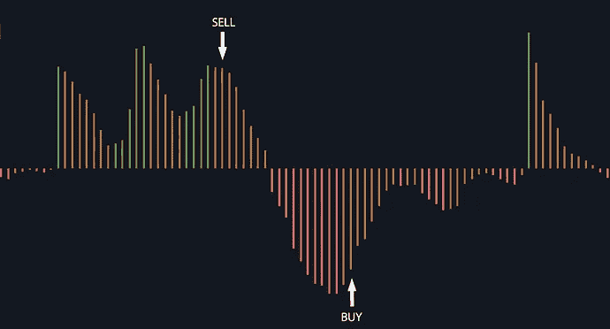
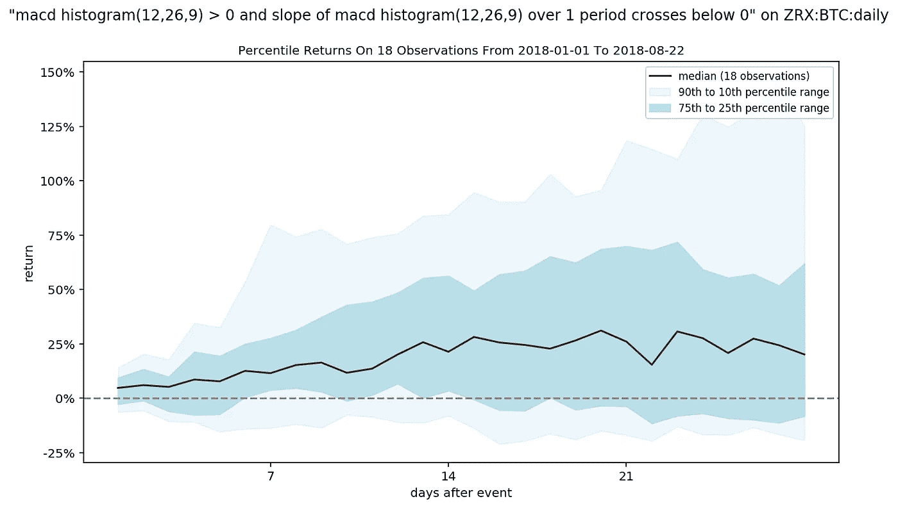

# 使用 Gatsiva API 验证加密货币交易策略

> 原文：<https://medium.com/hackernoon/how-to-validate-a-crypto-trading-strategy-bfeda73c1d55>

我们如何使用 Gatsiva API 评估 0x (ZRX)的交易策略的用例及演练。

Photo by Ylanite Koppens from Pexels

在 [Gatsiva](https://gatsiva.com) ，我们已经将机器学习应用于股票、外汇和最近的加密货币市场超过 15 年。我们提供了一个 API，通过利用技术分析生成买入或卖出信号，帮助[加密货币](https://hackernoon.com/tagged/cryptocurrency)交易者在交易中变得更加自信。

在本文中，我们展示了我们的一个合作者如何使用 Gatsiva API 来增强对 0x (ZRX)交易方法的信心。

## 提议的战略

我们平台上的一位合作者最近提出了一个问题:MACD 直方图的斜率能否预测加密货币的价格变化？这是否能提供对价格下跌、价格上涨或两者的提前洞察？特别是，这种策略对正在讨论的比特币——以[比特币](https://hackernoon.com/tagged/bitcoin) (BTC)定价的 0x (ZRX)有效吗？

Illustration of MACD Histogram Slope Crossover Strategy

分析的第一步是在[gativa 的自然语言](https://gatsiva.com/docs/#gatsiva-language-definition)中设计条件，用于准确识别这些信号的条件定义。利用条件语言，我们帮助这个合作者指定他们描述的条件来定义策略。这对规则很容易定义如下:

> 规则 1(做空):macd 柱状图(12，26，9) > 0，macd 柱状图(12，26，9)的斜率在 1 个周期内低于 0
> 
> 规则 2 (Long): macd 直方图(12，26，9) < 0 and slope of macd histogram(12,26,9) over 1 period crosses above 0

The second step was to analyze the [条件回报剖面](https://gatsiva.com/docs/#condition-return-profile)。使用我们的 API，我们可以轻松地引入这些回报的数据，并生成以下可视化结果；我们定义的每个条件都有一个。

Rule 1 (SHORT) Percentile Return Profile

Rule 2 (LONG) Percentile Return Profile

这些可视化显示了过去发生上述情况后观察到的回报分布。这些回报显示在多个时间段内(本例中为几天)。那是满嘴的。基本上，可视化显示，对于上述条件，当它们在过去发生时，1 天后价格会发生什么变化？7 天？21 天？在上图中，我们可以看到，长边条件在过去的 19 次中为真，总的来说，以比特币(BTC)定价的 0x (ZRX)价格普遍下降，至少到一个月以后。

另一方面，我们可以看到，当短边条件发生时，基于之前的 18 个实例，以比特币(BTC)定价的 0x (ZRX)价格普遍上涨。同样，至少在大约三周后。

对于我们合作者的交易想法来说，这是一个有趣的结果。他们想要做多分析的条件预测价格下跌，他们想要做空分析的条件预测价格上涨。这两个条件很匹配，但实际结果与我们的合作者所设想的正好相反。运行这一分析是对可能导致损失的提议交易策略的有价值的洞察

> 关于这些置信带图表以及如何创建它们的更详细的解释，可以看看我们之前的文章:[用置信带交易加密货币](https://hackernoon.com/trading-cryptocurrency-with-confidence-bands-cffd523f3e4b)和 [Gatsiva + Python:可视化比特币修正](/@gatsiva/gatsiva-python-visualizing-bitcoin-corrections-7836aab57586)。要直接进入代码，你也可以看看我们的[开源 Python 笔记本](https://github.com/gatsiva/jupyter-notebooks)。

通常 MACD 直方图为正且向下倾斜是超买的迹象。同样，相反的是一个*超卖*情景的迹象。但在这种情况下，以比特币(BTC)定价的 0x (ZRX)的回报曲线恰恰相反。

当 MACD 直方图为正时，斜率向下移动(规则 1)，接下来几天的回报通常会更高，这表明这是一个比短规则更好的长规则。类似地，当 MACD 直方图为负，斜率向上移动时，回报继续为负——表明这是一个比长法则更好的短法则。

**这是 Gatsiva API 的第一个强大功能——在事件发生后显示真实回报的能力**。这有助于支持或快速揭穿交易理念，尤其是那些在股票市场等其他市场上经典有效的交易理念。

## 模拟交易

接下来是交易模拟。在 Gatsiva，我们建立了一个内部交易模拟器，允许我们使用币安的 5 分钟间隔数据来模拟 Gatsiva 条件语言中定义的信号交易。

> 由于我们的主要数据源是 Cryptocompare，因此使用单独的数据源来模拟交易对于最小化数据窥探偏差是必要的，也是通过使用更细粒度的时间片来获得更真实的交易输入体验的一种方式。

我们假设初始投资组合为 10 个 BTC，最多允许同时建立 5 个未结头寸，每个头寸有 20%的可用资本用于新的头寸。最后，我们假设佣金成本为 0.1%。

由于源数据稍微延迟，我们的实际条件信号稍微延迟。此外，在我们的引擎中处理数据和生成信号需要少量时间。这些延迟被构建到我们的模型中，并包含在我们的模拟中，以确保更真实的交易场景。以下规则也包括在我们的模拟中:

Trade Entry Rules

退出标准很简单:应用 15%的跟踪止损和 20%的利润目标，但是持仓时间不要超过 72 小时。随着头寸变得有利可图，模拟会更新跟踪止损。如果止损被触发或者我们达到盈利目标，模拟以目标价格卖出。如果我们达到了最大持有时间，模拟以 5 分钟时间间隔内观察到的开盘价、收盘价和最低价的平均值卖出。这些出场规则适用于多头和空头。

> 注意:当结合我们的头寸规模(15%跟踪止损 x 20%总头寸规模)时，这相当于任何一笔交易总价值的最大 3%损失。

最后，我们选择了 2018 年 1 月 1 日至 2018 年 8 月 9 日(我们进行分析的日期)的数据。这是为了确保在开始技术分析之前，从 0x 开始可以获得一些历史记录。

## 结果呢

0x (ZRX)的总体结果令人印象深刻，如下面的表格和图表所示。我们能够真实地输入我们信号产生的 78%的交易，并获得超过 14%的佣金后利润。在此期间，我们的模拟投资组合曾达到的最低值为 9.81 BTC(约为我们初始资本的-1.9%)。

Table of Simulation Results

Portfolio Value and Open Positions Over Time

P/L of Each Trade

关于模拟交易和时间戳的详细列表，请看看 Github 上的这个[要点。](https://gist.github.com/otbbdeploy/8edc2f20f40e8dee8f4db9b583951995)

## 批评

从这些结果中，我们当然可以预见到许多批评，其中一些是公正的。特别是其中的两个——时间框架选择和硬币选择——我们提供以下内容:

有可能我们选择的时间框架扭曲了结果。请注意，在 2018 年 1 月 1 日至 2018 年 8 月 9 日的模拟期间，0x (ZRX)在 BTC 的整体价格上涨了近 132%。我们必须认识到，这些结果可能只是“幸运”的，我们的结果受益于助跑。

为了测试这一点，我们选择了另一个与 2018 年 8 月 9 日收盘价最接近的时间段，并发现 2018 年 2 月 2 日将是测试我们“运气”的好起点。下面是选择一个相对“平坦”重现期的比较，结果也是正面的。

Comparison of Simulation Results to Flat Time Period

在上表中，我们可以看到，即使是在回报率略有下降的时期，这种策略也产生了积极的结果。

另一个公平的批评是这次模拟选择了 0x (ZRX)而不是更主流的硬币。但是，请记住，在进入该策略之前，我们验证了我们对应用于 0x (ZRX)的 MACD 直方图斜率交叉信号的可行性的假设。

也就是说，有趣的是，在同一时期，以太坊(ETH)、以太坊经典(ETC)和莱特币(LTC)也能观察到类似的结果。

Comparison of Simulation Results to Other Coins

在上表中，我们可以看到，对于 ETH、ETC 和 LTC，我们通过 coin 在混合环境中获得了积极的结果。以太坊和以太坊经典在这段时间内表现相对平淡，但模拟在两种场景下都表现出色。在这段时间里，莱特币的价值损失了 43%,但 MACD 直方图交叉策略在这种环境下的佣金后实际上赚了 3.28%。

在下跌的市场中获得边际收益…我们会接受它，而不是亏钱。

## 将模拟付诸实施

我们可以用这个条件分析和模拟结果做什么？这两个条件已经添加到我们的洞察引擎中，并且随着新的市场数据的产生，现在正在不断地实时重新评估。任何基于我们模型的相关信号都会被反馈给我们的合作者，作为在我们平台上讨论的可用信号。

值得注意的是，这种策略不会在所有情况下对所有硬币都有效。这带来了 Gatsiva 平台的第二个强大功能——持续跟踪和更新哪些信号适用于哪些硬币的能力。通过实时统计工具的仔细应用和验证，这些信号可以成为一个人交易策略的有力补充。

## 对自己策略的工具感兴趣？

来 gatsiva.com 的[访问我们吧，看看我们 API](http://gatsiva.com) 的[文档，开始构建你自己的策略，一定要注册我们的](https://gatsiva.com/docs)[协作平台](https://discourse.gatsiva.com)。我们总是根据合作者的反馈来扩展我们的 API。

最后，如果你喜欢你刚刚读到的:请随意给这篇文章添加书签，鼓掌，或者留下评论！它帮助我们帮助更多的人！