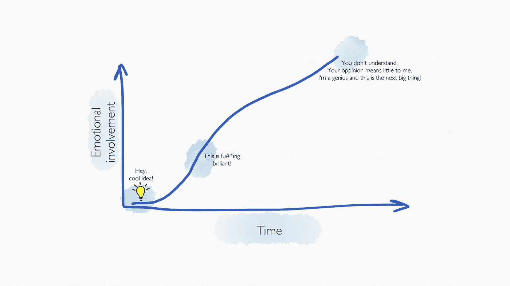
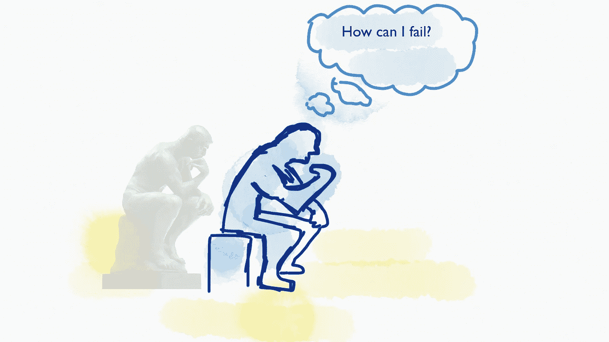
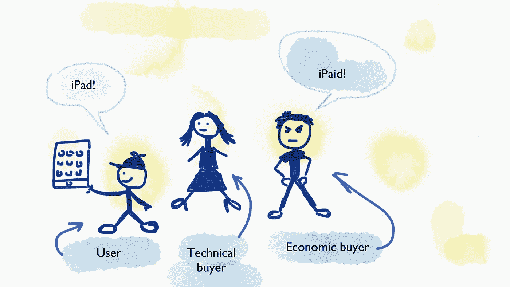
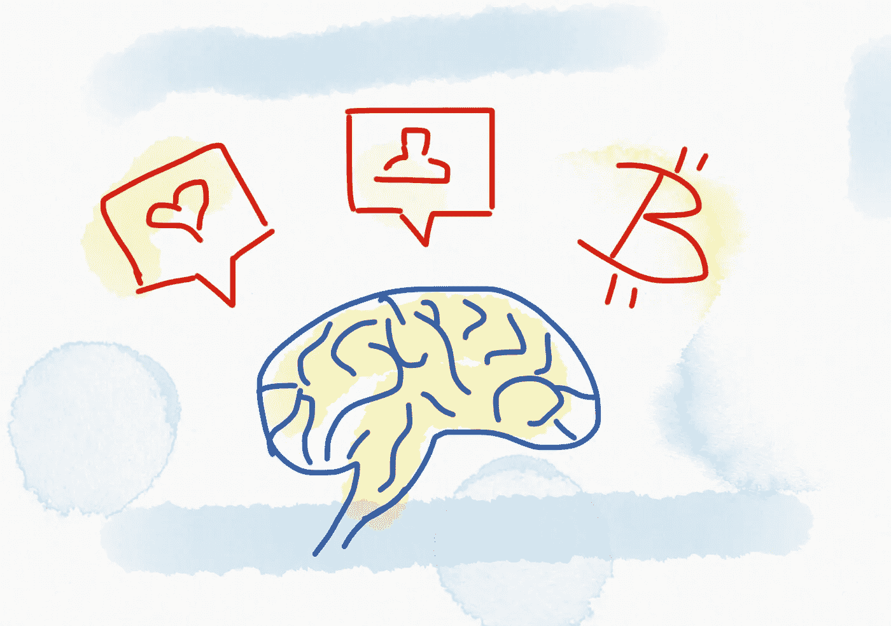

# 在你对一个想法产生感情之前，如何验证它？

> 原文：<https://medium.com/hackernoon/how-to-validate-an-idea-before-you-get-emotionally-attached-to-it-8a493ec2cee>

为什么我们会执着于自己的想法，以及如何在这个过程中保持不偏不倚？通过寻找不确定的证据来预测你的 [*创意*](https://hackernoon.com/tagged/idea) *的成功和商业可行性。快速失败或者到达星星！*

我大部分的啊哈时刻都发生在清晨。想法突然出现在我的脑海中，我必须把它们写下来，否则它们会随着突触火花而消失。

但是在我写下它们之后会发生什么呢？

# 确认偏差

随着时间的推移，每个想法都在演变。你对这个想法想得越多，你的情绪就越激动。这是事实。不管你有多开明，一个关于这个想法可行性的不同意见开始伤害你的感情，你把它当成个人的。

As the time passes by, emotional involvement with the idea gets stronger

这叫做**确认偏差**。我们倾向于精选信息来证实我们现有的信念或想法。这种偏见可能如此强烈，以至于持相反意见的两个人可以看到**相同的** **证据**，并感觉他们的想法被它所证实。但是为了进步，要残酷地对自己诚实，寻找不可信的证据。

> 不确定的证据——证明**证明你现有的观点** **是错误的**的证据——这比确定的证据更有价值。

这和负面反馈是一样的，被认为是建设性的批评。你现在可能想知道为什么你要反对自己的想法。好吧，如果你真的努力证明它是错的，但失败了，那么这个想法可能会变成一些真实而有价值的东西。

如何自己做到这一点？请继续阅读…

# 不可靠的证据

验证一个想法的最好方法是建造你想建造的任何东西。执行力是关键，实际的努力才是最重要的。

> “想法就是游戏，执行就是游戏”——加里·维纳查克

建立原型，写你想了多年的书，或者建立你的直运商店。疯狂工作几个月，实现你的想法。随着时间的推移，现实和市场将验证这一想法。如果它是坏的，周围的世界会用一个巨大的锤子在你的眼睛之间猛击你。啪！然后你意识到你白白浪费了几个月。

等等，等等……肯定有更好的方法来验证我的想法。有。这正是我想要避免的。与其花费几个月的时间，不如想象一个场景，你已经构建好了所有的东西。

Seek for disconfirming evidence instead of confirming evidence

# 更聪明地工作，而不是更努力

创造一个想法已经成为现实的场景，让你思考那些原本会被遗忘的细节。场景的每一步都让你更接近是否应该在执行中投入时间的结论。创造一个场景只需要很少的时间，所以**你没有足够的时间来发展情感投入**，你的决定将是客观的。我使用的场景模板有四个必须解决的主要问题:

1.  **顾客**，
2.  **方案，**
3.  **前一天**和
4.  **后天**。

记住——你必须对自己非常诚实。

## 1.客户

首先，你要知道谁是你的潜在客户。当我说客户时，我指的是**用户**、技术买方**和经济买方**。根据产品或服务的不同，这些角色可以是一个人(B2C)，也可以是几个人，甚至是组织(B2B)。****

用户会接触到你的产品。他们是对你的产品感到满意的人。对他们喜欢什么和需要什么做一点调查。考虑他们的年龄、教育、习惯和偏好。

> 需求:你的产品必须让用户的生活更轻松。

**技术采购员**通常是部门经理(在 B2B [业务](https://hackernoon.com/tagged/business)模式中)。必须说服技术购买者相信产品是必需的，并且它将提高业务或用户的满意度。这次购买的好处必须清楚响亮地传达给用户。

> 要求:产品必须对目标部门有明确的好处。

**经济买家**就是钱袋子的一个实例。这个人正在为产品付费。价格应该在目标群体的购买力范围内。如果你抓住了前两个方面，如果产品的核心价值适合他们，用户和技术购买者将说服经济购买者同意购买。

> 要求:必须有令人信服的购买理由和明确的投资回报。

Customer categories

## 2.解决方法

显然，你必须为某个问题提供解决方案。如果你的解决方案触及了痛点，你就中了大奖。只要确保用户理解产品如何帮助他们克服那个痛点。

> 需求:发现用户的需求。将需求作为目标和棘手问题的组合来解决。通过克服痛点来帮助他们实现目标。

如果你不能解决任何问题，你的产品必须为用户提供某种激励措施。这些激励可以是**金钱**(例如比特币)或**多巴胺**(像 Instagram 这样的上瘾应用)。两者的结合是甜蜜的…

Product incentives — dopamine and money

## 3.前一天

现在你已经确定了你的客户，想象一下他们需要你的产品的场景或情况。用户如何处理今天的问题，问题出在哪里？

我喜欢用这个备忘单来弄清楚在没有我的产品的情况下，用户如何处理特定的任务。拿出一支笔和一张纸，然后填空:

> 场景或情况:_ _ _ _ _ _ _ _ _ _ _ _ _ _ _ _ _ _ _ _

想象用户生活中的一天，想象你的产品对用户行为产生影响的场景。

> 期望的结果:_ _ _ _ _ _ _ _ _ _ _ _ _ _ _ _ _ _ _ _

几乎每个行动都是从形成目标和意图开始的。这些是行动七个阶段的前两个步骤。试着弄清楚用户的意图和想要的结果。这是非常重要的，因为你想对你的产品有所帮助，帮助用户更快或更容易地达到他们的目标。你要做的第一件事是弄清楚他们的期望和行动的预期结果是什么。

> 有人参与的方法:_______________

形成一个目标后，自然的下一步就是指定并执行一个行动来实现目标。弄清楚用户关注的方法是什么。写下用户为了达到期望的结果而必须采取的每一步。计算所需的步骤。想象使用这些步骤来识别当前流程中的痛点。这是你应该改进的地方。

> 干扰因素:_ _ _ _ _ _ _ _ _ _ _ _ _ _ _ _ _ _ _ _

这些步骤中的干扰因素是什么？他们是否阻止用户实现目标？使用你的*痛苦测量仪*测量用户对当前方法的失望程度。如果仪表显示高值，这是一个好迹象，因为如果挫折感高，那么愿意改变和使用其他东西。如果没有干扰因素，那么你应该问自己为什么用户会改变他已经习惯的当前方法。

If interfering factors are intensive (heavy), then the resist to change will be relatively lower and the user will have a compelling reason to buy.

> 经济后果:_ _ _ _ _ _ _ _ _ _ _ _ _ _ _ _ _ _ _ _

如果这些干扰因素阻止了用户达到目标或者延迟了进程，那么考虑一下经济后果。如果这些后果很严重，你就有很好的机会说服经济买家购买你的产品，因为你会为他们省钱。简单。如果没有经济后果，不要担心，高度的挫折感会很好地达到目的。

## 4.第二天

太好了，你已经弄清楚了想要的结果、想要的方法和干扰因素。现在你可以想象你的产品会有什么帮助。您将如何解决用户目前面临的这些问题？你将如何让他们的生活更轻松？

再次填空:

> 新方法:_ _ _ _ _ _ _ _ _ _ _ _ _ _ _ _ _ _ _ _

牢记用户当前方法中的所有痛点，提供更好的解决方案。新方法可以有更少的步骤、更好的整体体验、实现最终目标的捷径等等。基本上，只要写下你能提供给用户的更好的解决方案。

> 有利因素:_ _ _ _ _ _ _ _ _ _ _ _ _ _ _ _ _ _ _ _

写下您的解决方案为用户提供了哪些有利因素。强调用户目前的干扰因素，只是为了提醒他们。这会让你的有利因素看起来更有吸引力。

> 经济奖励:_ _ _ _ _ _ _ _ _ _ _ _ _ _ _ _ _ _ _ _

如果你的产品真的有帮助，它必须有一些经济回报。加速实现目标的过程可能足以产生递增的经济回报。十倍的提高可以通过让其他人变得富有而让你变得富有。

# 结论

既然您已经填写了该模板中的所有空白，请回顾您对该想法的评估。这个想法的可行性可以归结为三点:

1.  有没有购买力足够的市场？

2.当前的方法有很大的痛点吗？

3.我提供了更好的解决方案吗？

三个肯定的回答会让你对这个想法有所了解。如果这些问题的答案之一是否定的，那么你应该重新考虑你是否应该继续这个想法。

这篇文章深受杰弗里·摩尔的书《跨越鸿沟》的影响。此外，我认为这种想法验证的方法是对 Jake Knapp 的— [Sprint](https://www.amazon.com/Sprint-Solve-Problems-Test-Ideas/dp/1442397683) 的一个很好的补充，因为它更关注客户和经济可行性。这两本书对于每个寻求创新的行业来说都是一个组合。掌握了这两本书里的技巧，你一定会成为超级英雄。

让我知道你对这种方法的想法，以及你如何处理确认偏差。我希望这有所帮助。

# 想了解更多？

学习如何将你的想法转化为成功的业务。

这本书为你提供了创建一个成功企业的整个过程的全面指导。它旨在为你展示整个[商业计划](https://treasureroadmap.com/)，让你的起步更加容易。整个过程归结为它的要点，使步骤简单易懂。

如果你遵循我在这本书里揭示的公式，很有可能你可以通过把一个[想法变成一个成功的生意](https://treasureroadmap.com/)来谋生。

 [## 宝藏路线图——如何将你的想法转化为成功的业务——企业家的最佳书籍…

### 如果你选择遵循我在这本书里揭示的公式，很有可能你可以通过转行谋生…

treasureroadmap.com](https://treasureroadmap.com/) 

点击下面的图片获取您的免费图书摘要:

