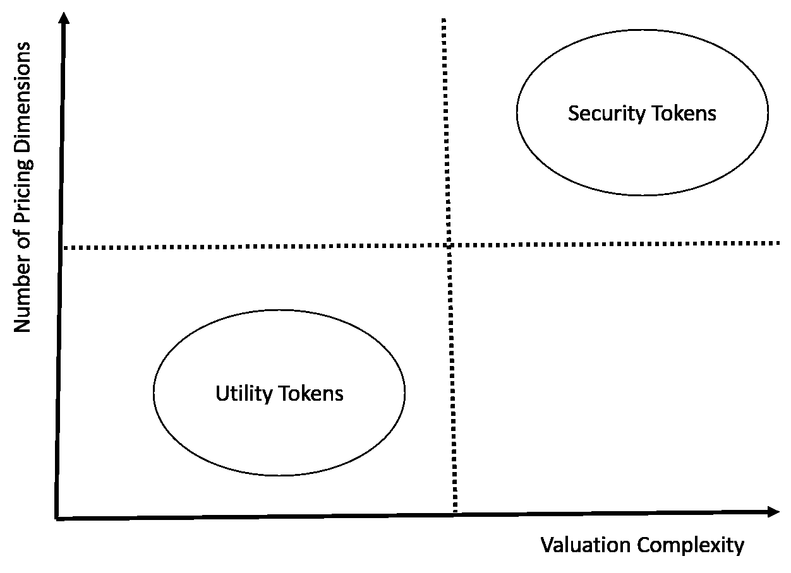
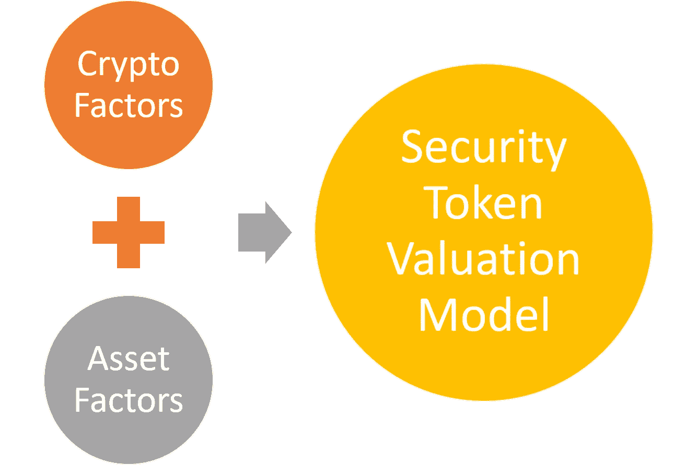

# 如何评估安全令牌的价值？第一部分:要考虑的因素

> 原文：<https://medium.com/hackernoon/how-to-value-a-security-token-part-i-factors-to-consider-5a5a79b3e5d9>

几乎从一开始，定价就是加密货币争论的核心要素之一。许多著名的加密怀疑论者认为，大多数加密货币都注定要失败，因为影响其价格的唯一因素是有人愿意为此支付多少钱。如果你正在读这篇文章，你(和我一样)强烈反对这种说法。然而，对加密资产的正确价格/估价建模的问题仍然是一个有趣的挑战。随着安全令牌成为加密领域一个新的相关资产类别，这个问题又有了新的层面。

我们正处于安全令牌生态系统发展的早期阶段，市场的许多基础构件才刚刚构建起来。然而，没有人怀疑，如果我们希望安全令牌成为一种可行的资产类别，估值模型是一个需要解决的关键因素。目前，第一波安全令牌产品(STO)使用的是高度主观的估值模型，随着该领域变得更加主流，这是不可持续的。

密码行业已经产生了一些有趣的模型来计算公用令牌和加密货币的价值，那么我们为什么不能将它们应用到安全令牌上呢？是什么让安全令牌的定价和估价如此具有挑战性？我准备借用深度学习领域的一个术语来概括这个挑战:维度的诅咒。

# 维度和安全令牌评估

维数灾难是深度学习领域中一个著名的理论困境，它指出问题的复杂性随着维数的增加而增加。例如，图像识别问题比经典的线性回归模型有更多的维度。这和安全令牌有什么关系？非常简单，可用于评估安全令牌的因素/维度及其组合变化的数量比它们的效用令牌等价物高几倍。因此，评估安全令牌的模型比我们迄今在实用令牌领域看到的要复杂得多。

让我们更深入地探讨一下这个维度问题。在对公用事业代币进行估值的模型中，最受欢迎的一个模型是 Placeholder Capital 的联合创始人 Chris Burniske 在他的书[中提出的。伯恩斯克的模型基于一个简单的公式 *M=PQ/V* ，该公式根据以下因素估算加密资产的价值:](https://www.amazon.com/Cryptoassets-Innovative-Investors-Bitcoin-Beyond/dp/1260026671)

*   M =资产基础的规模
*   V =资产的速度
*   P =正在供应的数字资源的价格
*   Q =正在供应的数字资源的数量

Burniske 的方法非常聪明和简单(简单到我认为需要针对更复杂的令牌模型进行修改)。该公式清楚地反映了影响公用事业代币价格的关键因素，并且还假设这些资产的定价可以用线性模型来描述。如果我们尝试将 Burniske 的想法推广到安全令牌空间，我们将很快发现，有更多的因素决定加密证券的价格，并且行为远远不是线性模型。

# 影响证券代币估价的因素

如何计算安全令牌的估值？这个问题不会只有一个答案。就像资产支持证券一样，我们将有许多统计方法来模拟证券的估值。类似地，不同类别的安全令牌将使用不同的模型进行估值。代表房地产租赁的第 1 层证券令牌的估价，不同于代表私人公司股份的令牌，也不同于代表房地产资产池的证券令牌衍生工具。我一直在研究安全令牌的定价模型，我计划在不久的将来在这里讨论这些模型，但是，在我们走得太远之前，我们可以先了解一些对安全令牌的估值有很大影响的因素。

虽然可以说有无限多的模型可以用来对证券进行定价，但也有一组通用的因素可以帮助建立任何估值分析的框架。构建这种分析的一个简单方法是将这些因素分为两类:基于加密的因素和基于资产的因素。

# 基于加密的估价因素

就像公用代币一样，加密证券的估价受到与代币本身性质相关的不同因素的影响。这些因素的一些示例将是正在调配的令牌的数量或令牌的交易频率(速度)。在这个层面上，我们可以借鉴效用令牌空间的许多思想来对安全令牌的估值进行建模。然而，我们还需要考虑一整套与加密资产的架构无关的因素。

# 基于资产的估价因素

与效用代币不同，安全代币的估值深受链外市场因素的影响。我无意提供一个包罗万象的列表，但我认为在估算安全令牌的价值时，应该考虑以下一些因素:

## 基础资产的估价

代表替代资产的证券代币受基础资产价格的影响很大。以代表私人公司股票的代币为例，随着公司估价的增加，相应的证券代币的价格可能也会增加。

## 现金流和股息

许多证券代币代表债务工具(如房地产租赁)中的现金产生资产。这些证券代币可能会定期向代币持有人发放股息，这是在估价时应该考虑的一个因素。发行较高股息的代币可以比其他低股息的代币定价更高(在某些资产类别中不一定如此)。

## 风险

假设有一个安全令牌代表一组房地产租约。有一个内在的风险，与一些人可能不支付或违约的事实有关。定量地估计风险应该是对证券进行估价时要考虑的一个因素。

## 抵押

证券令牌的估值不一定需要与基础资产线性相关。在许多情况下，安全令牌可以使用不同的抵押方法来控制和影响其估值。例如，一个证券令牌可以代表一组来自不同市场的房地产租赁，它们将在特定的市场条件下相互对冲。

## 资产流动性

流动性是对第一代证券代币进行估价的关键因素之一。证券化部门的人做了一项出色的工作，将流动性作为他们平台的固有组成部分。代币储备或超额现金流等流动性模型是证券代币估值中的一个高度相关的因素。

# 其他因素

在加密证券的估价中，还有其他几个相关的因素。基础资产类别的税收模型、第三方机构的评级标准或保险模型是应该考虑的因素，因为它们肯定与证券化产品相关。幸运的是，我们可以从证券化模型中借用许多有趣的想法来对安全令牌的估值进行建模。我将在以后的文章中进一步阐述这个主题。