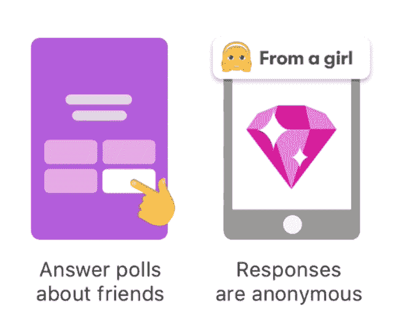
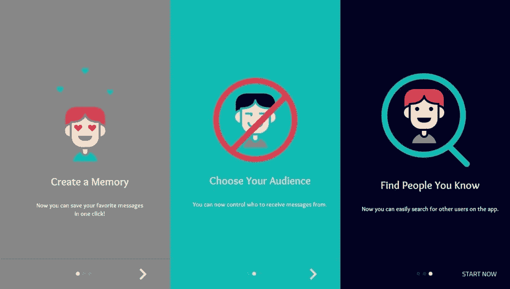
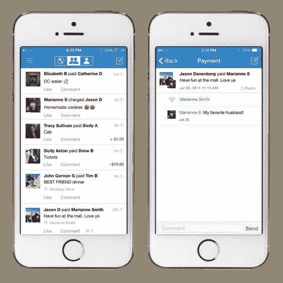
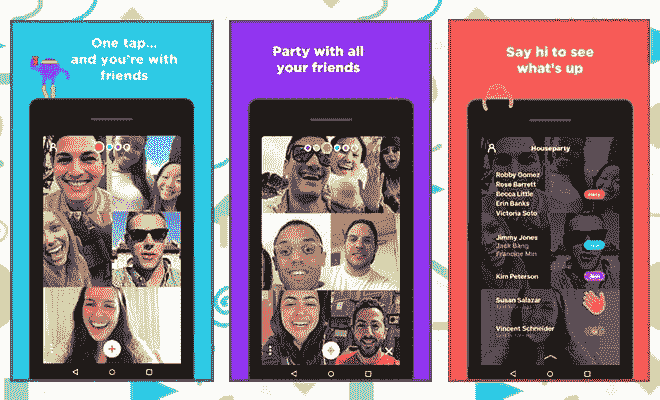
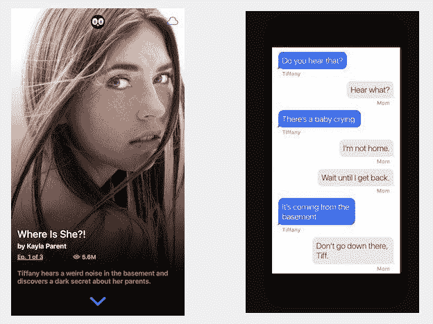
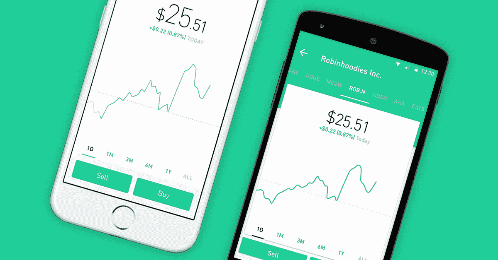
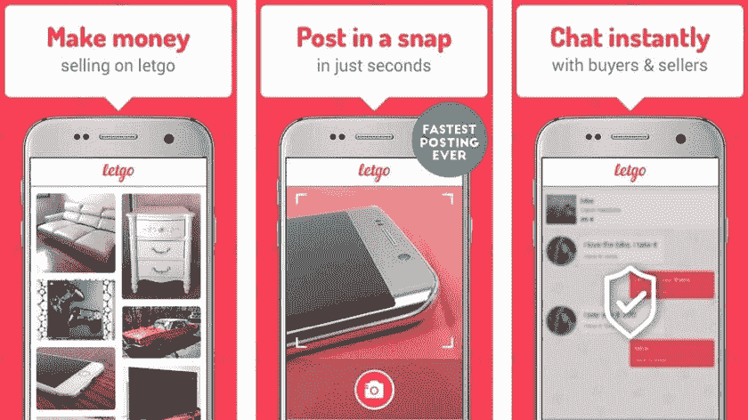

# 如何用手机应用赢得 Z 世代奖

> 原文：<https://medium.com/hackernoon/how-to-win-generation-z-igen-with-a-mobile-app-97fa84cc0f85>

为了我们的报告，我最近调查了[2017 年有哪些应用成为了趋势。](https://www.allinmobile.co/the-top-trending-apps-where-is-the-mobile-app-market-headed-in-2018/)我想看看是否有任何趋势能告诉我们一些关于[移动](https://hackernoon.com/tagged/mobile)市场走向的信息。

我发现 2017 年 AppStore 排名飙升的应用之间有着非常强的联系。他们中的绝大多数人把他们的受欢迎归功于青少年。

现在让我们考虑一下最年长的千禧一代现在已经 37 岁了。在快速变化、不断发展的数字世界中，这已经是相当多了。从技术的角度来看，千禧年将很快像史前时代的恐龙。但是有一个新的人群正成为焦点——他们被称为[Z 世代](https://hackernoon.com/tagged/generation-z)。

# 谁是 Z 世代(也称为 Z 世代和 iGen)？

Z 世代是千禧一代之后的人口群体。这些人出生于 1995 年至 2010 年。这意味着这个人群中年龄最大的大约是 23 岁，最小的…嗯，他们只是孩子。但是不要低估他们，尤其是如果你在应用程序行业。Z 世代正在成为移动市场背后的驱动力。

坏消息是，关于 Z 世代的研究并不多——似乎每个人都仍然关注千禧一代(他们是迄今为止研究最广泛的群体)。但是，通过结合所有可用的数据和我们自己的研究，我们可以推断出一些与移动应用市场相关的重要事情。

# 为什么 Z 世代是移动应用的重要目标群体？

1.  他们是乐于尝试新事物的早期采纳者

2.他们是热爱技术和一切移动事物的数字原住民

3.他们是最大的媒体受众群体，占美国总人口的 26%

4.他们是智能手机用户的主要群体(年龄在 19-21 岁之间)

为 Z 世代开发应用程序时需要考虑什么？为了回答这个问题，我将把对 Z 世代的一般研究与我们关于趋势应用和移动市场的报告结合起来。

# 比起更永久的身份，青少年更喜欢匿名

脸书是最受认可的应用之一，但青少年讨厌它。2014 年，25%的 13-17 岁青少年离开了脸书。这是因为青少年在脸书上发布的任何东西都会对他们的身份产生影响，他们不想建立这种联系。[他们想要的是能让他们分享任何东西而不受影响的媒体。](http://www.latimes.com/business/la-fi-anonymous-social-networks-20140503-story.html)由于他们非常在意留下任何数字足迹[(只有 21%的人愿意分享个人生活信息)，](https://www-01.ibm.com/common/ssi/cgi-bin/ssialias?htmlfid=GBE03799USEN&)他们喜欢匿名媒体，如 Snapchat，这使他们能够私下与同龄人分享他们的想法和经历。尽管青少年分享的东西比普通人多得多，但他们会保护某些信息不被公众所知。

## 应用示例

有些情况下，青少年会根据自己的需求修改流行的应用程序，以增加他们的隐私。以 Instagram 为例。尽管青少年有他们的主要 Instagram 账户(称为 Rinstagrams)，他们也有 [Finstarams(也称为 Finsta)](https://www.theguardian.com/technology/shortcuts/2017/feb/21/finstagram-secret-instagram-account-post-ugly-selfies) 。Finsta 是在主账户之外建立的，但仍然是私有的。该访问权限只授予一小部分人，他们是最亲密的朋友圈子。在那里，青少年可以张贴他们丑陋的自拍照、尴尬的照片、个人故事和任何他们不想让公众看到的东西。

面对这些事实，在我们的[报告](https://www.allinmobile.co/the-top-trending-apps-where-is-the-mobile-app-market-headed-in-2018/)中确定的 2017 年最受欢迎的应用之一 with、萨拉哈和波莉——是匿名应用，提供了脸书等其他社交媒体网络所没有的东西——允许青少年与其他同龄人保持联系，但同时与他们的身份无关(因为没有人知道他们是谁)。在网上隐姓埋名有助于青少年以他们在现实世界中可能无法表达的方式表达自己。

# Z 世代希望保持联系

记得我说过青少年讨厌脸书吗？尽管他们对此感到恼火，但仍有大多数人继续使用它，因为它是与朋友和同龄人交往的重要媒介。友谊是青少年生活中最重要的事情，不管是哪一代。青春期是我们寻找归属感、接纳感和同伴成员感的一个时期。如今，青少年花在网上的大部分时间都是与他们在网外经常接触的人进行私人交流。对 Z 世代来说，线上和线下生活的界限融合在一起。

## 应用示例

让我们从[我们关于趋势应用](https://www.allinmobile.co/the-top-trending-apps-where-is-the-mobile-app-market-headed-in-2018/)的报告中再举一个例子。Venmo 是一款金融应用——它允许用户发送点对点支付。但是 Venmo 有一个新闻订阅源，就像一个很棒的社交网络，在那里你可以看到谁在一起花了钱，花了什么。支付包括滑稽的笑话和愚蠢的表情符号，使它变得有趣和社交。这种社交方面是一种秘密酱，使 Venmo 成为 2017 年最受欢迎的应用之一。最重要的是，Venmo 感觉比任何其他社交平台都更私密，因为你可以编辑看到你交易的默认受众(还记得之前关于隐私的观点吗？).

前面提到的应用程序(萨拉哈、波利、TBH)也都是社交网络应用程序。此外，AppStore 排名第一的教育应用程序是一个将学校社区聚集在一起的交流平台，这一点也不奇怪。

更不用说在青少年中如此受欢迎的 Houseparty 应用程序，甚至脸书也决定调查它出名的原因，并随后推出了一个类似的应用程序。Houseparty 对青少年很有吸引力，因为它允许他们通过视频连接与朋友随意闲逛( [47%的受访青少年表示他们通过视频工具与朋友交谈。](https://www.themarketingscope.com/how-teens-use-mobile-social-video-and-messaging-report/))它还有 FOMO 的某个方面(害怕错过)——如果用户的朋友在视频聊天中没有他们，用户会收到通知，以便他们可以加入对话。

# 青少年使用表情符号、图像和符号快速交流

他们发短信……很多。短信在青少年中比以往任何时候都更受欢迎，十分之九的人说他们使用短信，要么直接通过手机，要么通过应用程序或网站。一个典型的青少年每天收发 30 条短信。他们还广泛使用表情符号、gif、贴纸、缩写和图像。

## 应用示例

Snapchat 在 Z 世代获得了吸引力，因为发送视频和图片比普通短信快得多。然而，如果你想要一个像妻子一样在青少年中流行的应用程序，这并不意味着你必须使用社交网络应用程序。以我们关于趋势应用的[报告中的 Hooked 和 Yarn 为例。这些应用程序是电子书的替代品，将故事呈现为移动优先的体验。每一个奇谈怪论、勾心斗角的故事，说出来都像是在看别人的短信。这些应用程序的开发者利用年轻人的行为模式，并将它们转化为应用程序的成功因素。](https://www.allinmobile.co/the-top-trending-apps-where-is-the-mobile-app-market-headed-in-2018/)

# Z 世代是不能容忍技术故障的数字原住民

2017 年 1 月，IBM 和美国国家零售基金会发布了一份名为[独特的 Z 世代:关于当今最年轻的消费者，品牌应该知道什么。](https://www-01.ibm.com/common/ssi/cgi-bin/ssialias?htmlfid=GBE03799USEN)他们调查了 15，000 多名年龄在 13 至 21 岁之间的 Z 世代，收集了一些对应用程序企业主可能至关重要的信息:

如果你的 app 不符合最高质量标准，Gen Z 会不可原谅，毫不犹豫地卸载。IBM 的报告发现，62%的青少年不会使用难以导航的应用程序，60%的青少年不会使用加载速度慢的应用程序。

Z 世代是第一批真正“移动优先”的客户。虽然千禧一代采用了手机，但今天的青少年出生时，智能手机已经广泛使用。这就是为什么他们可以在物理世界和数字世界之间无缝移动，并期待顶级技术性能。容易出错的应用程序在青少年的智能手机中没有一席之地。

## 应用示例

在[我们的报道](https://www.allinmobile.co/the-top-trending-apps-where-is-the-mobile-app-market-headed-in-2018/)中，最受欢迎的应用之一是 Robinhood 应用。它处理查看、购买和出售股票。这个应用程序是一个真正的杰作——它让股票交易像在网上订购披萨一样简单。[这得益于流畅的入门体验，用户可以体验该应用的核心功能、通过滑动手势快速导航、大胆的设计、动画过渡和排版。毫无疑问，这款应用获得了 2016 年 Google Play 卓越设计奖。Robinhood 提供最高的质量标准和无缝体验。](https://design.google/library/robinhood-investing-material/)

# Z 世代对钱有意识

他们不仅试图保持无债务，他们经常在很小的时候就开始存钱。[你会惊讶地发现，许多年轻人(特别是 21%)甚至在 10 岁之前就已经有了储蓄账户。](http://3pur2814p18t46fuop22hvvu.wpengine.netdna-cdn.com/wp-content/uploads/2017/04/The-State-of-Gen-Z-2017-White-Paper-c-2017-The-Center-for-Generational-Kinetics.pdf)换句话说，他们在很小的时候就开始在财务上变得聪明。83%的青少年目前正在存钱。他们也很有创业精神，希望从多种渠道赚钱，其中许多人都在网上赚钱。三分之一的人安装了银行应用程序——毕竟，Z 一代是在一个没有现金的社会中成长起来的。

## 应用示例

在我们的报告中，很大一部分应用都有财务方面的内容，这使得它们成为年轻人感兴趣的产品:

*   Robinhood 应用程序——一个允许快速买卖股票的应用程序。罗宾汉用户的平均年龄只有 26 岁！
*   Venmo 和 cash app——这些应用程序提供了具有革命性潜力的点对点或 p2p 支付系统，
*   penny finder——以耦合和搜索交易为中心的应用程序也非常受欢迎，
*   OfferUp 和 let go——销售和购买二手、二手或二手产品的应用程序在青少年心中也有特殊的地位。对青少年来说，这是一种赚外快的超级简单的方式。

## 想要更多吗？

以下是为 Z 世代开发移动产品的一些额外技巧:

## 提示 1:

让您的年轻用户控制他们共享的内容以及谁可以看到。对他们的个人数据将如何存储和使用保持透明。

## 提示 2:

青少年希望与线下世界的朋友和同龄人保持在线联系。给你的应用一个社交层面。

## 提示 3:

了解您的目标群体的所有信息。他们的担忧、挫折、恐惧和抱负是什么？他们典型的一天是什么样子的？他们如何花钱？他们在空闲时间做什么？他们如何使用技术？只有了解您的目标用户，您才能交付一个成功的应用程序。

## 提示 4:

Gen Z 喜欢他们的交流快速而直观。确保你的信息能吸引注意力，让他们很快理解。这也意味着大胆的设计，伟大的 UX 和迷人的动画和过渡。

## 提示 5:

您的应用程序应该易于导航且运行速度快。确保代码质量良好，并测试您的应用程序以尽早发现任何错误和问题。不断努力改进您的应用程序，以提供尽可能好的体验。

你还有什么要补充的吗？请在评论中告诉我！