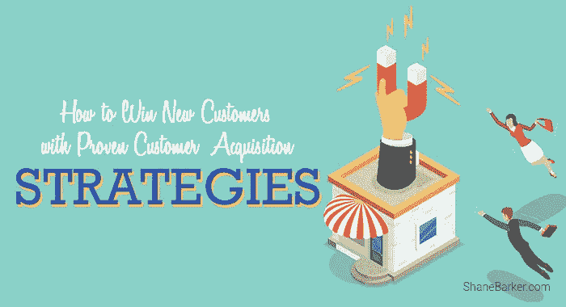

# 如何用成熟的客户获取策略赢得新客户

> 原文：<https://medium.com/hackernoon/how-to-win-new-customers-with-proven-customer-acquisition-strategies-ea7203897354>

关于获取客户的严酷事实是，随着时间的推移，对企业的信任一直在削弱。HubSpot 最近报告称，55%的消费者不再像以前那样信任他们购买的品牌。65%的消费者不相信广告，71%的消费者不相信社交媒体上的赞助帖子。

这种对品牌信任的明显缺乏，让营销和销售团队的工作变得更具挑战性。更糟糕的是，大多数公司都没有意识到这个问题。他们最终将更多的钱投入到“推”营销策略中，希望这能帮助他们赢得新客户。

精选的相关内容:

*   [如何利用影响者营销来加强你的客户关系](https://shanebarker.com/blog/use-influencer-marketing-strengthen-customer-relationships/)
*   [在内容中使用客户评价的 7 种方式](https://shanebarker.com/blog/7-ways-use-customer-testimonials-content/)

但这永远不是正确的解决方案。

那是什么？

你的最佳杠杆点是投资于“拉动”[营销策略](https://shanebarker.com/blog/affiliate-marketing-strategies/)和客户服务。但是在我们深入探讨这些常青树策略之前，让我们先来谈谈客户获取。

# 什么是获客？

你带来新客户或顾客的过程就是获得顾客。对任何公司来说，目标都是创造可持续和系统的客户获取策略，以跟上行业趋势。

不管你的企业规模有多大，除了帮助你扭亏为盈之外，这是经营企业的一个非常重要的方面。它还可以作为你的业务吸引外部世界的证据，包括合作伙伴、投资者、有影响力的人和潜在客户。

请注意，客户获取不应与潜在客户产生混淆。在商业世界中，我们经常以漏斗的形式想象顾客的旅程，如下所示。

作为漏斗消费者之旅的一部分:

1.  提高对您的品牌的认知度和对您产品的兴趣
2.  将您的产品或服务添加到他们正在考虑的备选方案列表中，并且
3.  决定成为你企业的付费客户

销售线索挖掘构成了销售漏斗的顶部。销售线索获取是中间部分。而铅转化是一路垫底。然而，客户获取是包含所有这些阶段的整个端到端过程。

# 客户获取策略

我们已经谈到了品牌在试图获得新客户时面临的一些关键挑战。对品牌缺乏信任是关键。但这并不是说，你不能做任何事情来提高你的客户获取。

这里列出了一些常青树客户获取策略，你可以利用它们来确保你总能获得新客户。

精选的相关内容:

*   [了解移动优先索引——有什么帮助？](https://shanebarker.com/blog/mobile-first-indexing/)

# 1.定义你的目标受众

你需要执行的第一步也是最重要的一步是为你的公司确定合适的用户或潜在受众。

很有可能你的产品是某一类消费者所面临问题的完美解决方案。这只是一个发现他们是谁并把你的客户获取努力主要集中在他们身上的问题。

如果你心中没有目标客户，很可能你会限制自己有效地营销你的品牌。除非你的产品满足普遍需求，否则你最好为自己找一个利基市场。

进行全面的市场调查，并试图找出谁和你应该如何营销你的产品，以赢得新客户。例如，[据 Invesp](https://www.invespcro.com/blog/saas-customer-acquisition/) 称，SaaS 的公司可以通过提供免费试用而无需询问他们的信用卡信息，从而使他们的付费用户数量翻倍。

这样的知识只能通过尽职调查市场研究来获得。它形成了一个基础，没有它，你的任何其他客户获取策略都不会奏效。

# 2.使用正确的采集通道

基于我们上面的讨论，仅仅知道谁是你的理想客户是不够的。同样重要的是，要知道获取上述潜在客户的正确渠道。

现在，有许多不同的框架可以帮助你确定用于你的客户获取策略的[最佳渠道](https://shanebarker.com/blog/b2b-social-networking-channels-grow-your-business/)。但在大多数情况下，需要大量的实验才能找到正确的渠道。

为了让事情变得简单，你应该为自己和你的竞选设定明确的目标。即使有粗略的目标也会帮助你了解你的策略是否有效。一旦你测试了不同的渠道，你将能够比较彼此之间的成功。

精选的相关内容:

*   [帮助你成功开展营销活动的 17 个基本 B2B 营销工具](https://shanebarker.com/blog/b2b-marketing-tools/)

# 3.利用视频内容

视频营销正在兴起。81%的企业利用 it，比去年的 63%有所上升。这是因为 97%的营销人员发现视频内容有助于增加客户对其产品的了解。另外 76%的人发现这有助于增加网络流量和销售额。

人们倾向于视觉学习，视频是向潜在客户介绍你的品牌和产品的最佳方式之一。你应该试着在信息丰富和有趣的视频之间找到一个好的平衡。利用有影响力的人来制作这样的视频，在社交媒体和你的网站上分享。

Explainer 视频和客户评价是另一个很好的方法。它们不仅具有吸引力，还能为用户提供做出最终购买决定所需的信息。

像 Okta 这样的公司从视频营销这样的获客策略中受益匪浅。

# 4.做赠品

通常，顾客需要的不仅仅是言语或承诺来说服他们购买你的产品和服务。一些更持久的消费者甚至不会被影响者或口碑营销所左右。

为了赢得这些消费者的忠诚，你应该考虑做赠品。给他们一个直接体验你的产品的机会，是给他们额外的推动力，让他们认真考虑你的选择。

实施这种客户获取策略的最简单方法是在社交媒体上开展赠品活动。

以下是女性时尚服装品牌 Forever21 为推动用户通过销售漏斗所做的工作。通过这种方式，他们甚至可以衡量市场，如果有的话，任何他们想尝试销售的新款式。

精选的相关内容:

*   [你可以实施的 11 种超高效销售线索挖掘策略](https://shanebarker.com/blog/lead-generation-tactics/)

# 5.定期创作高质量的内容

[内容营销](https://shanebarker.com/blog/increase-social-media-engagement/)无疑是最有效、最持久的客户获取策略之一。让我们这样想:它帮助你在你的行业或领域建立你的思想领导地位。让消费者信任你的品牌是成功的一半，内容营销可以帮助你赢得这场战斗。

从潜在客户的角度来看，内容营销的效率是典型的外向营销的三倍，成本也低 62%。为你的企业开一个博客，在社交媒体上分享内容，发布白皮书，这些都是让你成为业内值得信赖的专家的好方法。

如今消费者越来越见多识广。通过让你的潜在客户做出明智的购买决定，你将获得他们的信任，并很有可能转化他们。创造有价值的、信息丰富的、有洞察力的和吸引人的内容，最终将有助于推动你的客户获取。

# 6.专注于 SEO

在你通过制作有见地的内容建立了你的在线形象之后，你需要在 SEO 上下功夫。这样做将有助于提高这些内容在搜索引擎上的排名。从而使您的内容更容易被目标受众看到和发现。

提高搜索排名和你的品牌的知名度与客户获取漏斗的第一阶段有很大关系。一些更基本的 SEO 策略包括使用行业相关的关键词、权威网站的反向链接等。

另一个有效的 SEO 策略是为移动设备优化你的网站，你可以用它来赢得更多的客户。去年将近 50%的互联网流量来自移动设备。为潜在客户提供卓越的移动体验可以证明是转化客户的诀窍。

精选的相关内容:

*   [如何优化谷歌排名:找出你的排名有多脆弱](https://shanebarker.com/blog/optimize-google-rankbrain/)

# 7.运行推荐程序

推荐项目通常是许多客户获取策略的基础，尤其是当你是一家羽翼未丰的公司时。你可以向当前用户提供额外的功能或折扣等激励，鼓励他们向其他人推荐你的服务。你也可以向这些新客户提供类似的折扣，让他们更多地利用你的服务。

Dropbox 运行着一个非常可爱的推荐程序，当用户邀请朋友注册时，他们会额外提供 500mb 的存储空间。您的朋友还可以获得额外的 500mb 存储空间，这让这笔交易更加划算。他们通过向双方提供某些东西来最大化从推荐中获得的价值。

# 8.创建优化的登录页面

在其他客户获取策略中，[优化你的登陆页面](https://shanebarker.com/blog/landing-page-best-practices-boosting-conversions/)绝对是最有效的策略之一。登录页面有助于引导消费者购买你的产品或服务。一个有效的登录页面不仅仅提供有价值的信息，还包括引人注目的行动号召，以促进转化。

运行 A/B 测试可以帮助您优化您的登录页面，并大幅改善它们。这又回到了了解你的客户对你的期望。你需要能够预测他们的需求，然后满足他们的需求。

你可以使用像 [Unbounce](https://unbounce.com/) 这样的工具来测试你的登陆页面设计。尝试没有导航栏的页面，有导航栏的页面，尝试不同的字体、CTA 和元素。这是一个反复的过程，你应该不断尝试，找出有助于赢得更多客户的方法。

精选的相关内容:

*   [能让你的业务更上一层楼的 10 个必备工具](https://shanebarker.com/blog/essential-tools-take-your-business-next-level/)

# 9.提高网站和电子邮件参与度

虽然这可能是一种和互联网一样古老的策略，但它仍然是最有效的客户获取策略之一。它有助于你站在目标受众面前，推广你的内容、折扣和产品信息。这也是你联系和获得新客户最简单的方式。

一个很好的方法是根据客户获取过程的不同阶段给人们发送定制的电子邮件。因此，前两步中的人可能更适合可能引发客户参与的内容。

那些把你列入考虑范围的人会对包含产品信息的邮件更感兴趣。这使他们能够做出更明智的购买决定。同样，处于最后阶段的人可能会被一封提供折扣的促销邮件所诱惑而购买。

举例来说，亚马逊在这方面做得很好。他们总是向观众发送定制的电子邮件。无论是提醒他们愿望清单上的物品还是一辆废弃的手推车。或者当你刚刚买了一件东西时，可能是这样的。

精选的相关内容:

*   [自动链接建设:一种轻松获得链接的方式](https://shanebarker.com/blog/automated-link-building/)
*   [思想领导力营销如何帮助你营销你的品牌](https://shanebarker.com/blog/thought-leadership-marketing/)

# 结论

没有什么神奇的公式可以保证你的企业有稳定的新客户流。虽然像市场调查这样的客户获取策略是必须的，但你需要从那里开始。这是一个实验过程，试图找出哪些策略最适合你的业务。

不过，在很大程度上，上面列出的九条是常青树，只要做对了，保证适用于任何企业。

你对这些获客策略有什么想法？请在评论区告诉我们。

***最初发表于*******。****

***关于作者***

*[谢恩·巴克](https://shanebarker.com)是[内容解决方案](https://contentsolutions.io/)和 [Gifographics](http://gifographics.co/) 的创始人兼首席执行官。你可以在[推特](https://twitter.com/shane_barker)、[脸书](https://www.facebook.com/ShaneBarkerConsultant/)、 [LinkedIn](https://www.linkedin.com/in/shanebarker/) 、 [Instagram](https://www.instagram.com/shanebarker/) 上和他联系。*