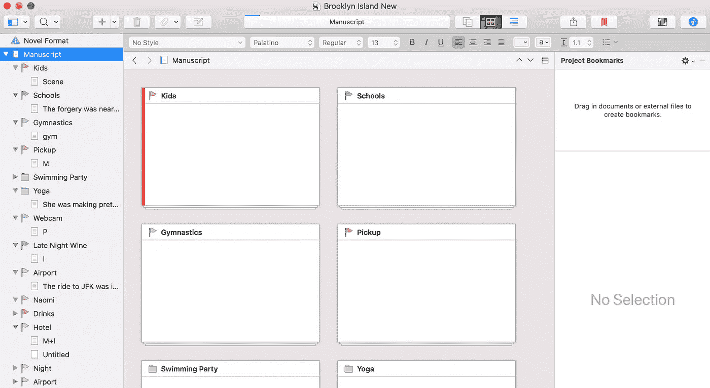
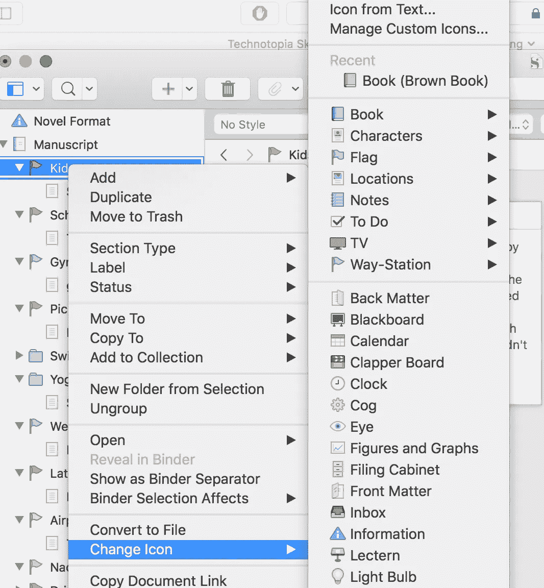
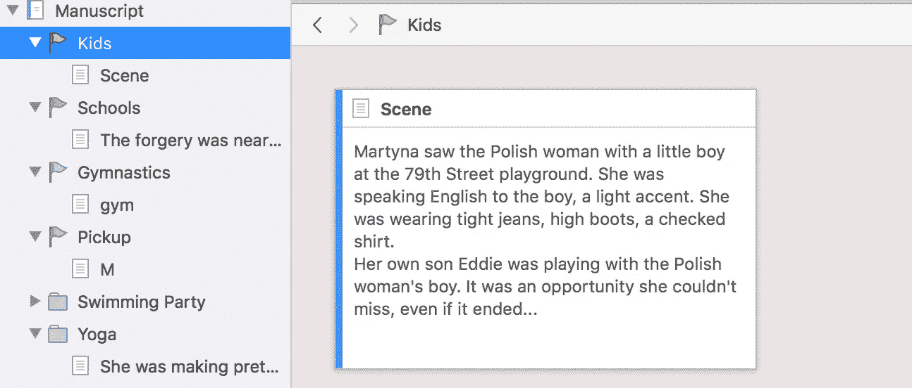
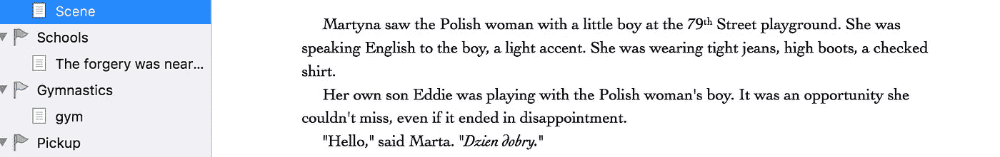

# 如何写书

> 原文：<https://medium.com/hackernoon/how-to-write-a-book-2065b6e807d3>

Please don’t be insufferable and romanticize writing.

写作很容易！对大多数作家来说，所需要做的就是坐在椅子上盯着空白屏幕 20 年，直到有人最终付钱给你。然而，对你来说，我想提供一些关于如何快速、轻松地写自己的书的小技巧。准备好了吗？

1.  **有想法。**咄。还要确保除了你之外，其他人也对这个想法感兴趣。如果你打算写一部关于机器人和人类一起打败邪恶的多思·沃德的太空歌剧，或者如果你想写一本关于如何改变你的生活，让你一年只工作 2 小时的书，那么现在就停下来。问问你的朋友他们想读什么，在你找到完美的想法之前，先想出几个主意。或者不要写，只是盲目地希望别人关心 CrossFit 如何改变了你的生活。
2.  **概述**。除非你有地图，否则你不能去旅行。任何告诉你不是这样的人都是在骗你。你必须概述你所有的章节，无论是非小说还是小说。你不必确切知道每一章将包含什么，但你必须有一个大致的路径。下面是我正在写的一部小说的“大纲”。我使用一款名为 [Scrivener](https://www.literatureandlatte.com) 的应用，它可以让你以一种非常独特的方式创作书籍。在你抱怨你如何不想学习另一个程序之前，请闭嘴一分钟。

看看这个。这是一本小说。

有一个主要的“手稿”文件夹，里面有一些子文件夹。这些是章节。此图中的子文件夹上有小旗。这可能会让你感到困惑。别担心。

这些小旗是我自己通过右键点击并改变图标添加的。我知道如果我给你看这些旗子，你会感到困惑，所以现在我需要解释一下。您可以让章节看起来像任何东西:

我用旗子来标识每一章中的主要人物。如果你是视觉学习者或者你喜欢图标，这很有帮助。在这些章节文件夹里面是场景。

每个场景都是一个文本文件。如果你点击章节文件夹，你会看到里面场景的小卡片。猜猜这意味着什么？你可以创建一个章节文件夹，将其命名为“欢迎来到我的神奇大脑”，并添加一个场景，说明“向读者介绍我的大脑”多次这样做，你就会有一本书。大多数书应该有 50，000 字，所以你需要 12-15 章，每章几千字。提前做好这方面的准备，你就不会写出 50 万字没人想读的作品，也不会写小册子。

Scrivener 让你拖动章节和场景，最终将你的书编译成电子书格式。购买软件。真的很好。

你能在创业公司休假期间眺望普吉岛的水面，用一支精致的黑翼铅笔在一个漂亮的 Moleskine 笔记本上画出轮廓吗？是的，但是你什么也做不了。继续做你自己，停止阅读这篇文章，这样你就可以让严肃的人做一些工作。

Please don’t do this, you hipster dingus.

2.**自言自语。**你不是一个好作家。你可能很健谈。作为一个作家，我勉强可以，我已经写了 20 年了。所以不写了。说话。

记录你自己口述每章中的每个场景。直言不讳地说出你想说的话。聊几分钟或者几个小时。没关系。全都拿出来。然后转录下来。我有一个我使用的服务，我[可以连接你](mailto:john@typewriter.plus)，或者你可以上网，然后[用机器人或其他什么东西做这件事。不管怎样，这要花一点钱。结果是，你有一页又一页的文本来组成那本 5 万字的书，而不必坐下来考虑在你的第一章的第一行应该使用“决定性的”还是“坚决的”。简而言之，我让你免于成为作家。过会儿谢谢我。](https://aws.amazon.com/transcribe/)

3.**“写”一天 1000 字。**这是最难的部分。你需要每天至少写出 1000 个单词，每天如此，持续 60 天左右。这意味着你必须每天花一点时间，记录一章或一章的一部分。你还应该确保你已经把每一章都想好了，这样你就可以随意地停下来开始。继续这样做，直到你有至少 80，000 字的转录文本。

4.雇佣两到三名编辑。如果你认为你不能把你的漫谈变成可读的文本，你将需要一个**的代笔人**。如果你找到一个刚从学校毕业、不介意为微薄的收入工作的人，这应该要花费 1500 美元左右。这个人会把你的漫谈变成段落，和你一起写文章。如果你自己可以做到这一点，而不会碰到某种气阻，那就去做吧。接下来你需要一个**开发编辑**。发展编辑就像教练。他们会移动东西，帮助事情变得有意义。他们确保你有一个一致的思路，并把你的喃喃自语变成一本真正的书。预计为此支付约 1000 美元。最后，你需要一个文本编辑器。这将花费 500 到 2000 美元，取决于你得到谁。许多人认为文案编辑就是写作。这是确保你听起来像是在说英语(或法语或其他什么)的过程。这些人是完整和昂贵的，因为没有人想复制编辑。即使你拒绝雇佣这份名单中的任何人，也要付钱给文字编辑。这显然是自私的，因为我可以[为你找到所有这些人](http://typewriter.plus)，但见鬼，这是 2018 年，内容已经被贬低到低于鱼包装，所以为什么不在一个中等帖子中插入我自己的废话。你也可以上网问问，但是祝你好运，找到一个正常的人。

5.**运气好。悲哀的事实是:即使你做了所有这些，你也可能不会被出版。我爱你，布罗罕/埃塔，但是听着:出版商有东西要保护，他们不希望像你这样的怪人闯入他们的领地。我的建议？自助酒吧，把这本书当作厚厚的名片。雇佣一名封面设计师，将文本输入 InDesign 模板，然后就此收工，上传到亚马逊。如果你认为它好到一定要在世界各地的 Hudson Newses 上出售，那么你需要找到一个文学代理人——如果你的书很好，这并不难，但如果你的书很差，那就真的很难了——然后说服出版商出版它。我要警告你:出版商不关心现代数据仓库发现中的高级区块链分解技术，或者你决定写一本书的任何东西，所以你最好自己出版。然而，如果你写了一本关于月亮或 BDSM 的小说，你可能是金色的。**

6.**重复。**没错:你要再写一本书。另一个。另一个。如果你认为你只有一本书，那么感谢上帝，回到你的编程或营销或其他工作中去。如果你认为你有更多的话要说，那么你应该重复这个过程大约十年，直到你真的很擅长为止。到这个时候，你会像我一样又胖又痛苦，但如果他们不想让你为福布斯和公司贡献者网络(Forbes and Inc . contributor network)撰稿，这是一项只授予斯克兰顿地区最优秀、最聪明的网络营销骗子和精力充沛的人力资源经理的荣誉。此外，你将能够创建多个名片，并与广大观众分享你的经验和技能，你会感觉很好。

**我撒谎了。写作很难。我只是让你更容易。归根结底，关键是弄清楚你想说什么，弄清楚你想对谁说，然后说出来。如果对于一本书来说这是一个足够大的想法，这就是如何着手创作它。如果它能放在一条推特上，我们都会过得更好。不管怎样，祝你好运！**

*顺便说一句，我有一个庞大的编辑和作家团队等着帮助你。* [*访问 typewriter.plus 获取报价*](http://typewriter.plus) *或者发邮件给我。另外。你也可以* [*在这里*](http://www.tokenreporter.co) *阅读我的代币出售简讯。*

主图由[rawpixel.com](https://unsplash.com/photos/ZN97BfWuHhs?utm_source=unsplash&utm_medium=referral&utm_content=creditCopyText)在 [Unsplash](https://unsplash.com/search/photos/writing?utm_source=unsplash&utm_medium=referral&utm_content=creditCopyText) 上拍摄。

马修·佩恩在 [Unsplash](https://unsplash.com/search/photos/writing?utm_source=unsplash&utm_medium=referral&utm_content=creditCopyText) 上拍摄的照片