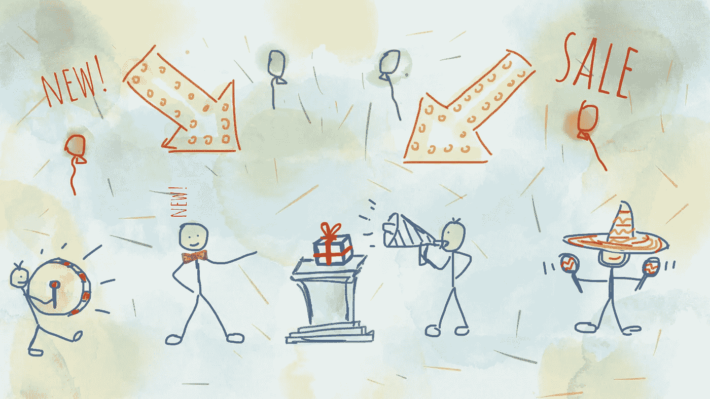
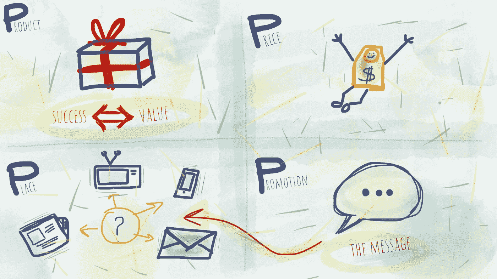
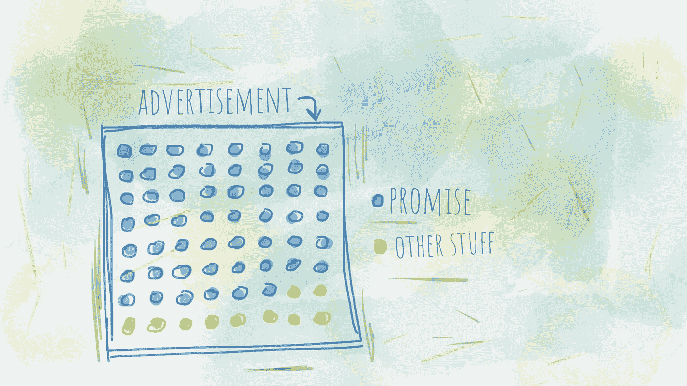

# 如何写出令人惊叹的广告文案

> 原文：<https://medium.com/hackernoon/how-to-write-an-amazing-advertising-copy-98e6677ed084>

现在，你就可以轻松地写出一个惊人的广告，卖出更多的东西！看看我是如何做到的，并把这些技巧融入到你的广告策略中。

一个普通家庭每天会接触到 1500 多个广告。我们都讨厌它们，但它们是当今经济的重要组成部分。这篇文章简要概述了我认为写一个好广告最重要的是什么，不管是销售数字产品还是实物产品。

# 首先，什么是广告？

这是一种传播产品或服务意识的有偿战略努力，但它不是营销人员销售产品的唯一方法。[广告](https://hackernoon.com/tagged/advertising)是企业主为吸引人们对产品或服务的注意而采取的具体行动。我们统称这些行为为“广告”,它们的范围可以从印刷传单张贴到你的社区，到经营国际电视或[脸书](https://hackernoon.com/tagged/facebook)视频广告，以及介于两者之间的任何事情。

广告的目标是接触最有可能愿意为公司的产品或服务付费的人，并吸引他们购买。实际上，我会将广告目标分为三个结果组:

*   社会证明
*   交通
*   转换

社会证明是当人们发现“每个人都在这么做”时产生的积极影响。这是一个令人信服的认可你的业务，产品或服务。使用社交证明可以对你的业务增长产生重大影响。以证明、评论或信任印章的形式在你的产品中建立社交证明是产生兴趣(流量)、增加可信度和推动更多转化的好方法。

**流量**是这次行动的主要目标之一。写一篇令人信服的广告文案会给你的企业带来更多的关注和流量。有趣的副本和标题激发了读者的好奇心。在好奇心的驱使下点击一下，他们会觉得自己发现了产品或服务。他们不会觉得自己是被骗了，或是被咄咄逼人的广告攻势强迫购买。这样一来，他们的购买意愿就会增强。

社交证明和更多的流量会带来更高的**转化率**。达成交易是最终目标。一个写得好的广告，清楚地陈述产品的价值和好处，自然会带来高转化率。

这篇文章将帮助你理解什么是一个伟大的广告文案的要素，以及如何使用这些技术来实现上述结果。

在我们继续之前，先说清楚:

> 你的产品质量将决定成功；广告只会在它成为家喻户晓的名字之前传播这种品质的意识；

因此，不要依赖于点击诱饵标题，投资于实际质量。口碑会创造奇迹。

# 1.广告元素——先做好功课

在你开始写广告文案之前，先了解你的受众。他们喜欢什么，他们需要什么，他们最有可能参与的平台是什么，他们关注的影响者是谁，等等。作业部分可以归纳为 4 Ps: **P** 产品、 **P** 大米、 **P** 花边、 **P** 运动。

4 Ps in ad preparation: **P**roduct, **P**rice, **P**lace, **P**romotion.

产品:你全身心地投入到产品或服务中，你对它了如指掌。但是退一步，看看更大的画面。使用它最重要的好处是什么？关于产品，你想让每位顾客知道的是什么？确定产品的真正价值，并专注于此。成功与你回报的价值成正比，所以这绝对应该是你的重点。提升自己的真实价值。这是你广告中最重要的部分之一，因为顾客关心的是他们花钱后能得到什么回报。而价值高了，价格也就跟着高了。

此外，了解你的产品的受众。这是我在以前的一篇文章中提到的一个单独的主题，部分是关于技术采用生命周期的:

 [## 建立品牌应该是你产品路线图的一部分

### 对于一个工程背景的人来说，解决问题的优质方案是唯一重要的事情。但是后来…

momcilodakic.com](https://momcilodakic.com/2018/09/07/building-a-brand-should-be-part-of-your-product-roadmap/) 

价格:现在，你可能已经算出了你产品的价格。它应该支付你的费用，给你留有利润。你可能想知道为什么价格对你的广告工作很重要？嗯，根据你的价格范围，你的广告必须有一个合适的语气，外观和感觉。就像如果你申请一个首席执行官的职位，你很可能会穿西装，而不是申请一个咖啡师的职位，在那里你的时髦胡子会暴露你的资历。类似的情况也适用于广告——越贵的产品给人的感觉就越高级。然而，如果产品是负担得起的，高价广告会拒绝一些顾客，因为他们会认为价格太高。

*如果你对如何为产品定价感兴趣，你可以在这里找到一些有用的建议:*

 [## 人人都卖——如何设定合适的价格？

### 工程师(包括我自己)都喜欢相信产品好到自己会卖出去。你只需要…

momcilodakic.com](https://momcilodakic.com/2018/06/28/everybody-sells-how-to-set-the-right-price/) 

如果你想把哈雷戴维森自行车卖给穿皮衣的 300 磅的成年人，不要在儿童电视上做广告。试试爱尔兰酒吧或加油站。我在这里的观点是，了解你的客户在哪里花时间，他们与什么平台互动，或者他们关注和信任的影响者是谁。除非你有无限的预算，否则你应该找到并专注于更有可能接触到大多数客户群的平台。这里有这么多层，这很容易成为一个单独的职位。例如，作为一家辣酱公司，你可以专注于在线广告。然后，你可以专注于脸书的广告。然后，你可以只关注住在纽约州地区的人的视频广告，他们对意大利辣香肠比萨饼感兴趣，并关注“hot ones”节目。诸如此类…

**晋级**:作业部分最后一个 P 就是晋级部分。根据你的业务和受众，你可以选择印刷广告、在线广告、博客文章推广、客座文章推广、电子邮件宣传、电视广告、广告牌广告、报纸剪辑等等。每一种媒介都需要一份将信息传递给读者的文案，这将我们带回到主题——**如何写一份令人惊叹的广告文案？**

# 2.广告的灵魂

有史以来最古老的关于广告的文章可能是塞缪尔·约翰逊于 1759 年 1 月 20 日发表在他的杂志《闲人》第 40 期上的文章。除其他外，它说:

> 承诺，巨大的承诺，是广告的灵魂。

为了获得关注，你应该用你高超的口才去强调和拥抱承诺的华丽。这就是你必须做功课的原因，第一个 P 的部分——产品。同样，成功与你提供的回报成正比，所以这绝对应该是你写文案的重点。在你的广告中承诺这个价值，你就会抓住读者的注意力。记住，你说什么比你怎么说更重要。

Promise, large Promise, is the soul of an Advertisement.

## 给出事实

有一种普遍的误解，认为消费者对产品的事实不感兴趣。但事实远非如此。毕竟，你是某人的消费者。因此，假设消费者是傻瓜，他们会仅仅因为口号和亲切的形容词而上当，这是对你自己的侮辱。实际真相是**说的越多，卖的越多**。所以，如果标题描述了你产品的所有好处，就不要限制自己写 15 个字的标题。我最喜欢的一个标题是大卫·奥格威为劳斯莱斯写的标题:

> 时速 60 英里时，新型劳斯莱斯汽车中最大的噪音来自电钟。

十二字佳作。没有花哨的形容词，只是一个事实说明了一切。它能让你通过阅读这一事实来想象汽车的制造质量和豪华程度。

# 3.把你一美元中的 80 美分花在标题上

在大多数情况下，标题让读者决定是否阅读该副本。平均而言，阅读标题的人数是阅读正文的五倍。因此，如果你不在标题中做任何销售，你就浪费了 80%的广告范围。

以下是一些关于如何在标题中进行销售的建议:

## 显示问题

这里的想法是展示你的潜在买家的问题。这肯定会引起他们的注意。这是一种强有力的销售技巧，因为它承诺了一种希望。希望您的客户所面临的问题能够消失。

## 许诺利益

你的标题应该吸引顾客的兴趣。如果你明确了问题的定义，并在标题中承诺了一个高质量的解决方案，你的广告可能会中大奖。

## 注入新闻

永远要想办法在标题中加入新闻，因为大多数顾客都在追求新产品。产品甚至不一定是新的。你可以强调使用旧产品的新方法，或者阐明使用现有解决方案的创新方法。在某种意义上，你甚至可以用“新”这个词。只要你有一个增量的提升，就可以称之为新。

## 奇怪的话

一些研究表明，使用以下词语可以帮助你吸引更多的客户，所以试着使用它们:如何，突然，现在，宣布，介绍，它在这里，刚刚到达，一个重要的发展，改进，惊人的，革命性的，神奇的，提供，快速，容易，想要的，挑战，建议，真相，比较，最后的机会，赶紧…

这些词可能与紧迫感、稀缺和创新联系在一起。这是一种告诉你的顾客如果他们忽视你的产品，他们将会错失良机。他们将错过过上更好、更轻松生活的机会。他们会心甘情愿地放弃你给他们的希望和承诺。让他们控制自己的选择，但明确声明如果他们不买，他们将会错过机会。

## 使用简单的英语

不要玩游戏，在标题中使用简单的英语。一小撮人喜欢阅读带有隐藏信息的深刻的哲学陈述。说到广告，根本没有人喜欢看，尤其是那些很难理解的广告。不太可能有人会花时间去思考你隐藏在字里行间的信息。直截了当，使用简单的英语。

# 4.让真相引人入胜

正文是你进入细节的地方。如果你已经很好地定义了你的标题，这是达成交易的最后一步。标题引起了客户的好奇心，所以希望你在这一部分有所表现。用事实开门见山。读者已经感兴趣了，所以这里的重点是提供足够多的关于产品及其优点的事实和细节。

说出真相，但要让它引人入胜。这是一个值得遵循的建议。你会想把事实传递给读者，但你不想成为一个令人厌烦的人。所以努力让那些事实尽可能的令人兴奋。有时候很难弄清楚，但是值得努力。

## 包括证明

指出你的产品价值的一个聪明的方法是在你的文案中加入客户评价。这又是一个社会证明，一个令人信服的认可，让顾客更容易相信这种价值。他们宁愿相信他们的消费者伙伴，而不是匿名的广告文案。人们喜欢故事，所以一个关于你的产品如何改善他人生活的精彩故事在潜在客户眼中是一个强有力的信息。同样，这是一个希望和承诺，他们也可以受益。

## 免费提供建议

最后，你应该给读者有益的建议。读者可以立即使用的东西，就像你可以在香水店里使用测试器一样。如果你的建议被证明是正确的，如果它兑现了承诺，你会立即建立信任。建立信任是一件大事，因为这样的话，顾客会乐意从你这里购买更多的建议，更多的产品，因为他们相信你的方法是有效的。你现在许下的希望似乎是可信的。

这是我经常使用的东西，当我写一篇文章，一个广告或一封电子邮件主题时，它给了我很大的帮助。标题上的一个小变化会带来巨大的不同。尝试一下，让我知道它对你的效果如何。我相信你会做得更好！

# 想了解更多？

学习如何将你的想法转化为成功的业务。

这本书为你提供了创建一个成功企业的整个过程的全面指导。它旨在为你展示整个[商业计划](https://treasureroadmap.com/)，让你的开始变得更加容易。整个过程归结为它的要点，使步骤简单易懂。

如果你遵循我在这本书里揭示的公式，很有可能你可以通过把一个[想法变成一个成功的商业](https://treasureroadmap.com/)来谋生。

 [## 宝藏路线图——如何将你的想法转化为成功的业务——企业家的最佳书籍…

### 如果你选择遵循我在这本书里揭示的公式，很有可能你可以通过转行谋生…

treasureroadmap.com](https://treasureroadmap.com/) 

点击下面的图片获取您的免费图书摘要:

