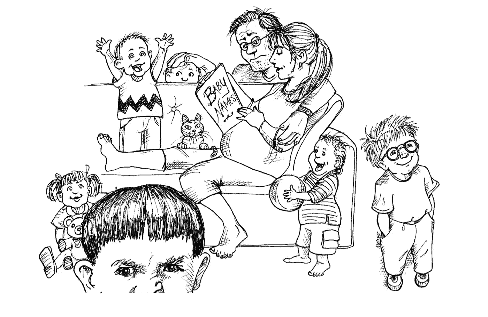

# 如何写出干净的代码？

> 原文：<https://medium.com/hackernoon/how-to-write-clean-code-d557d998bb08>

## 罗伯特·马丁的经验教训


Photo by [rawpixel](https://unsplash.com/@rawpixel)

# 目录:

*   **干净代码概述** [书](https://hackernoon.com/tagged/book) —罗伯特·c·马丁(鲍勃大叔)
*   什么是干净代码？
*   在软件中写有意义的名字的技巧。
*   使**函数**易于阅读和理解的规则。
*   **评论**代码，应该评论不好的代码还是重写？
*   **单元测试**的好处，测试驱动开发( **TDD** )

**原创于我的博客**:[https://luanotes.com/blogs/how-to-write-clean-code](https://luanotes.com/blogs/how-to-write-clean-code)

# 概观

> “编程大师认为系统是要讲的故事，而不是要写的程序。”——鲍勃叔叔。

干净的代码— *敏捷软件工艺手册*是开发人员的必读书籍，尤其是当你想成为一名更好的软件开发人员的时候。这本书解释了什么是干净的代码，以及帮助你编写干净代码的最佳实践。

[](https://www.amazon.com/Clean-Code-Handbook-Software-Craftsmanship/dp/0132350882/) [## 干净的代码:敏捷软件工艺手册

### 即使是糟糕的代码也能运行。但是如果代码不干净，它会使开发组织陷入困境。每年…

www.amazon.com](https://www.amazon.com/Clean-Code-Handbook-Software-Craftsmanship/dp/0132350882/) 

它帮助我提高编码技能，并在我的职业道路上取得显著成就。通过这篇文章，我想分享我的经验教训，并总结这本书的要点，我认为它对你很有用。

## 关于作者

Robert C. Martin，俗称 [**大叔 Bob**](https://blog.cleancoder.com/) **，**自 1970 年以来一直是一名软件专业人员，著有许多著名的书籍，如《干净的程序员》、《干净的架构》和 [***更有***](https://www.goodreads.com/author/show/45372.Robert_C_Martin) 。

# 什么是干净代码？

有许多关于干净代码的定义，这些定义是由著名的、经验丰富的程序员提出来的，他们认为是什么？

**比雅尼·斯特劳斯特鲁普，C++的发明者，*c++编程语言的作者:***

> 我喜欢我的代码优雅而高效。逻辑应该简单明了，以使错误难以隐藏，依赖性最小化以简化维护，错误处理根据明确的策略完成，性能接近最佳，以避免人们因无原则的优化而使代码混乱。干净的代码做好了一件事。

**Grady Booch，*面向对象分析和设计及应用的作者* :**

> “干净的代码简单而直接。干净的代码读起来像写得很好的散文。干净的代码永远不会掩盖设计者的意图，而是充满了清晰的抽象和直截了当的控制线。”

**“大”迪夫·托马斯，OTI 创始人，日蚀战略教父:**

> *干净的代码可以被原作者之外的开发者阅读和增强。它有单元测试和验收测试。它有意味深长的名字。它为做一件事提供了一种方式，而不是多种方式。它具有最小的依赖性，这是显式定义的，并提供一个清晰和最小的 API。代码应该是有文化的，因为根据语言的不同，并不是所有必要的信息都可以用代码清楚地表达出来。*

基于以上定义和我的编码经验，Clean Code 的主要**特征包括:**

*   **优雅**:干净的代码*读起来赏心悦目*，应该会让你会心一笑。
*   **可读性**:干净的代码读起来应该像写得很好的散文。
*   **简单**:用单一责任原则(SRP)做一件事。
*   **可测试**:运行所有测试。

在下一节中，我将分享如何编写干净的代码。

# **有意义的名字**

应用程序中的所有东西都有一个名字，从变量、函数、参数、类、模块到包、源文件、目录。

给事物命名是每个开发者最常见的问题。正如菲尔·卡尔顿所说:

> “在计算机科学中只有两件困难的事情:缓存失效和命名”——Phil Karlton



Naming things is hard

**名字**是你向阅读你的代码的开发者(包括你自己)传达你的代码意图的强有力的方式。选择好的名字需要时间，但是可以让你的代码更好，更干净*。它使你的代码更容易被其他开发人员阅读，也便于你自己将来阅读。*

*而在本书中，鲍勃大叔分享了一些 ***创造好名字的简单规则:****

## ***应该:***

## ***使用透露意图的名称***

*这意味着选择揭示意图的名字，名字应该告诉你它为什么存在，它做什么，以及它是如何使用的。如果一个名字需要注释，那么这个名字就不会暴露它的意图。这使得你的代码更容易理解，以后也更容易修改。*

```
*# bad 
t = Date.today # the name t reveals nothing.

# good
today = Date.today*
```

## ***使用容易发音的名字***

*人类擅长文字，而文字，顾名思义，是可以发音的。*

*如果你不会发音，你就不能像个白痴一样讨论这个问题。这很重要，因为编程是一项社会活动。*

```
*# bad 
ymdhms = Time.current # date, year, month, day, hour, minute, second# good
today_timestamp = Time.current*
```

## ***类名***

*类和对象应该有*名词*或*名词短语*名称，如 Customer、WikiPage、Account 和 AddressParser。避免在类名中使用管理器、处理器、数据或信息这样的词。*

*类名不应该是动词。*

## ***方法名称***

*方法应该有一个动词或动词短语名称。例子:`createUser`、`deletePhoto`或`save`*

## ***为每个概念选择一个单词***

*应用程序中的同一个概念应该有相同的名称。例如，将`fetch`、`retrieve`和`get`作为不同类的等价方法很容易混淆。*

*每个概念使用相同的单词将有助于开发人员更容易理解代码。*

## ***不应该:***

## ***编码***

*编码的名字很难发音，而且很容易打错。*

## ***思维导图***

*读者不必在心里把你的名字翻译成他们已经知道的其他名字。这个问题通常源于选择既不使用问题领域术语也不使用解决方案领域术语。
聪明的程序员和职业程序员的一个区别是，职业程序员明白 ***清晰才是王道*** 。专业人士善用他们的能力，编写他人可以理解的代码。*

## ***双关语***

*避免将同一个词用于两个目的。用同一个术语来表达两种不同的想法，本质上是一种双关语。*

# *功能*

*你如何让一个功能传达它的意图？有一些最佳实践可以帮助你写出易于阅读和修改的好函数。*

## ***小***

*函数的第一条规则是它们应该很小。函数的第二个规则是它们应该比那个小。*

## ***做一件事***

> *函数应该做一件事。他们应该做好这件事。他们应该只做这件事。*

*遵循[单一责任原则](https://en.wikipedia.org/wiki/Single_responsibility_principle) (SRP)*

## ***函数参数***

*功能应该有< 3 arguments.*

*The ideal number of arguments for a function is zero (niladic). Next comes one (monadic), followed closely by two (dyadic). Three arguments (triadic) should be avoided where possible. More than three (polyadic) requires very special justification — and then shouldn’t be used anyway.*

## ***不重复自己(干)***

*复制是软件中的一个问题。已经创建了许多原则和最佳实践来减少重复代码。*

## ***使用一个描述性名称***

*与上一节中解释的规则有意义的名称相同。*

> *“编程大师认为系统是要讲的故事，而不是要写的程序。”——鲍勃叔叔。*

*如果你很好地应用了上面的规则，你的函数是可读的，容易理解的，组织良好的，并且讲述了系统的故事。*

# *评论*

> *"不要评论糟糕的代码——重写它."*
> 
> *布莱恩·w·克尼根和 p·j·普劳格尔*

*注释不能弥补糟糕的代码。*

***用评论代码说不！！！***

# *单元测试*

> **测试代码和生产代码一样重要。**

*[测试驱动开发](https://en.wikipedia.org/wiki/Test-driven_development) (TDD):是一个*软件开发过程*，它依赖于一个非常短的开发周期的重复:需求被转化为非常具体的测试用例，然后软件被改进以通过新的测试。*

*鲍勃大叔用 3 条定律描述了 TDD:*

*   *第一法则:在你写完一个失败的单元测试之前，你不能写产品代码。*
*   ***第二定律:**你不能写超过足以失败的单元测试，不编译就是失败。*
*   ***第三定律:**你不可以编写超过足以通过当前失败测试的生产代码。*

**

*[The Cycles ofTDD](https://blog.cleancoder.com/uncle-bob/2014/12/17/TheCyclesOfTDD.html) by Uncle Bob*

*测试对一个应用程序来说非常重要，就像生产代码一样，因为它使你的代码干净、灵活和可维护。如果你有测试，你就不会害怕代码的改变和减少错误。*

*单元测试帮助我获得更多的深度睡眠！*

# *结论*

*在本文中，我与您分享了从 Robert c . Martin(Bob 叔叔)那里学到的关于干净代码的有用经验。对于每个想在职业道路上出类拔萃的开发人员来说，这是非常必要的。*

## *参考资料:*

*   *清洁代码书:[清洁代码手册软件工艺](https://www.amazon.com/Clean-Code-Handbook-Software-Craftsmanship/dp/0132350882)*
*   *干净的代码博客:[https://blog.cleancoder.com/](https://blog.cleancoder.com/)*
*   *TDD 的周期:[https://blog.cleancoder.com/TheCyclesOfTDD.html](https://blog.cleancoder.com/uncle-bob/2014/12/17/TheCyclesOfTDD.html)*
*   *SRP:[https://en . Wikipedia . org/wiki/Single _ respons ibility _ principle](https://en.wikipedia.org/wiki/Single_responsibility_principle)*