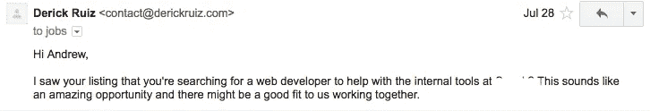
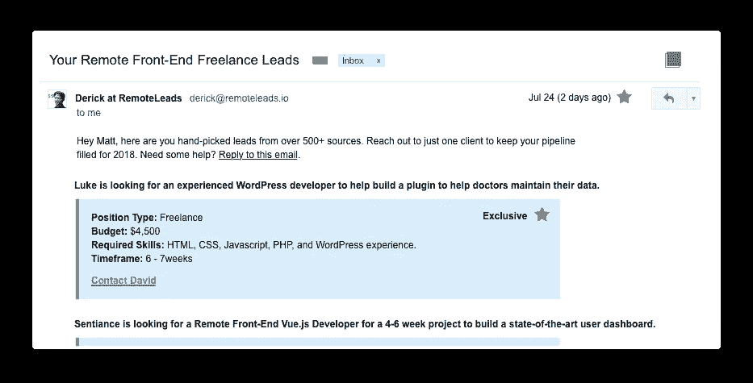

# 跳过简历。写电子邮件赢得你的下一个远程自由职业项目(免费模板)

> 原文：<https://medium.com/hackernoon/how-to-write-cover-letter-emails-to-win-your-next-remote-freelance-project-free-template-5530929364f1>

作为自由职业者，我们赢得客户的主要方法是写建议书，通常以电子邮件的形式。我们投了太多简历，以至于养成了不做任何客户调查就投简历的坏习惯。

我将与你分享如何通过几分钟的额外研究和修改你的电子邮件副本，就能大大增加你赢得客户的机会。

# 1)立即展示你如何提供价值

当客户在网上发布工作时，他们不可避免地会得到大量回复。对他们来说，查看所有这些电子邮件是无法承受的。这就是为什么你必须站出来，展示你如何能立即为他们提供价值。有两个地方你可以从一开始就这么做。

1.  你邮件的标题
2.  邮件正文的前两句话。

## 电子邮件标题

**标题是客户在看你的提案时首先要读的东西。**你正在与其他开发人员竞争这份工作，所以你必须脱颖而出，展示你已经准备好工作并解决他们的问题。这里有一个对我来说创造了奇迹。

## 前两句

客户首先在[自由职业者](https://hackernoon.com/tagged/freelance)论坛上发布工作的原因是因为他们希望问题得到解决。当他们打开你的邮件时，他们会问自己:**这个人能帮我解决我的问题吗？**

你可以帮助他们回答“是”的方法是立即承认他们的问题，而你就是那个可以解决问题的人。

# 2)提前提供你所有的信息

在客户打开电子邮件并通读了开头的几个句子后，他们会想这样的问题，这个人有经验吗？或者说我怎么相信这个人？这是一个展示你的投资组合的机会，你的经验可以帮助他们解决问题。

不要仅仅提供一个你作品集的链接，然后希望他们会浏览你的网站。他们不会的。他们正忙着查看其他开发者发来的邮件。选择几个与他们的项目相关的项目，描述你如何应用你的经验来解决他们的问题。

**这里有一个我倾向于在电子邮件中写作品集的例子。**

**一切都回归到快速提供即时价值。要记住的最重要的事情是，客户并不真正关心你的投资组合。他们关心你的经验如何帮助解决他们的问题。大多数时候，客户会非常感激你为他们减少工作量，并把所有相关信息放在邮件里。**

# 3)在项目结束时问一些可行的问题

客户讨厌收到明显是发给多人的提议。当他们只得到一个作品集链接或一份简历 pdf 时，他们可以知道你在向多人发送垃圾邮件。

为了传播这一点，你必须对他们的项目表现出真正的兴趣，并做一些额外的研究。你不会仅仅通过看招聘启事就了解他们项目的一切，所以问一两个问题来进一步澄清事情是非常主动的。

这个副本非常依赖于项目，但这里有一个例子:

# 节省搜索时间，让您的下一个远程自由职业项目直接发送到您的电子邮件

通过订阅远程销售线索，您可以避免花费大量时间搜索销售线索。**我们找到最好的线索，审查他们，并通过电子邮件发送给你**。这是确保你有稳定的潜在商机的好方法。你可以在这里订阅。

# 结论:把一切都联系在一起。

最大的收获是立即展示你如何提供价值。

1.  在正文中用一个吸引人的标题和前两句话展示你如何能立即带来价值。
2.  以与他们工作经验相关的方式展示你的作品集。
3.  问他们一两个问题，澄清一些事情，引起更多的兴趣。

我已经将这些要点汇总到一个可编辑的基于文本的模板中，您可以在联系客户时使用它。

[下载您的免费提案模板](https://remoteleads.io/files/remote-freelance-proposal-template.pdf)