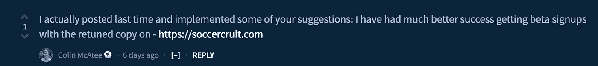
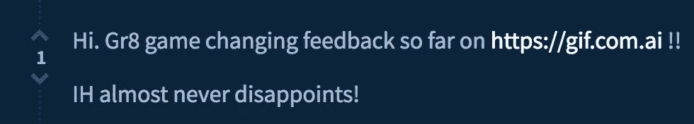

# 可接受的网络副本的禅

> 原文：<https://medium.com/hackernoon/how-to-write-for-your-users-or-the-zen-of-acceptable-web-copy-edef0044fcd2>

在世界各地，我们正在进入一年中有趣的部分。

不，我指的不是美国选举过程的奇观，让我们承认，如果你站在距离结果一臂之遥的地方看，这是一个有趣的残骸。

我指的是即将到来的假期。

Well, I went to this site called [Pixabay](https://pixabay.com/en/friends-celebration-dinner-table-581753/), searched for dinner party images and …and…and…

现在，想象你在感恩节拜访你另一半的家人。

你喜欢这些食物，你肯定想让主人知道这一点。所以你会天真地问他们是如何制作馅料、蔓越莓酱、馅饼的……不管是什么。

*轰！*

你的主人泪流满面地讲述了从好市多买最大的火鸡的来龙去脉，周末去 T2 农贸市场的旅行，他们的 T4 T5 新的 T6 T7，新的，从去年开始更新的制作馅料的方法，以及他们用来确保酱汁混合均匀的小技巧。

嗯，这正是许多美国开发者向我们不知情的观众兜售我们产品的方式。

> 哦，我们只是把 AWS 和 to to 连接起来..哦，Docker 动态更新后端数据存储区，同时利用跨多个边缘节点的重复数据消除技术以超低延迟对其进行分片..晚上使用 cron 作业…因为 ETL 和…生成报告。

我夸大了这一点，但如果你再看一眼你自己的网站副本，你可能会看到一个更温和的版本。

# 我怎么知道这个？

我知道这一点，因为每个月(给予或接受)，我在我最喜欢的社区之一(www.indiehackers.com，如果你一定要知道)开设一个线程，提供对网络复制的反馈给任何人。

每次我打开这个帖子，都会有几十家初创公司要求我审查他们的文案。

由于这个问题似乎是创业界的通病，我想我应该分享一下我的清单，看看你能做些什么来让你的产品不那么像一个功能清单，而更像是一个问题的解决方案。

# 但是这行得通吗？这有用吗？

我可以给你无数的案例研究，或者我可以向你推荐一些人的反馈，你实际上使用了我的建议来获得结果。

OR

# 可接受的网络副本的禅

事不宜迟，这里是网络文案写作的禅。

## 规则 0

命名事物。如果你正在开发一个博客工具，说出它最适合的博客引擎。如果你正在构建一个待办事项应用程序，命名你的集成。名字为理解创造了一条心理路径。它帮助人们将你的产品与他们日常工作流程中所知道的一切联系起来。

## 规则 1

说出客户的痛苦。这可以放在规则 0 下，但是它足够重要，值得特别提及。花一天或几个创意周期想象你的产品能解决什么问题。

以无服务器运动为例。云提供商首先向您出租硬件。一旦他们意识到硬件管理是乏味的，他们就从产品化服务器管理中创建了一个完整的业务线，瞧，无服务器运动就这样诞生了！

## 规则 2

用祈使句开始你的标题。甚至这个句子——以祈使句开始标题——也是祈使句。

你的潜在客户希望相信你有一个路线图来带领他们远离痛苦(见规则 1)。如果我写的是*,最好以命令式*开头，你会跳过规则 2 的右边部分作为一个不错的选择。

## 规则 3

专注于 UX 写作。这就是酒店网站邀请你查看空房和告诉你预订房间的区别。你要确保你的 UX 文案符合你的用户在他们与你的关系中所处的心理地图。

## 规则 4

不要害怕采用某种语气或态度。这让人耳目一新，而且你会和喜欢你的人做生意。

## 规则 5

虽然我不是设计师，我会说你的字体，你的配色方案，你的文本大小，你的库存照片选择，一切都在创造熟悉和信任的问题。

所以你有它。一个方便的清单，当你考虑你的网页内容时，它会指引你正确的方向。如果你想再看一眼，你可以随时去 IndieHackers 加入我的每月话题。