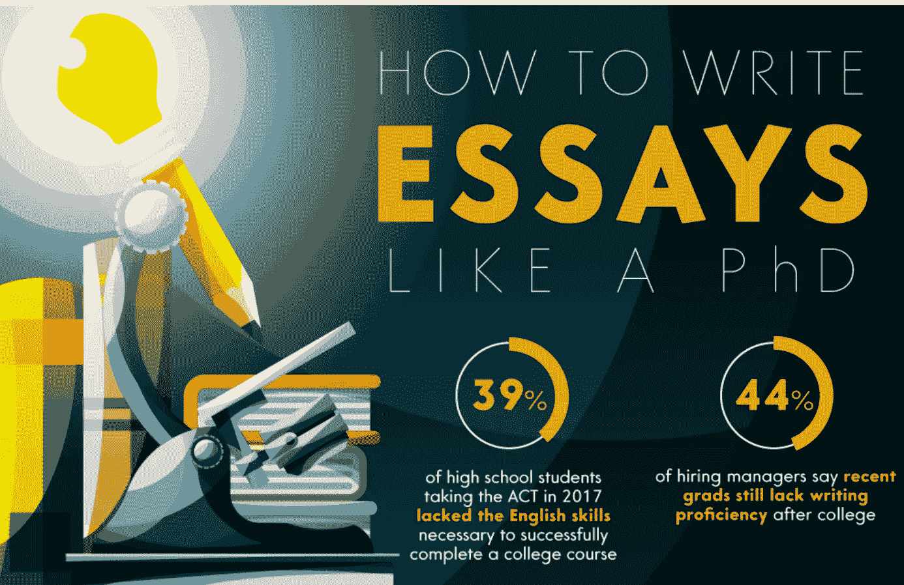
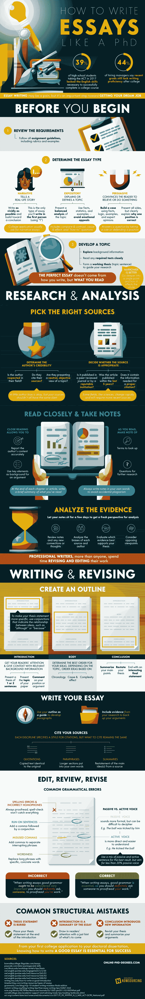

# 如何写出完美的文章

> 原文：<https://medium.com/hackernoon/how-to-write-the-perfect-essay-70698a3830af>

我们从写作过程中学到的不仅仅是交给老师或教授的东西；这些交流技巧应该会伴随我们一生。从汇编可靠的资源，优先考虑我们的时间，清晰简洁地表达我们的想法，这些都是有可能让我们得到理想工作的技能。

任何职业作家都会支持修改、修改、再修改的重要性。将校对的步骤提升到一个新的水平，定期检查我们的工作中的拼写错误和结构错误是写论文的关键步骤之一。巧合的是，练习调整自己的节奏和一步一步地做事情是最重要的品质，这将使我们比仅仅写作走得更远。实用的技巧也不能忽视，毕竟即使是技术人员也需要知道如何写作。避免连写句子、误用逗号和过度冗长是基本的，但也是文章结构中容易被遗忘的部分。

对我们许多人来说，一旦毕业，对论文的需求就消失了。然而，我们在成长过程中学到的技能应该伴随我们到成年。请看这张来自[online-phd-degrees.com](http://online-phd-degrees.com/)的信息图，了解更多关于[如何写一篇类似博士论文的信息](http://www.online-phd-degrees.com/perfect-essay/)，在专业环境中磨砺论文技巧意味着什么，以及这些技巧在我们的交流和其他方面发挥的作用。

