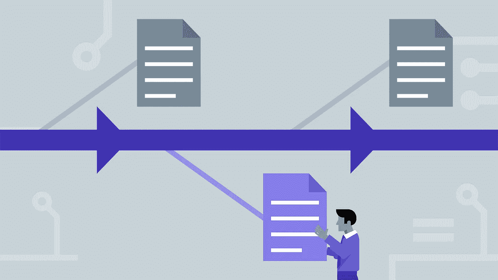

# 如何在 Solidity 中编写可升级(版本化)的智能合约？

> 原文：<https://medium.com/hackernoon/how-to-write-upgradable-versioned-smart-contracts-in-solidity-910007057943>

## 使用库在 Solidity 中理解和实现可升级智能合同的完整指南

Versioning(Pseudo-Versioning) Smart Contracts