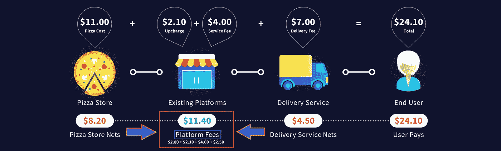

# 令牌化如何抑制我们对随需应变的贪得无厌的欲望的成本！现在！

> 原文：<https://medium.com/hackernoon/how-tokenization-can-curb-the-costs-of-our-insatiable-appetite-for-on-demand-everything-now-40b4568ab549>

Logistics Specialists — Serve — Are Putting Their Skills on The Blockchain

我们所有人每天都在交换各种形式的价值。无论是金钱还是产品和服务的金钱，每个人都是索取者和给予者。

商业的车轮从未停止转动。互联网连接铺就了即时满足的道路，我们大多数人都很乐意每天驾驶它们。

作为消费者——受制于广告行业并深受社交媒体的影响——我们往往缺乏任何耐心。我们想要的东西是即时的，我们希望它们能便宜地送到这里，最好是免费的。

因为，你知道，那个闪亮的新玩意儿在周六而不是周一到来时会更加闪亮。如果你不用自己去拿，食物总是更好吃。

不足为奇的是，“现在就必须拥有”的心态为创业企业提供了无限的机会。

一个突出的例子是当日送达的兴起。这个行业非常火爆。热饼干和松饼、家庭餐、苹果店的电子产品、冰咖啡、美酒和冰镇啤酒。

通过点击应用程序中的几个按钮，所有这些好东西可以在大约一个小时内成为你的。对于纯素奶昔来说，隔夜运输是不现实的，不是吗？

然而，满足我们无止境的需求和欲望的逻辑是非常复杂的。大量的移动部件给协调工作带来了挑战。

这些应用背后的公司不公平地补偿了自己，扼杀了我们的不耐烦。

> 有事业心的中介抓住每一个机会，从我们日常生活中根深蒂固的曾经不可行的服务中榨取利润。

现在，在我们追求便利的过程中，网络带着我们走了很远。但是区块链可以推动我们走得更远，一路上减少脂肪。

新的加密初创公司——[**Serve**](https://serve.io/)——正忙于建立一个平台，利用该组织的物流经验来创建一个激励参与者的全球经济。

你看，在任何给定的经济中，非中介化创造了每笔交易费用的自然减少。将中间人排除在等式之外，剩下的参与者——买方、卖方和供应商——会赢得更多。

在服务网络上，这些奖金流向消费者和企业，以及努力工作以确保你的冰淇淋在到达你家门口之前不会融化的服务提供商。

现在，食品配送只是 Serve 项目计划渗透的众多行业之一。我们将在本文中讨论一般交付，但值得注意的是，该平台打算更深入地进入全球商业领域。

Serve 项目到底会如何改变现状？继续滚动，你会找到一些答案。

但是首先，这里有一份上面有你名字的快递…

***免责声明*** *:这不是投资或理财建议。无论如何我都不是金融专家。本文中的大部分信息都是推测性的，仅仅是个人观点。在参与任何创业项目之前，一定要进行自己的研究。*

永远记住，你如何使用你的资金是你自己的决定。如果这个决定对你一个人来说太难了，向金融专家寻求指导。

*我可能会也可能不会收到创建此内容的少量令牌分配。也就是说，我尽最大努力保持公正和公平。我尽量避免所有的 FOMO 和 FUD，不希望在我的秘密伙伴中唤起这些情绪。*

How to calculate the best value for online purchases

# 亚马逊效率低下

有没有从亚马逊订购了几件商品，却发现它们装在几个不同的盒子里？也许其中一个主要是空气。

呃。我的牙膏不得不单骑在那里，是吧？

我不知道你怎么想，但对我来说，这是高效的反义词。当然，产品存放在不同地区的不同仓库中。

但是这和 UPS 中心进行递送有什么关系呢？

***单*** 不是应该触发褐衣男女同化后再发货吗？你真的需要把所有的汽油分三次开到我家吗？

除非我选择隔夜运输的东西，放慢你的滚动！

在一个网上订单变成分散的独立递送任务的情况下，我经常想知道 UPS 必须承担的实际成本。

亚马逊/UPS 的合作伙伴关系肯定足够大，足以保证对分批交付订单进行特殊处理。

单就温室气体而言，目前最后一英里配送服务的分散状态是一个巨大的失败。

嘿，UPS，你能在我们等其他人来的时候帮我们 HODL 这个包裹吗？谢了伙计。

# 关于 Postmates、Uber Eats 和类似平台的不方便的真相

在 2017 年的六个月里，我开着 ***走遍了整个城镇*** 给随机的人带去食物和随机的好吃的东西。

我享受驾驶的自由，这份工作让我得以进入我家乡的一些地方——有些小棚屋里满是保安——我从来不知道那里的存在。

现在，停机可能会对您的底线造成灾难性的影响。在开始为一项服务开车后不久，我增加了另一项服务，这样这项工作理论上会变得更加有利可图。

转变从两个应用程序打开开始。先到先得。

我经常来回换班。在极少数情况下，我会只为一项服务开车，但通常是两项都开。

即使两个应用都在运行，我仍然会遇到间歇，一些 4 小时的轮班结束时，我的账户上只有不到 20 美元。是的，运送食物的报酬可能低得可怜。因为，不会，客户多交的大部分费用不会到司机手里。

并非每个顾客都意识到了这一点，但这个系统是靠小费运转的。没有他们，零工工资 ***低于最低工资*** 。汽油和汽车维修只会加深伤口。

所有这些补偿不足的根本原因是平台——而不是勤劳的司机——享受的巨额费用。

许多顾客都认为他们的司机比他们实际挣得多。“我不需要给小费，因为它已经包含在内了，”他们必须告诉自己。

不，不是这样的！价格暴涨是因为平台运营商的原因，而不是发货的行为，这是系统 ***必须*** 具备的。

Food-delivery platforms’ lopsided pricing structure

让我给你一个真实的例子。我家附近有一家地中海餐馆供应美味的陀螺。我经常吃它们，以至于我已经记住了税后亲自定价 8.67 美元。

一个下雨天，我感到异常疲倦、懒惰，但又很饿。我想我应该用超级食物。我打开应用程序，找到餐厅，然后继续寻找我心爱的三明治。

曾经的 7.99 美元现在变成了 9.99 美元。是的，成本增加了 25%。我已经意识到送货费和礼貌服务的小费，但这令人讨厌的一点点费用在我嘴里留下了酸味。

# 每个人都必须付钱

现在，尽管顾客在平台上赚的钱最多，但餐馆也受到了冲击。司机们也是。

## 顾客是如何被压榨的

饥饿的食客可能认为他们只支付两种费用，但实际上，有三种费用:

1.  **虚高的菜单价格** —常规价格在此不适用。对于在餐馆就餐或外卖的顾客吃的同样的食物，预计要多付 10-20%的钱。
2.  **服务费**——除了菜单上膨胀的价格，我们还得支付另一笔费用，因为我们一开始就被多收了钱。
3.  **送货费** —这里没有惊喜。总得有人补偿那个(希望如此)友好的司机，他把你的食物送到你所在的任何地方。

## 餐馆是如何受到挤压的

使用外送服务的餐馆可以指望支付服务费来换取订单的增加。在 Uber Eats 的例子中是 30%。呀。

让我们做一点数学，好吗？

我们的菜单项目是寿司级别的戳碗。为了便于讨论，我们假设一家繁忙的餐馆一天能卖出 200 碗。一半碗留在里面，另一半上路。

**戳碗定价指标**

*   餐厅成本= 8 美元
*   堂食价格= 20 美元
*   交货价格= 24 美元
*   服务费=总销售额的 30%

**内部订单**

销售额:100 X 20 美元= 2，000 美元

成本:100 X 8 美元= 800 美元

**销售额减去成本=利润= 1200 美元**

**提货单**

销售额:100 X 24 美元= 2，400 美元

成本:100 X 8 美元= 800 美元

服务费:2，400 美元 X 30% = 720 美元

**销售额减去成本减去服务费=利润= 880 美元**

***利润差额=负 27%***

因此，无论如何，在这个例子中，为了使用 Uber Eats 服务的特权，餐馆老板支付了本质上很重的税。每流入一美元，就有 27 美分流出。

如果一家餐馆能够利用批量准备的方法来削减成本，这也许是值得的。然而，放弃 27%的利润是一个很高的要求。

人们不禁要问，餐馆在营销活动上花同样的钱——甚至更少的钱——会不会更好。

尽管业主感受到了高额费用的压力，但很难忽视他们原本不会获得的额外收入。

毫无疑问，对一些餐馆老板来说，这是个艰难的选择。但有足够的理由让当地一家越南三明治店的老板否认该平台的求爱尝试。

## 司机如何被烧伤

Uber Eats 运营的物流远非完美。除了只能得到一部分送货费之外，司机们还必须应对由于效率低下而导致的长时间等待。

有时这是一个有趣的小故障，应用程序将相同的订单分配给两个不同的司机。到达后，最后一名司机听到他们的订单已经在门外。所以我白跑了一趟？谢谢！

对于不了解情况的人来说，大多数送餐员是按订单而不是按小时付费的。除了浪费汽油和里程之外，损失本可以更好地用于实际交付的时间可能会特别昂贵。

虽然这些平台可能会损害司机的收入，但餐馆本身往往是罪魁祸首。

Home of the Big Mick

我可以诚实地告诉你，在完成了超过 1000 次交付后，WacArnold 的是其中最糟糕的违规者。

情况如此糟糕，以至于我会立即取消出现在我应用程序上的那家“餐馆”的订单。

你看，除了一个全明星经理这种罕见的例外，米奇 D 的员工都讨厌优步 Eats 的订单。

为什么？因为优步的订单会到达一个单独的终端，藏在收银台旁边的某个地方。

脱离汉堡和薯条的主流会在整个操作过程中溢出大量的果汁。

这是我和一个明显慌张的员工的真实对话，他的名牌上写着比尔:

**比尔:我能为你做什么？**

**我:“嗨。你今天晚上过得怎么样？”**

比尔:“哦，我有点紧张。”

我:“很遗憾听到这个消息。我是来取优步吃的订单的。”

比尔:“这就是我压力大的原因。”

订单经常被遗忘，直到“优步”出现后的*才被输入。是的，他们真的在很多场合很多地方都这么叫我。有人向其他船员宣布，“优步号到了！”*

站在那里等一个油腻的棕色袋子——或者来自任何其他地方的未下订单——会大大减少司机的收入。

更重要的是，我们不要忽视小费的涓滴效应，因为订单需要很长时间才能到达顾客手中。

是的，按需送货服务很方便。谁不想要美味的食物或方便的小玩意呢？但与此同时，它们的价格过高是没有必要的。

> 按需送货行业不会有任何发展。我们每天都饿——为了食物或者几乎所有能想象到的东西。

然而，我们可以做得更好，我们可以通过将操作放在区块链上来降低成本。

既然你已经充分意识到为什么这个系统如此昂贵，让我们来看看 Serve 项目是如何改善整个体验的…

The Serve platform’s economy runs on SRV tokens

# 代币可以降低成本

服务平台运行在其本地 SRV 令牌上。

同样的令牌支持智能合约，智能合约推动网络交易。

转向选择将托管系统融入交易。在交易完成之前，所有各方都必须遵守他们的协议。

顾客用 SRV 代币支付商品和服务，但是商家和递送者也必须用代币。把这个概念想象成一轮扑克中的赌注。你需要在底池中下注，否则你就不能玩了。

一旦智能合约同意一切正常，交易的 SRV 令牌的合法份额将返回原始钱包。

> 通过去除人类信任的元素——这是区块链理工存在的首要原因之一——我们正在减少让我们这些笨拙的错误机器每一步都参与进来的需要。

通过对自动化系统的信任，该平台可以有效地消除臃肿的费用结构。我们相信程序设计，而不是运输部健忘的弗兰克。

也许我没有必要首先使用“信仰”这个术语。透明度是游戏的名称，通过公开展示数字交易中发生的一切，信任的要素变得无可争议。

糟糕的演员不会持续太久，因为区块链会在他们试图耍花招时点名批评他们。

此外，基于代币的经济具有内在的成本效益。我们只是把工作外包给了电脑——终极会计机器人。

现在，在你听到“他们抢走了我们的工作！”对我来说，你必须承认有些任务最好留给算法。处理数据和存储不可变的信息是两个主要的例子。

在转向平台上，费用最高为 2.5%。如果我们假设全球各种交付平台的平均费用为 25%,那就是下降了 10 倍！

# 每个人都必须赢

毫无疑问，Serve 旨在改善众多的最后一英里配送服务。但他们没有采取激进的“消除竞争”的方式。相反，他们邀请任何人来集成他们的开源协议。

目标是创建所有人都采用的行业标准。这个项目基本上是在说，“看，我们当前的系统和流程需要帮助。我们是物流专家，但也有其他人。让我们共同努力，为每个人的进步创造一个统一的体系。”

现在，与今天的产品相比，Serve 平台的参与者——企业、司机和客户——可以大幅降低费用。

但是，让我们来看看全球物流平台能够带来的其他一些好处…

## 车手如何获得无限可能

当司机赢了，就会产生多米诺骨牌效应，影响到企业和消费者。

我就是按需送货司机高流失率的活生生的例子。意思是:很多人都没有尽自己最大的努力。当你快要放弃的时候，你的心不在这里。

Serve 制作了一个关于我以前的视频。他们怎么知道的？如果这种情况在去年成为现实，我会在游戏中呆得更久。

我不叫亚历克斯，但他的虚拟世界是我的真实世界…

Me, a year ago

一边开车一边听方向，搜索地址，主动监控两个独立的应用程序，往好里说是分散注意力，往坏里说是危险。尤其是第二个应用程序场景，因为它需要在车辆行驶时与手机进行物理交互。

想象一下，五个重要的现任者与服务协议联系在一起。一个司机可以为他们所有人开车，但仍然可以从一个单一的界面操作。本质上，一个简单，集中，代币收入的解决方案。

停机时间缩短到几乎为零，因为你在一个主要城市的任何地方，在一天的任何时间，都有人想要食物、产品或乘车。

更不用说避免创建额外的帐户和链接银行帐户和提交保险信息的麻烦。

高薪司机肯定会在路上呆得更久。如果服务平台看到一些大牌加入进来，用自己的车送货会变得更加有利可图。

## 企业如何赚取更高的利润

类似于司机可以一次抢很多服务的工作，企业主也可以享受同样的奢侈。

Serve 项目提供企业解决方案——包括 API 和 SDK——使公司能够将一些业务运营放在区块链上。

通过加入 Serve，他们让一大群司机为他们工作。不要依靠特定服务的递送力量来抓取你的货物，因为离你最近的*服务司机已经准备好出发了。*

在食物方面，更多的司机意味着食物以尽可能快的速度飞出家门。而且，由于费用如此之低，入学的决定应该被证明是简单的。

## **顾客如何获得更快捷的服务**

回到大量的司机准备拂一瓶威士忌直接到你的位置，等待时间的任何事情都可以实现显着减少。

下订单，无论司机属于哪一种快递服务，你的东西都会很快送到你手中。

快速的服务加上低廉的价格让顾客一次又一次地回到服务平台。这对司机和企业主也有好处。

在这里你看到自我喂养效率的循环在起作用吗？快乐的顾客造就快乐的企业主和忙碌的司机。赢了/赢了/赢了！

# 最后的想法…

加密货币给了我们——作为有能力处理自己货币交易的负责任的主权个人——超越法定领域的话语权。

诚然，目前的事态相当于微观星球呼呼镇的孤独呼喊。

然而，随着时间的推移，我们的集体呐喊会引起大牌球员的注意，忽视代币会给他们带来危险。

作为密码爱好者，我们是少数。大多数人只是看不到好处。但最终，我们会变得如此响亮，以至于外来者不得不进入我们的领域。

我可以预见同样的场景会在最后一英里的递送领域上演。一套透明而高效的行业标准吸引着任何希望管理更严格的企业。也就是说，所有人。

而且，这个项目正在吸引大量价值数十亿美元的产业。在任何给定的行业中，小比例的市场份额都是完全可以接受的，因为它们具有集体潜力。

Serve 项目是一个需要密切关注的项目。该团队的雄心似乎是无限的，他们要解决一些真正的问题——在全球范围内——我们大多数人经常处理的问题。

就我个人而言，我期待着有一天中间人不再为了方便的缩影而滥收费用——任何东西都可以带到你所在的任何地方。

## DYOR

现在，仅仅因为我看好项目服务并不意味着你需要马上加入。形成自己的观点总是很重要的。

这里有几个地方，你可以方便地做到这一点:

[**服务网站**](https://serve.io/)

[**服务白皮书**](https://serve.io/files/websites/83/311/media/1/WHITE_PAPER_small.pdf)

[**Scoobeez**](http://scoobeez.com/)—***发球队现有的发球服务***

👇**获得社交与服务**👇

[**Bitcointalk**](https://bitcointalk.org/index.php?action=profile;u=2085434)**|**[**脸书**](https://www.facebook.com/ServeToken/)**|**[**GitHub**](https://github.com/serveeconomy)**|**[**insta gram**](https://www.instagram.com/servetoken/)**|**[**LinkedIn**](https://www.linkedin.com/company/servetoken)**|**[**Medium**](/@servetoken)**|**

## **顺便说一下…**

**如果你喜欢你在这里看到的，并且需要帮助把你的加密信息传递给大众，我很想听听你的创业故事。**

**即使你只是想聊聊 crypto 或者你最喜欢的区块链项目，你也可以在这里找到我:blockchainauthor at Gmail**

***bounty 0x username = block chain author***