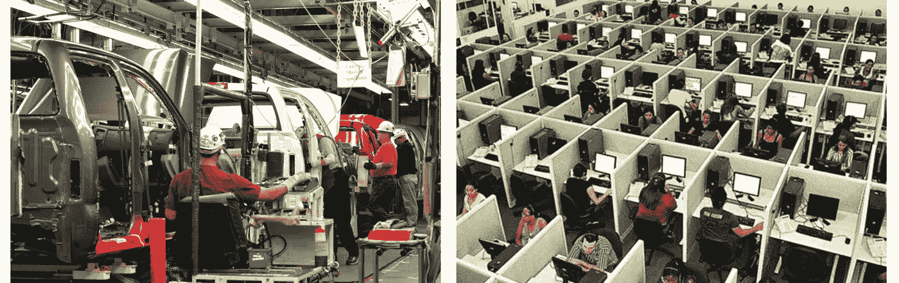

# 丰田如何引导我们基础设施的发展(并让我欣赏吉拉)

> 原文：<https://medium.com/hackernoon/how-toyota-guides-the-evolution-of-our-infrastructure-and-makes-me-appreciate-jira-bcb766822a3e>

## 反思我公司的微服务、开发运维以及完美价值流之旅

在制造业中，价值流图(VSM)是一种用于衡量绩效的流行工具。VSM 因丰田而闻名，本质上是一个流程图，描述了创造价值的必要步骤。

例如，考虑这个简单的 VSM 椅子厂。

An example VSM for a Chair Factory.

这个例子说明了我们工厂在收到订单后生产一把椅子所需的 4 个步骤:焊接、喷漆、组装和检验。

这里有几件事值得指出。

1.  这些步骤必须按顺序进行。在本例中，每把椅子都必须在焊接后进行喷漆。
2.  对于不同的工作项，可以并行执行这些步骤。在本例中，这意味着上漆和焊接可以同时进行，但针对的是两把不同的椅子。
3.  VSM 的总时间是所有步骤的总和。在这个例子中，每把椅子从开始到结束需要 7 天时间。
4.  **输出速率**是一个工作项目通过 VSM 的速度。在这个例子中，如果每一步都有一把椅子，我们的工厂可以每 3 天生产一把椅子。

Our Chair Factory working at full capacity can produce 1 chair every 3 days.

最后一点特别值得注意，因为它说明了总时间和**输出速率**之间的差异。当决定如何改进流程时，产出率解释了为什么我们应该关注最长的步骤(或最大的瓶颈)。在本例中，我们的工作流程仅因检查而受阻。

这个例子是关于椅子的，但是价值流图也可以描述软件交付。考虑下面的另一个 VSM；和做椅子差不多。

An example VSM for software delivery.

在这个软件示例中，Deploy 是最长的步骤，这意味着不管其他步骤有多快，每个功能请求的输出速度至少是 3 天。换句话说，这个 VSM 告诉我们，部署实际上是我们唯一的约束。

以上两个例子都是过于简化的价值流图，但是它们说明了为什么只有最大的瓶颈才是重要的。当我反思我公司的架构这些年是如何发展的时候，我意识到正是这些瓶颈导致了我们一些最大的变化。

# 我们的基础设施如何受瓶颈制约的故事

一开始，我的公司的旅程是从几个开发人员开始的，没有其他人。协调很容易，因为团队很小，而且没有遗留系统需要支持，因为不存在遗留系统。这提供了确定业务和产品的灵活性。我们的价值流非常清晰。

Just a couple of developers and a new Rails project

然后我们的公司成长了。用户增加了，产品进化了，这意味着需要新的系统。但是管理这些系统需要我们从开发中抽出时间。这成为我们的第一个瓶颈。因此，我们引入了像 [Capistrano](http://capistranorb.com/) 和 [Puppet](https://www.chef.io/puppet/) 这样的工具来管理我们的系统，这样我们的第一个大瓶颈就解决了。

More systems required required tools like Puppet and Capistrano to manage them.

但是我们的公司继续发展。更多的开发人员来了，随之而来的是更多的部署、补丁和配置。我们的自动化有所帮助，但许多任务仍然需要我们孤独的系统管理员的人工协助，他很快就变得不知所措。这成了我们的第二大瓶颈，结果是雇佣了更多的系统管理员，组建了一个基础设施(或 [SRE](https://en.wikipedia.org/wiki/Site_Reliability_Engineering) )团队。

More people and teams required an SRE team to deal with all their requests

在这一点上，我们主要使用 Ruby 和 MySQL，我们的 SRE 团队允许我们扩展。但是很快我们就会需要 JavaScript 和 Scala，以及 Kafka 集群和 Cassandra 数据库。这变成了我们的下一个瓶颈，因为我们引入的每项新技术都衍生出独特的需求，这阻碍了我们 SRE 团队的系统特定程序。因此，我们将我们的系统迁移到 Docker 和一个[容器编排(或微服务)平台](/@ikod/8-container-orchestration-platforms-to-know-dbc7021c757e)上，为我们的系统管理员提供一个公共接口，以便随着我们技术选择的扩展支持我们的各种系统。

More diverse technologies required Docker to make it easier to support diverse technologies.

容器允许我们支持多种技术，但它也鼓励开发人员更多地参与他们系统的操作。这意味着越来越多的团队要求系统管理员改变他们的容器。团队构建得更快，变得更 DevOps，但是这种对 SRE 团队的依赖成为了新的瓶颈。认识到我们组织中的这种趋势后，开发人员创建了一个自助式门户，可以在没有系统管理员的情况下应用特定的更改(即使是在生产中)。最初，这个门户允许用户为他们的容器设置 CPU 和内存限制，这是当时最流行的请求，但是随着其他常见请求(或瓶颈)的出现，添加了一些功能。

An early mock of our self-serve infrastructure portal for teams.

该门户通过支持团队自由工作，帮助推动整个公司的开发运维，但也让我们面临成本管理和访问控制方面的新挑战，不用说，这些挑战不会结束。一旦这些挑战得到解决，我们很可能会再次发现更多的瓶颈。瓶颈永远不会停止，但是请放心，这不是一件坏事。

我们的基础设施的故事并不新鲜，但我发现启发性的是认识到我们的旅程是无止境的。完美的基础设施是不存在的(任何软件产品也是如此)，但这并不意味着我们应该停止努力改进。到达终点没有前进重要。

# 持续的瓶颈导致持续的改进

有需要解决的瓶颈是一件好事。瓶颈代表着我们工作方式的改进。它们引导我们的努力，迫使我们不断地问自己如何创造价值，价值是什么。

在我最喜欢的《社交网络的场景中，爱德华多问马克他什么时候能完成脸书的建设，这样他就可以开始赚钱了。马克恰当地回答说，脸书永远不会结束，就像时尚永远不会结束一样。

The Facebook will never be done

这个场景引起了我的共鸣，因为我认为它不仅适用于脸书，也适用于所有形式的工艺，无论是软件、艺术、音乐还是其他东西。经验总是可以被吸取的，成长总是可以实现的，在软件交付的情况下，价值流揭示了导致最有意义的改进的瓶颈。

有人曾经告诉我，开发软件就像修建铁路一样；这个过程从开拓开始，然后是构建，最后是优化。虽然这种比较有时是有用的，但“优化”的终结感觉缺乏。相反，我更喜欢将软件开发比作《星际迷航》,以及它不断探索的使命，就像探索宇宙一样，建设(和改进)是永无止境的。我们只需要决定朝哪个方向走。

# 造椅子和写软件的真正区别

制造和软件共享一个持续的改进之旅，但是当涉及到价值流图时，这是相似性的终点。制造业处理的是物质世界。在 factory 地板上，您可以看到工作项目和工作流程本身。甚至可以明显看出哪些步骤是瓶颈和容易出错的。这对于软件来说并不容易。

有了软件，工作就电子化了，工厂车间就是一屋子的电脑。很难看出某人被分配了什么任务，或者工作流程是什么。软件是无形的，这是它与制造业的真正区别，也是为什么像吉拉这样的工具对这类工作如此重要。

Progress is easier to spot in an assembly line than an office.

吉拉是一个任务[管理](https://hackernoon.com/tagged/management)系统，用于软件团队描述和跟踪工作项目、它们的进度、所有权、花费的时间以及其他对于理解低效和构建有意义的价值流图至关重要的信息。这些任务管理系统通常被认为仅仅是为了规划[未来](https://hackernoon.com/tagged/future)的工作，但是它们的价值很大一部分来源于它们如何记录过去，所以我们可以合理化它以便在未来做出更好的决策。

Creating a ticket to track a work item in Jira

为了理解开发人员的生产力及其驱动因素，已经做了大量的工作。在 DevOps 时代，这导致了对部署频率、变更交付时间以及[其他类似开发人员度量](https://devops.com/metrics-devops/)的认可。然而，根据我的经验，没有什么比简单地记录工作和时间更有效的了。我坚信个人从写日记和反思中获得的好处，比如下面这些，也适用于组织。

*   从直接经验中学习如果再加上反思会更有效。
*   写日记来记录成功和挫折(否则可能会从你的记忆中溜走)可以提供动力，让你意识到自己正在取得进步，并帮助你思考如何摆脱阻碍你进步的障碍(即使是那些反复出现的小障碍)。

对于任何软件公司来说，最重要的事情是理解它如何创造价值。许多公司在选择技术或组织结构时迷失了方向，但这些本质上都不重要。唯一重要的是价值是如何创造的，以及阻碍价值创造的障碍是什么。通过引用这些经历(和吉拉或其他人)并反思它们，我们不仅能够认识到我们前进道路上的障碍，还能揭示前进的道路。