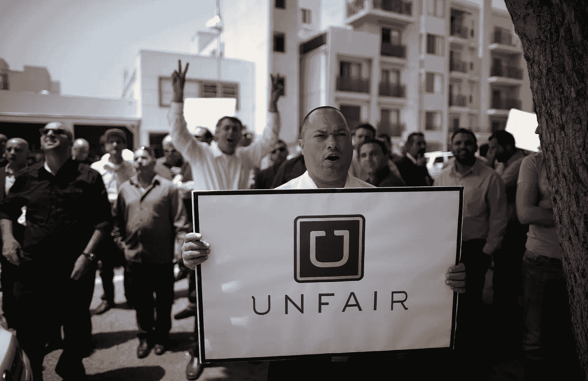
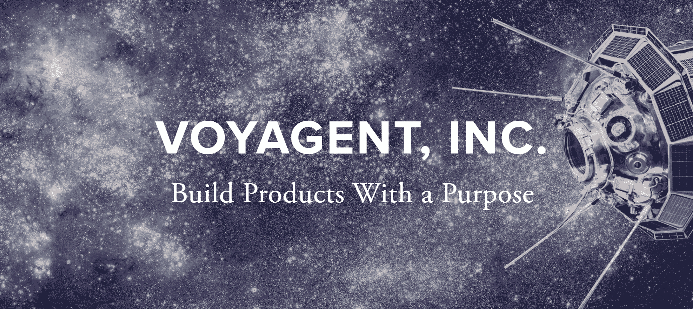

# 不要扼杀你的文化——优步是如何欺骗他们的员工并失去他们的魔力的

> 原文：<https://medium.com/hackernoon/how-uber-killed-its-culture-and-how-you-can-avoid-killing-yours-704decb3e467>

Uber drivers protesting unfair business practices

我记得优步第一次发射的时候。我第一次尝试时，我很惊讶。“哇哦！我刚被一辆干净漂亮的车接走。司机给了我一瓶水，并热烈欢迎我。司机来找我，而不是我必须争取一辆出租车。而且我也不用在喝醉的时候摸索钱包了！”这是一次难以置信的经历。最重要的是，司机们总是告诉我他们有多爱优步。这给了他们自由。这给了他们额外的钱来过更好的生活。他们喜欢结识新朋友。他们觉得自己是革命的一部分。*然后一切都变糟了。*

大约一年后，我开始听到司机的抱怨。“他们把我们的工资减半了！明天早上会聚集起来抗议。”什么？*减半？*为什么？！这种服务已经比出租车更便宜更好了。老实说，我很乐意多付钱，因为这是更好的体验。我喜欢司机们对公司的热情，支持他们让我感觉很好。他们为什么要毁掉这一切？

## 答案很简单:G **簧片**。

他们沉浸在难以置信的增长的狂喜中，不停地追逐利润。在他们失控的增长中，他们从那些资金最雄厚、利润最大的人那里获得了巨额投资。他们在不惜一切代价地竞争到底。他们通过租赁新车的方式，把司机变成了依赖他们的顾客。他们向信用不良的司机提供融资，这是一种有问题的掠夺性贷款行为。如果司机不能付款，他们会收回他们的车，同时让他们没有工作或交通工具去买新车。他们公然避免向他们的司机提供任何好处或支持。作为独立承包人，司机没有健康保险，也没有劳动法的保护。司机对优步收取的价格和他们的收入也没有谈判权。如果优步决定大幅降价，他们可以不经任何人同意就这么做。优步被成功冲昏了头脑，这使得他们的员工开始反对他们。

现在我不在乎优步是否降价。我拒绝和他们做生意仅仅是因为他们的道德。我宁愿多付钱给竞争对手，只要司机告诉我他们受到了很好的待遇。因为这反过来为我创造了更好的体验。

这种有毒的文化导致了无数的性骚扰丑闻，以及创始人 CEO 的出局。他们的品牌被玷污了，他们的信任被他们的员工，对不起，我是说承包商和顾客破坏了。他们正处于螺旋式下降。他们现在将不断努力留住司机和乘客，而不是建立忠诚度。

很难说这种文化是从一开始就存在，还是随着公司的成长而发展，但有一点是明确的。一种以牺牲你的员工和客户为代价，只关注底线增长和股东价值的文化，可能会在短期内取得成功，但最终将遭遇爆炸性的戏剧性消亡。

## 如果你爱你的员工，他们就会爱你的顾客，顾客也会爱你

我们生活在另一个镀金时代，我们的公共和私人资金系统的所有激励都明确奖励伤害员工的行为。你的股价低迷吗？解雇几千名员工以获得晋升。利润率太薄？削减福利。员工开始抱怨工资低和工作条件差？解雇他们，把你的业务转移到海外，那里的员工没有权利。**如果你衡量成功的唯一标准是底线，那么那些利用他人的人就是赢家。**

事情不一定是这样的，如果我们着眼于长期投资，善待我们的员工实际上是值得的。让我们看看好市多，这是一个完美的例子。这是一家从一开始就致力于员工的公司。他们一直为员工提供更高的工资、更好的福利和更好的工作环境。因此，不仅员工更快乐、更健康，我还自豪地告诉我的朋友和家人去好市多购物。我相信当我在好市多购物时，我是在支持一个好的事业。这是一家牺牲短期收益来支持员工的公司，而员工的努力最终带来了长期的成功。通过削减利润率以更好地补偿员工，好市多创建了一个员工以工作为荣、顾客以做生意为荣的组织。

## 投资于你的员工

创业很难。资金总是很紧张，有时为了让投资者高兴或获得新客户而做出牺牲是很诱人的。你的员工是你公司的生命线。如果你挤压它们，你可能会在短期内获得更多的血液，但从长远来看，它们会干涸。**如果你不能照顾好员工，那么你就不能做生意。**

投资于你的员工是一个再生过程。由于没有营业额，它产生了效率和动力。它创造快乐的员工，反过来创造快乐的客户。它提高了质量，因为员工在工作中很细心。它提高了生产率，因为员工被激励去尽最大努力。它最终会创造更多的增长，因为你的价值观会在整个社区产生共鸣。

我们需要改变做生意的思维方式。工人权利的丧失和逐底竞争在我们的社会中产生了一种有害的文化。我们需要开始爱我们的员工，不是因为我们害怕反抗(尽管它可能会到来)，而是因为我们知道这是正确的事情，最终会为每个人带来更多的成功。

# 这是否引起你的共鸣？

我致力于改善我们公司的文化和领导力。如果你想改变你的公司文化，请通过我的[网站](http://www.voyagent.io)联系我，让我们一起合作。

如果你想阅读更多我写的关于产品开发、领导力和软件开发过程的文章，[在 Medium](/@mostlyemptyspace) 上关注我。你也可以在我的[媒体页面](https://www.voyagent.io/media/)上找到我的会议演讲和播客。