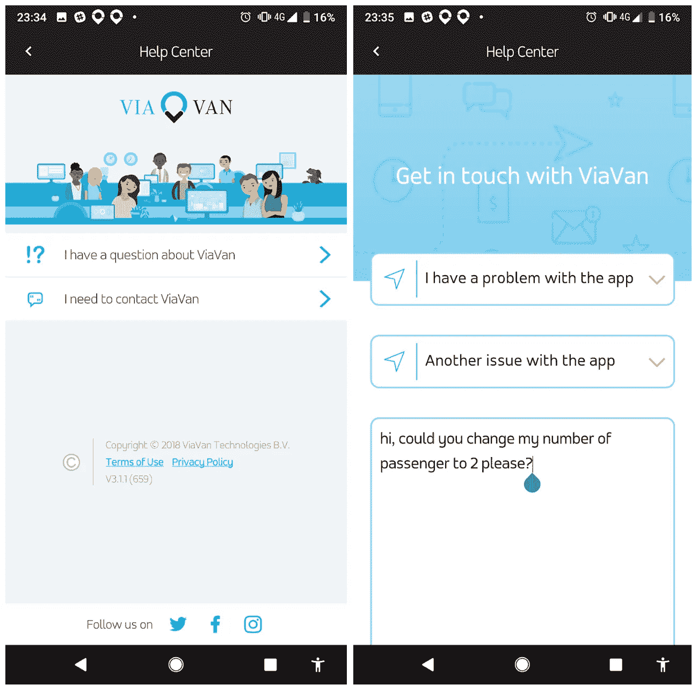
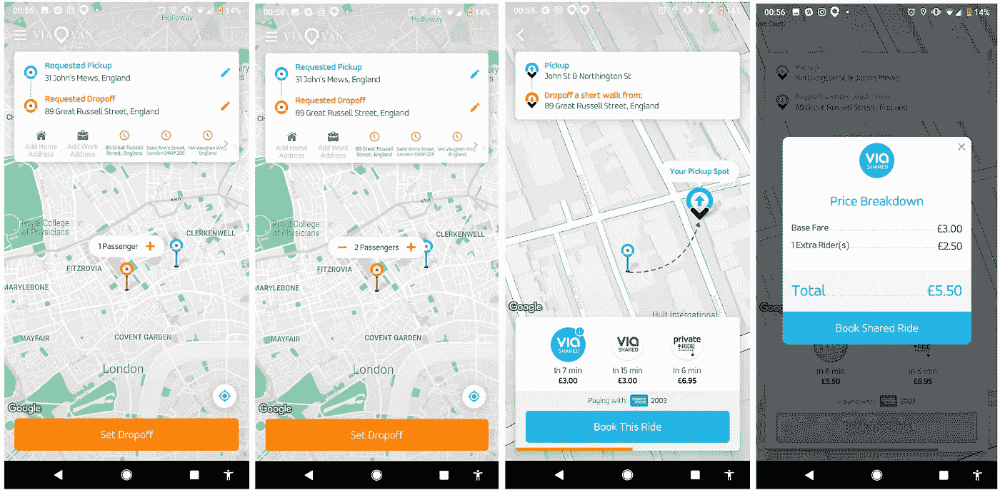
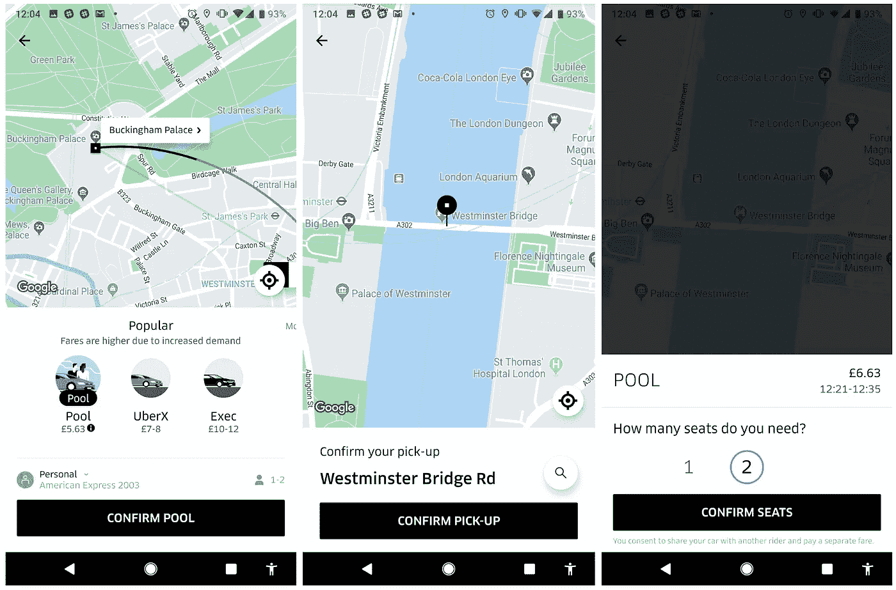
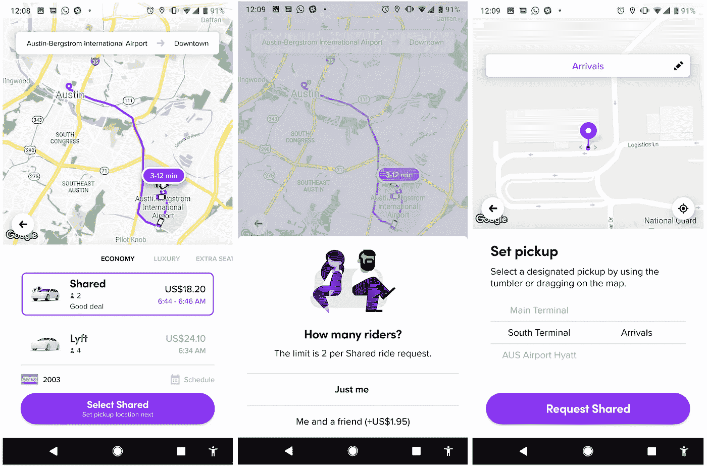

# 优步的竞争对手 ViaVan 是如何在大街上抛弃用户的

> 原文：<https://medium.com/hackernoon/how-ubers-rival-viavan-is-deserting-its-users-on-the-street-72ea74bdcd83>

*又有一款类似优步的应用上市了，他们还没有完全搞清楚*

Photo by [Mentatdgt](https://www.pexels.com/@mentatdgt-330508) on [Pexels](https://www.pexels.com)

# **维亚万——优步的新挑战者**

毫无疑问，优步已经成为过去几年科技成功的故事之一。这款移动应用已经成为一家价值数十亿美元的公司和一个家喻户晓的名字，并完全改变了我们对打车的看法。

但是现在有了一辆新的出租车…

ViaVan 于今年 4 月在英国推出，是伦敦非常成功的优步的新挑战者。这家新贵与梅赛德斯-奔驰(Mercedes-Benz)合作，提供私人乘坐服务，但他们最重要的服务相当于众所周知的“优步泳池”；一种为人们提供公共交通之外的选择的共享乘车服务。

ViaVan 旨在将出租车出行的便利性与公共交通的可承受性结合起来，它已经在媒体上引起了一些轰动。*入围名单*指出 ViaVan 可能比优步便宜得多，这一评论肯定会让人刮目相看。

ViaVan 首席执行官克里斯·斯奈德(Chris Snyder)在 4 月份告诉《商业内幕》*,这项服务在英国获得了充分的许可，同时向司机提供了比优步更高的佣金，并且比他们臭名昭著的竞争对手更重视司机的安全和福祉。*

> ***“让大量司机充斥道路不符合 ViaVan 的利益”，Snyder 指出，“因为它的技术是让人们以更少的车辆更高效地从 A 地到达 B 地。”***

*虽然该服务最初仅在一区和二区推出，但 ViaVan 刚刚向五区和机场客户提供。当然，这是对优步霸权的潜在危险挑战，但它傲慢的承诺在现实世界中如何体现呢？*

# ***问题***

*为了验证这个想法，我决定让 ViaVan 试一试。天哪，这真是一次有趣的旅行！虽然，当我说“娱乐”时，我并不一定是指完全积极的态度！*

*你等过出租车司机 15 分钟吗？而不是凌晨 3 点在俱乐部门口！这正是我和 ViaVan 的第一次经历。*

*虽然乘车很便宜，而且是“共乘”，但我发现我几乎肯定会一个人在车上度过整个旅程。然而，我应该指出，自那时以来，他们已经走过了漫长的道路，他们的鸡和蛋的障碍已经得到解决和减少。*

*这个应用程序已经开始出名了。事实上，它越来越受欢迎意味着我越来越多地与其他用户分享这些乘坐体验。该死的，光辉岁月结束了！*

*Gif from [Giphy.com](https://giphy.com)*

*他们的增值和重点是与他人共享乘车服务。*

*所以，让我为你设定一个典型的 ViaVan 旅程的场景…*

*你独自一人，准备出门。所以你打开 ViaVan 应用程序，预订了一辆车。这与预订优步出租车非常相似，但有一个根本的区别。ViaVan 体验的核心是不确定性。*

*正是在这一点上，悬念开始建立。你一个人在里面吗？你身边会有一个满身烟味的人吗？喝醉的人？反过来，也许坐在你旁边的会是你一生的挚爱！谁知道呢？*

*一天晚上，我决定冒险去伦敦参加一个晚上的娱乐活动。那是晚上 8 点，我去了城里，想和我的一些朋友一起吃一顿愉快的晚餐。试用 ViaVan 的绝佳机会！*

*所以我使用了这个应用程序，进行了预订，然后等待。几分钟后，果然 ViaVan 车来了！司机开着一辆白色丰田普锐斯来接我，我很快发现一个叫大卫的男人坐在我旁边。这就是维亚万不可预测的世界！这绝对不是社交尴尬者的理想服务！*

*不用说，谈话保持在最低限度。尽管如此，我们还是在路上停下来接另一个人。*

*嗯，我说是另一个人..不只是一个人！事实上，原本应该是一个人的，结果却是一群三个朋友，不幸的是，司机的车被授权只能载 5 个人。*

*司机被迫放下车窗，对这群人说:*

> ***“我不能去接你，你需要取消乘车，重新订票，选择三位乘客！”***

*然后他突然开车走了。我翻了翻白眼。“喝醉的人”，我心想。直到再次发生！😱*

*几周后，我成了一辆 ViaVan 车里唯一的乘客，我们搭载了一对夫妇。他们只选择了一名乘客(再次！？😑)，但是空间够大，司机够友好，还是愿意接他们。所以我们把车停了几分钟，以便帮助他们把他们的预订换成两个乘客。*

*这本身对我来说就够不方便的了……就像大门里的一匹赛马；我疯了才会去！最后，甚至不可能执行变更！相反，司机让他们给 ViaVan 发信息，把车改成两个乘客，然后我们就开车走了。比我们应该的时间晚了几分钟！*

*From [Giphy.com](https://giphy.com)*

***这对夫妇如何在应用程序上申请预订变更:***

**

*Screenshots on ViaVan*

*我们的司机 Kalil 对这个明显令人担忧的问题感到惊讶，就像周一早上的到来一样。他说这种情况经常发生。 ***这个*** 就是它打我的时候。虽然我个人从来不需要为两个乘客选择，但我突然想到*我甚至不知道* ***在 app*** 上的位置。*

*这听起来也像是一个明确的用户交互流程，对我来说，这种知识和基本功能的鸿沟显然会对 ViaVan 产生巨大的负面影响。*

***从我的“移动”用户测试中，我可以观察到:**
1⃣用户忘记或弄不清在哪里添加乘客数量；
2⃣这恰好是用户的痛点(作为一个普通用户，我在几周内经历了两次)；
3⃣一旦预订了顺风车，司机和用户都没有能力改变乘客。*

***那么，这为什么是一个问题呢？** 1⃣用户可能不会被接走；
2⃣司机可能会停车一段时间，与乘客商量一下；司机 3⃣被带离公路，因为这个问题总是需要几分钟才能解决。*

*那么… ***这里的*** 是这个**增加一个乘客**按钮吗？🤔我很高兴你问了…让我们来回顾一下他们的应用程序流程。*

**

*Viavan — Shared Ride Flow*

*你能看见它吗？它类似于“查理在哪里”游戏…👨‍👨‍👧‍👦如果你没有发现它，回到流程中。在第二张截图上。*

*那么从设计的角度来看，发生了什么呢？ViaVan 没有通过 Jakob Nielsen 在 1995 年定义的用户界面设计 10 条可用性启发法中的 4 条。我自己看得出来——我不是设计师！*

***❌未能在系统和现实世界之间进行匹配** Viavan 未能使“添加乘客”按钮出现在自然且符合逻辑的位置。*

*让我们退一步…我们都知道如何叫出租车。我们打电话让司机在 A 接我们去 B，我们需要一辆可以坐 6 个人的车，所以我们要确保他们有一辆足够大的车，以及 20 件不需要的衣服！最后问一下要花多少钱，这样你就可以和你的朋友们一起分摊费用了。*

*虽然设计意图是最小化，但它带走了自然的流动。稍后我们将看到竞争对手的设计如何解决这个问题。*

*❌未能灵活有效地使用系统，感觉系统的流程对用户不友好，因此新手和没有经验的用户无法理解。*

*❌未能接受极简设计正如我们之前提到的，当订购出租车时有一个自然的流程，ViaVan 未能以逻辑的方式再现这一点。他们试图通过在欢迎屏幕上增加乘客选项来“简化”流程。但这可能会让用户感到困惑甚至忽略。因此，极简设计和简单的理念在这个系统中消失了，经常使通过 ViaVan 订购的过程变得混乱和过于复杂。*

***❌未能帮助用户识别、诊断并从错误中恢复** 该应用程序不会向你确认你将只有一个座位。这个简单的特性有助于防止任何错误。*

# ***竞赛方案***

*现在，我们来看看竞争对手是如何提供多乘客共享乘车服务的。*

***优步共享乘车流程***

**

*Shared ride flow on Uber’s app*

***Lyft -共享乘车流程***

**

*Shared ride flow on Lyft’s app*

*很明显，竞争对手会直接问用户这个问题，就像打电话给出租车司机一样:**你需要几个乘客座位？***

# ***假设***

*基于以上所述，以下是我对 ViaVan 的假设:*

> **通过为用户提供预订流程中的额外步骤，使他们能够选择乘客数量，ViaVan 将减少乘车取消，缩短到达时间，并提高客户满意度。**

*我怎么强调这对 ViaVan 的重要性都不为过，因为我已经亲自测试了这家公司。相信我……在乘坐出租车的中途被打断，以便为另一名乘客解决一些预订问题，这是令人讨厌和不方便的，就像补牙一样。而在无法解决的情况下，他们就更不方便了，还得另订司机！*

*最终，ViaVan 的生死将取决于它能否提供乘客在优步已经享受到的那种便利。是的，服务特别实惠。是的，他们有一些好主意。是的，它有潜力。但这种潜力只有在笨拙的预订流程得到切实改善后才能实现，因为顾客只会去别处。*

*他们会知道他们可以预订一个优步，而且最大的可能性是一切都会像时钟一样运行，这在像伦敦这样繁忙的大都市是至关重要的，因为时间总是宝贵的。*

*我钦佩作为公司使命核心的道德精神。实惠的价格永远是赢家。然而我给 ViaVan 的核心信息是…确保你的预订流程正确…而且要快！*

*页（page 的缩写）s:致 ViaVan——我希望这篇博客文章是有用的，尽管我确信你现在有相当多的问题需要关注。对任何读者来说…你是否经历过 ViaVan 的同样问题或其他类似问题？你和 ViaVan 一起骑行有什么正面的经历吗？请在评论区分享你的观点。*

*页（page 的缩写）附言:如果你喜欢这个，至少给我十几下掌声祝你好运；)*