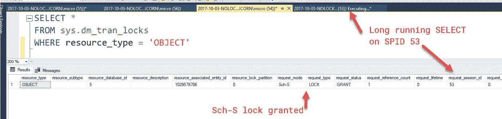
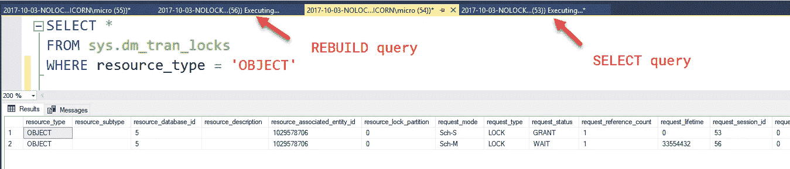
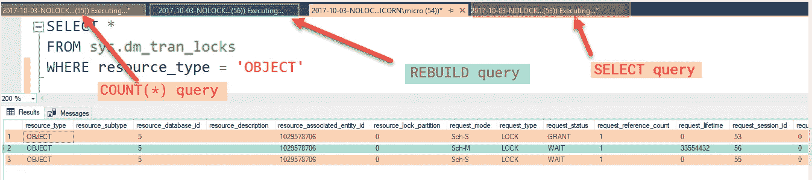

# 使用 NOLOCK 如何阻止您的查询

> 原文：<https://medium.com/hackernoon/how-using-nolock-can-block-your-queries-adc8611105ff>


注意:下面描述的问题适用于所有的选择查询，而不仅仅是那些带有 NOLOCK 提示的查询。它适用于 NOLOCK 查询的事实让我大吃一惊，因此有了这个标题。

很多人不喜欢 SQL Server 中的 [NOLOCK](https://hackernoon.com/tagged/nolock) (即 read uncommitted 隔离级别)，因为它会返回不准确的数据。我已经看到很多警告开发人员不要检索未提交的读取的论点，因为它们会返回[脏数据、幻影读取和不可重复读取](https://docs.microsoft.com/en-us/sql/odbc/reference/develop-app/transaction-isolation-levels)。

我知道所有这些问题，但是有一个问题我直到最近才听说: **NOLOCK 可以阻止其他查询运行。**

*You can also watch this week’s* [*post on YouTube*](https://www.youtube.com/watch?v=3G1sgS4fFoQ)

让我们后退一步，理解为什么我过去经常使用 NOLOCK。我使用 NOLOCK 的一个相当典型的例子是当我想让一个查询整夜运行以返回一些大型数据集时。我可以接受数据中的一些不一致(来自脏读取等……)。我主要关心的是，我不希望长时间运行的查询妨碍其他进程。

我一直认为 NOLOCK 是这种情况下的完美解决方案，因为它从不锁定它读取的数据——结果可能不完美，但至少查询不会对服务器上的任何其他进程产生负面影响。

这就是我对 NOLOCK 理解错误的地方:**虽然 NOLOCK *不会*锁定行级数据，但它*会*取出一个模式稳定性锁。**

一个[模式稳定性(Sch-S)锁](https://technet.microsoft.com/en-us/library/ms175519%28v=sql.105%29.aspx?f=255&MSPPError=-2147217396)防止表的结构在查询执行时改变。所有 SELECT 语句，包括那些处于 read uncommitted/NOLOCK 隔离级别的语句，都会取出一个 Sch-S 锁。这是有意义的，因为我们不希望开始从表中读取数据，然后在数据检索的中途更改列结构。

然而，这也意味着可能会有一些操作被 Sch-S 锁阻塞。例如，在这种情况下，任何请求模式修改(Sch-M)锁的命令都会被阻塞。

什么命令请求 Sch-M 锁？

比如索引重建或 sp_recompile 表。这些是在我的夜间维护工作中运行的命令类型，我首先试图通过使用 NOLOCK 来避免伤害它们！

重申一下，我曾经认为使用 NOLOCK 提示是在长时间运行的查询中防止阻塞的好方法。然而，结果是我的 NOLOCK 查询实际上阻塞了我的夜间索引作业(在这个例子中所有的 SELECT 查询都阻塞了，但是我发现 NOLOCK 特别容易引起误解)，这导致其他 SELECT 语句也被阻塞了！

让我们来看看实际情况。这里我有一个查询，它创建一个数据库 table，然后用 NOLOCK 运行一个长时间运行的查询:

```
DROP DATABASE IF EXISTS [Sandbox] 
GO 
CREATE DATABASE [Sandbox] 
GO 
USE [Sandbox] 
GO 
DROP TABLE IF EXISTS dbo.Test 
CREATE TABLE dbo.Test 
( 
  c0 int IDENTITY PRIMARY KEY, 
  c1 varchar(700) default REPLICATE(‘a’,700) 
) 
CREATE NONCLUSTERED INDEX IX_Id ON dbo.Test (c1); 
GOINSERT INTO dbo.Test DEFAULT VALUES; 
GO 1000-- Read a billion records 
SELECT * 
FROM dbo.Test t1 (NOLOCK) 
CROSS JOIN dbo.Test t2 (NOLOCK) 
CROSS JOIN dbo.Test t3 (NOLOCK)
```

现在，在读取十亿行的同时，我们可以通过查看 sys.dm_tran_locks 来验证查询是否获取了 Sch-S 锁:

```
SELECT * 
FROM sys.dm_tran_locks 
WHERE resource_type = ‘OBJECT’
```



当它运行时，如果我们试图重建一个索引，重建会被阻塞(显示为等待):

```
USE [Sandbox] 
GOALTER INDEX IX_Id ON dbo.Test REBUILD
```



我们的索引重建查询将保持阻塞状态，直到我们的十亿行 NOLOCK SELECT 查询运行完毕(或者被终止)。这意味着我打算完全不引人注目的查询现在阻止了我的夜间索引维护作业的运行。

更糟糕的是，任何其他试图在重建查询之后运行的查询(或者任何其他请求 Sch-M 锁的命令)也将被阻塞！如果我尝试运行一个简单的 COUNT(*)查询:

```
USE [Sandbox] 
GOSELECT COUNT(*) FROM dbo.Test
```



屏蔽了！这意味着，不仅我的初始 NOLOCK 查询导致我的索引重建维护作业等待，重建维护作业放置的 Sch-M 锁也导致该表上的任何后续查询被阻塞并被迫等待。我刚刚用一个阻塞 NOLOCK 语句破坏了我的维护工作和后续查询的及时性！

# 解决方法

不幸的是，这是一个棘手的问题，没有放之四海而皆准的解决办法。

# 解决方案 1:不要运行长时间运行的查询

我*可以*避免在晚上运行长时间的查询，因为它们可能会影响我的索引维护工作。这将防止那些索引维护作业和后续查询被延迟，但这意味着我最初的十亿行选择查询将不得不提前运行，从而在一天中可能更忙的时候对服务器[性能](https://hackernoon.com/tagged/performance)产生负面影响。

# 解决方案 2:使用低优先级等待

从 2014 年开始，我可以使用 WAIT_AT_LOW_PRIORITY 选项集进行在线索引重建:

```
ALTER INDEX IX_Id ON dbo.Test REBUILD 
WITH ( 
  ONLINE = ON (
    WAIT_AT_LOW_PRIORITY (
      MAX_DURATION = 1 MINUTES , 
      ABORT_AFTER_WAIT = BLOCKERS)))
```

该查询基本上给当前正在运行的任何阻塞 SELECT 查询 1 分钟的时间来完成执行，否则该查询将杀死它们，然后执行索引重建。或者，我们也可以设置 ABORT_AFTER_WAIT = SELF，重建查询会自行终止，允许 NOLOCK billion row SELECT 完成运行，并且不会阻止任何其他查询的运行。

这不是一个很好的解决方案，因为这意味着要么长时间运行的查询被终止，要么索引重建被终止。

# 解决方案#3:如果没有 Sch-S，则重新构建，否则重新组织

可以编写一个尝试重建索引的编程解决方案，但是如果知道必须等待 Sch-M 锁，就退回到重新组织。

我已经创建了下面的 boiler 板作为起点，但是你可以用它做的事情没有限制(例如，创建一个 WHILE 循环来每 x 秒检查一次锁，创建一个脚本应该停止尝试重新构建而只是重新组织的超时，等等)

```
-- Idea for how to rebuild/reorganize based on a schema stability lock.
-- More of a starting point than fully functional code.
-- Not fully tested, you have been warned!
DECLARE 
 [@TableName](http://twitter.com/TableName) varchar(128) = 'Test',
 [@HasSchemaStabilityLo](http://twitter.com/HasSchemaStabilityLo)ck bit = 0

SELECT TOP 1 [@HasSchemaStabilityLo](http://twitter.com/HasSchemaStabilityLo)ck = 
 CASE WHEN l.request_mode IS NOT NULL THEN 1 ELSE 0 END
 FROM
  sys.dm_tran_locks as l
 WHERE
  l.resource_type = 'OBJECT'
  AND l.request_mode = 'Sch-S'
  AND l.request_type = 'LOCK'
  AND l.request_status = 'GRANT'
  AND OBJECT_NAME(l.resource_associated_entity_id) = [@TableName](http://twitter.com/TableName)

IF [@HasSchemaStabilityLo](http://twitter.com/HasSchemaStabilityLo)ck = 0
BEGIN
 -- Perform a rebuild
 ALTER INDEX IX_Id ON dbo.Test REBUILD
 PRINT 'Index rebuilt'
END
ELSE
BEGIN
 -- Perform a REORG
 ALTER INDEX IX_Id ON dbo.Test REORGANIZE
 PRINT 'Index reorganized'
END
```

这个解决方案是我最喜欢的，因为:

1.  特别长时间运行的查询不会被终止(所有花费在处理上的时间不会浪费)
2.  Sch-M 锁尝试通过 REBUILD 不会阻止其他选择查询
3.  索引维护仍然会发生，即使最终是重组而不是重建

*感谢阅读。你可能也会喜欢* [*在推特上关注我。*](https://twitter.com/bertwagner)