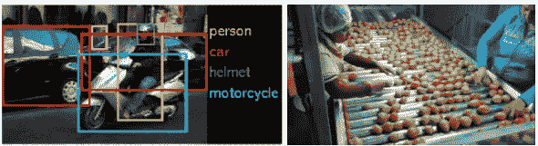
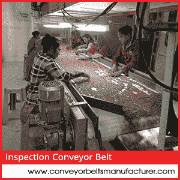
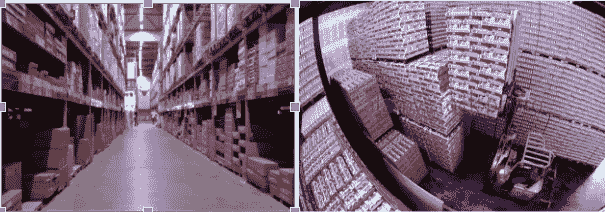

# 视觉物体检测如何改变制造业

> 原文：<https://medium.com/hackernoon/how-visual-object-detection-can-transform-manufacturing-industries-8b6698cc0a47>

自工业革命以来，人类在制造业方面取得了巨大的进步。随着时间的推移，我们已经看到越来越多平凡的手工工作被自动化所取代，通过先进的工程、计算机、机器人以及现在的物联网。我们相信人工智能(或者更准确地说是深度学习)的最新进展将有助于以一种迷人的方式加速这种自动化趋势。这是因为 AI 增加了一个工厂迄今为止一直缺失的非常关键的组件——“机器看到的能力”。有了具有计算机视觉功能的机器人，现在可以探索许多新的和未开发的自动化领域。“对象检测”是计算机视觉的一个分支，处理从图像中找到特定对象(如人、红牛罐、红牛罐纸箱等)。有了这个博客，我们将提出一个案例，说明为什么物体检测是制造自动化的一个关键组成部分，以及你应该如何考虑它。

***那么究竟什么是物体探测呢？***

计算机视觉是赋予计算机像人类一样“看”东西的能力的领域。目标检测是一项基本的视觉感知任务，也是计算机视觉应用的关键领域之一。它主要处理图像中特定对象的查找和定位。

对于检测通用对象(如汽车，人，桌子，树)，有开源和预训练的模型，如 Yolo 可用。然而，如果你想要一个算法来检测非常特定的对象(比如一个‘小生番茄’或一个‘大熟番茄’)，你就需要训练一个你自己的对象检测算法。

## 制造业中物体检测的使用案例

通过视觉检测找到特定的物体是一项基本任务，涉及分拣、库存管理、加工、质量管理、包装等多个工业过程。在这篇博客中，我们讨论几个这样的用例，以帮助读者直观地理解这项技术如何应用于任何新的制造环境。

***质量管理***

迄今为止，制造周期的质量控制部分仍然是一项艰巨的任务，因为它依赖于人的视觉理解和对不断变化的条件和产品的适应。有了人工智能，这些复杂情况大部分都可以处理。AI 可以以令人难以置信的速度自动区分装配线上的好零件和故障零件，让你有足够的时间采取纠正措施。对于产品环境不断变化的动态环境来说，这是一个非常有用的解决方案，时间对企业来说非常宝贵。

***库存管理***

库存管理可能非常棘手，因为物品很难实时跟踪，每天都有东西被添加、删除和移动。糟糕的库存管理会在资金和时间方面对公司造成伤害。人工智能系统可以执行自动目标计数和定位，这将让您提高库存的准确性。人工智能自动化通过准确计算你的持有和流出库存，消除了等式中的人为错误。自动化后，企业将以尽可能好的价格订购正确数量的产品，确保不会在不准确或无关的订单上浪费金钱。

Source: Alamy, ShutterStock

***排序***

人工分拣涉及高劳动成本和伴随的人为错误。即使是机器人，这个过程也不够精确，仍然容易出现偏差。通过人工智能驱动的对象跟踪，对象按照制造商选择的参数进行分类，并显示对象数量的统计数据。它极大地减少了分类中的异常，并使装配线更加灵活。例如，在农业行业，分拣在装配线上起着至关重要的作用。公司必须识别并丢弃可能影响成品的受损水果/蔬菜。人工智能驱动的对象检测可以帮助将这一繁琐的手动过程转变为高效的自动化过程，同时保持相同甚至更高的准确性。

***装配线***

今天，我们拥有全自动化的装配线，甚至可以生产像汽车这样的复杂产品。但是，机械臂和原材料/组件的每个动作都是按照脚本定义和播放的。为了赋予现代自动装配线更多的灵活性，教会机器准确地定位和移动不同的产品/部件是很重要的。人工智能驱动的物体检测为这种可能性打开了大门。

Source: MIT News

**自定义物体检测如何工作？**

当在制造设置中为利基用例执行定制对象检测时，需要考虑几个挑战。对象有不同的形状、大小、方向、颜色，而真实世界的工厂环境有来自视点、照明、遮挡和阴影变化的额外噪声。在算法方面，您需要确保在不需要安排太多(大约数千个)训练样本的情况下达到所需的精度。

在 [ParallelDots](https://www.paralleldots.com/) ，我们将推出一个定制的对象检测 API，帮助客户应对这样的挑战。它基于我们专有的[方法](https://arxiv.org/pdf/1803.06813v1.pdf)，使用完全卷积网络和卷积编码器-解码器的组合，使用少于 50 张(未标记)的训练图像来执行精确的对象检测。

如果您想了解更多关于 Karna AI 和我们的行业解决方案，请通过我们的[网站](https://www.karna.ai/)与我们联系。

以上研究由 [Karna 进行。AI](https://www.karna.ai/) —平行作业市场研究部。这里可以阅读原文[。](https://blog.karna.ai/how-visual-object-detection-can-transform-manufacturing-industries-ce93a68e2cc8)

我们希望你喜欢这篇文章。请[注册](https://user.apis.paralleldots.com/signing-up?utm_source=blog_chat&utm_medium=chat&utm_campaign=signup)免费的 ParallelDots 账户，开始你的 AI 之旅。