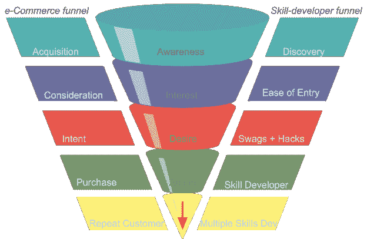

# 我是如何进入 Alexa 开发的？

> 原文：<https://medium.com/hackernoon/how-was-i-funneled-into-alexa-development-3c575cf0833d>

我是一名计算机工程师，职业是一名工程经理。虽然我目前的重点领域是后端系统和数据分析，但在过去的一年里，我已经发展了多项 [Alexa](https://hackernoon.com/tagged/alexa) 技能。

现在回想起来，我很奇怪——我是怎么陷进去的？感觉这个过程非常类似于电子商务产品漏斗:

意识->兴趣->欲望->行动

我从来没有意识到我是亚马逊 Alexa 团队建立的转换优化漏斗的一部分，我最终成为了*的回头客*。以下是我做类似比较的努力:

更深一层看，这里有 8 个具体步骤，有助于吸引和转化合适的人到 Alexa 开发，并建立其最大的社区。

**1。个性化营销:**

Publish Alexa Skill ad for US developers

Publish Alexa Skill ad for University Students

**2。每个人的免费赠品**

Publish Alexa Skill and everyone get’s a T-Shit

**3。每月都有新的创意奖品**

Sock + Echo swag

Echo Spot and bottle swag

**4。CTA 上的点(在 5 分钟内发展 Alexa 技能)**

CAT — Build a Skill in 5 mins

**5。踢屁股文档**

当我第一次开发它的时候，我参考了模板技能的逐步文档。它拥有一个新手所能要求的一切:

*   逐步指南
*   截屏
*   文档链接
*   Github 来源
*   以最小的改动进行定制

文档:[链接](https://developer.amazon.com/blogs/post/TxDJWS16KUPVKO/New-Alexa-Skills-Kit-Template:-Build-a-Trivia-Skill-in-under-an-Hour)

Documentation screenshot

目前这些文档甚至更好。

6。所有的基础设施都是免费的

*   免费 AWS 帐户:

Alexa skills hosting free on AWS

*   测试模拟器测试版(不需要设备)

最初，我认为有必要拥有一个 Echo 设备来测试和部署我构建的技能。生态系统提供了一个测试模拟器来代替这种需求。只需通过语音或文本输入，就可以验证 Alexa 的理解，并查看技能如何响应。

[https://developer . Amazon . com/docs/dev console/test-your-skill . html](https://developer.amazon.com/docs/devconsole/test-your-skill.html)

7。及时反馈的优质客户服务:

Customer feedback e-mail

我的第一项技能是现场直播

DMV Trivia Skill

**接着是:**

Swag, I received :)

不错，几个小时的工作——一项新技能，战利品和口袋里的新工具。

**8。新技能邮件:**

每周都有邮件介绍人们正在创造的新技能，以及顶级技能是如何得到激励的。我过去常常忽略他们。

**几个月后，**

该是我公司半年一次的黑客马拉松的时候了。难怪，我想到了一个语音应用程序的想法。它觉得 EchoMonkey 是可行的:通过语音进行调查。

当我还没有想到 Alexa 开发的时候；我开发了多种赢得 Alexa 技能的黑客马拉松。

我要称赞 *Alexa 的营销团队*，他们出色地引导工程师开发技能，并围绕它建立了一个伟大的社区。

难怪，结局是:

总而言之，当我读到以下内容时，我可以看到一个更诱人的未来:

*   [用亚马逊支付 Alexa 技能赚钱](https://developer.amazon.com/blogs/alexa/post/64090337-7957-419a-a8fd-b3fb15d30760/amazon-pay-for-alexa-skills)
*   [通过技能内购买利用你的 Alexa 技能赚钱](https://developer.amazon.com/blogs/alexa/post/5d852c9c-8cdf-45c1-9b68-e2f02af26c89/make-money-with-alexa-skills)
*   [用 Alexa 开发者奖励赚钱](https://developer.amazon.com/alexa-skills-kit/rewards)
*   [Alexa 很快会获得记忆，交谈更自然](https://techcrunch.com/2018/04/26/alexa-will-soon-gain-a-memory-converse-more-naturally-and-automatically-launch-skills/)

这样的努力将保持社区的吸引力和参与度。