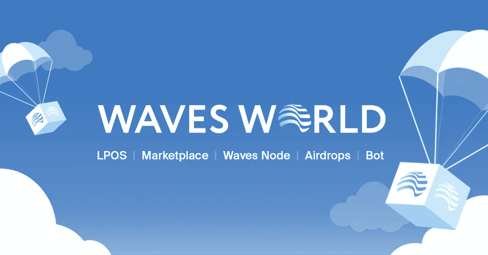

# Waves World 将如何建立一个令人敬畏的加密令牌经济

> 原文：<https://medium.com/hackernoon/how-waves-world-is-going-to-build-an-awesome-crypto-token-economy-f68d390f5fea>

[Waves World](http://www.wavesworld.io/) 是一家家族企业，自 2017 年 12 月以来一直运营 Waves node，每周一向其租赁者发放奖励。我们一直完全自筹资金，并作为一项爱心工作提供服务和相关网站。我们对 Waves 和区块链理工大学充满热情，并为我们能够提供的技术能力和个人客户支持感到自豪。

**电波世界中的数字:**

*   [前 20 名生成节点](http://dev.pywaves.org/generators/)
*   543158.6995 [编写时产生平衡的波](http://wavesexplorer.com/address/3P3PfgFKpfisSW6RCsbmgWXtwUH8fHAESw4)
*   10 亿 Waves World (WW)代币总供应量
*   [401083486 WWN 流通供给](http://dev.pywaves.org/assets/AbunLGErT5ctzVN8MVjb4Ad9YgjpubB8Hqb17VxzfAck)
*   截至 2019 年 6 月，每周向出租人支付 100%的 WAVES、MRT 和 769.2 万 WW
*   迄今为止最大的付款:39.12189997 波，1249.93 捷运，7，692，346.0 WW

**推出全球加密生态系统！**

现在，我们正在努力为 Waves 社区创建一个多样化的加密生态系统，以我们现有的矿池和服务为基础。Waves World (WW) token 将是其中不可或缺的一部分，只要有意义，我们将在我们计划提供的所有不同功能和服务中使用它作为我们的本地货币。

关于如何在生态系统和令牌中构建价值，我们有很多想法，但这必须是一篇(长得多的)文章或白皮书的主题。现在，我们将向我们的社区概述我们计划建立一个活跃、充满活力、有趣和有益的加密经济的一些方法。

**空投**

启动和建立一个繁荣的经济是为了确保你的代币被广泛用作商业和投资手段。这意味着两件事:

1)分发—将您的令牌分发给尽可能多的人

2)兑换——给人们尽可能多的消费代币的方式

我们计划以多种方式发布 WW。在接下来的一年中，直到 2019 年 6 月，我们将向我们的采矿池租赁者空投 WW。我们还将在早期阶段为人们提供获得免费代币的其他方式。我们正在为我们的空投机器人开发一个订阅模型，将提供给那些持有最低余额的人。(我们还将利用这一点分享我们的部分利润，并分发其他寻求宣传的项目的令牌——为双方提供奖励。)当我们需要购买服务或提供奖金时，我们也会尽可能向 WW 付费。

**海浪世界市场**

我们要提供的另一个主要方面是我们的市场。首先，我们将提供官方的 Waves 商品，以及其他一些经典的加密工具包——一些是我们自己的产品和设计，一些来自其他主要的加密零售商。同样，在我们力所能及的地方，我们将接受这些物品的全球价值，帮助巩固我们的代币的价值，并使其在世界经济的浪潮中流通。在其他情况下，接受比特币和其他密码更有意义，因为我们将从其他主要零售商那里运送受欢迎的产品。

我们希望我们的市场成为一个加密社区可以与我们和其他人互动的地方，不仅可以购买商品，所以我们也将努力实现这一目标——帮助推动和扩大加密领域，并使现有产品更容易获得。我们真正喜欢的一个想法是举办艺术和设计比赛，从有才华的加密世界成员中征集参赛作品，然后给获胜者一个通过我们的市场销售他们作品的地方。引入我们的社区作为参赛者和评委将建立对获奖图片和项目的需求，有望确保艺术家的收入、WW 及其持有者的收入以及满意的买家。这也是围绕 crypto、Waves 和 Waves World 进行宣传的好方法。

但是正如我们所说的，我们有很多想法。底线是，我们计划围绕 WW 建立一个强大的生态系统，我们知道这只有在草根加密社区的帮助下才能实现。所以，观看这个空间，来加入我们，告诉我们你想看什么！

在 Waves Platform 加密货币俱乐部加入我们对[脸书的讨论](https://www.facebook.com/groups/WavesPlatformCC/)

在 3pfgfkpfissw 6 rcsbmgwxtwuh 8 fhaesw 4 将您的波浪租赁到我们的采矿池

更多信息请访问[https://www . waves world . io](https://www.wavesworld.io/)